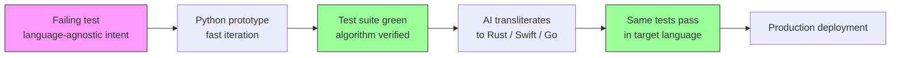

# Language Doesn't Matter Anymore: What Kent Beck's Shift Means for Coding Agents


---

Kent Beck — creator of Extreme Programming, co-author of the Agile Manifesto, pioneer of Test-Driven Development — no longer has an emotional attachment to any programming language[^1]. That sentence alone should make every senior developer pause. Beck's shift isn't a philosophical musing; it's a practical observation grounded in months of building production-grade software in languages he has never formally learnt. His B+ tree library, BPlusTree3, was written in Rust and Python using AI agents — with Beck contributing architectural intent and tests rather than syntax knowledge[^2].

This article explores what Beck's language agnosticism means for how we use Codex CLI and other coding agents, and why AGENTS.md's cross-tool portability makes language choice a second-order concern.

## Beck's Thesis: Syntax Is Deprecated, Design Is Amplified

In his June 2025 conversation with Gergely Orosz on The Pragmatic Engineer podcast, Beck described the "clickbait version" of his position: *programming languages are dead*[^1]. The nuanced version is more interesting. He is actively maintaining projects in Rust and Swift — two languages he has never formally studied — and can read, modify, and extend code in both[^1].

Beck's "augmented coding" framework draws a line between what AI deprecates and what it amplifies[^2]:

| Deprecated | Amplified |
|---|---|
| Language syntax expertise | Vision and strategy |
| Knowing where ampersands go in Rust | Task decomposition |
| Memorising standard library APIs | Feedback loop design |
| Boilerplate fluency | Test-driven specification |

The insight is that *knowing where to put ampersands in Rust* no longer differentiates a developer. What differentiates is the ability to decompose a problem, write a failing test that captures intent, and evaluate whether the agent's output satisfies that intent[^2].

## The "Copy From Simpler Language" Technique

Beck codified this into a repeatable augmented coding technique he calls "Copy From Simpler Language"[^3]. The workflow is:

1. **Prototype in a high-level language** — Beck chose Python for the B+ tree algorithm, where borrow checker constraints don't interfere with algorithmic exploration.
2. **Verify correctness with tests** — the Python implementation passes a comprehensive test suite validating insertion, deletion, splitting, and merging.
3. **Transliterate to the production language** — Beck instructed Augment's Remote Agent to transliterate the Python implementation into idiomatic Rust, requiring only a few manual interventions[^2][^3].

The result: BPlusTree3, a plug-compatible replacement for Rust's standard `BTreeMap` and `BTreeSet`, built by someone who has never learnt Rust's ownership model from a textbook[^4].



This is not "vibe coding." Beck explicitly distinguishes augmented coding from vibe coding: in augmented coding, you care about code quality, complexity, test coverage, and design — the same values as hand-coding, but with AI handling the syntactic translation[^2].

## Why This Matters for Codex CLI Workflows

Beck's technique maps directly onto Codex CLI's architecture. Three features make language agnosticism practical at scale.

### 1. AGENTS.md Is Language-Agnostic by Design

AGENTS.md files are plain Markdown — no language-specific DSL, no framework coupling[^5]. A well-written AGENTS.md captures *architectural intent*: build commands, test commands, directory structure conventions, and approval rules. These instructions are meaningful regardless of whether the codebase is Python, Rust, TypeScript, or a polyglot monorepo.

Since December 2025, AGENTS.md has been stewarded by the Agentic AI Foundation under the Linux Foundation, with platinum members including OpenAI, Anthropic, Google, Microsoft, and AWS[^6]. Over 60,000 open-source repositories have adopted the format[^6]. The same AGENTS.md file works across Codex CLI, Claude Code, Cursor, Gemini CLI, GitHub Copilot, and thirty-plus other agent platforms[^5][^6].

This cross-tool portability means your project instructions survive a language migration. If you rewrite a service from Python to Go, the AGENTS.md file needs updated build and test commands — not a complete rewrite.

### 2. Agent Skills Are Cross-Platform and Language-Independent

Codex CLI's skill system (SKILL.md files) follows the same principle[^7]. A skill is a directory containing a `SKILL.md` with YAML frontmatter and natural-language instructions, optionally accompanied by scripts and reference documentation. Skills created for Codex run unchanged in Claude Code, Google Antigravity, Cursor, and other compatible platforms[^7].

This portability matters for Beck's workflow. A "transliterate" skill that encodes the Copy From Simpler Language technique could be written once and invoked from any agent:

```markdown
---
name: transliterate
description: Transliterate code from one language to another, preserving tests
invocation: auto
---

## Instructions

1. Read the source implementation and its test suite
2. Identify language-specific idioms vs algorithmic logic
3. Transliterate to the target language using idiomatic patterns
4. Ensure every original test has a corresponding test in the target language
5. Run the target test suite and fix failures iteratively

## Rules
- Never drop or simplify tests during transliteration
- Preserve function signatures and public API shape
- Flag any constructs that have no direct equivalent in the target language
```

### 3. Subagent Delegation Enables Polyglot Pipelines

Codex CLI's multi-agent v2 system supports path-based addressing and structured messaging between agents[^8]. In a polyglot monorepo, you can spawn language-specialist subagents:

```toml
# config.toml — polyglot subagent pattern
[profiles.polyglot]
model = "gpt-5-codex"

[[profiles.polyglot.subagents]]
name = "rust-worker"
instructions = "You are a Rust specialist. Follow Rust 2024 edition idioms."
working_directory = "services/core-engine"

[[profiles.polyglot.subagents]]
name = "python-worker"
instructions = "You are a Python specialist. Use uv, ruff, pytest."
working_directory = "services/analytics"

[[profiles.polyglot.subagents]]
name = "typescript-worker"
instructions = "You are a TypeScript specialist. Use Vitest, ESM modules."
working_directory = "apps/dashboard"
```

Each subagent reads the AGENTS.md in its working directory, inherits language-specific conventions, and reports results back to the orchestrator. The orchestrator itself needs no language expertise — it coordinates intent and verifies outcomes.

## The Economics of Language Agnosticism

Beck's observation connects to a deeper economic shift. In the pre-agent era, language expertise was a form of leverage: years invested in mastering Rust's borrow checker or Haskell's type system created a competitive moat. AI agents collapse that moat[^1].

What remains valuable:

- **Architectural judgement** — choosing the right language for a component based on runtime characteristics, ecosystem maturity, and team capabilities
- **Test specification** — writing tests that capture intent precisely enough for an agent to implement against
- **System decomposition** — breaking work into pieces small enough for an agent to handle reliably within a single context window
- **Verification** — reading the agent's output critically, regardless of the language it's written in

Beck frames this as a shift in *what's cheap*. Syntax translation is now cheap. Design thinking, feedback loops, and quality judgement remain expensive[^1].

## Practical Implications for Teams

### Hiring Changes

If language syntax is deprecated leverage, hiring for "5 years of Rust experience" becomes less meaningful than hiring for "can decompose problems and write effective tests." Teams that adopt agent-augmented workflows should weight design skills and verification discipline over language-specific expertise.

### Monorepo Strategy

Polyglot monorepos become more viable when language boundaries are less intimidating. A team that maintains services in Go, Python, and TypeScript can use Codex CLI subagents to work across all three, with AGENTS.md files in each service directory providing language-specific guidance.

### Migration Velocity

Beck's Copy From Simpler Language technique offers a structured approach to language migrations. Rather than a risky big-bang rewrite, teams can:

1. Write comprehensive tests for the existing implementation
2. Have an agent transliterate module by module
3. Verify each module against the original test suite
4. Replace incrementally

This is significantly faster than traditional rewrites and maintains test coverage throughout.

## Limitations and Caveats

Beck's language agnosticism is not absolute. Several constraints apply:

- **Performance-critical code** still requires language-specific expertise to optimise. An agent can transliterate a B+ tree from Python to Rust, but understanding cache-line alignment and SIMD opportunities requires domain knowledge that transcends language syntax.
- **Ecosystem-specific patterns** — async runtimes in Rust (tokio vs async-std), dependency injection in Java (Spring vs Guice), and concurrency models in Go (goroutines vs channels) — encode design decisions that agents may not capture correctly without explicit AGENTS.md guidance. ⚠️
- **AI training data bias** means agents are more fluent in popular languages (Python, JavaScript, TypeScript) than in niche ones (Zig, Nim, Elixir). Beck's technique works best when both the source and target languages are well-represented in training data. ⚠️
- **Regulatory environments** may still require developers to demonstrate language-specific competency for audit purposes, regardless of how the code was produced.

## Conclusion

Kent Beck's language agnosticism is not a prediction — it is a description of how he already works. The combination of test-driven specification, AI-powered transliteration, and cross-platform agent standards (AGENTS.md, SKILL.md) makes programming language choice a pragmatic, task-driven decision rather than an identity-defining one.

For Codex CLI users, this means leaning into the tools that make language independence practical: well-crafted AGENTS.md files that capture architectural intent, subagent delegation for polyglot workloads, and — above all — comprehensive test suites that serve as the language-agnostic specification of what your code should do.

Beck's "unpredictable genie" still needs a master who knows what to wish for. The difference is that the master no longer needs to speak the genie's language.

## Citations

[^1]: Orosz, G. (2025). "TDD, AI agents and coding with Kent Beck." *The Pragmatic Engineer Podcast*. [https://newsletter.pragmaticengineer.com/p/tdd-ai-agents-and-coding-with-kent](https://newsletter.pragmaticengineer.com/p/tdd-ai-agents-and-coding-with-kent)

[^2]: Beck, K. (2025). "Augmented Coding: Beyond the Vibes." *Tidy First? Substack*. [https://tidyfirst.substack.com/p/augmented-coding-beyond-the-vibes](https://tidyfirst.substack.com/p/augmented-coding-beyond-the-vibes)

[^3]: Beck, K. (2025). "Augmented Coding Technique: Copy From Simpler Language." *Tidy First? Substack*. [https://tidyfirst.substack.com/p/augmented-coding-technique-copy-from](https://tidyfirst.substack.com/p/augmented-coding-technique-copy-from)

[^4]: Beck, K. (2025). "BPlusTree3: A plug-compatible replacement of Rust's BTree collection." *GitHub*. [https://github.com/KentBeck/BPlusTree3](https://github.com/KentBeck/BPlusTree3)

[^5]: OpenAI. (2026). "Custom instructions with AGENTS.md." *Codex Developer Documentation*. [https://developers.openai.com/codex/guides/agents-md](https://developers.openai.com/codex/guides/agents-md)

[^6]: Linux Foundation. (2025). "Linux Foundation Announces the Formation of the Agentic AI Foundation (AAIF)." [https://www.linuxfoundation.org/press/linux-foundation-announces-the-formation-of-the-agentic-ai-foundation](https://www.linuxfoundation.org/press/linux-foundation-announces-the-formation-of-the-agentic-ai-foundation)

[^7]: OpenAI. (2026). "Agent Skills." *Codex Developer Documentation*. [https://developers.openai.com/codex/skills](https://developers.openai.com/codex/skills)

[^8]: OpenAI. (2026). "Subagents." *Codex Developer Documentation*. [https://developers.openai.com/codex/subagents](https://developers.openai.com/codex/subagents)
