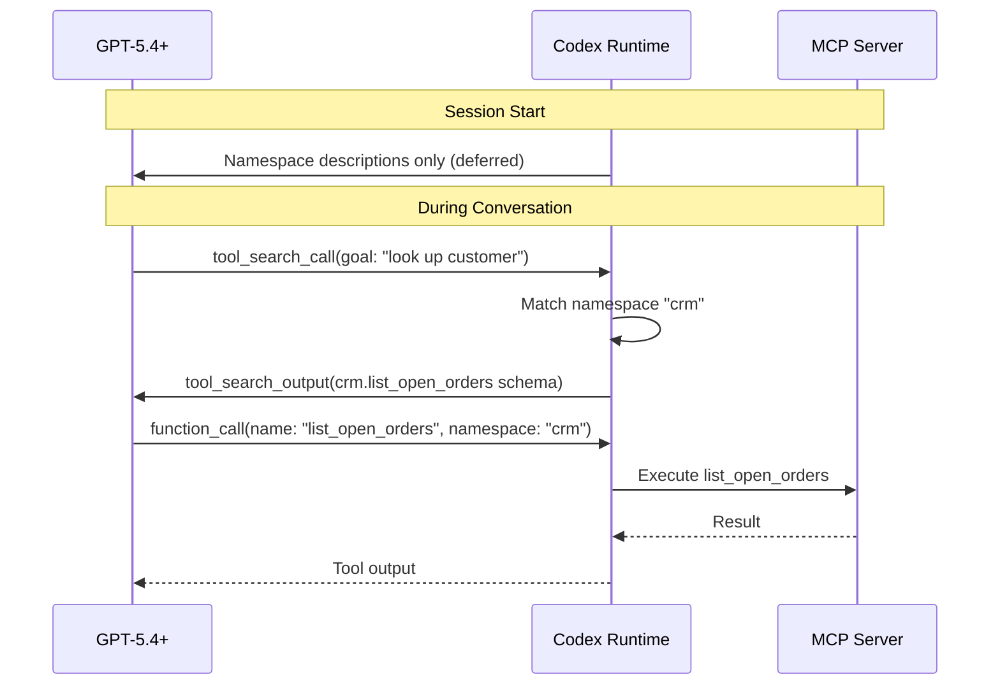
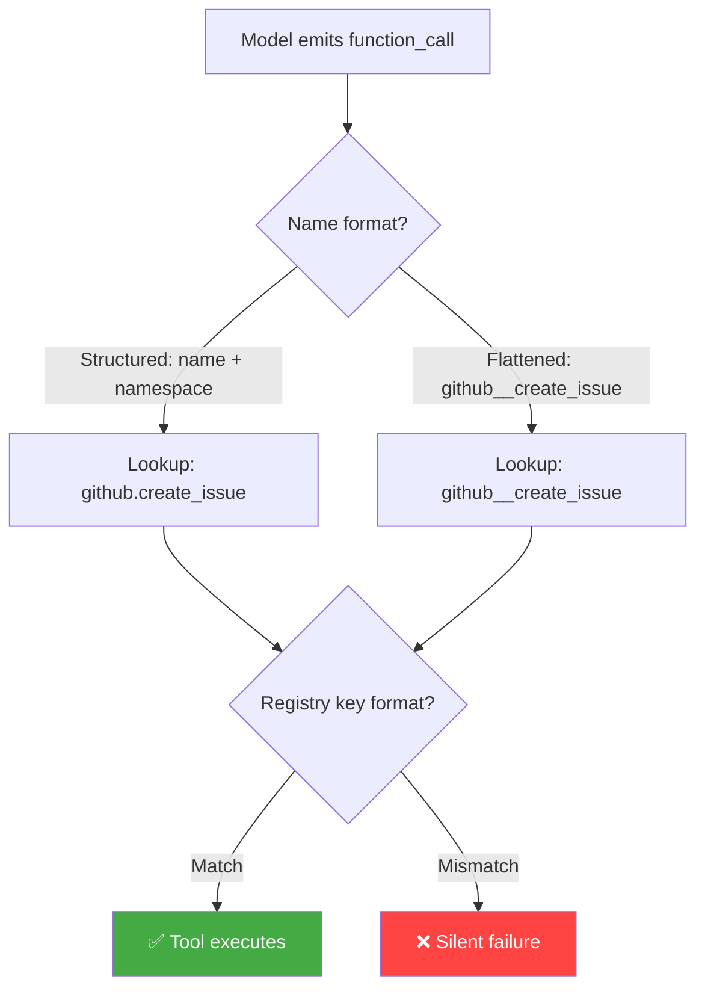

# MCP Tool Namespace Unification: Fixing the Silent Tool-Not-Found Bug


---

## The Problem: Tools That Vanish Without a Trace

If you ran a multi-server MCP configuration in Codex CLI prior to v0.121.0, you may have encountered a particularly frustrating class of bug: the model requests a tool that _should_ exist, the runtime silently fails to match it, and the agent moves on as if the tool never existed. No error, no warning — just a quiet degradation of capability.

The root cause lay in how Codex CLI registered MCP tools internally. Direct tools (those loaded into context at session start) and deferred tools (those discovered at runtime via `tool_search`) used different naming formats[^1]. When the model emitted a function call referencing a deferred tool by its flattened name, the runtime's lookup table — keyed by a different format — returned nothing[^2].

PR #17404 and its companion refactors (#17402, #17556) landed in Codex CLI v0.121.0 to eliminate this entire class of bugs by unifying how all MCP tools are registered, regardless of loading strategy[^3].

## Background: Direct vs Deferred Tool Loading

Codex CLI supports two strategies for exposing MCP tools to the model.

### Direct Loading

Every tool definition is injected into the model's context window at session start. Simple and reliable, but costly: a single MCP server can contribute thousands of tokens. One community report measured two Context7 tools consuming 2,522 characters (388 words) — added to every request despite being relevant in roughly 5% of interactions[^4].

### Deferred Loading via `tool_search`

Introduced alongside GPT-5.4's `tool_search` capability[^5], deferred loading presents only high-level namespace descriptions upfront. The model discovers individual tool definitions on demand. When MCP tool descriptions exceed 10% of the context window, Codex CLI automatically defers them and routes discovery through its internal `MCPSearch` mechanism[^6].



The token savings are substantial — estimated at 47% for tool-heavy configurations[^4] — but the dual registration paths created a naming inconsistency that led to silent failures.

## The Naming Inconsistency

Prior to v0.121.0, Codex CLI maintained two separate code paths for tool registration:

1. **Direct tools** were registered with a structured `ToolName` type that preserved the server namespace as a separate field — e.g., `{ server: "github", name: "create_issue" }`.
2. **Deferred tools**, when resolved via `tool_search_output`, arrived with flattened names — e.g., `"github__create_issue"` or simply `"create_issue"` with namespace metadata in a sibling field.

When the model emitted a `function_call` for a deferred tool, the name format depended on the model's output. GPT-5.4+ models emit structured calls with separate `name` and `namespace` fields[^5]:

```json
{
  "type": "function_call",
  "name": "create_issue",
  "namespace": "github",
  "call_id": "call_abc123",
  "arguments": "{\"title\": \"Fix login bug\"}"
}
```

But the runtime's tool registry might have stored the tool under a flattened key like `"github__create_issue"`, or vice versa. The lookup failed silently, and the model received no tool output — interpreting this as the tool not existing.



## The Fix: Unified `ToolName` Type

PR #17402 refactored the internal `ToolName` representation into a single type that encapsulates both name and namespace[^3]. Rather than storing tools under string keys with inconsistent formatting, every tool — direct or deferred — is now registered through the same normalisation path.

PR #17404 then applied this unified type to all MCP tool registrations, ensuring that every MCP server's tools are namespace-aware from the moment they are discovered[^3].

PR #17556 completed the picture by handling the edge case of flattened deferred tool names — ensuring that when a `tool_search_output` returns tools with flattened identifiers, they are correctly decomposed into the structured `ToolName` format before registry insertion[^3].

The key changes:

| Aspect | Before v0.121.0 | After v0.121.0 |
|--------|-----------------|----------------|
| Direct tool key | `{ server, name }` struct | Unified `ToolName` type |
| Deferred tool key | Flattened string | Unified `ToolName` type |
| Lookup normalisation | Per-path, inconsistent | Single normalisation function |
| Silent mismatch possible | Yes | No — lookup is format-agnostic |

An additional fix in PR #17946 resolved a related issue where namespace descriptions could be empty in tool output, which degraded the model's ability to select the correct namespace during `tool_search`[^3].

## Practical Impact

### For End Users

If you use multiple MCP servers — particularly a mix of app-backed servers (which were already deferred) and custom stdio/HTTP servers — upgrading to v0.121.0 eliminates an entire category of "the model seems to ignore my MCP tools" issues. The fix is automatic; no configuration changes are required.

### For MCP Server Authors

The unification means you no longer need to worry about how your tool names interact with Codex's internal registry. Previously, tool names containing double underscores or dots could collide with namespace delimiter conventions. The structured `ToolName` type eliminates delimiter-based parsing entirely.

### For Plugin Ecosystem Reliability

The namespace unification also lays groundwork for richer MCP features landed in the same release cycle: namespaced MCP registration, parallel-call opt-in, and sandbox-state metadata for MCP servers[^3]. These features depend on reliable tool identity — which the unified `ToolName` type now guarantees.

## Configuration Best Practices

To get the most from namespace-aware tool registration, structure your MCP servers with clear, descriptive names:

```toml
[mcp_servers.github]
command = "gh-mcp-server"
args = ["--repo", "myorg/myrepo"]

[mcp_servers.database]
url = "http://localhost:3100/mcp"
enabled_tools = ["query", "describe_table", "list_tables"]
disabled_tools = []
```

OpenAI's guidance recommends keeping each namespace to fewer than 10 functions for optimal `tool_search` performance[^5]. If your MCP server exposes dozens of tools, consider using `enabled_tools` to curate a focused subset[^7]:

```toml
[mcp_servers.large_server]
command = "mega-tools-server"
enabled_tools = ["search", "create", "update", "delete"]
```

For deferred loading with GPT-5.4+, the automatic deferral threshold (10% of context window) handles most cases. If you want explicit control, the API-level `defer_loading: true` flag on individual tools within a namespace gives fine-grained control over which tools load eagerly and which wait for discovery[^5].

## Verifying the Fix

After upgrading to v0.121.0+, you can verify namespace-aware registration is working by running:

```bash
codex --model o4-mini
```

Then use the `/mcp` command within the session to inspect registered tools. Each tool should display with its namespace prefix, and deferred tools should resolve correctly when the model invokes them.

## Conclusion

The MCP tool namespace unification in Codex CLI v0.121.0 is a reliability fix that addresses a subtle but impactful class of bugs. By consolidating tool identity into a single `ToolName` type, Codex eliminates the silent tool-not-found failures that plagued mixed direct/deferred configurations. For teams running complex multi-server MCP setups, this is a compelling reason to upgrade.

---

## Citations

[^1]: [Extend GPT-5.4-style tool search and deferred loading to all MCP server tools — GitHub Issue #14507](https://github.com/openai/codex/issues/14507)
[^2]: [MCP and tool registered error — GitHub Issue #15779](https://github.com/openai/codex/issues/15779)
[^3]: [Codex CLI Changelog — v0.121.0 Release Notes](https://developers.openai.com/codex/changelog)
[^4]: [Add MCP search tool, lazy MCP load, reduce MCP tool occupying context — GitHub Issue #9266](https://github.com/openai/codex/issues/9266)
[^5]: [Tool Search — OpenAI API Documentation](https://developers.openai.com/api/docs/guides/tools-tool-search)
[^6]: [Codex CLI Features — MCP Tool Handling](https://developers.openai.com/codex/cli/features)
[^7]: [Codex Configuration Reference — MCP Server Settings](https://developers.openai.com/codex/config-reference)
