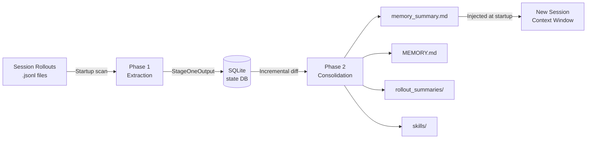

# Memory Lifecycle Management: Create, Consolidate, Clean, Delete in Codex CLI


---

Since v0.100.0, Codex CLI has shipped a persistent memory system that retains facts, preferences, and project context across sessions[^1]. What started as a simple key–value note store has matured into a two-phase extraction-and-consolidation pipeline backed by SQLite, with configurable retention, diff-based forgetting, and programmatic deletion. This article walks through every stage of that lifecycle — create, consolidate, clean, delete — and explores the configuration surface and data-governance implications for enterprise teams.

## Why Agent Memory Matters

Stateless agents force developers to repeat context: "use `pnpm`, not `npm`"; "our API always returns a `meta` field"; "run tests with `pytest -x --tb=short`". Codex CLI's memory system eliminates that friction by persisting observations from past sessions and injecting them into the model's developer instructions at startup[^2]. The payoff compounds across long-running projects where architectural decisions, tool preferences, and codebase conventions accumulate over weeks.

## Architecture at a Glance



The pipeline comprises two asynchronous phases that run at session startup, a set of on-disk artefacts under `~/.codex/memory/`, and a SQLite state database that tracks job ownership and watermarks[^3].

## Phase 1 — Extraction

Phase 1 identifies **stale threads** — those updated since their last memory extraction — and summarises each one using the lightweight `gpt-5.4-mini` model[^3]. The output is a `StageOneOutput` struct containing:

| Field | Purpose |
|---|---|
| `raw_memory` | Detailed markdown capturing decisions, preferences, and lessons |
| `rollout_summary` | Compact recap suitable for the rollout_summaries/ directory |
| `rollout_slug` | Optional human-readable filename stem |

Results land in the `stage1_outputs` table in SQLite. Concurrency is governed by `CONCURRENCY_LIMIT` (default 8), ensuring the startup scan does not saturate API quotas[^3].

### Selection Criteria

Not every thread qualifies. Phase 1 scans the `threads` table for active threads within `max_rollout_age_days` and filters out those idle for less than `min_rollout_idle_hours` (recommended >12 h)[^4]. This prevents in-progress sessions from generating premature memories.

## Phase 2 — Global Consolidation

Phase 2 is the heavy lift. It claims a global lock via `try_claim_global_phase2_job` (with a one-hour lease expiry) and spawns a dedicated sub-agent sourced as `SubAgentSource::MemoryConsolidation`[^3]. The consolidation model is `gpt-5.3-codex` running at medium reasoning effort — stronger than Phase 1's mini model, because merging and deduplicating memories requires judgement[^5].

### Incremental Diff Labels

Rather than reprocessing every memory from scratch, Phase 2 tracks an `input_watermark` and classifies each Stage 1 output with a diff label[^5]:

| Label | Meaning |
|---|---|
| `added` | In the current selection but absent from the previous Phase 2 baseline |
| `retained` | Present in both current selection and prior snapshot, unchanged |
| `removed` | Was in the prior baseline but no longer in the current top-N |

The consolidation agent receives these labels and adjusts the on-disk artefacts accordingly — merging new facts, preserving stable ones, and **forgetting** removed evidence.

### On-Disk Artefacts

Phase 2 maintains five artefact types under `codex_home`:

```
~/.codex/memory/
├── memory_summary.md          # Navigational summary injected into prompts
├── MEMORY.md                  # Searchable registry of aggregated insights
├── raw_memories.md            # Temporary merge of Phase 1 outputs (input to Phase 2)
├── rollout_summaries/
│   └── <thread_id>-<ts>-<slug>.md
└── skills/
    └── <name>/SKILL.md        # Reusable procedures and scripts
```

Rollout summary filenames are generated by `rollout_summary_file_stem`, combining `ThreadId`, a timestamp fragment, and the optional `rollout_slug`[^3].

## Context Injection — The Read Path

At session start, `memory_summary.md` is injected into the model's developer instructions, truncated to `MEMORY_TOOL_DEVELOPER_INSTRUCTIONS_SUMMARY_TOKEN_LIMIT` (5,000 tokens)[^3]. The agent is instructed to cite specific files and line ranges using `<oai-mem-citation>` blocks, creating a retrieval-augmented generation loop where the model can reference evidence from past sessions.

Each citation triggers a call to `record_stage1_output_usage`, incrementing `usage_count` and updating `last_usage` in the database[^3]. This usage tracking feeds directly into the selection ranking for the next consolidation pass:

```
usage_count DESC → last_usage DESC → source_updated_at DESC
```

Frequently cited memories rise to the top; neglected ones gradually age out[^5].

## Cleaning — Diff-Based Forgetting

Introduced in v0.106.0, diff-based forgetting is the mechanism that keeps the memory store lean[^1]. During Phase 2, memories labelled `removed` trigger deletion of the corresponding evidence from `rollout_summaries/` and `MEMORY.md`. The consolidation agent produces a forgetting pass that "deletes only the evidence supported by removed thread IDs"[^6].

### Stale Output Pruning

Phase 1 also performs housekeeping: `stage1_outputs` older than `max_unused_days` are pruned in batches of `PRUNE_BATCH_SIZE`[^3]. This prevents the SQLite database from growing unboundedly on machines with years of session history.

### Polluted Thread Handling

When a session uses a disqualifying tool (one that produces non-deterministic or sensitive output), the thread can be marked as **polluted**. If the thread had `selected_for_phase2 = 1`, the system immediately enqueues a new global Phase 2 job so the forgetting pass can remove it[^6].

## Deletion — User-Controlled and Programmatic

### Interactive Deletion

The `/m_drop <query>` slash command removes a memory matching the query from the active store[^1]. This is the simplest deletion path — useful for correcting a stale preference or removing an outdated architectural fact.

### Full Reset

For a clean slate — when switching between unrelated projects, for instance — `codex debug clear-memories` wipes all memory artefacts and resets the SQLite state[^1]. Introduced in v0.107.0, this addresses the common complaint that memories from Project A would bleed into Project B.

### Disabling the Read Path

Three methods exist to suppress memory injection without deleting the underlying data[^7]:

```bash
# Command line flag
codex --no-project-doc

# Environment variable
export CODEX_DISABLE_PROJECT_DOC=1
```

```toml
# config.toml
[project_docs]
enabled = false
```

For the memories pipeline itself, the `memories.use_memories` and `memories.generate_memories` booleans in `config.toml` control read and write paths independently[^4]:

```toml
[memories]
use_memories = true        # Inject memories into prompts
generate_memories = true   # Run Phase 1/2 pipeline at startup
```

Setting `generate_memories = false` while keeping `use_memories = true` freezes the memory store — the agent still reads existing memories but stops creating new ones.

## Configuration Reference

The full `[memories]` section in `~/.codex/config.toml` exposes nine tunables[^4]:

```toml
[memories]
use_memories = true
generate_memories = true
max_rollout_age_days = 90
min_rollout_idle_hours = 12
max_rollouts_per_startup = 5000
max_unused_days = 60
max_raw_memories_for_global = 200
phase_1_model = "gpt-5.4-mini"
phase_2_model = "gpt-5.3-codex"
```

| Key | Default | Purpose |
|---|---|---|
| `max_rollout_age_days` | 90 | Threads older than this are excluded from Phase 1 |
| `min_rollout_idle_hours` | 12 | Minimum idle time before a thread qualifies |
| `max_rollouts_per_startup` | 5000 | Cap on Phase 1 candidates per session start |
| `max_unused_days` | 60 | Stale outputs pruned after this many days |
| `max_raw_memories_for_global` | 200 | Top-N memories fed into Phase 2 consolidation |
| `phase_1_model` | gpt-5.4-mini | Lightweight extraction model |
| `phase_2_model` | gpt-5.3-codex | Consolidation model with medium reasoning |

Enterprise teams will want to tune `max_unused_days` and `max_raw_memories_for_global` to balance recall depth against startup latency.

## Memory vs AGENTS.md — When to Use Which

Codex CLI offers two persistence mechanisms, and conflating them is a common mistake:

| Dimension | Memories | AGENTS.md |
|---|---|---|
| **Scope** | Personal, per-user | Project or directory, version-controlled |
| **Creation** | Automatic from sessions | Manual, authored by developers |
| **Sharing** | Not shared | Committed to the repository |
| **Hierarchy** | Flat (single user store) | Three-level merge: global → project → directory[^7] |
| **Best for** | Personal preferences, tool choices | Team conventions, architecture docs |

Use memories for "always use `pytest`" and AGENTS.md for "this repo's API layer lives in `src/api/` and uses FastAPI".

## Enterprise Data Governance Considerations

For organisations deploying Codex CLI at scale, the memory system raises several governance questions:

1. **Data residency**: Memories are stored locally under `codex_home`. In cloud-task mode, they reside on the ephemeral runner — ensure your task infrastructure handles cleanup.

2. **Secret leakage**: Since v0.101.0, automatic secret sanitisation prevents credentials from being written to memory files[^1]. However, teams should audit `raw_memories.md` periodically, especially in regulated environments.

3. **Retention policies**: Map `max_unused_days` and `max_rollout_age_days` to your organisation's data retention requirements. A 60-day default may be too long — or too short — depending on compliance posture.

4. **Cross-project contamination**: Without per-project memory partitioning, memories from one codebase can influence another. Use `codex debug clear-memories` when rotating between sensitive projects, or set `generate_memories = false` for short-lived tasks.

## Comparison with Claude Code

Claude Code takes a fundamentally different approach: it has no built-in persistent memory system equivalent to Codex's two-phase pipeline[^5]. Instead, Claude Code relies on CLAUDE.md instruction files (analogous to AGENTS.md) and a three-tier context compaction strategy (tool result trimming → cache-friendly strategies → structured summaries)[^8]. The absence of automatic cross-session memory means Claude Code users must manually curate their instruction files — more control, less automation.

## Conclusion

Codex CLI's memory lifecycle — create via Phase 1 extraction, consolidate via Phase 2's diff-aware merging, clean through forgetting passes and stale pruning, delete via `/m_drop` or `clear-memories` — represents the most sophisticated agent memory system in any terminal-based coding tool today. The nine configuration tunables give enterprise teams the knobs they need to balance recall, latency, and data governance. As the pipeline continues to evolve, expect tighter integration with the TUI and finer-grained per-project memory partitioning.

## Citations

[^1]: [Blake Crosley — Codex CLI: The Definitive Technical Reference](https://blakecrosley.com/guides/codex) — Memory system overview, version history, slash commands, and data governance enhancements.

[^2]: [Codex CLI Features — OpenAI Developers](https://developers.openai.com/codex/cli/features) — Official feature documentation including conversation resumption and context persistence.

[^3]: [DeepWiki — Memory System (openai/codex)](https://deepwiki.com/openai/codex/3.7-memory-system) — Two-phase pipeline architecture, SQLite storage, context injection, and source file references.

[^4]: [Mintlify — Codex Configuration Reference](https://mintlify.wiki/openai/codex/configuration/reference) — Full `[memories]` configuration section with all tunables.

[^5]: [Zylos Research — OpenAI Codex CLI Architecture and Multi-Runtime Agent Patterns](https://zylos.ai/research/2026-03-26-openai-codex-cli-architecture-multi-runtime-patterns) — Phase 2 consolidation model, diff labels, and Claude Code comparison.

[^6]: [Justin3go — Shedding Heavy Memories: Context Compaction in Codex, Claude Code, and OpenCode](https://justin3go.com/en/posts/2026/04/09-context-compaction-in-codex-claude-code-and-opencode) — Diff-based forgetting, polluted thread handling, and compaction strategies.

[^7]: [Mintlify — Codex Memory & Project Docs](https://mintlify.wiki/openai/codex/features/memory) — AGENTS.md hierarchy, disabling memory, and project docs configuration.

[^8]: [OpenAI Developers — Codex CLI Changelog](https://developers.openai.com/codex/changelog) — Release notes for v0.119.0 and v0.120.0.
