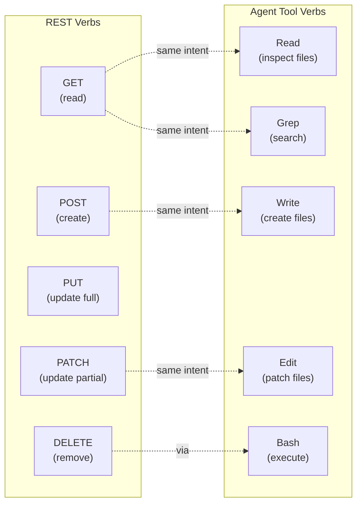
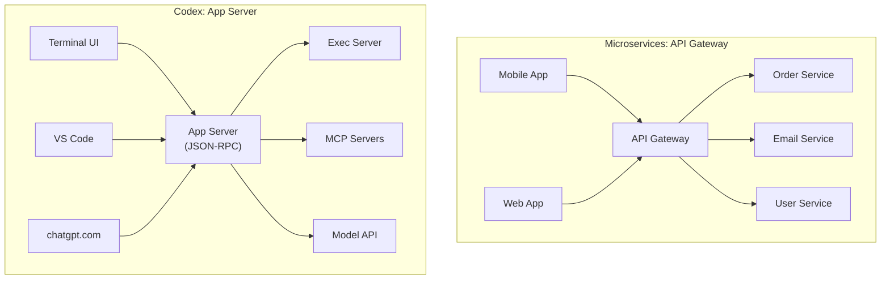
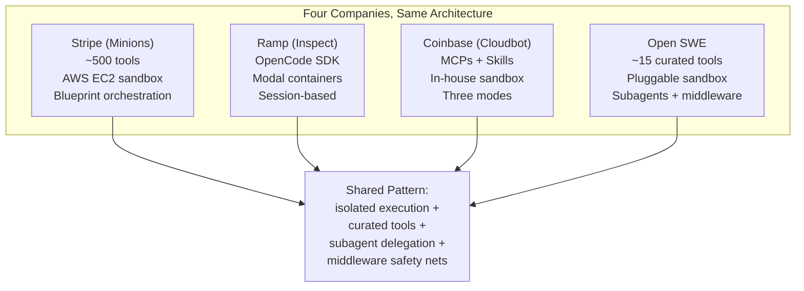

# What Microservices Taught Us About Building AI Coding Agents

---

I attended a microservices talk yesterday at Norfolk Developers. The speaker covered the fundamentals — monoliths versus microservices, RESTful API design, service sizing, scaling, observability, asynchronous messaging, and the distributed monolith anti-pattern. As I listened, I kept noticing the same patterns I see every day in agentic coding with Codex CLI. The parallels are not superficial. The architectural principles that make microservices work are the same principles that make AI coding agents work well.

This article maps the key lessons from microservices architecture onto agentic engineering and asks: if you already understand microservices, what do you already know about building with AI coding agents?

## Lesson 1: The Monolith-to-Microservices Journey Is the Copilot-to-Agent Journey

The talk opened with the classic progression. You start with a monolith — all business capabilities in one process, one codebase, one database. It simplifies development at first, but over time it becomes hard to maintain, hard to scale, and hard for multiple teams to work on without tripping over each other. The solution is to decompose into microservices: smaller, independently deployable units that each serve a single business capability.

AI coding tools followed the exact same arc:

| Microservices Journey | AI Coding Journey |
|----------------------|-------------------|
| **Monolith** — all logic in one process | **Autocomplete** — all intelligence in one prediction (Copilot, TabNine) |
| **Service-oriented architecture** — bigger services, some separation | **Chat assistants** — separate interaction but tightly coupled to IDE context |
| **Microservices** — small, independent, single-capability | **Agentic coding** — independent agent loop with discrete tool calls, each doing one thing |

The original AI coding monolith was inline autocomplete: one model, one prediction, no separation of concerns. Chat-based assistants (early Copilot Chat, ChatGPT) were the service-oriented architecture phase — bigger, more capable, but still monolithic in their execution. The agentic phase is the microservices moment: decomposed into discrete, independent capabilities (read, search, edit, execute) orchestrated by a lightweight loop.[^1]

And just as the speaker warned, you can end up with a **distributed monolith** in agentic coding too — an agent that technically has separate tools but where everything is so tightly coupled that you cannot change one tool without breaking the whole chain. This happens when agents hard-code assumptions about tool output formats or when context is shared implicitly rather than through clean interfaces.

## Lesson 2: Single Business Capability = Single Tool Responsibility

The speaker emphasised that each microservice should serve **one business capability**. Not one endpoint — one capability. An order service handles orders. An email service handles emails. They are cohesive, encapsulated, and loosely coupled.

Codex CLI's tool architecture follows the same principle. Each tool does one thing:[^2]

| Microservice Principle | Codex CLI Tool |
|----------------------|----------------|
| One business capability per service | One action per tool (`Read`, `Edit`, `Bash`, `Grep`) |
| Well-defined API contract | Structured JSON input/output schema |
| Independent deployment | Tools are independently implemented and versioned |
| Own data store | Each tool operates on its own domain (filesystem, shell, search index) |

The speaker asked the audience "how big should a microservice be?" and found no consensus — Jamie Lewis says 100-1,000 lines, others say "small enough for one team to maintain." The same ambiguity exists in agentic tool design: how granular should a tool be? Codex has a single `Bash` tool for all shell commands; Claude Code splits it into `Bash` plus `TodoWrite` plus `NotebookEdit`. There is no right answer, but the principle is the same — **one capability, clean interface, independently changeable**.[^3]

## Lesson 3: Know Your Verbs

One of the strongest sections of the talk was on RESTful API design — know your HTTP verbs, use the right status codes, be consistent. The speaker was passionate: "Don't delete with POST. Don't wrap the response body in an extra object. Don't include a `success` field in your response."

This maps directly onto how agents interact with tools. The Codex app server protocol uses a verb-like method taxonomy:[^4]

The speaker's rule — "use the right verb so the client knows what to do" — applies equally to agent tool design. When Codex calls `Edit` with `old_str`/`new_str`, the contract is precise: find this exact string, replace it with this exact string. The agent knows what will happen. When the contract is vague (a generic "do stuff" tool), the agent hallucinates, just like a client that gets a 200 back for every response and has to guess what actually happened.

And the speaker's warning about status codes? The same lesson applies: tools must return clear, actionable error information. A `Bash` tool that returns exit code 1 with no stderr is the equivalent of a REST API that returns 500 for a missing field in the request body. The agent cannot self-correct if it does not know what went wrong.[^5]

## Lesson 4: Cross-Cutting Concerns as Shared Libraries

The speaker recommended putting cross-cutting concerns — authentication, logging, observability, resilience patterns — into shared libraries used across all microservices. "Write it once, share it across all your services." But crucially: **do not share business logic**. If two services need the same capability, one should expose an API to the other.

In agentic engineering, cross-cutting concerns are handled by the agent framework itself:

| Cross-Cutting Concern | Microservices | Codex CLI |
|----------------------|---------------|-----------|
| **Authentication** | Shared auth library / API gateway | App server auth layer (capability tokens, JWT) |
| **Logging/Observability** | Datadog, Splunk, ELK | W3C Trace Context, JSONL session logs, structured logging |
| **Resilience** | Circuit breakers, retries, timeouts | Exponential backoff with jitter, command timeouts, overload rejection (-32001) |
| **Consistency** | Shared data structures | MCP protocol schemas, AGENTS.md standards |

Addy Osmani's **Agent Skills** project (10,000+ GitHub stars) is a concrete example of this pattern in practice. It encodes senior engineering discipline — drawn from Google's engineering culture — into a shared library of 19 skills and 7 commands (`/spec`, `/plan`, `/build`, `/test`, `/review`, `/code-simplify`, `/ship`) that work across Claude Code, Cursor, and Gemini CLI.[^6] This is the cross-cutting concerns library for agentic coding: write your quality gates once, enforce them everywhere. Osmani's insight is sharp — left to their own devices, agents optimise for "done" rather than "correct," skipping specifications, bypassing tests, and ignoring security reviews. The shared library forces discipline, just as a shared auth library forces consistent authentication across microservices.

The speaker's point about not sharing a database between services has a direct parallel: **agents should not share mutable state implicitly**. When Codex spawns subagents via cloud exec, each gets its own context and working directory. They communicate results back through clean interfaces (return values), not by mutating shared files that other agents might be reading. The same principle, different domain.[^7]

## Lesson 5: The Public API Gateway Pattern

The speaker was emphatic: "Only have one service that talks to a GUI or mobile app." A single point of entry — an API gateway — that orchestrates calls to internal microservices. This gives you control over authentication, bandwidth, rollback, and service discovery.

Codex CLI's app server is exactly this pattern. The app server is the single point of entry for every client surface — the terminal UI, VS Code extension, macOS desktop app, and the web interface at chatgpt.com/codex. Internal subsystems (the exec server, MCP servers, the model API) are hidden behind this single bidirectional JSON-RPC interface:[^8]

The speaker's advice about security at the gateway — use temporary tokens externally, trust internally with API keys — maps onto Codex's transport security model. The WebSocket transport uses capability tokens or signed JWTs for external connections. The stdio transport (internal, same process boundary) needs no authentication at all. Same principle: trust the boundary, secure the perimeter.[^9]

## Lesson 6: Asynchronous Messaging and Decoupling

"Sometimes you don't need a message back straight away," the speaker said, introducing SQS, RabbitMQ, and message queues. The key benefit: "The only thing you're coupled against is the message itself." Services only need to know where the queues are, and that is handled by infrastructure.

Codex CLI uses this pattern in several places:

- **Notifications**: The app server protocol is heavily notification-based. When Codex streams a response, it sends dozens of `item/*/delta` notifications that clients consume asynchronously. The server does not wait for acknowledgement.
- **Cloud exec**: When Codex dispatches work to cloud workers, the communication is asynchronous. The local agent continues while remote workers process their subtasks.
- **MCP tool calls**: External MCP servers may respond asynchronously. The agent loop does not block the entire pipeline waiting for a slow database query to return.

The speaker noted the trade-off: "You do both have to agree on what the message looks like." That is exactly why MCP standardised the tool interface (JSON Schema for inputs and outputs) and why the app server protocol has a formal schema you can generate with `codex app-server generate-json-schema`. The message contract is the coupling point — everything else is decoupled.[^10]

## Lesson 7: Observability Is Non-Negotiable

The speaker described the pain of tailing logs on multiple servers, trying to correlate requests across services. The solution: centralised observability with Datadog, correlation IDs, distributed tracing.

Agentic coding sessions have the same problem at a different scale. A single Codex session might invoke twenty tool calls across three subagents, each making model API calls. Without observability, debugging is impossible.

Codex addresses this with:[^11]

- **W3C Trace Context**: Every JSON-RPC request can carry a `traceparent` and `tracestate` for distributed tracing
- **JSONL session logs**: Every item in every turn is captured for post-hoc analysis
- **Correlation through thread IDs**: Every event is scoped to a thread, and threads have unique IDs that persist across process restarts

The speaker's advice to "get all your logs in one place so you can follow the correlation all the way through" is precisely what the analytics pipeline in Codex v0.121.0 provides. The recent PRs (#16641, #16706, #16870) added JSONL session analytics that capture every tool call, model interaction, and agent decision in a single, queryable stream.[^12]

## Lesson 8: Scaling — Vertical vs. Horizontal

The speaker explained the classic distinction: vertical scaling (give it more power) versus horizontal scaling (run more instances behind a load balancer). The key constraint for horizontal scaling: **services must be stateless**.

Codex CLI uses both:

| Scaling Strategy | Microservices | Codex CLI |
|-----------------|---------------|-----------|
| **Vertical** | More CPU/RAM for a single instance | Larger context window (1M tokens), more powerful model (GPT-5.4) |
| **Horizontal** | Multiple instances + load balancer | Cloud exec with up to 6 parallel workers, subagent delegation |
| **Statelessness requirement** | No session state on individual instances | Each cloud worker gets a fresh context — no shared mutable state |

The speaker warned: "If you service a message on one instance, the next time the load balancer takes you to another, you can't rely on state from the original instance." Codex's cloud workers enforce this by design — each worker operates in an isolated sandbox with its own filesystem. If you need shared state, it flows through the orchestrator, not through side channels.[^13]

## Lesson 9: Start with Microservices (or Agents), Keep It Under Review

The speaker said something unexpected: "Start with microservices, unless you can't." Most advice says start with a monolith and decompose later, but the speaker argued that if you know you will need the decomposition, you save pain by starting decomposed.

I think the same advice applies to agentic coding. If you know your task requires multiple steps — reading code, making changes, running tests, iterating — start with an agent rather than a chatbot. Do not begin with a monolithic "paste code into ChatGPT" workflow and try to add agency later. Start with `codex` or `claude` from the beginning, let the agent loop handle the orchestration, and keep your approach under review as the task evolves.

But the speaker also acknowledged the modular monolith approach, attributed to Kevlin Henney: "Nobody told you to write a messy monolith." You can have all your code in one place and still keep it modular. The agentic equivalent is using a single agent session with well-structured AGENTS.md instructions rather than immediately reaching for multi-agent orchestration. Sometimes one well-configured agent is better than a committee of poorly coordinated ones.[^14]

## Lesson 10: The Distributed Monolith Anti-Pattern

The speaker's most important warning was about the **distributed monolith**: "You've got lots of different services, but they're not really separate. They're still tightly coupled and you can't deploy one without deploying another."

In agentic engineering, the distributed monolith looks like this:

- An agent that calls tools in a fixed, hard-coded sequence rather than reasoning about what to do next
- MCP servers that depend on each other's internal state rather than communicating through clean APIs
- Multi-agent setups where agents share a database (filesystem) without coordination, stepping on each other's changes
- Tool chains where changing one tool's output format breaks every downstream tool

The antidote is the same in both worlds: **loose coupling through clean contracts**. Each tool should have a well-defined interface. Each agent should be independently deployable. State should be explicit, not implicit.

## Production Validation: Open SWE and the Enterprise Pattern

If you are unconvinced that microservices patterns map onto agentic coding, consider LangChain's **Open SWE** framework, released in April 2026. It is an open-source framework for building internal coding agents, and its architecture reads like a microservices system design document.[^15]

Open SWE was built by studying production coding agents at Stripe (Minions, forked from Goose), Ramp (Inspect, composed on OpenCode), and Coinbase (Cloudbot, built from scratch). Despite three different companies making three different implementation choices, they all converged on the same architectural primitives:

| Microservices Primitive | Open SWE Implementation |
|------------------------|------------------------|
| **Independent services** | Subagents via `task` tool — child agents with isolated context |
| **Container isolation** | Pluggable sandbox providers (Modal, Daytona, Runloop) — each task runs in its own cloud environment |
| **Cross-cutting concerns** | Middleware hooks — deterministic safety nets (linting before commit, automatic PR creation) |
| **Curated API surface** | ~15 carefully selected tools rather than an unbounded tool registry |
| **Service discovery** | AGENTS.md for repository conventions; Linear/Slack/GitHub for task context |
| **API gateway** | Slack-first invocation — single entry point meeting developers in existing workflows |

The comparison table from LangChain's blog is revealing:

The key insight from Open SWE is **customisation without forking** — sandbox providers, LLM models, tools, triggers, system prompts, and middleware are all pluggable. This is the microservices promise applied to agents: swap out any component without rebuilding the core. It is the same modularity the Norfolk Developers speaker advocated for services, now applied to agent architecture.[^16]

## The Deeper Connection

These are not just analogies. Microservices and agentic coding share the same underlying challenge: **how do you coordinate independent, autonomous units that each do one thing well?**

In microservices, the units are services. In agentic coding, the units are tool calls within an agent loop (and, at a higher level, the agents themselves in multi-agent systems). The coordination primitives are the same: clean interfaces, message contracts, asynchronous communication, centralised observability, and explicit state management.

If you have spent years learning how to build, deploy, and operate microservices, you already have the mental models for agentic engineering. The vocabulary is different, but the architecture is the same.

| Microservices Concept | Agentic Engineering Equivalent |
|----------------------|-------------------------------|
| API Gateway | App Server |
| Service | Tool |
| Message Queue | Notification Stream |
| Load Balancer | Task Router / Cloud Exec |
| Circuit Breaker | Tool timeout + retry logic |
| Service Discovery | MCP server registry |
| API Contract (OpenAPI) | Tool schema (JSON Schema) |
| Distributed Tracing | W3C Trace Context + session logs |
| Health Check | `/readyz`, `/healthz` endpoints |
| Sidecar Pattern | PostToolUse hooks |
| CQRS | Read tools vs. Write tools |
| Saga Pattern | Multi-turn rollback (`thread/rollback`) |

The speaker closed with a mention of Kevlin Henney and the importance of getting the fundamentals right. That advice has never been more relevant. As AI coding agents become the primary way we build software, the developers who understand distributed systems architecture — not just AI prompting — will be the ones who build the best agentic workflows.

The microservices era taught us how to decompose, coordinate, and observe autonomous systems. The agentic era is the same lesson, applied to a new kind of autonomous unit.

---

## Footnotes

[^1]: The progression from autocomplete to chat to agentic coding mirrors the monolith-to-microservices decomposition. See: "The Codex Agent Loop Deep Dive," codex.danielvaughan.com, March 2026.

[^2]: Codex CLI tool architecture: each tool implements a single capability with a structured JSON interface. https://github.com/openai/codex

[^3]: Nadeem et al., "Inside the Scaffold: A Source-Code Taxonomy of Coding Agent Architectures," arXiv, April 2026. https://arxiv.org/html/2604.03515 — found agents range from 0 to 37 tools but all implement four core categories.

[^4]: OpenAI, "App Server Protocol — Thread, Turn, Item Primitives," Codex Developer Documentation. https://github.com/openai/codex/blob/main/codex-rs/app-server/README.md

[^5]: The importance of clear error reporting for agent self-correction is discussed in: Tompkins et al., "Building AI Coding Agents for the Terminal," arXiv, March 2026. https://arxiv.org/html/2603.05344v1

[^6]: Osmani, A., "Agent Skills — Engineering discipline for AI coding agents," April 2026. 19 skills + 7 commands encoding Google engineering culture. 10,000+ GitHub stars. https://www.linkedin.com/posts/addyosmani_ai-softwareengineering-programming-activity-7448255964102950912-vScT

[^7]: Codex cloud exec isolation: each worker operates in an independent sandbox. OpenAI, "Codex Cloud Execution," April 2026. https://developers.openai.com/codex/concepts/cloud-execution

[^8]: The Codex app server as single point of entry is documented in: "The Codex App Server: A Complete Guide," codex.danielvaughan.com, April 2026.

[^9]: Transport security: WebSocket uses capability tokens or signed JWTs; stdio is inherently trusted. `codex-rs/app-server/src/transport/auth.rs`. https://github.com/openai/codex/blob/main/codex-rs/app-server/src/transport/auth.rs

[^10]: MCP protocol standardisation: donated to the Agentic AI Foundation (Linux Foundation), December 2025. 97 million monthly SDK downloads. https://mcpmanager.ai/blog/mcp-adoption-statistics/

[^11]: W3C Trace Context in Codex: `JSONRPCRequest.trace` field. https://github.com/openai/codex/blob/main/codex-rs/app-server-protocol/src/lib.rs

[^12]: Analytics pipeline PRs: #16641, #16706, #16870 added JSONL session analytics to Codex v0.121.0. https://github.com/openai/codex/pulls

[^13]: Codex cloud workers are stateless by design — each operates in an isolated sandbox with its own filesystem. https://developers.openai.com/codex/concepts/cloud-execution

[^14]: Henney, K., various talks on modular monoliths and software architecture. The principle "nobody told you to write a messy monolith" applies equally to agent session design.

[^15]: LangChain, "Open SWE: An Open-Source Framework for Internal Coding Agents," April 2026. Built on Deep Agents and LangGraph, studying production agents at Stripe, Ramp, and Coinbase. https://www.langchain.com/blog/open-swe-an-open-source-framework-for-internal-coding-agents/

[^16]: Open SWE's pluggable architecture (sandbox providers, models, tools, triggers, middleware) demonstrates the microservices principle of swappable components behind stable interfaces. https://github.com/langchain-ai/open-swe
