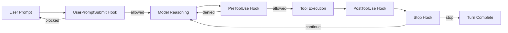
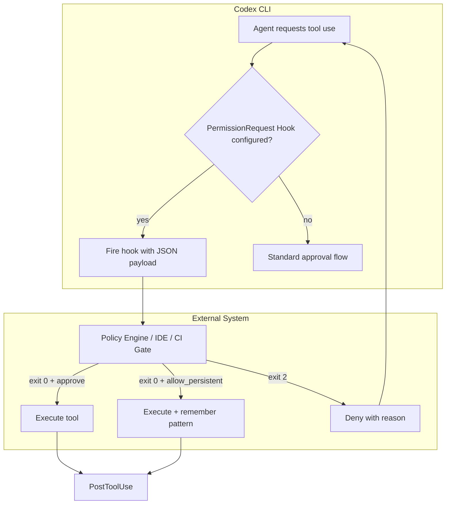

# PermissionRequest Hooks as a Programmatic Policy Engine


---

Codex CLI's hook system has quietly evolved from a simple logging extension point into something far more powerful: a programmable policy engine. By combining `PreToolUse` hooks, granular approval policies, and the emerging `PermissionRequest` hook proposal, teams can enforce security constraints that go well beyond static configuration — adapting dynamically to context, escalating trust progressively, and integrating with external governance systems.

This article dissects the current state of Codex CLI's permission hook architecture, demonstrates practical policy-as-code patterns, and examines the trajectory toward full programmatic approval workflows.

## The Hook Lifecycle Model

Codex CLI's extensibility framework centres on lifecycle hooks — external scripts that fire at specific points in the agentic loop [^1]. Hooks are configured in `hooks.json` files discovered alongside active config layers, at both user (`~/.codex/hooks.json`) and repository (`<repo>/.codex/hooks.json`) levels [^1]. When multiple files exist, all matching hooks load — higher-precedence layers do not replace lower-precedence ones.

The current hook event types are [^1]:

| Event | Scope | Blocking | Matcher Support |
|---|---|---|---|
| `SessionStart` | Session | Yes | `startup`, `resume` |
| `PreToolUse` | Turn | Yes | `Bash` (currently) |
| `PostToolUse` | Turn | Yes | `Bash` (currently) |
| `UserPromptSubmit` | Turn | Yes | None |
| `Stop` | Turn | Yes | None |

Every hook receives a JSON object on stdin containing `session_id`, `cwd`, `hook_event_name`, `model`, `turn_id`, and `transcript_path` [^1]. Output behaviour varies by event, but all hooks support exit code semantics: exit 0 for success, exit 2 for a blocking decision (with the reason on stderr) [^1].



## PreToolUse: The Current Policy Enforcement Point

The `PreToolUse` hook is presently the primary mechanism for injecting policy decisions into the execution flow. It intercepts tool invocations before they run, receiving the command details on stdin and accepting structured JSON responses that can deny execution [^1].

A denial response takes this shape:

```json
{
  "hookSpecificOutput": {
    "hookEventName": "PreToolUse",
    "permissionDecision": "deny",
    "permissionDecisionReason": "Destructive command blocked by hook."
  }
}
```

### Practical Example: Blocking Destructive Git Operations

```json
{
  "hooks": {
    "PreToolUse": [{
      "matcher": "Bash",
      "hooks": [{
        "type": "command",
        "command": "python3 /opt/codex-policies/block-destructive-git.py",
        "statusMessage": "Checking command safety",
        "timeoutSec": 10
      }]
    }]
  }
}
```

The corresponding policy script might inspect the command for patterns like `git push --force`, `git reset --hard`, or `rm -rf`:

```python
#!/usr/bin/env python3
"""PreToolUse hook: block destructive git operations."""
import json, sys, re

DESTRUCTIVE_PATTERNS = [
    r"git\s+push\s+.*--force",
    r"git\s+reset\s+--hard",
    r"git\s+clean\s+-[fd]",
    r"rm\s+-rf\s+/",
]

def main():
    payload = json.load(sys.stdin)
    command = payload.get("command", "")

    for pattern in DESTRUCTIVE_PATTERNS:
        if re.search(pattern, command):
            result = {
                "hookSpecificOutput": {
                    "hookEventName": "PreToolUse",
                    "permissionDecision": "deny",
                    "permissionDecisionReason":
                        f"Blocked: matches destructive pattern '{pattern}'"
                }
            }
            json.dump(result, sys.stdout)
            return

    # Allow by default — exit 0 with no output
    pass

if __name__ == "__main__":
    main()
```

**Important caveat:** The official documentation notes that "the model can still work around this by writing its own script to disk" [^1], so `PreToolUse` hooks are a defence-in-depth layer rather than an absolute security boundary. Pair them with sandbox restrictions for robust enforcement.

## Granular Approval Policies: The Configuration Layer

Hooks operate alongside Codex CLI's built-in approval policy system, which provides a declarative complement to programmatic enforcement. The `approval_policy` setting in `config.toml` accepts either a simple mode string or a granular object [^2]:

```toml
# Simple mode
approval_policy = "on-request"

# Granular control
approval_policy = { granular = {
  sandbox_approval = true,
  rules = true,
  mcp_elicitations = true,
  request_permissions = false,
  skill_approval = false
} }
```

The five granular categories are [^2]:

- **`sandbox_approval`** — sandbox configuration changes
- **`rules`** — execution policy rule triggers
- **`mcp_elicitations`** — MCP tool interaction prompts
- **`request_permissions`** — permission elevation requests
- **`skill_approval`** — skill script execution approval

Setting a category to `false` auto-rejects requests in that category rather than prompting the user [^2]. This is critical for CI/CD pipelines where interactive approval is impossible.

### Enterprise Managed Policies

For organisations, Codex Admins deploy managed `requirements.toml` policies from the Policies dashboard, applying them uniformly across CLI, app, and IDE surfaces [^3]. Policies are assigned to user groups with first-match semantics — each policy functions as a complete profile without inheritance from subsequent rules [^3].

```toml
# Enterprise managed policy example
approval_policy = "on-request"
sandbox_mode = "workspace-write"

[sandbox_workspace_write]
network_access = false
writable_roots = ["/home/dev/project"]
```

## The PermissionRequest Hook Proposal

The most significant evolution on the horizon is the dedicated `PermissionRequest` hook, proposed in GitHub issue #15311 [^4]. This addresses a fundamental limitation of the current system: `PreToolUse` is bash-only and deny-only. The `PermissionRequest` hook would provide:

- **Bidirectional responses** — approve or deny, not just deny [^4]
- **All tool types** — not limited to Bash commands [^4]
- **Persistent approval** — hook output can include `allow_persistent` to auto-approve matching patterns [^4]
- **Rich context** — receives command details, tool name, `prefix_rule`, and sandbox permissions [^4]

The driving use case is external approval UIs: desktop overlays, IDE extensions, and CI/CD pipelines that need to participate in the approval flow without access to the terminal [^4].



## Multi-Agent Permission Patterns

When running subagents, permission handling introduces additional complexity. Codex CLI's current model is straightforward: subagents inherit the parent session's sandbox policy, and live runtime overrides (including interactive approval decisions) are reapplied when spawning children [^5].

This means a `PreToolUse` hook configured at the repository level applies equally to all agents in the session. However, individual custom agents can receive explicit `sandbox_mode` overrides in their TOML configuration, enabling patterns like read-only explorer agents alongside a write-capable orchestrator [^5].

In non-interactive flows, actions requiring new approval simply fail — Codex surfaces the error to the parent workflow rather than silently proceeding [^5]. This fail-closed behaviour is essential for automated pipelines.

### Progressive Trust Escalation Pattern

Combining hooks with granular policies enables a progressive trust model:

```toml
# Start restrictive
approval_policy = { granular = {
  sandbox_approval = true,
  rules = true,
  mcp_elicitations = true,
  request_permissions = true,
  skill_approval = true
} }
```

```json
{
  "hooks": {
    "PreToolUse": [{
      "matcher": "Bash",
      "hooks": [{
        "type": "command",
        "command": "python3 /opt/policies/progressive-trust.py",
        "statusMessage": "Evaluating trust level"
      }]
    }],
    "SessionStart": [{
      "matcher": "startup",
      "hooks": [{
        "type": "command",
        "command": "python3 /opt/policies/init-trust-state.py",
        "statusMessage": "Initialising trust context"
      }]
    }]
  }
}
```

The `progressive-trust.py` script could maintain a turn-scoped trust score, starting restrictive and relaxing constraints as the agent demonstrates safe behaviour — for example, allowing file writes only after several successful read-only operations.

## Guardian Subagent: Delegated Review

Codex CLI also supports routing approval requests through a guardian reviewer subagent rather than prompting the user directly [^2]:

```toml
approvals_reviewer = "guardian_subagent"
```

This experimental feature delegates eligible approval reviews to a secondary model that evaluates whether the requested action is safe [^2]. Combined with hooks, this creates a layered review architecture: deterministic policy scripts handle known patterns, whilst the guardian handles ambiguous cases that require judgement.

## Limitations and the Road Ahead

The current hook system has several notable constraints [^1]:

- **Tool coverage gaps** — `PreToolUse` and `PostToolUse` only intercept Bash; MCP, Write, WebSearch, and other tools are not yet covered
- **No Windows support** — hooks are temporarily disabled on Windows
- **Fail-open semantics** — parsed-but-unsupported fields fail open, permitting execution rather than blocking
- **Script workarounds** — models can circumvent `PreToolUse` denial by writing scripts to disk

The `PermissionRequest` hook proposal [^4] addresses the tool coverage and bidirectionality gaps. Once landed, it would provide the missing piece for true policy-as-code: a single hook that intercepts all permission-requiring operations with full approve/deny/persist semantics.

⚠️ The `PermissionRequest` hook is still a proposal (issue #15311) and has not yet been merged. The specific API surface may change before release.

## Practical Recommendations

1. **Enable hooks today** — add `codex_hooks = true` to your `[features]` section and start with logging hooks before enforcement
2. **Layer defences** — use sandbox restrictions as the hard boundary and hooks as the policy layer
3. **Fail closed in CI** — set `request_permissions = false` in granular approval policy for automated pipelines
4. **Audit with PostToolUse** — even if you don't block, log all tool invocations for compliance review
5. **Watch #15311** — the `PermissionRequest` hook will be the cornerstone of programmatic policy enforcement

## Citations

[^1]: [Hooks – Codex CLI Documentation](https://developers.openai.com/codex/hooks) — Official hooks reference covering event types, configuration, input/output schemas, and limitations.

[^2]: [Advanced Configuration – Codex CLI Documentation](https://developers.openai.com/codex/config-advanced) — Granular approval policies, guardian subagent routing, and feature flags.

[^3]: [Enterprise Admin Setup – Codex CLI Documentation](https://developers.openai.com/codex/enterprise/admin-setup) — Managed policy deployment, group-based assignment, and compliance APIs.

[^4]: [GitHub Issue #15311 — Add blocking PermissionRequest hook for external approval UIs](https://github.com/openai/codex/issues/15311) — Original proposal for the PermissionRequest hook with bidirectional approval support.

[^5]: [Subagents – Codex CLI Documentation](https://developers.openai.com/codex/subagents) — Permission inheritance model, runtime override persistence, and multi-agent approval flows.
