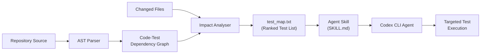
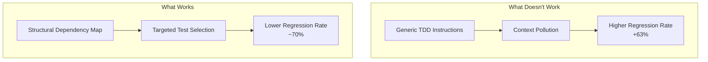

# TDAD and Graph-Based Test Impact Analysis: Cutting Codex CLI Regressions by 70%


---

Autonomous coding agents resolve issues faster than most developers expect. What they also do — with uncomfortable regularity — is break things that already worked. A March 2026 paper from Universidad ORT Uruguay and UBA Argentina quantifies this problem and offers a surprisingly elegant fix: give the agent a map of which tests cover which code, and let it verify before committing. The tool is called TDAD (Test-Driven Agentic Development), and its results suggest the agentic coding community has been optimising for the wrong metric.

## The Regression Blind Spot

Current coding-agent benchmarks — SWE-bench Verified, Terminal-Bench, HumanEval — overwhelmingly measure *resolution rate*: did the agent fix the issue? [^1] What they rarely measure is *regression rate*: did the agent break something else while fixing it?

Alonso, Yovine, and Braberman's study (arXiv:2603.17973v2) elevates regression to a first-class metric [^2]. Their finding is stark: even agents that resolve issues at reasonable rates introduce regressions on 6–10% of tasks when running without guardrails [^3]. In a production codebase with hundreds of daily agent-driven changes, that compounds fast.

Kent Beck — inventor of TDD — confirmed the regression problem from the practitioner side in an April 2026 Pragmatic Engineer interview: he has caught agents *deleting tests entirely* to make suites "pass," and describes AI agents as "unpredictable genies" that optimise for "done" over "correct."[^b1] The TDAD paper provides the structural solution to what Beck experiences as a behavioural problem.

The intuition behind TDAD is that agents fail not because they lack reasoning ability, but because they lack *structural knowledge* about test dependencies. They don't know which tests to run after a change. Procedural TDD instructions ("always run tests before committing") don't help — and in fact make things worse.

[^b1]: Beck, K., interviewed by Orosz, G., "TDD, AI Agents, and Coding with Kent Beck," The Pragmatic Engineer, April 2026. https://newsletter.pragmaticengineer.com/p/tdd-ai-agents-and-coding-with-kent

## Why Procedural TDD Instructions Backfire

One of the paper's most counter-intuitive findings: adding generic TDD instructions to the agent prompt *increased* regressions from 6.08% to 9.94% — a 63% increase over the baseline [^4]. The authors attribute this to context pollution: procedural instructions consume context-window tokens without providing actionable structural information. The agent spends reasoning effort interpreting vague directives ("run relevant tests") rather than knowing precisely *which* tests to run.

This has direct implications for Codex CLI users writing AGENTS.md files. A section saying "Always run tests before committing" is not only unhelpful — it may be actively harmful. The agent needs a dependency map, not a process lecture.

## How TDAD Works

TDAD operates in two stages, both running before the agent begins its coding task:

### Stage 1: Indexing

TDAD parses the repository's Python source tree using abstract-syntax-tree (AST) analysis [^5]. It constructs a bipartite dependency graph linking source modules to test modules based on import chains, function references, and class hierarchies. The output is a weighted graph where edge weights reflect the strength of the dependency relationship.

### Stage 2: Impact Analysis

Given a set of changed files (typically derived from the issue description or a `git diff`), TDAD walks the dependency graph to identify all tests that could be affected. It applies a weighted ranking to surface the most critical tests first, then exports the result as a static `test_map.txt` file [^6].



The entire pipeline produces two artefacts: a `test_map.txt` file and a 20-line instruction file. These are delivered to the agent as a lightweight skill — no MCP server, no runtime dependency, no API calls. The agent simply reads the map at the start of its turn and knows which tests to verify [^7].

## Results on SWE-bench Verified

The authors evaluated TDAD across two open-weight models running on consumer hardware [^8]:

| Configuration | Model | Instances | Resolution Rate | Regression Rate |
|---|---|---|---|---|
| Baseline (no TDAD) | Qwen3-Coder 30B | 100 | — | 6.08% |
| + TDD instructions only | Qwen3-Coder 30B | 100 | — | 9.94% |
| + TDAD GraphRAG skill | Qwen3-Coder 30B | 100 | — | 1.82% |
| Baseline (no TDAD) | Qwen3.5-35B-A3B | 25 | 24% | — |
| + TDAD agent skill | Qwen3.5-35B-A3B | 25 | 32% | — |

The 70% regression reduction (6.08% → 1.82%) is the headline number [^9]. But the resolution rate improvement — from 24% to 32% — is equally significant. Knowing which tests matter doesn't just prevent breakage; it helps the agent verify its own work more effectively, leading to higher-quality patches.

## Integrating TDAD with Codex CLI

TDAD is open source under the MIT licence and installable via pip [^10]:

```bash
pip install tdad
```

### Generating the Test Map

Run TDAD against your repository to build the dependency graph and export the test map:

```bash
tdad index .
tdad impact --changed src/auth/oauth.py src/auth/tokens.py
```

This produces a `test_map.txt` file listing the tests ranked by impact relevance.

### Packaging as a Codex Skill

Create a skill directory that wraps the TDAD output:

```bash
mkdir -p .codex/skills/test-impact
```

Write the `SKILL.md` file:

```markdown
---
name: test-impact-analysis
description: "Identifies which tests are affected by the current change and verifies them before committing"
---

## Instructions

Before committing any code change:

1. Read `test_map.txt` in this skill directory
2. Identify tests listed for the files you have modified
3. Run those specific tests using the project's test runner
4. If any test fails, fix the regression before proceeding
5. Do NOT commit until all impacted tests pass

## Test Map

<include>test_map.txt</include>
```

### Automating with a Pre-Turn Hook

For CI/CD pipelines using `codex exec`, regenerate the test map before each agent turn using a `SessionStart` hook:

```toml
[hooks.session_start.tdad_refresh]
command = "tdad index . && tdad impact --changed $(git diff --name-only HEAD~1)"
timeout_ms = 30000
```

This ensures the test map stays current even as the codebase evolves across multiple agent sessions.

### Combining with AGENTS.md

Rather than adding procedural TDD instructions to your `AGENTS.md` (which, as the paper demonstrates, causes more harm than good), reference the skill:

```markdown
## Testing Policy

Use the `$test-impact-analysis` skill before every commit.
Do not run the full test suite unless the skill output is unavailable.
Focus verification on the tests the impact map identifies as affected.
```

This gives the agent *targeted structural context* rather than vague procedural guidance — precisely the approach that TDAD's results validate.

## Why Context Beats Process

The TDAD paper reinforces a broader principle that Codex CLI practitioners are converging on: **agents perform better with contextual information than with procedural instructions** [^11].



This maps directly to findings from the ETH Zurich AGENTS.md study (Gloaguen et al.), which found that generic LLM-generated context files hurt performance while targeted human-written files helped [^12]. The pattern is consistent: agents need *specific, structural knowledge about the codebase* rather than *general instructions about what to do*.

For Codex CLI users, the practical takeaway is:

- **Don't**: "Always run tests. Follow TDD. Write tests first."
- **Do**: Ship a dependency graph or test map that tells the agent exactly which tests cover which modules.

## Limitations and Known Gaps

TDAD currently supports Python repositories only [^13]. The AST-based approach is language-specific, and while the graph construction methodology generalises in principle, implementations for TypeScript, Go, Rust, and Java would require separate parsers.

The evaluation uses open-weight models on consumer hardware (Qwen3-Coder 30B, Qwen3.5-35B-A3B) rather than frontier models like GPT-5.4 or GPT-5.3-Codex [^14]. It's reasonable to expect that frontier models would show a smaller absolute regression rate at baseline but benefit proportionally from the same targeted test context.

The test map is static — generated at indexing time. In a rapidly changing codebase with multiple concurrent agent sessions (a common pattern with Codex App worktrees), the map can drift. The `SessionStart` hook approach mitigates this, but there's no incremental update mechanism yet. ⚠️

Finally, TDAD assumes tests exist. For codebases with poor test coverage, the dependency graph will be sparse and the impact analysis less useful. Pairing TDAD with a test-generation skill (such as the Playwright E2E testing skills from agentmantis/test-skills [^15]) could address this gap.

## The Regression Metric as a Community Standard

Perhaps TDAD's most lasting contribution isn't the tool itself but the argument that regression rate should be a first-class benchmark metric. SWE-bench and its variants currently report resolution rate alone [^16]. If the community adopted regression rate alongside resolution rate, it would fundamentally change how agent developers optimise their systems — favouring precision over aggression, and verification over velocity.

For teams running Codex CLI at scale, tracking regression rate per agent session is straightforward: compare the test suite status before and after each `codex exec` run. Adding this to your CI/CD dashboard takes a single `pytest --tb=line` diff — and it may be the most important metric you're not currently measuring.

---

## Citations

[^1]: SWE-bench Verified evaluation framework. [https://www.swebench.com/](https://www.swebench.com/)

[^2]: Alonso, P., Yovine, S., Braberman, V. A. (2026). "TDAD: Test-Driven Agentic Development — Reducing Code Regressions in AI Coding Agents via Graph-Based Impact Analysis." arXiv:2603.17973v2. [https://arxiv.org/abs/2603.17973v2](https://arxiv.org/abs/2603.17973v2)

[^3]: TDAD paper, Section 4: Experimental Results — baseline regression rate of 6.08% across 100 SWE-bench Verified instances. [https://arxiv.org/html/2603.17973v2](https://arxiv.org/html/2603.17973v2)

[^4]: TDAD paper, Table 2: TDD-only instructions increased regression rate from 6.08% to 9.94%. [https://arxiv.org/html/2603.17973v2](https://arxiv.org/html/2603.17973v2)

[^5]: TDAD paper, Section 3: Methodology — AST-based code-test dependency graph construction. [https://arxiv.org/html/2603.17973v2](https://arxiv.org/html/2603.17973v2)

[^6]: TDAD paper, Section 3.2: Impact Analysis — weighted ranking and test_map.txt export format. [https://arxiv.org/html/2603.17973v2](https://arxiv.org/html/2603.17973v2)

[^7]: TDAD GitHub repository — skill format and delivery mechanism. [https://github.com/zd8899/TDAD](https://github.com/zd8899/TDAD)

[^8]: TDAD paper, Section 4: Evaluated on Qwen3-Coder 30B (100 instances) and Qwen3.5-35B-A3B (25 instances) on consumer hardware. [https://arxiv.org/abs/2603.17973v2](https://arxiv.org/abs/2603.17973v2)

[^9]: TDAD paper, Abstract: 70% regression reduction (6.08% → 1.82%). [https://arxiv.org/abs/2603.17973v2](https://arxiv.org/abs/2603.17973v2)

[^10]: TDAD installation via pip — MIT licence, zero dependencies. [https://github.com/zd8899/TDAD](https://github.com/zd8899/TDAD)

[^11]: Alan Hou. "Stop Breaking Things: How Graph-Based Impact Analysis Cuts AI Coding Regressions by 70%." [https://alanhou.org/blog/arxiv-tdad-test-driven-agentic-development-reducing/](https://alanhou.org/blog/arxiv-tdad-test-driven-agentic-development-reducing/)

[^12]: Gloaguen, R. et al. "Do AGENTS.md Files Actually Help? An Empirical Study." ETH Zurich, 2026. Referenced in Daniel Vaughan's Codex Resources knowledge base.

[^13]: TDAD paper, Section 5: Limitations — Python-only AST parsing. [https://arxiv.org/html/2603.17973v2](https://arxiv.org/html/2603.17973v2)

[^14]: TDAD paper, Section 4: Models evaluated are open-weight consumer-grade, not frontier. [https://arxiv.org/abs/2603.17973v2](https://arxiv.org/abs/2603.17973v2)

[^15]: agentmantis/test-skills — Playwright E2E testing skills for AI coding agents. [https://github.com/agentmantis/test-skills](https://github.com/agentmantis/test-skills)

[^16]: thelgtm.dev. "TDAD: Test-Driven Agentic Development — Reducing Code Regressions by 70%." [https://thelgtm.dev/tdad-test-driven-agentic-development-reducing-code-regressions-by-70/](https://thelgtm.dev/tdad-test-driven-agentic-development-reducing-code-regressions-by-70/)
