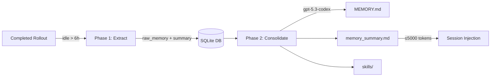
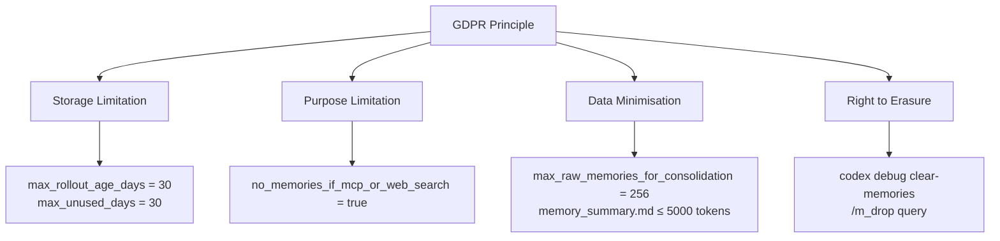

# Agent Memory Governance: GDPR, Data Retention, and Enterprise Memory Policies


---

Codex CLI's persistent memory system — the two-phase pipeline that extracts, consolidates, and reinjects session knowledge across invocations — is arguably its strongest differentiator over stateless coding assistants. It is also, from a data governance perspective, its most exposed surface. This article examines the memory lifecycle through the lens of GDPR, the EU AI Act, and enterprise retention policy, then maps concrete controls available in Codex CLI's configuration to each compliance obligation.

## The Memory Lifecycle: What Gets Stored and Where

Codex CLI (v0.100.0+) maintains a persistent, cross-session knowledge base through a background pipeline that triggers at startup [^1]. Understanding exactly what is stored is a prerequisite for governing it.

### Phase 1 — Extraction

For each eligible completed rollout (subject to `memories.min_rollout_idle_hours`, default 6 hours), the pipeline calls a model to extract a structured `raw_memory` and `rollout_summary`, then persists both to a local SQLite database [^2]. Developer and system messages are excluded from Phase 1 input since v0.103.0, and a secret sanitisation pass scrubs credentials before anything hits disk [^3].

### Phase 2 — Consolidation

Phase 2 reads recent Phase 1 outputs from SQLite, syncs filesystem artefacts (`raw_memories.md`, `rollout_summaries/`), and spawns a dedicated consolidation sub-agent — currently using `gpt-5.3-codex` with medium reasoning — under a global lock [^2]. The sub-agent merges and deduplicates extracted memories, updating `MEMORY.md`, `memory_summary.md`, and a `skills/` directory. The consolidated `memory_summary.md` is injected into model instructions at session start, capped at 5,000 tokens [^2].



### What This Means for Governance

Every completed session can produce personal data artefacts in at least four locations: the SQLite database, `raw_memories.md`, `MEMORY.md`/`memory_summary.md`, and session transcripts (controlled separately by `history.persistence`). Any governance strategy must account for all four.

## GDPR Obligations and the Memory Surface

### Article 17 — Right to Erasure

GDPR Article 17 grants data subjects the right to have personal data erased without undue delay [^4]. For Codex CLI's memory, this means an organisation must be able to locate and delete PII that has been extracted into memory artefacts — including derived inferences that may constitute personal data under GDPR's broad definition.

Codex CLI provides a blunt but effective erasure mechanism:

```bash
codex debug clear-memories
```

This command resets all stored memories, removing the SQLite database contents and regenerated markdown files [^3]. For targeted deletion, the `/m_drop <query>` interactive command removes memories matching a specific query without a full reset [^3].

However, neither mechanism produces an audit trail of what was deleted — a gap that enterprise deployments should address with wrapper tooling.

### The Embedding Provability Problem

⚠️ Whilst Codex CLI's memory is stored as plain Markdown and SQLite (not vector embeddings), organisations that extend the memory pipeline with third-party vector stores face a harder problem. No commercially available vector database currently provides a provable deletion mechanism for data embedded in a vector store [^5]. Inversion attacks can reconstruct approximate source data from embeddings, meaning embeddings derived from personal data cannot be treated as anonymous under GDPR [^6].

### Article 13/14 — Transparency

Data subjects must be informed when their data is processed. If a developer's session involves processing data about identifiable individuals (code reviews mentioning colleagues, debugging user-reported issues containing PII), the memory system may capture and persist that data silently. Enterprise deployments should document this in their privacy notices and consider enabling the `memories.no_memories_if_mcp_or_web_search` flag to prevent memory generation from sessions that access external data sources [^7].

## Enterprise Memory Configuration

Codex CLI's `config.toml` exposes a comprehensive set of memory lifecycle controls under the `[memories]` namespace [^7]:

```toml
[memories]
# Core toggles
use_memories = true          # Inject existing memories into sessions
generate_memories = true     # Store new sessions as memory inputs

# Lifecycle bounds
max_rollout_age_days = 30          # Max age of threads for memory gen (0–90)
max_unused_days = 30               # Evict memories unused for N days (0–365)
max_raw_memories_for_consolidation = 256  # Cap raw memories (max 4096)
max_rollouts_per_startup = 16      # Rollouts processed per startup (max 128)
min_rollout_idle_hours = 6         # Min idle before extraction (1–48)

# Model overrides
consolidation_model = "gpt-5.3-codex"  # Model for Phase 2
extract_model = ""                      # Model for Phase 1

# Safety
no_memories_if_mcp_or_web_search = false  # Block memory from external data sessions
```

### Mapping Configuration to GDPR Principles



| GDPR Principle | Config Control | Recommended Enterprise Setting |
|---|---|---|
| Storage limitation | `max_rollout_age_days` | 30 (default) or lower for regulated sectors |
| Purpose limitation | `no_memories_if_mcp_or_web_search` | `true` for teams handling external PII |
| Data minimisation | `max_raw_memories_for_consolidation` | 128–256 depending on team size |
| Accuracy | `max_unused_days` | 14–30 to evict stale memories |
| Right to erasure | `codex debug clear-memories` | Wrap in automated offboarding scripts |
| Transparency | `history.persistence = "none"` | Disable transcript retention where not needed |

## Session Transcript Governance

Memory artefacts are not the only data surface. Session transcripts, controlled by `history.persistence`, default to `save-all` [^7]. For GDPR-sensitive environments:

```toml
[history]
persistence = "none"       # Do not persist session transcripts
# or
max_bytes = 1048576        # Cap history at 1 MiB, dropping oldest entries
```

Disabling persistence eliminates one data surface but sacrifices reproducibility. A middle ground is to retain transcripts with a short `max_bytes` cap and a cron job that purges files older than the retention period.

## EU AI Act Implications

The EU AI Act's requirements for high-risk AI systems become enforceable on 2 August 2026 [^8]. Articles 12 and 13 mandate automatic event logging and traceability for high-risk systems, with penalties reaching €35 million or 7% of global annual turnover [^8].

Whilst most Codex CLI usage falls outside the high-risk classification, organisations using it for code generation in safety-critical domains (medical devices, financial systems) should consider:

1. **Audit logging** — Codex CLI's memory pipeline does not natively produce deletion audit logs. Enterprise wrappers should log every `clear-memories` and `/m_drop` invocation with timestamps and operator identity.
2. **Traceability** — Pair memory governance with the OpenTelemetry integration (`[otel]` config block) to create decision traces that link memory state to specific agent actions [^9].
3. **Provenance metadata** — The `raw_memories.md` and `rollout_summaries/` files lack provenance headers. A post-processing hook can stamp each entry with source rollout ID, timestamp, and data classification.

## Comparison with Claude Code's Memory Approach

Claude Code takes a fundamentally different architectural approach to memory [^10]:

| Aspect | Codex CLI | Claude Code |
|---|---|---|
| Storage format | SQLite + Markdown pipeline | Markdown files only (CLAUDE.md) |
| Consolidation | Automated sub-agent with model call | Manual or plugin-driven |
| Cross-session | Native two-phase pipeline | Static rules file + auto-memory |
| Memory cap | 5,000 tokens (memory_summary.md) | 200-line index (MEMORY.md) |
| Deletion | `codex debug clear-memories`, `/m_drop` | Manual file deletion |
| Semantic search | Not native (keyword-based) | Not native (grep-based) |
| Enterprise config | 10+ config.toml knobs | Limited configuration surface |

From a governance perspective, Codex CLI's richer configuration surface is a double-edged sword: more controls mean more compliance levers, but also a larger surface to audit and misconfigure.

## Practical Enterprise Memory Policy

For organisations deploying Codex CLI at scale, a layered memory policy should address three tiers:

### Tier 1 — Global Defaults (Managed Config Distribution)

Distribute a base `config.toml` via your configuration management system with conservative memory settings:

```toml
[memories]
use_memories = true
generate_memories = true
max_rollout_age_days = 14
max_unused_days = 14
no_memories_if_mcp_or_web_search = true
max_raw_memories_for_consolidation = 128

[history]
persistence = "none"
```

### Tier 2 — Project-Scoped Overrides

Projects handling regulated data can tighten further in their `.codex/config.toml`:

```toml
[memories]
generate_memories = false   # No memory generation for this project
```

### Tier 3 — Automated Lifecycle Management

Implement cron-based memory hygiene:

```bash
#!/usr/bin/env bash
# Weekly memory cleanup for GDPR compliance
# Purge memory artefacts older than retention period

CODEX_HOME="${CODEX_HOME:-$HOME/.codex}"
RETENTION_DAYS=14

find "$CODEX_HOME/memory" -type f -mtime +$RETENTION_DAYS -delete
codex debug clear-memories 2>/dev/null

# Log the action for audit trail
echo "$(date -u +%Y-%m-%dT%H:%M:%SZ) memory-purge retention=$RETENTION_DAYS operator=$(whoami)" \
  >> "$CODEX_HOME/memory-audit.log"
```

## Key Takeaways

1. **Map your data surfaces** — Codex CLI's memory pipeline creates artefacts in SQLite, Markdown files, and session transcripts. All three need governance controls.
2. **Use the configuration levers** — The `[memories]` config namespace provides granular lifecycle controls that map directly to GDPR principles.
3. **Audit deletion** — Native deletion commands lack audit trails. Wrap them in logged scripts for enterprise deployments.
4. **Prepare for August 2026** — The EU AI Act's traceability requirements will demand better provenance metadata than the memory system currently provides natively.
5. **Diff-based forgetting is your friend** — The v0.106.0 diff-based forgetting mechanism automatically removes stale facts, but it is not a substitute for explicit GDPR erasure processes [^3].

## Citations

[^1]: [Memory System — openai/codex, DeepWiki](https://deepwiki.com/openai/codex/3.7-memory-system)
[^2]: [OpenAI Codex CLI Architecture and Multi-Runtime Agent Patterns, Zylos Research](https://zylos.ai/research/2026-03-26-openai-codex-cli-architecture-multi-runtime-patterns)
[^3]: [Codex CLI: The Definitive Technical Reference, Blake Crosley](https://blakecrosley.com/guides/codex)
[^4]: [Engineering GDPR Compliance in the Age of Agentic AI, IAPP](https://iapp.org/news/a/engineering-gdpr-compliance-in-the-age-of-agentic-ai)
[^5]: [AI Agent Memory Governance: 6 Enterprise Risks Explained, Atlan](https://atlan.com/know/ai-agent-memory-governance/)
[^6]: [The Right to Be Forgotten Is Dead: Data Lives Forever in AI, TechPolicy.Press](https://www.techpolicy.press/the-right-to-be-forgotten-is-dead-data-lives-forever-in-ai/)
[^7]: [Configuration Reference — Codex, OpenAI Developers](https://developers.openai.com/codex/config-reference)
[^8]: [AI Risk & Compliance 2026: Enterprise Governance Overview, SecurePrivacy](https://secureprivacy.ai/blog/ai-risk-compliance-2026)
[^9]: [Codex CLI Observability with OpenTelemetry, codex-resources](https://danielvaughan.github.io/codex-resources/articles/2026-04-16-codex-cli-opentelemetry-observability-tracing-agent-sessions.html)
[^10]: [How Claude Remembers Your Project, Claude Code Docs](https://code.claude.com/docs/en/memory)
