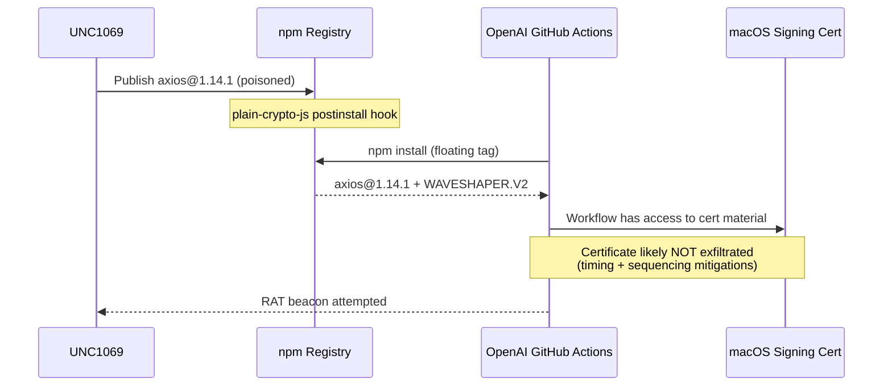
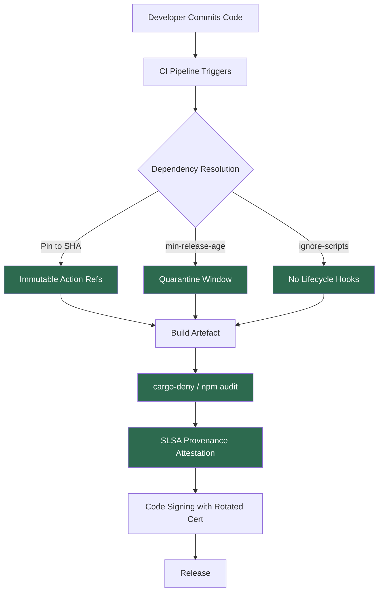

# The Axios Supply Chain Attack: How It Hit Codex CLI's Signing Pipeline and What Teams Should Learn


On 31 March 2026, a North Korean threat actor compromised the Axios npm package — the most popular HTTP client in the JavaScript ecosystem, with over 100 million weekly downloads [^1]. Within hours, the malicious payload had reached OpenAI's macOS code-signing pipeline, touching Codex CLI, the Codex App, ChatGPT Desktop, and Atlas [^2]. No user data was compromised, but OpenAI revoked and rotated its macOS signing certificate as a precaution [^2].

This article dissects what happened, why Codex CLI was exposed, and — most importantly — the concrete CI/CD hardening measures that OpenAI shipped in response. If you maintain a build pipeline that consumes npm packages or GitHub Actions, the lessons here apply directly.

## The Attack: Three Hours, Global Blast Radius

Between 00:21 and 03:20 UTC on 31 March, an attacker who had compromised the Axios maintainer's npm account published two poisoned versions: `1.14.1` and `0.30.4` [^1]. Both injected a dependency called `plain-crypto-js@4.2.1` whose `postinstall` hook silently deployed **WAVESHAPER.V2**, a cross-platform remote access trojan (RAT) [^3].

Google's Threat Intelligence Group attributed the attack to **UNC1069**, a financially motivated North Korea-nexus actor active since at least 2018 [^3]. Microsoft independently attributed the infrastructure to **Sapphire Sleet** [^4].



The poisoned versions were pulled from the registry approximately three hours later, but during that window roughly 3% of Axios's user base downloaded them [^1].

## How It Reached Codex CLI

OpenAI's macOS app-signing process ran inside a GitHub Actions workflow. That workflow consumed npm packages — including Axios — as part of its build tooling. Two misconfigurations created the exposure [^2]:

1. **Floating tag reference**: The Actions workflow used a mutable version tag for a dependency rather than pinning to an immutable commit SHA.
2. **No minimum release age**: There was no `minimumReleaseAge` configured, meaning freshly published (and potentially malicious) package versions were consumed immediately.

The workflow had access to Apple code-signing certificate material and notarisation credentials. OpenAI's post-incident analysis concluded that the certificate was **likely not exfiltrated** due to the timing of payload execution relative to certificate injection into the job [^2]. Nevertheless, OpenAI treated it as compromised and rotated all signing material.

### Affected Applications and New Certificate Versions

| Application | First Clean Version |
|---|---|
| ChatGPT Desktop | 1.2026.051 |
| Codex App | 26.406.40811 |
| **Codex CLI** | **0.119.0** |
| Atlas | 1.2026.84.2 |

Effective **8 May 2026**, older macOS builds signed with the revoked certificate will no longer receive updates and may cease to function [^2]. If you're running Codex CLI on macOS, ensure you're on **v0.119.0 or later**.

## OpenAI's Hardening Response

The Codex CLI changelog for April 2026 includes a dedicated supply-chain hardening entry (PR #17471) [^5] that addresses the root causes directly. Here's what changed.

### GitHub Actions Pinning

Every third-party GitHub Action in the Codex CI pipeline is now referenced by full-length commit SHA rather than a mutable tag [^5][^6].

Before (vulnerable):

```yaml
# ❌ Floating tag — attacker can retag to malicious commit
- uses: actions/setup-node@v4
```

After (hardened):

```yaml
# ✅ Immutable SHA pin — code can't change without updating hash
- uses: actions/setup-node@1a4442cacd436585916f13e47d78e0d8b4e9c8b3 # v4.2.0
```

This is the only way to reference an Action immutably [^6]. Tags and branches are mutable — an attacker with repository access can repoint them to arbitrary commits, as demonstrated in the **tj-actions/changed-files** compromise of March 2025 that affected over 23,000 repositories [^6].

### Cargo and Rust Supply Chain

The hardening extends beyond npm into Codex CLI's Rust build pipeline [^5]:

- **Cargo install pins**: All `cargo install` invocations pin to exact versions with `--locked` to respect `Cargo.lock`.
- **Git dependency pins**: Git-sourced crate dependencies use specific commit SHAs rather than branch references.
- **V8 checksum verification**: V8 engine binaries consumed during build are verified against known checksums.
- **cargo-deny source allowlists**: The `cargo-deny` tool enforces an explicit allowlist of crate registries and git sources, blocking unexpected dependency sources.

### Bazel Release Verification

PR #17704 added Bazel release-build verification, ensuring release-only Rust code is compiled within PR CI [^5]. This catches divergence between what developers test and what ships in the release binary.

## Defence-in-Depth: What Your Team Should Implement

The Axios incident and OpenAI's response illustrate a layered defence model that any team running CI/CD pipelines should adopt.

### 1. Pin Everything to Immutable References

```yaml
# GitHub Actions — pin to full SHA
- uses: actions/checkout@11bd71901bbe5b1630ceea73d27597364c9af683 # v4.2.2

# npm — use exact versions, commit lockfiles
npm config set save-exact true
npm ci  # Respects lockfile exactly, unlike npm install
```

Use **Dependabot** or **Renovate** to automate SHA updates when upstream actions release new versions [^6]. This gives you immutability without maintenance burden.

### 2. Enforce a Minimum Release Age

A `minimumReleaseAge` acts as a quarantine window, giving the security community time to detect poisoned packages before they enter your pipeline [^7].

```toml
# Renovate config — wait 3 days before adopting new versions
[packageRules]
  minimumReleaseAge = "3 days"
```

```bash
# npm v11.10.0+ — reject packages published less than 7 days ago
npm config set min-release-age=7 --global
```

pnpm supports this natively too: setting `minimumReleaseAge` to `1440` blocks packages published less than 24 hours ago [^7].

### 3. Disable Lifecycle Scripts in CI

The Axios attack relied on a `postinstall` hook to execute the dropper [^1]. Disabling lifecycle scripts in CI removes this attack vector entirely:

```bash
# In CI pipelines
npm ci --ignore-scripts

# Or globally
npm config set ignore-scripts true
```

⚠️ This may break packages that require postinstall compilation (e.g., `node-gyp` native addons). Test thoroughly and allowlist specific packages if needed.

### 4. Use cargo-deny for Rust Projects

If your project includes Rust (as Codex CLI does), `cargo-deny` provides static analysis of your dependency graph [^5]:

```toml
# deny.toml
[sources]
unknown-registry = "deny"
unknown-git = "deny"
allow-registry = ["https://github.com/rust-lang/crates.io-index"]
allow-git = []
```

This blocks any crate sourced from an unexpected registry or git repository.

### 5. Implement SLSA Provenance

The Supply-chain Levels for Software Artifacts (SLSA) framework provides a maturity model for build integrity [^8]. At SLSA Level 3, builds are performed on hosted infrastructure with tamper-evident provenance. npm now supports provenance attestations via `--provenance` on `npm publish`, and GitHub Actions can generate them automatically for supported CI platforms [^8].



## Broader Implications for Agentic Tooling

The Axios incident carries a specific warning for teams building on agentic coding tools. Codex CLI, Claude Code, Cursor, and similar tools all consume complex dependency trees — npm packages, Python packages, Rust crates, MCP servers, and community plugins. Each dependency is a potential entry point.

The Codex CLI ecosystem is particularly exposed because:

- **Skills and plugins** pull from git repositories and npm packages at install time.
- **MCP servers** run as subprocesses with access to the filesystem and network.
- **GitHub Actions integrations** (via `openai/codex-action`) run in CI with elevated permissions.

OpenAI's hardening of PR #17471 sets a baseline, but teams should extend the same discipline to their own skill installations, MCP server dependencies, and plugin marketplace sources. The `requirements.toml` feature for enterprise MCP whitelisting [^9] and the execution policy rules system [^10] provide additional layers of governance.

## What to Do Right Now

If you're a Codex CLI user on macOS:

1. **Update immediately** to v0.119.0 or later — run `codex update` or reinstall via your package manager.
2. **Verify your version**: `codex --version` should show 0.119.0+.
3. **Before 8 May 2026**: all macOS OpenAI apps on the old certificate will stop working [^2].

If you maintain CI/CD pipelines:

1. Audit your GitHub Actions for floating tag references — pin every action to a full SHA.
2. Enable `minimumReleaseAge` in Renovate or Dependabot.
3. Run `npm ci --ignore-scripts` in CI and allowlist only necessary lifecycle hooks.
4. For Rust projects, adopt `cargo-deny` with explicit source allowlists.
5. Review your code-signing workflow — ensure certificate material is injected as late as possible and scoped to the minimum necessary job steps.

## Citations

[^1]: Google Cloud Blog, "North Korea-Nexus Threat Actor Compromises Widely Used Axios NPM Package in Supply Chain Attack," April 2026. [https://cloud.google.com/blog/topics/threat-intelligence/north-korea-threat-actor-targets-axios-npm-package](https://cloud.google.com/blog/topics/threat-intelligence/north-korea-threat-actor-targets-axios-npm-package)

[^2]: OpenAI, "Our response to the Axios developer tool compromise," 13 April 2026. [https://openai.com/index/axios-developer-tool-compromise/](https://openai.com/index/axios-developer-tool-compromise/)

[^3]: The Hacker News, "Google Attributes Axios npm Supply Chain Attack to North Korean Group UNC1069," April 2026. [https://thehackernews.com/2026/04/google-attributes-axios-npm-supply.html](https://thehackernews.com/2026/04/google-attributes-axios-npm-supply.html)

[^4]: Microsoft Security Blog, "Mitigating the Axios npm supply chain compromise," 1 April 2026. [https://www.microsoft.com/en-us/security/blog/2026/04/01/mitigating-the-axios-npm-supply-chain-compromise/](https://www.microsoft.com/en-us/security/blog/2026/04/01/mitigating-the-axios-npm-supply-chain-compromise/)

[^5]: OpenAI Codex Changelog, "Hardened supply-chain and CI inputs," April 2026. [https://developers.openai.com/codex/changelog](https://developers.openai.com/codex/changelog)

[^6]: StepSecurity, "Pinning GitHub Actions for Enhanced Security: Everything You Should Know," 2026. [https://www.stepsecurity.io/blog/pinning-github-actions-for-enhanced-security-a-complete-guide](https://www.stepsecurity.io/blog/pinning-github-actions-for-enhanced-security-a-complete-guide)

[^7]: pnpm Documentation, "Mitigating supply chain attacks." [https://pnpm.io/supply-chain-security](https://pnpm.io/supply-chain-security)

[^8]: Bastion, "12 Best Practices to Prevent Software Supply Chain Attacks (2026)." [https://bastion.tech/blog/software-supply-chain-attack-prevention-best-practices/](https://bastion.tech/blog/software-supply-chain-attack-prevention-best-practices/)

[^9]: Socket.dev, "Axios Supply Chain Attack Reaches OpenAI macOS Signing Pipeline, Forces Certificate Rotation." [https://socket.dev/blog/axios-supply-chain-attack-reaches-openai-macos-signing-pipeline-forces-certificate-rotation](https://socket.dev/blog/axios-supply-chain-attack-reaches-openai-macos-signing-pipeline-forces-certificate-rotation)

[^10]: OpenAI Codex Developers, "Security." [https://developers.openai.com/codex/security](https://developers.openai.com/codex/security)
