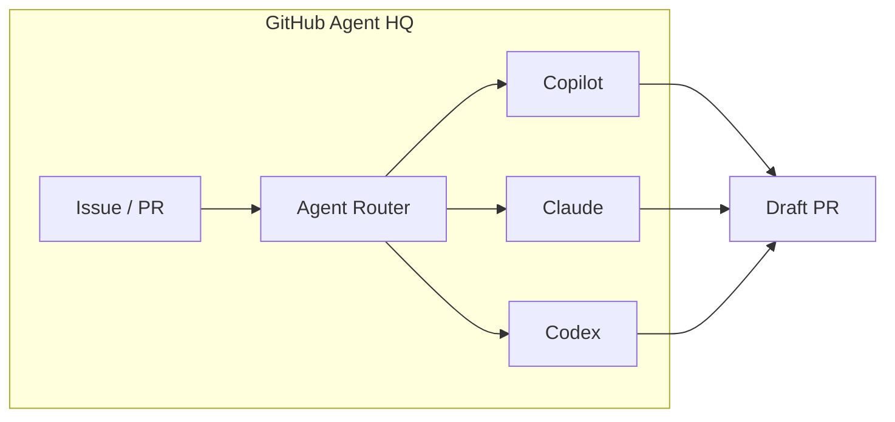
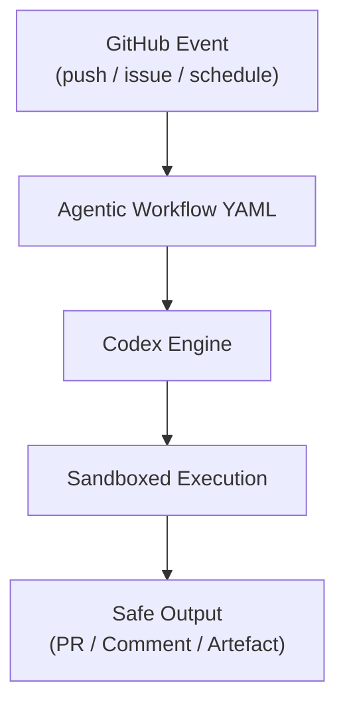

# Codex as a GitHub Coding Agent: Agent HQ, Model Selection, and Cloud-Based Code Review


---

Most coverage of Codex focuses on the CLI — the open-source terminal agent you install with `npm install -g @openai/codex`. But since February 2026, Codex has lived a parallel life as a **cloud coding agent on github.com**, operating inside GitHub's Agent HQ alongside Claude and Copilot[^1]. On April 14, GitHub shipped model selection for third-party agents[^2], and on April 15, enterprise admins gained custom-property-based cloud agent enablement[^3]. This article covers the full integration: what it is, how to configure it, and when it makes sense over the CLI.

## What Is Agent HQ?

Agent HQ is GitHub's multi-agent platform, announced on February 4, 2026[^1]. It positions GitHub as an **agent-neutral orchestration layer** — rather than locking developers into Copilot alone, it offers a choice of coding agents from different providers:

- **GitHub Copilot** — the established first-party agent
- **Claude** (Anthropic) — public preview since February 2026
- **OpenAI Codex** — public preview since February 2026
- **Google Gemini, Cognition, xAI** — announced as future integrations[^1]

Each agent operates asynchronously, producing artifacts — draft pull requests, review comments, code changes — that appear in standard GitHub workflows[^4].



## Enabling Codex on GitHub

### Subscription requirements

Codex on GitHub requires a Copilot subscription — Pro, Pro+, Business, or Enterprise[^5]. Access is included at no additional cost; you are consuming premium requests from your existing Copilot quota, with each agent session counting as one premium request[^1].

### Enterprise and organisation policy

Administrators must explicitly enable Codex at multiple levels[^5][^6]:

1. **Enterprise level**: AI Controls → Agents → Partner Agents → enable OpenAI Codex
2. **Organisation level**: Settings → Copilot → Coding agent → enable OpenAI Codex
3. **Repository level**: Settings → Copilot → Cloud agent → toggle Codex on

As of April 15, 2026, enterprises can use **custom properties** to selectively enable the cloud agent per-organisation via three new REST API endpoints (PUT, POST, DELETE), or through the AI Controls page under "Enabled for selected organisations"[^3]. This replaces the previous all-or-nothing toggle, letting teams pilot Codex with a subset of organisations before wider rollout.

⚠️ Note: custom property evaluation happens once at configuration time. If properties are later modified, organisations do not automatically gain or lose access — manual updates are required[^3].

### VS Code integration

The Codex agent is also available in VS Code (version 1.109+) via the Agent Sessions view[^1]. Pro+ subscribers can authenticate with "Sign in with Copilot". Three session types are available:

| Session type | Description |
|---|---|
| **Local** | Interactive agent session (Copilot only) |
| **Cloud** | Autonomous GitHub-based task execution |
| **Background** | Asynchronous local operations (Copilot only) |

## Model Selection (April 14, 2026)

The most recent enhancement is **model selection for third-party agents**[^2]. When kicking off a Codex task on github.com, you can now choose from:

| Model | Strengths |
|---|---|
| **Auto** | Copilot's intelligent model selection to reduce rate limiting |
| **GPT-5.2-Codex** | Mature, cost-effective for routine tasks |
| **GPT-5.3-Codex** | Most capable agentic coding model; strong on complex engineering[^7] |
| **GPT-5.4** | Latest flagship; computer use and 1M extended context[^8] |

The Auto option routes to whichever model has available capacity, which is useful for teams hitting rate limits on popular models[^5]. Note that a subset of models may only be available in the standalone OpenAI Codex extension rather than via GitHub[^5].

For comparison, Claude users on Agent HQ can select from Claude Sonnet 4.5, Sonnet 4.6, Opus 4.5, or Opus 4.6[^2].

## Code Review with @codex

The most immediately useful integration is **cloud-based code review**. Codex can review pull requests without the developer running anything locally[^9].

### Manual review

Comment `@codex review` on any pull request. Codex acknowledges with a 👀 reaction and posts a standard GitHub code review[^9].

```
@codex review
```

For focused reviews, add instructions inline:

```
@codex review for security regressions
```

### Automatic review

Enable "Automatic reviews" in Codex settings (chatgpt.com/codex/settings/code-review), and Codex reviews every new PR automatically[^9].

### Contextual tasks

Mention `@codex` with any instruction beyond "review" to trigger a cloud task using the PR as context[^9]:

```
@codex fix the CI failures
```

### Customising review behaviour with AGENTS.md

Codex searches your repository for `AGENTS.md` files and applies the **closest file in the directory tree** to each changed file[^9][^10]. A top-level file sets global review policy:

```markdown
## Review guidelines

- Never log PII to stdout or structured logs.
- Verify authentication middleware wraps every route.
- Flag any SQL query that does not use parameterised bindings.
```

Subdirectory `AGENTS.md` files override for specific packages. By default, Codex flags only P0 and P1 severity issues. To expand coverage, specify severity expectations in your guidelines[^9].

## GitHub Agentic Workflows

Beyond issue assignment and code review, Codex is available as an **engine** in GitHub Agentic Workflows (technical preview since February 13, 2026)[^11]. These workflows augment traditional CI/CD with agent-driven steps, running in sandboxed execution environments.

Specify Codex as the engine in your workflow YAML[^12]:


```yaml
engine:
  id: codex
  version: latest
  model: gpt-5.3-codex
  env:
    OPENAI_API_KEY: ${{ secrets.OPENAI_API_KEY }}
```


The engine configuration supports several options[^12]:

| Field | Purpose |
|---|---|
| `model` | Override default model selection |
| `command` | Custom executable path |
| `args` | Additional CLI arguments |
| `api-target` | Custom endpoint hostname (enterprise GHE) |
| `token-weights.multipliers` | Cost multiplier overrides for custom models |

All four engines (Copilot, Claude, Codex, Gemini) share the `tools.web-fetch` capability. Codex does not currently support `max-turns` or `max-continuations` — those are Claude-only and Copilot-only features respectively[^12].



## Codex GitHub Action

For teams already using GitHub Actions, the `openai/codex-action@v1` action provides a more traditional CI/CD integration point[^13]. This differs from Agentic Workflows — it runs Codex as a step in a standard Actions workflow rather than using the newer engine abstraction:


```yaml
- name: Run Codex review
  uses: openai/codex-action@v1
  with:
    task: "Review this PR for performance regressions"
  env:
    OPENAI_API_KEY: ${{ secrets.OPENAI_API_KEY }}
```


## When to Use GitHub Codex vs the CLI

The cloud agent and the CLI share the same underlying Codex SDK and app-server architecture[^14], but they serve different workflows:

| Consideration | GitHub Cloud Agent | Codex CLI |
|---|---|---|
| **Trigger** | Issue assignment, PR comment, workflow event | Developer prompt in terminal |
| **Execution** | GitHub-hosted cloud environment | Local machine or remote server |
| **Authentication** | Copilot subscription (GitHub SSO) | OpenAI API key or ChatGPT sign-in |
| **Sandbox** | GitHub-managed | Local seatbelt/landlock/bubblewrap |
| **Best for** | Async delegation, review automation, CI | Interactive development, complex multi-turn sessions |
| **AGENTS.md** | Read from repo for review context | Read from repo for development context |
| **Model selection** | Auto, GPT-5.2-Codex, GPT-5.3-Codex, GPT-5.4 | Any configured model including custom providers |

The cloud agent excels at **fire-and-forget delegation** — assign an issue, walk away, review the draft PR later. The CLI excels at **interactive, iterative development** where you steer the agent through multi-turn conversation with full local tool access.

A practical pattern: use the CLI for feature development locally, then let the cloud agent handle automated PR reviews and CI-triggered maintenance tasks.

## Enterprise Considerations

For organisations evaluating Codex on GitHub, the April 2026 updates address several governance gaps:

- **Graduated rollout**: Custom properties enable per-organisation enablement without all-or-nothing policies[^3]
- **Model governance**: Administrators can restrict which models are available organisation-wide[^2]
- **Audit trail**: Agent sessions produce standard GitHub audit log entries[^1]
- **Data residency**: Code processed by Codex flows through OpenAI's infrastructure — evaluate against your data classification policies
- **Cost visibility**: Each agent session consumes one Copilot premium request, tracked in the Copilot metrics dashboard[^1]

⚠️ As of April 2026, agent sessions on GitHub route code to OpenAI's API. Organisations with strict data sovereignty requirements should evaluate whether this aligns with their compliance posture before enabling the Codex policy.

## What's Next

The trajectory is clear: GitHub is positioning Agent HQ as the **operating system for AI-assisted development**[^4], with agents from multiple providers competing on quality rather than platform lock-in. Google Gemini, Cognition (Devin), and xAI integrations are in progress[^1]. The April 15 custom properties update suggests enterprise-grade controls are being prioritised — expect RBAC-level agent permissions and organisation-scoped model restrictions in coming releases.

For Codex CLI users, the cloud agent is not a replacement — it is a **complementary surface**. The CLI remains the power tool for interactive development; the GitHub integration turns Codex into infrastructure that runs in the background of your team's workflow.

---

## Citations

[^1]: GitHub Blog, "Pick your agent: Use Claude and Codex on Agent HQ", February 4, 2026. [https://github.blog/news-insights/company-news/pick-your-agent-use-claude-and-codex-on-agent-hq/](https://github.blog/news-insights/company-news/pick-your-agent-use-claude-and-codex-on-agent-hq/)

[^2]: GitHub Changelog, "Model selection for Claude and Codex agents on github.com", April 14, 2026. [https://github.blog/changelog/2026-04-14-model-selection-for-claude-and-codex-agents-on-github-com/](https://github.blog/changelog/2026-04-14-model-selection-for-claude-and-codex-agents-on-github-com/)

[^3]: GitHub Changelog, "Enable Copilot cloud agent via custom properties", April 15, 2026. [https://github.blog/changelog/2026-04-15-enable-copilot-cloud-agent-via-custom-properties/](https://github.blog/changelog/2026-04-15-enable-copilot-cloud-agent-via-custom-properties/)

[^4]: The New Stack, "GitHub is letting developers choose between Copilot and its biggest rivals", 2026. [https://thenewstack.io/github-agent-hq/](https://thenewstack.io/github-agent-hq/)

[^5]: GitHub Docs, "OpenAI Codex", 2026. [https://docs.github.com/en/copilot/concepts/agents/openai-codex](https://docs.github.com/en/copilot/concepts/agents/openai-codex)

[^6]: GitHub Changelog, "Claude and Codex now available for Copilot Business & Pro users", February 26, 2026. [https://github.blog/changelog/2026-02-26-claude-and-codex-now-available-for-copilot-business-pro-users/](https://github.blog/changelog/2026-02-26-claude-and-codex-now-available-for-copilot-business-pro-users/)

[^7]: OpenAI Developers, "Codex Changelog", 2026. [https://developers.openai.com/codex/changelog](https://developers.openai.com/codex/changelog)

[^8]: Previously published: "GPT-5.4 Computer Use and Tool Search in Codex CLI", March 31, 2026. [https://codex.danielvaughan.com/2026/03/31/gpt54-computer-use-tool-search-codex-cli/](https://codex.danielvaughan.com/2026/03/31/gpt54-computer-use-tool-search-codex-cli/)

[^9]: OpenAI Developers, "Use Codex in GitHub", 2026. [https://developers.openai.com/codex/integrations/github](https://developers.openai.com/codex/integrations/github)

[^10]: agents.md specification. [https://agents.md/](https://agents.md/)

[^11]: GitHub Changelog, "GitHub Agentic Workflows are now in technical preview", February 13, 2026. [https://github.blog/changelog/2026-02-13-github-agentic-workflows-are-now-in-technical-preview/](https://github.blog/changelog/2026-02-13-github-agentic-workflows-are-now-in-technical-preview/)

[^12]: GitHub Agentic Workflows, "AI Engines (aka Coding Agents)". [https://github.github.com/gh-aw/reference/engines/](https://github.github.com/gh-aw/reference/engines/)

[^13]: OpenAI Developers, "GitHub Action – Codex". [https://developers.openai.com/codex/github-action](https://developers.openai.com/codex/github-action)

[^14]: Previously published: "Codex App-Server TUI: The Architecture Shift That Enables Remote Sessions", March 30, 2026. [https://codex.danielvaughan.com/2026/03/30/codex-app-server-tui-architecture-shift/](https://codex.danielvaughan.com/2026/03/30/codex-app-server-tui-architecture-shift/)
