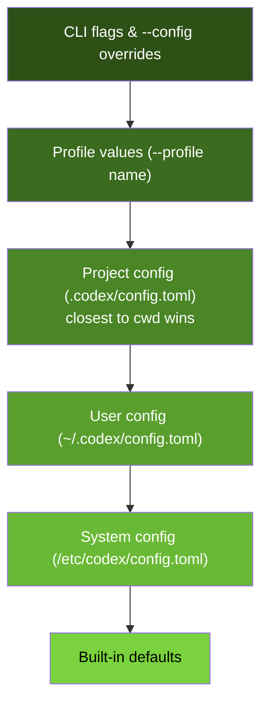
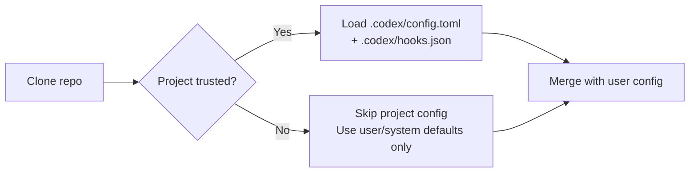

# Codex CLI Configuration Hierarchy: Project-Scoped Config, Trust Boundaries, and Layered Resolution


Every Codex CLI user starts with a `~/.codex/config.toml` and a handful of keys. But as teams grow and repositories multiply, the single-file approach breaks down. You need project-specific model routing, per-directory MCP server configs, environment variable isolation for CI, and a trust model that stops cloned repositories from silently overriding your security settings.

Codex CLI's configuration hierarchy solves this with a six-layer resolution chain, a directory-walking merge strategy, and an explicit trust boundary that gates project-scoped config loading. This article covers the full resolution order, the trust model, practical team patterns, and the often-overlooked `shell_environment_policy` and `hooks.json` layering.

## The Six-Layer Resolution Chain

Codex resolves configuration from six sources, highest priority first [^1] [^2]:



Each layer can override any key from the layer below. Within the project config layer, Codex walks from the repository root to your current working directory, loading every `.codex/config.toml` it encounters [^2]. If multiple project-level files define the same key, the file closest to `cwd` wins.

### CLI Overrides with `-c`

The `-c` / `--config` flag parses values as TOML and supports dot-notation for nested keys [^2]:

```bash
# Override a single key for one run
codex -c 'model="gpt-5.4-mini"' "refactor the auth module"

# Disable a specific MCP server
codex -c 'mcp_servers.context7.enabled=false' "summarise the codebase"

# Set nested sandbox permissions
codex -c 'sandbox.permissions.disk_write_path=["/tmp"]' "run the build"
```

This is particularly useful in CI pipelines where you need per-job configuration without maintaining separate config files.

## Project-Scoped Configuration and the Trust Boundary

### How Project Config Works

Any repository can include a `.codex/config.toml` at its root (or in subdirectories) to define project-specific settings [^3]. Common use cases include:

- Pinning the model to match the team's cost budget
- Configuring MCP servers specific to the project's toolchain
- Setting approval policies stricter than the user's personal defaults
- Defining shell environment policies that expose only the variables the project needs

### The Trust Gate

Here is the critical security constraint: **Codex loads project-scoped `.codex/` layers only when the project is trusted** [^1] [^3]. If a project is untrusted, Codex silently skips all `.codex/config.toml` files in that repository and falls back to user/system defaults.

This prevents a malicious repository from overriding your sandbox mode to `danger-full-access` or injecting a rogue MCP server simply by including a `.codex/` directory.



When you open a project containing a `.codex/config.toml` for the first time, Codex prompts you to trust or reject it [^4]. Trust state is stored separately from the config itself — in `~/.codex/` metadata — so your global config can be version-controlled without accidentally persisting trust decisions for every repository you have ever cloned [^5].

### Subdirectory Config Layering

For monorepos, you can place additional `.codex/config.toml` files in subdirectories to create scoped overrides:

```
my-monorepo/
├── .codex/
│   └── config.toml          # repo-wide: model = "gpt-5.3-codex"
├── services/
│   ├── api/
│   │   └── .codex/
│   │       └── config.toml  # api service: model = "gpt-5.4"
│   └── worker/
│       └── .codex/
│           └── config.toml  # worker: approval_policy = "never"
└── packages/
    └── shared-lib/
```

When you `cd services/api` and run Codex, the resolution loads the repo-wide config first, then merges the `services/api/.codex/config.toml` on top — so the API service gets `gpt-5.4` while everywhere else defaults to `gpt-5.3-codex` [^2].

## Profiles: Named Configuration Sets

Profiles provide a parallel override mechanism. Define them under `[profiles.<name>]` in any config layer [^2] [^6]:

```toml
# ~/.codex/config.toml

model = "gpt-5.3-codex"
model_reasoning_effort = "medium"

[profiles.fast]
model = "gpt-5.4-mini"
model_reasoning_effort = "low"

[profiles.thorough]
model = "gpt-5.4"
model_reasoning_effort = "xhigh"

[profiles.review]
model = "gpt-5.4"
model_reasoning_effort = "high"
instructions = "You are a code reviewer. Focus on correctness, security, and performance."
```

Invoke with `codex --profile fast "fix the lint errors"`. Profile values slot into layer 2 of the resolution chain, overriding project and user config but yielding to CLI flags [^1].

### Profile-Scoped Model Providers

You can nest `model_providers` inside a profile to route different profiles to entirely different backends [^7]:

```toml
[profiles.local]
model = "deepseek-r1"

[profiles.local.model_providers.local-ollama]
name = "local-ollama"
base_url = "http://localhost:11434/v1"
env_key = "OLLAMA_API_KEY"
```

This is powerful for teams that want to use a local model for iteration and a frontier model for final review — all controlled by the `--profile` flag rather than editing config files.

## Shell Environment Policy: Subprocess Isolation

The `[shell_environment_policy]` section controls which environment variables Codex passes to subprocesses — every `bash`, `python`, or build command the agent executes [^8] [^9]. This is critical for preventing accidental secret leakage.

### Inheritance Modes

```toml
[shell_environment_policy]
# "none" = clean slate (most secure)
# "core" = PATH, HOME, USER, SHELL, TERM, LANG only
inherit = "core"
```

### Layered Filtering

After setting the base inheritance, you can add excludes, includes, and overrides [^8]:

```toml
[shell_environment_policy]
inherit = "core"

# Block anything matching these patterns (case-insensitive globs)
exclude = ["*SECRET*", "*TOKEN*", "*KEY*", "AWS_*"]

# Explicitly allow specific variables through the exclude filter
include = ["GOPATH", "CARGO_HOME", "NODE_PATH", "RUST_LOG"]

# Hard-code values regardless of what the shell has
[shell_environment_policy.overrides]
CI = "true"
NODE_ENV = "development"
```

The `ignore_default_excludes` flag (default `false`) controls whether the built-in `KEY/SECRET/TOKEN` pattern filter runs before your custom rules [^8]. For most teams, leaving this at `false` is the right call — it catches the obvious cases even if your exclude patterns miss something.

### Enterprise Pattern

For regulated environments, place a restrictive `shell_environment_policy` in the system config (`/etc/codex/config.toml`) and enforce it with `requirements.toml` [^10]:

```toml
# /etc/codex/config.toml (MDM-deployed)
[shell_environment_policy]
inherit = "none"
include = ["PATH", "HOME", "LANG", "GOPATH", "CARGO_HOME"]
```

This guarantees that no matter what a developer's personal config says, subprocesses never see credentials unless explicitly allowlisted at the system level.

## Hooks Layering: `.codex/hooks.json`

Hooks follow the same layered discovery as config files. Codex loads `hooks.json` from every active config layer — typically `~/.codex/hooks.json` and `<repo>/.codex/hooks.json` [^11] [^12]. Unlike config keys (where closest-to-cwd wins), **hooks from all layers run concurrently** [^12].

```json
{
  "hooks": {
    "pre-tool-use": [
      {
        "matcher": { "tool_name": "shell" },
        "command": ["python3", ".codex/hooks/audit-shell-commands.py"]
      }
    ],
    "session-start": [
      {
        "command": ["bash", ".codex/hooks/load-project-context.sh"]
      }
    ]
  }
}
```

This means a user-level hook (e.g., logging all commands to a central analytics endpoint) runs alongside a project-level hook (e.g., blocking `rm -rf` in the production service directory). Neither can prevent the other from executing [^12].

### Hook Trust

Like config files, project-scoped `hooks.json` files only load for trusted projects [^2]. This is essential — an untrusted repository's hooks could otherwise execute arbitrary code on your machine during the `SessionStart` event.

⚠️ Hooks remain experimental as of v0.121.0 and are currently disabled on Windows [^12].

## Practical Team Configuration Patterns

### Pattern 1: Monorepo with Service-Scoped Models

```
repo/
├── .codex/
│   └── config.toml        # Team defaults
├── services/
│   ├── billing/
│   │   └── .codex/
│   │       └── config.toml  # Highest-capability model for financial logic
│   └── notifications/
│       └── .codex/
│           └── config.toml  # Fast, cheap model for templating
```

```toml
# repo/.codex/config.toml
model = "gpt-5.3-codex"
approval_policy = "on-request"

[shell_environment_policy]
inherit = "core"
exclude = ["*SECRET*", "*TOKEN*"]
```

```toml
# repo/services/billing/.codex/config.toml
model = "gpt-5.4"
model_reasoning_effort = "high"
approval_policy = "untrusted"  # Extra caution for billing
```

```toml
# repo/services/notifications/.codex/config.toml
model = "gpt-5.4-mini"
model_reasoning_effort = "low"
```

### Pattern 2: CI Pipeline with Profile Switching

```yaml
# .github/workflows/codex-review.yml
jobs:
  review:
    steps:
      - uses: openai/codex-action@v1
        with:
          profile: review
          config: 'sandbox_mode="read-only"'
```

The `review` profile is defined in the repo's `.codex/config.toml`, giving the CI job a read-only sandbox with a high-reasoning model — while developers use the default profile interactively with `workspace-write` [^13].

### Pattern 3: Separating Trust State from Config

A common frustration: developers want to version-control their `~/.codex/config.toml` (e.g., in a dotfiles repo) but don't want trust decisions for every project they have ever opened polluting that file [^5]. As of v0.121.0, Codex stores trust state in a separate metadata store within `~/.codex/`, keeping config and trust cleanly separated.

## The Project Root Detection Trap

By default, Codex treats directories containing `.git` as project roots [^2]. But if you're working in a detached worktree, a Mercurial repo, or a Sapling checkout, you need to adjust:

```toml
# ~/.codex/config.toml
project_root_markers = [".git", ".hg", ".sl", ".jj"]
```

Setting this to an empty array (`[]`) disables parent-directory walking entirely, which can be useful in deeply nested polyrepo setups where you want config resolution to stop at `cwd` [^2].

## Debugging Configuration Resolution

When config isn't behaving as expected, use the `/status` slash command inside a running Codex session. As of v0.121.0, `/status` refreshes rate-limit data asynchronously and displays the active configuration source for each key [^14].

For CLI-based debugging:

```bash
# Show the effective config after all layers merge
codex --profile fast -c 'model="gpt-5.4"' --dry-run 2>&1 | head -20
```

The `--config` flag's dot-notation syntax also serves as a quick verification tool — if a key path is invalid, Codex rejects it at parse time rather than silently ignoring it.

## Key Takeaways

1. **Six layers, deterministic order**: CLI flags → profiles → project config (closest wins) → user → system → defaults. Know where your settings come from.
2. **Trust is a security boundary**: Project-scoped config only loads for trusted projects. Never auto-trust repositories you haven't reviewed.
3. **Subdirectory config enables monorepo scaling**: Different services can have different models, approval policies, and MCP servers.
4. **`shell_environment_policy` prevents secret leakage**: Start with `inherit = "core"` and add explicit includes. The default excludes catch `KEY/SECRET/TOKEN` patterns automatically.
5. **Hooks layer additively**: Unlike config keys, hooks from all layers run concurrently. A user-level audit hook and a project-level safety hook both execute.
6. **Profiles are the CLI override sweet spot**: Define named sets for `fast`, `thorough`, `review`, `ci` and switch with a single flag.

## Citations

[^1]: [Config basics – Codex CLI, OpenAI Developers](https://developers.openai.com/codex/config-basic)
[^2]: [Advanced Configuration – Codex CLI, OpenAI Developers](https://developers.openai.com/codex/config-advanced)
[^3]: [Configuration Reference – Codex CLI, OpenAI Developers](https://developers.openai.com/codex/config-reference)
[^4]: [Show warning/hint if you have a project .codex/config.toml but project does not have a trust setting — Issue #10389, openai/codex](https://github.com/openai/codex/issues/10389)
[^5]: [Separate project trust state from ~/.codex/config.toml so global config can be VCS-managed — Issue #15433, openai/codex](https://github.com/openai/codex/issues/15433)
[^6]: [Sample Configuration – Codex CLI, OpenAI Developers](https://developers.openai.com/codex/config-sample)
[^7]: [Codex CLI Custom Model Providers — codex.danielvaughan.com](https://codex.danielvaughan.com/2026/03/31/codex-cli-custom-model-providers/)
[^8]: [Configuration for inherited environment variables — Issue #3064, openai/codex](https://github.com/openai/codex/issues/3064)
[^9]: [Codex CLI on Windows: Native Sandbox, WSL Integration, and the Elevated Security Model — codex.danielvaughan.com](https://codex.danielvaughan.com/2026/04/01/codex-cli-windows-native-sandbox-wsl/)
[^10]: [Codex Enterprise Admin Guide — codex.danielvaughan.com](https://codex.danielvaughan.com/2026/03/27/codex-enterprise-admin-guide/)
[^11]: [Hooks – Codex CLI, OpenAI Developers](https://developers.openai.com/codex/hooks)
[^12]: [Codex CLI Hooks Deep Dive — codex.danielvaughan.com](https://codex.danielvaughan.com/2026/03/26/codex-cli-hooks-deep-dive/)
[^13]: [Codex CLI for CI/CD: codex exec, Non-Interactive Mode and Pipeline Integration — codex.danielvaughan.com](https://codex.danielvaughan.com/2026/03/26/codex-cli-cicd-non-interactive/)
[^14]: [Changelog – Codex CLI, OpenAI Developers](https://developers.openai.com/codex/changelog)
