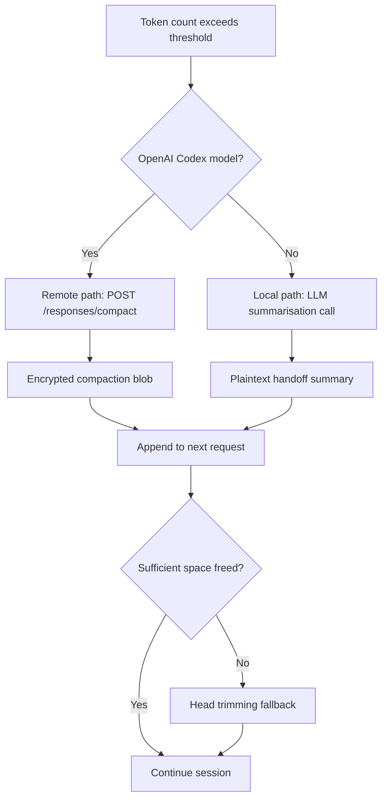
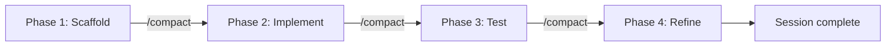
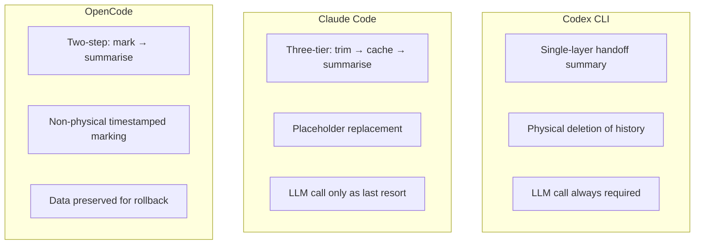

# Mastering Context Compaction in Codex CLI: Tuning Auto-Compact for Long-Running Sessions


Context compaction is the mechanism that lets Codex CLI sessions run for hours — even up to seven hours on complex tasks[^1] — without hitting context window limits. Yet most developers leave compaction on its defaults and wonder why the agent "forgets" critical decisions mid-refactor. This article covers the compaction pipeline end-to-end: how it works internally, every configuration knob available, custom compaction prompts, and battle-tested strategies for keeping long sessions productive.

## How Context Compaction Works

When a Codex CLI session accumulates enough conversation history to approach the model's context window, compaction replaces the full history with a compressed "handoff summary" that preserves essential state while freeing tokens for new work[^2].

### The Two Code Paths

Codex CLI implements compaction via two distinct paths, selected automatically based on the active model[^3]:

1. **Local path** (`compact.rs`): The client calls an LLM to generate a plaintext summary. This path works with any model provider — Azure, Vercel, Ollama, or any OpenAI-compatible endpoint[^3].

2. **Remote path** (`compact_remote.rs`): For OpenAI's own Codex models, the client calls the `POST /responses/compact` API endpoint, which returns an opaque encrypted blob rather than readable text. The server manages encryption keys; the client simply passes the blob into the next `responses.create()` call[^4].



### The Handoff Summary Structure

For the local path, Codex generates a structured briefing containing four components[^3]:

1. **Current progress and key decisions** — what has been accomplished and why
2. **Important constraints and user preferences** — coding standards, tooling choices, architectural boundaries
3. **Remaining TODOs** — the work queue going forward
4. **Critical data needed to continue** — file paths, variable names, API endpoints, and other specifics

The summary replaces all assistant replies and tool outputs whilst preserving user messages verbatim[^3]. If compaction alone doesn't free enough space, Codex falls back to **head trimming** — chopping the earliest messages until the conversation fits[^2].

### The 90% Safety Clamp

Since v0.100.0, Codex enforces a hard clamp: the effective auto-compact limit cannot exceed 90% of the context window[^5]. The formula is:

```
effective_limit = min(user_config_limit, context_window × 0.90)
```

This was introduced after "too many backend errors where compaction fails due to overflows"[^5]. The practical implication: even if you set `model_auto_compact_token_limit` to 250,000 on a 256k context window, compaction will trigger at 230,400 tokens.

## Configuration Reference

All compaction-related settings live in `~/.codex/config.toml` (or a project-level `.codex/config.toml`)[^6]:

```toml
# Context window size in tokens (unset = model default)
model_context_window = 128000

# Token threshold triggering auto-compaction (unset = model default)
model_auto_compact_token_limit = 100000

# Max tokens stored per tool/function output in history
tool_output_token_limit = 12000

# Inline override for the compaction prompt
compact_prompt = ""

# Load compaction prompt from a file (experimental)
experimental_compact_prompt_file = "/path/to/compact_prompt.txt"
```

### Per-Model Defaults

When `model_auto_compact_token_limit` is unset, Codex uses model-specific defaults[^7]:

| Model | Context Window | Default Compact Threshold |
|-------|---------------|--------------------------|
| gpt-5.4 | 1,000,000 | ~900,000 (90% clamp) |
| gpt-5.4-mini | 1,000,000 | ~900,000 |
| gpt-5.3-codex | 256,000 | ~230,400 |
| gpt-5.3-codex-spark | 128,000 | ~115,200 |
| gpt-5.2 (legacy) | 256,000 | ~230,400 |

⚠️ Exact default thresholds are not published by OpenAI; the values above are derived from the 90% clamp formula applied to known context windows.

### Profile-Based Compaction Strategies

Use profiles to switch compaction behaviour per task type[^6]:

```toml
# Default: aggressive compaction for quick tasks
model_auto_compact_token_limit = 64000

[profile.deep-refactor]
model = "gpt-5.4"
model_context_window = 1000000
model_auto_compact_token_limit = 800000
reasoning_effort = "high"

[profile.quick-fix]
model = "gpt-5.4-mini"
model_auto_compact_token_limit = 50000
reasoning_effort = "low"
```

Activate with `codex --profile deep-refactor`.

## Custom Compaction Prompts

The default compaction prompt works well for general coding tasks, but you can override it for domain-specific work. A good custom prompt should instruct the model to preserve the details that matter most for your project[^8].

### Writing an Effective Compact Prompt

Create a file at `~/.codex/compact_prompt.txt`:

```text
Create a detailed summary for continuing this coding session. Include:

1. COMPLETED WORK: Tasks finished, with file paths and function names
2. CURRENT STATE: Files modified, their current status, any failing tests
3. IN PROGRESS: What is actively being worked on right now
4. NEXT STEPS: Clear, ordered actions to take next
5. CONSTRAINTS: User preferences, project requirements, key architectural decisions
6. CRITICAL CONTEXT: Database schema details, API contracts, environment-specific configuration
7. TEST STATUS: Which tests pass, which fail, what coverage looks like

Be concise but preserve enough specificity that work can continue seamlessly.
Do NOT summarise test output — quote exact assertion failures.
Do NOT drop file paths — use absolute paths throughout.
```

Then reference it in `config.toml`:

```toml
experimental_compact_prompt_file = "~/.codex/compact_prompt.txt"
```

Alternatively, for a quick inline override:

```toml
compact_prompt = "Summarise this session preserving all file paths, test results, and architectural decisions. Quote exact error messages."
```

### Domain-Specific Prompt Examples

For **infrastructure-as-code** projects where losing resource identifiers is catastrophic:

```text
Preserve ALL: resource ARNs, Terraform state references, module paths,
variable bindings, and plan output diffs. Summarise prose discussions
but never abbreviate infrastructure identifiers.
```

For **database migration** work:

```text
Preserve: migration version numbers, schema DDL statements, column types,
index definitions, and any rollback procedures discussed. Summarise
general discussion but keep all SQL verbatim.
```

## The /compact Slash Command

Beyond auto-compaction, you can trigger compaction manually at any point during a session[^9]:

```
/compact
```

Codex will ask for confirmation before summarising. This is valuable when you know you're about to shift focus — compact the refactoring context before starting on a new feature within the same session.

Use `/status` to monitor your current context consumption[^9]. The output shows remaining context capacity, helping you decide when a manual compact is worthwhile.

### Strategic Manual Compaction

The most effective pattern for long sessions is **checkpoint compaction**: manually compact at natural breakpoints rather than waiting for auto-compact to trigger mid-task[^1].



This avoids the worst failure mode: auto-compaction firing whilst the agent is mid-way through a complex multi-file change, causing it to lose track of which files still need updating[^10].

## The Compaction-Reread Loop Problem

Compaction drops all tool outputs from history[^10]. This means after compaction, the agent no longer has the contents of files it previously read. The next time it needs that information, it re-reads the files — consuming tokens that may trigger another compaction sooner, creating a cascading loop.

A user reported this pattern in issue #16812: apparent doubling of compaction frequency turned out to be driven by large files (93 KB analysis + 58 KB plan + 610 KB OpenAPI spec) that had to be re-read after every compaction[^10].

### Mitigation Strategies

1. **Reduce `tool_output_token_limit`**: Smaller tool outputs mean less is lost per compaction, but also less context preserved. Find the balance for your project:

   ```toml
   tool_output_token_limit = 8000  # tighter than default 12000
   ```

2. **Use AGENTS.md for persistent context**: Critical information that must survive compaction belongs in AGENTS.md, not in conversation history[^11]. The agent re-reads AGENTS.md at session start and after compaction:

   ```markdown
   <!-- AGENTS.md -->
   ## Architecture
   - API gateway: src/gateway/
   - All endpoints return JSON with { data, error, meta } envelope
   - Database: PostgreSQL 16, migrations in db/migrations/
   ```

3. **Compact before large file reads**: If you're about to ingest a massive spec file, compact first so the summary is lean and the spec gets maximum context space.

4. **Split sessions for truly independent tasks**: If task A and task B share no context, use separate sessions (`/new`) rather than compacting between them.

## Compaction Across Tools: How Codex Compares

Understanding Codex's approach relative to alternatives helps you reason about its trade-offs[^2]:



| Dimension | Codex CLI | Claude Code | OpenCode |
|-----------|-----------|-------------|----------|
| Layers | 1 (summarise) | 3 (trim → cache → summarise) | 2 (prune → summarise) |
| LLM cost per compaction | Always | Only at layer 3 | Only at step 2 |
| Deletion model | Physical | Placeholders | Timestamped marks |
| Reversibility | Irreversible | Irreversible | Data preserved |
| Recent message preservation | ~20k tokens | Last 2 user turns | Last 40k tokens |

Codex's single-layer approach is simpler and works well with OpenAI's server-side encrypted compaction, but means every compaction event incurs an LLM call (or API call for the remote path)[^2]. Claude Code's three-tier system defers the expensive LLM call, trimming tool outputs first at zero cost[^2].

## Server-Side Compaction for SDK Users

If you're building on the Codex Python SDK (`codex_app_server`), you can leverage the Responses API's built-in compaction directly[^4]:

```python
import openai

client = openai.Client()

response = client.responses.create(
    model="gpt-5.4",
    input=conversation_items,
    context_management={
        "compact_threshold": 100000
    }
)

# The response may include a compaction item — carry it forward
next_input = conversation_items + response.output
# Drop items before the most recent compaction item for efficiency
```

The `compact_threshold` parameter tells the server to auto-compact within the same streaming response when the rendered token count exceeds the threshold[^4]. For explicit control, call the standalone endpoint:

```python
compact_result = client.responses.compact(
    model="gpt-5.4",
    input=conversation_items
)
# compact_result.output is the canonical next context window
# Do NOT prune it further
```

## Practical Tuning Recommendations

After working through compaction behaviour across dozens of sessions, these patterns consistently deliver the best results:

### For Short Tasks (< 30 minutes)

Leave defaults. Auto-compaction rarely triggers within a 128k context window for focused work.

### For Medium Tasks (1–3 hours)

```toml
model = "gpt-5.3-codex"
model_auto_compact_token_limit = 200000
tool_output_token_limit = 10000
```

Manual `/compact` at each major phase transition.

### For Marathon Sessions (3+ hours)

```toml
model = "gpt-5.4"
model_context_window = 1000000
model_auto_compact_token_limit = 750000
compact_prompt = "Preserve all file paths, test results, and TODO items verbatim."
```

Use GPT-5.4's million-token window to push compaction as late as possible. Combine with checkpoint compaction at natural breakpoints.

### For CI/CD Pipelines

```toml
[profile.ci]
model_auto_compact_token_limit = 80000
tool_output_token_limit = 6000
```

Tighter limits keep pipeline costs predictable. Pair with `codex exec --session-resume` for multi-stage pipelines where each stage compacts independently.

## Known Limitations

- **Compaction is irreversible** in Codex CLI. Once history is summarised, the original messages cannot be recovered[^2]. Use `/fork` before compaction if you may need to branch back.
- **Long conversations with multiple compactions degrade accuracy**. OpenAI explicitly warns that "long conversations and multiple compactions can cause the model to be less accurate"[^7].
- **The 90% clamp is non-negotiable**. There is no configuration to override it[^5]. If you need the absolute maximum context before compaction, you must choose a model with a larger context window.
- **No selective preservation**. You cannot tell compaction to keep specific tool outputs whilst dropping others. The feature request in issue #16839 tracks this gap[^10].
- **`experimental_compact_prompt_file` may change**. As the name suggests, this configuration key is experimental and may be renamed or removed[^6].

## Citations

[^1]: [Codex CLI Features — Long-Running Sessions](https://developers.openai.com/codex/cli/features) — OpenAI developer documentation, accessed April 2026.
[^2]: [Shedding Heavy Memories: Context Compaction in Codex, Claude Code, and OpenCode](https://justin3go.com/en/posts/2026/04/09-context-compaction-in-codex-claude-code-and-opencode) — Justin3go, April 9, 2026.
[^3]: [Context Compaction Research: Claude Code, Codex CLI, OpenCode, Amp](https://gist.github.com/badlogic/cd2ef65b0697c4dbe2d13fbecb0a0a5f) — Mario Zechner (badlogic), GitHub Gist, 2026.
[^4]: [Compaction — OpenAI API Documentation](https://developers.openai.com/api/docs/guides/compaction) — OpenAI, accessed April 2026.
[^5]: [v0.100.0 removed a critical user capability: hard 90% clamp nullifies user-defined compaction threshold — Issue #11805](https://github.com/openai/codex/issues/11805) — openai/codex, GitHub.
[^6]: [Sample Configuration — Codex Developer Documentation](https://developers.openai.com/codex/config-sample) — OpenAI, accessed April 2026.
[^7]: [Context Compaction Research Gist — Per-Model Thresholds](https://gist.github.com/badlogic/cd2ef65b0697c4dbe2d13fbecb0a0a5f) — Mario Zechner, 2026. Thresholds vary by model; 180k–244k range documented.
[^8]: [Codex Prompting Guide — Custom Compaction](https://developers.openai.com/cookbook/examples/gpt-5/codex_prompting_guide) — OpenAI Cookbook, 2026.
[^9]: [Slash Commands in Codex CLI](https://developers.openai.com/codex/cli/slash-commands) — OpenAI developer documentation, accessed April 2026.
[^10]: [Context compaction regression in CLI v0.118 — Issue #16812](https://github.com/openai/codex/issues/16812) — openai/codex, GitHub. Closed as not-a-bug; revealed compaction-reread loop pattern.
[^11]: [Custom Instructions with AGENTS.md](https://developers.openai.com/codex/guides/agents-md) — OpenAI developer documentation, accessed April 2026.
