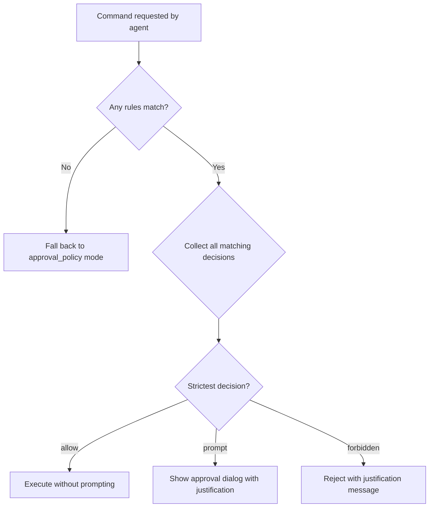
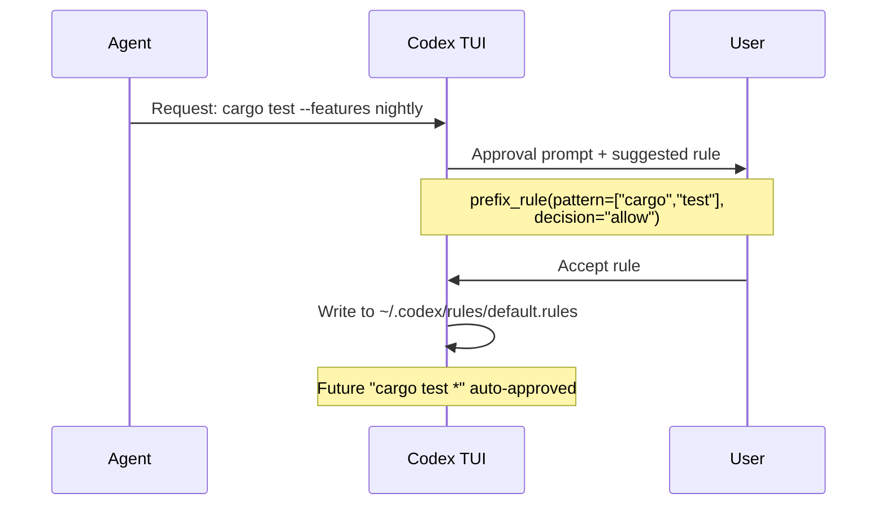

# Execution Policy Rules in Codex CLI: Starlark-Based Command Governance for Teams


---

Every senior developer running Codex CLI has felt the friction: approve `git status`, then approve `git diff`, then approve `git log` — each individually, each session. The built-in approval modes (`suggest`, `auto-edit`, `full-auto`) are blunt instruments. You either approve everything or you approve everything manually. The execution policy rules system, powered by Starlark and shipping since v0.117.0, offers the middle ground: declarative, testable, composable command governance that scales from solo developers to enterprise organisations[^1].

This article covers the rules format in depth, shows how to build a practical ruleset, explains the interaction with smart approvals and the TUI, and demonstrates the `codex execpolicy check` validation workflow.

## Why Approval Modes Aren't Enough

Codex CLI's three approval modes map to coarse trust levels[^2]:

| Mode | What It Does | The Problem |
|---|---|---|
| `suggest` | Agent proposes, you approve everything | Too slow for iterative work |
| `auto-edit` | File edits auto-applied, commands still prompt | Commands still interrupt flow |
| `full-auto` | Everything runs without prompting | No guardrails at all |

The approval system records exact command strings. Approving `git add src/main.rs` does not cover `git add src/lib.rs` — you must approve again[^3]. For any non-trivial session, this creates dozens of interruptions. Rules solve this by matching command *prefixes* rather than exact strings.

## The `.rules` File Format

Rules files use Starlark, a deterministic, side-effect-free subset of Python originally designed by Google for Bazel build configuration[^4]. Codex chose Starlark because it can be safely evaluated without sandboxing concerns — there is no file I/O, no network access, and no mutable global state[^5].

### File Location and Discovery

Codex scans `rules/` directories under every Team Config location at startup[^1]:

```
~/.codex/rules/default.rules      # User-level (auto-updated by TUI)
~/.codex/rules/custom.rules       # User-level (manual)
.codex/rules/project.rules        # Project-level
/etc/codex/rules/org.rules        # System-level (enterprise)
```

All `*.rules` files found across these locations are loaded and merged. When multiple rules match the same command, the most restrictive decision wins[^1].

### The `prefix_rule()` Function

Every rule is a call to `prefix_rule()` with a pattern and optional metadata:

```starlark
prefix_rule(
    pattern = ["git", "status"],
    decision = "allow",
    justification = "Read-only Git operation, safe to auto-approve",
    match = [
        ["git", "status"],
        ["git", "status", "--porcelain"],
    ],
    not_match = [
        ["git", "push"],
    ],
)
```

The fields break down as follows[^1][^6]:

| Field | Required | Description |
|---|---|---|
| `pattern` | Yes | Non-empty list defining the command prefix to match |
| `decision` | No | `"allow"` (default), `"prompt"`, or `"forbidden"` |
| `justification` | No | Human-readable reason, surfaced in TUI prompts |
| `match` | No | Example commands that *should* match (validated at load time) |
| `not_match` | No | Example commands that *should not* match (validated at load time) |

### Pattern Matching Mechanics

Each element in `pattern` can be either a literal string or a list of alternatives (a union). Matching is positional and prefix-based — once all pattern elements match, any trailing arguments are ignored[^1].

```starlark
# Matches: git status, git diff, git log, git diff --staged, etc.
prefix_rule(
    pattern = ["git", ["status", "diff", "log"]],
    decision = "allow",
)

# Matches: npm test, npm run test, npm run lint
prefix_rule(
    pattern = ["npm", ["test", "run"]],
    decision = "allow",
)
```

### The Decision Hierarchy

When multiple rules match, Codex applies strict severity ordering[^1][^6]:

```
forbidden  >  prompt  >  allow
```

This means a single `forbidden` rule overrides any number of `allow` rules matching the same command. The design is deliberately conservative — you cannot accidentally weaken security by adding a permissive rule.



## Shell Command Parsing

Codex handles shell wrappers (`bash -lc`, `zsh -c`, `sh -c`) with a two-tier parser[^1]:

**Safe scripts** — plain commands joined by `&&`, `||`, `;`, or `|` — are split into individual commands. Each is evaluated against rules independently.

**Complex scripts** — those containing redirection, variable substitution, wildcards, subshells, or control flow — are treated as single invocations. The entire script string becomes the "command" matched against patterns.

This distinction matters. A rule allowing `["cargo", "test"]` will match inside `bash -lc "cargo test && cargo clippy"` (safe script, split into two commands). But it will *not* match inside `bash -lc "cargo test > output.log 2>&1"` (complex script, treated as one opaque invocation).

## Building a Practical Ruleset

Here is a production-grade ruleset for a Rust project, covering the most common approval friction points:

```starlark
# --- Read-only operations: always allow ---

prefix_rule(
    pattern = ["git", ["status", "diff", "log", "show", "branch", "remote", "stash"]],
    decision = "allow",
    justification = "Read-only Git operations",
)

prefix_rule(
    pattern = ["cargo", ["check", "clippy", "test", "bench", "doc", "tree", "metadata"]],
    decision = "allow",
    justification = "Read-only Cargo operations (no writes to target/)",
)

prefix_rule(
    pattern = ["cat"],
    decision = "allow",
    justification = "File reading only",
)

prefix_rule(
    pattern = [["ls", "find", "wc", "head", "tail", "grep", "rg"]],
    decision = "allow",
    justification = "Standard Unix read-only utilities",
)

# --- Write operations: prompt for confirmation ---

prefix_rule(
    pattern = ["git", ["add", "commit", "merge", "rebase"]],
    decision = "prompt",
    justification = "Git writes — review before allowing",
)

prefix_rule(
    pattern = ["cargo", ["build", "install", "publish"]],
    decision = "prompt",
    justification = "Cargo operations that write artefacts or publish crates",
)

# --- Dangerous operations: forbidden ---

prefix_rule(
    pattern = ["git", ["push", "force-push"]],
    decision = "forbidden",
    justification = "No automated pushes — humans push to remote",
    match = [["git", "push", "origin", "main"]],
    not_match = [["git", "status"]],
)

prefix_rule(
    pattern = ["rm", "-rf"],
    decision = "forbidden",
    justification = "Recursive force-delete blocked",
)

prefix_rule(
    pattern = [["curl", "wget"]],
    decision = "forbidden",
    justification = "Network access blocked — use sandbox network policy instead",
)
```

## The `host_executable()` Guard

When the agent invokes a command by absolute path (e.g., `/opt/homebrew/bin/git`), Codex can fall back to basename matching — but only if allowed by a `host_executable()` declaration[^6]:

```starlark
host_executable(
    name = "git",
    paths = [
        "/opt/homebrew/bin/git",
        "/usr/bin/git",
        "/usr/local/bin/git",
    ],
)
```

Without this declaration, basename fallback is unrestricted. With it, only the listed absolute paths are permitted to resolve as `git`. This prevents path-confusion attacks where a malicious repository ships a `./git` wrapper that would otherwise match your `["git", ...]` rules[^6].

To enable this behaviour, pass `--resolve-host-executables` to the check command:

```bash
codex execpolicy check \
  --resolve-host-executables \
  --rules ~/.codex/rules/project.rules \
  -- /opt/homebrew/bin/git status
```

## Validating Rules with `codex execpolicy check`

The `codex execpolicy check` subcommand evaluates a command against one or more rule files and emits structured JSON[^1][^6]:

```bash
codex execpolicy check \
  --pretty \
  --rules ~/.codex/rules/default.rules \
  --rules .codex/rules/project.rules \
  -- gh pr view 7888 --json title,body,comments
```

Output:

```json
{
  "effectiveDecision": "allow",
  "matchedRules": [
    {
      "pattern": ["gh", "pr", ["view", "list"]],
      "decision": "allow",
      "justification": "Read-only GitHub CLI operations"
    }
  ]
}
```

When no rules match, `matchedRules` is empty and no `effectiveDecision` is included — meaning the command falls through to the session's `approval_policy` mode[^6].

### Inline Test Assertions

The `match` and `not_match` fields serve as load-time unit tests. If a `match` example does not trigger the rule, or a `not_match` example does trigger it, Codex rejects the file at startup with a clear error[^1]. Think of them as property-based assertions for your security policy:

```starlark
prefix_rule(
    pattern = ["docker", ["build", "run"]],
    decision = "prompt",
    match = [
        ["docker", "build", "."],
        ["docker", "run", "--rm", "alpine"],
    ],
    not_match = [
        ["docker", "push", "registry.example.com/app"],
        ["docker", "system", "prune"],
    ],
)
```

## Smart Approvals and Automatic Rule Generation

When smart approvals are enabled (the default), Codex observes your manual approval patterns and may suggest `prefix_rule` entries during escalation requests[^1]. The flow works as follows:



When you accept a suggested rule via the TUI, Codex writes it to `~/.codex/rules/default.rules`[^1]. This file is auto-managed — for custom rules that should persist across sessions and be version-controlled, create a separate file such as `~/.codex/rules/custom.rules` or commit `.codex/rules/project.rules` to your repository[^3].

## Integration with `approval_policy` and `requirements.toml`

Rules interact with the broader approval system at two levels:

### Config-level: `approval_policy.granular.rules`

The `approval_policy.granular.rules` config key controls whether `prompt` decisions from rules surface as interactive TUI prompts or are auto-rejected[^7]:

```toml
[approval_policy.granular]
rules = "prompt"          # Show prompts for "prompt" decisions (default)
# rules = "auto-reject"   # Silently reject "prompt" decisions
# rules = "auto-approve"  # Auto-approve "prompt" decisions
```

### Enterprise enforcement: `requirements.toml`

Administrators can enforce rules system-wide via `requirements.toml`, deployed through cloud-managed policies (ChatGPT Business/Enterprise), macOS MDM (`com.openai.codex:requirements_toml_base64`), or the system path (`/etc/codex/requirements.toml`)[^8]. This hierarchy ensures enterprise security teams can mandate `forbidden` rules that individual developers cannot override:

```
Cloud-managed requirements (highest priority)
  └── macOS MDM preferences
        └── System requirements.toml (/etc/codex/)
              └── User rules (~/.codex/rules/)
                    └── Project rules (.codex/rules/)
```

## Comparison with Claude Code Permissions

Claude Code takes a different approach: its `allowedTools` and `disallowedTools` arrays in `.claude/settings.json` operate at the tool level rather than the command level[^9]. You can allow or deny the `Bash` tool entirely, or use `Bash(git status:*)` glob patterns. Codex's Starlark-based rules offer finer granularity — matching on argument position and supporting union alternatives — but at the cost of a steeper learning curve.

| Capability | Codex CLI Rules | Claude Code Permissions |
|---|---|---|
| Matching granularity | Argument-position prefix | Tool-level glob |
| Policy language | Starlark (testable) | JSON arrays |
| Inline tests | `match`/`not_match` assertions | None |
| Severity hierarchy | `forbidden > prompt > allow` | Allow/deny binary |
| Auto-suggestion | Smart approvals generate rules | Manual configuration |
| Enterprise enforcement | `requirements.toml` stack | `.claude/settings.json` |
| CLI validation tool | `codex execpolicy check` | None |

## Practical Recommendations

1. **Separate auto-generated from manual rules.** Let `default.rules` be managed by smart approvals. Put deliberate policy in `custom.rules` or `project.rules`.

2. **Version-control project rules.** Commit `.codex/rules/project.rules` alongside `AGENTS.md`. New team members inherit the same command governance on clone.

3. **Use `match`/`not_match` liberally.** They cost nothing at runtime and catch pattern mistakes at startup. Treat them as unit tests for your security policy.

4. **Start with `prompt`, promote to `allow`.** Begin with `decision = "prompt"` for new command families. Once you trust the pattern, switch to `"allow"`. Never start with `"allow"` for write operations.

5. **Test before deploying.** Run `codex execpolicy check` against your ruleset with representative commands before committing. Pipe the JSON output through `jq` for batch validation in CI.

6. **Guard absolute paths.** If your team uses Homebrew, Nix, or custom toolchains, add `host_executable()` declarations for critical binaries to prevent path-confusion.

## Known Limitations

- **Rules are experimental.** The documentation notes that the format may change[^1]. Pin to a Codex CLI version in CI if stability matters. ⚠️
- **Complex shell scripts bypass splitting.** Any script with redirection, variables, or control flow is matched as a single opaque string, which limits rule precision.
- **No regex support.** Patterns are literal prefix matches with union alternatives. You cannot write `pattern = ["git", "commit", "-m", ".*"]` — the trailing argument is simply ignored by prefix matching.
- **No deny-by-default mode.** If no rule matches, Codex falls back to the session's `approval_policy`. There is no way to mandate that *every* command must match a rule. ⚠️

## Citations

[^1]: OpenAI, "Rules – Codex | OpenAI Developers," [https://developers.openai.com/codex/rules](https://developers.openai.com/codex/rules), accessed April 2026.
[^2]: OpenAI, "Agent approvals & security – Codex | OpenAI Developers," [https://developers.openai.com/codex/agent-approvals-security](https://developers.openai.com/codex/agent-approvals-security), accessed April 2026.
[^3]: Yorifuji, "Understanding Codex Execution Policy Rules for Secure and Efficient Use," Zenn, [https://zenn.dev/yorifuji/articles/3d44ca14ad6b3e](https://zenn.dev/yorifuji/articles/3d44ca14ad6b3e), accessed April 2026.
[^4]: Google, "Starlark Language Specification," [https://github.com/bazelbuild/starlark/blob/master/spec.md](https://github.com/bazelbuild/starlark/blob/master/spec.md), accessed April 2026.
[^5]: OpenAI, "Allow user to create rules with improved Starlark support," GitHub Issue #15214, [https://github.com/openai/codex/issues/15214](https://github.com/openai/codex/issues/15214), accessed April 2026.
[^6]: OpenAI, "codex-rs/execpolicy/README.md," GitHub, [https://github.com/openai/codex/blob/main/codex-rs/execpolicy/README.md](https://github.com/openai/codex/blob/main/codex-rs/execpolicy/README.md), accessed April 2026.
[^7]: OpenAI, "Configuration Reference – Codex | OpenAI Developers," [https://developers.openai.com/codex/config-reference](https://developers.openai.com/codex/config-reference), accessed April 2026.
[^8]: OpenAI, "Managed configuration – Codex | OpenAI Developers," [https://developers.openai.com/codex/enterprise/managed-configuration](https://developers.openai.com/codex/enterprise/managed-configuration), accessed April 2026.
[^9]: Anthropic, "Claude Code Permissions," [https://docs.anthropic.com/en/docs/claude-code/security](https://docs.anthropic.com/en/docs/claude-code/security), accessed April 2026.
