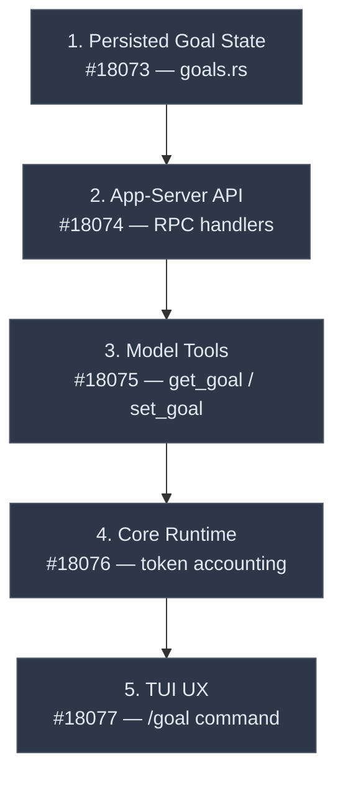
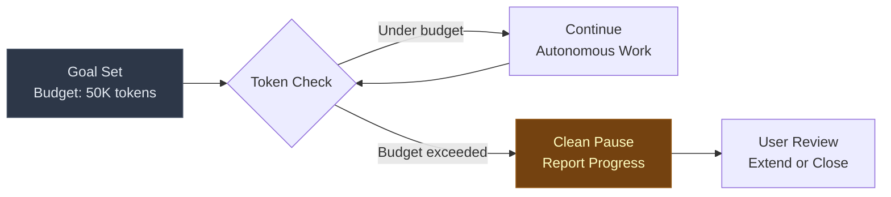

# Goal Mode: Persistent Objectives with Token Budgets and Autonomous Continuation


---

Codex CLI has steadily expanded its autonomy surface — from `--full-auto` mode[^1] through subagent workflows and `codex exec` for headless batch runs[^2]. But every interaction still follows the same pattern: user provides a task, agent executes it, user provides the next task. A five-part PR series from etraut-openai (PRs #18073–#18077), currently in review against the v0.122.0 development branch[^3], proposes a fundamental shift: **goal mode**, which transforms Codex from a task-execution tool into an objective-tracking system with persisted state, token budgets, and autonomous continuation.

This article analyses the architecture, implications, and trade-offs of goal mode based on the open PRs and their relationship to Codex CLI's existing autonomy primitives.

## The Problem Goal Mode Solves

Consider a refactoring task: "migrate the authentication module from session-based to OAuth2". Today, a developer would break this into discrete prompts — update the middleware, rewrite the token handling, adjust the tests, fix the integration layer — each requiring human orchestration between steps.

Goal mode inverts this. The developer sets an objective:

```bash
/goal "Migrate auth module to OAuth2 — update middleware, token handling, tests, and integration layer"
```

Codex persists that goal, works autonomously toward it across multiple turns, manages its own continuation, and only surfaces to the user when the goal is complete or the token budget is exhausted.

## Architecture: Five Layers

The implementation is structured as a stacked PR series, each layer building on the previous one.



### Layer 1: Persisted Goal State (#18073)

Goals are persisted per-thread in the thread store, surviving session restarts and `codex resume` operations[^3]. The key implementation lives in `codex-rs/state/src/runtime/goals.rs`, wired behind a feature flag. Each goal carries:

- A natural-language objective description
- Status (active, paused, complete, failed)
- Progress metadata the model can update
- Token budget and consumption counters
- Constraints (file scope, approval overrides)

Thread-level persistence means a developer can set a goal, close the terminal, resume the session later, and the agent picks up where it left off — a significant step beyond the existing `codex exec resume` capability[^2].

### Layer 2: App-Server API (#18074)

The app-server gains a v2 goal API with `ThreadGoalGetResponse` schema and RPC handlers for reading and updating materialised thread goals[^3]. Critically, the server can **re-trigger the agent** when a goal is active — enabling autonomous continuation without user input. A notification system broadcasts goal state changes to connected clients.

### Layer 3: Model Tools (#18075)

Two new tools, gated behind the tool-registry feature flag[^3]:

| Tool | Purpose |
|------|---------|
| `get_goal` | Model inspects the current persisted goal — status, progress, constraints |
| `set_goal` | Model updates goal state — mark complete, update progress, refine objective |

These tools let the model **reason about its own objectives explicitly** rather than relying on prompt context alone. This is a meaningful architectural distinction: the goal is a first-class runtime object, not merely text in the conversation history that gets compacted away.

### Layer 4: Core Runtime (#18076)

The execution engine for active goals handles:

- **Token accounting** — tracks consumption per goal with turn-level or tool-level granularity[^3]
- **Budget enforcement** — halts execution when the token budget is exceeded, producing a clean pause rather than an abrupt failure
- **Continuation prompts** — generates context for resuming work on partially-completed goals
- **Resume handling** — restores goal state after interruption
- **Interrupt/pause** — users can pause a running goal and resume later
- **Parallel tool serialisation** — prevents double-charging across concurrent tool invocations

### Layer 5: TUI UX (#18077)

The user-facing surface:

```bash
# Set a goal with a token budget
/goal "Refactor auth module to OAuth2" --budget 50000

# Inspect current goal status
/goal

# Clear the active goal
/goal --clear
```

A persistent statusline indicator shows goal progress in the TUI footer, and session-aware reset clears stale goal text when switching threads[^3].

## Token Budgets as Cost Governance

The per-goal token budget is arguably the most significant aspect for enterprise adoption. Current Codex CLI pricing routes primary work through GPT-5.4 and lighter tasks through GPT-5.4 mini at approximately 30% of the quota cost[^4][^5]. Without budget controls, autonomous agents can consume unpredictable amounts of tokens.

Goal mode's budget enforcement creates a natural governance boundary:



Teams can set per-goal cost limits as governance policy. Combined with the existing `fast_mode` toggle, budget in fast mode costs approximately 2× but completes approximately 1.5× faster[^3] — giving teams a speed-versus-cost dial within a fixed budget envelope.

## Comparison with Existing Autonomy Modes

Goal mode sits alongside, rather than replacing, Codex CLI's existing autonomy spectrum:

| Mode | Scope | Human Involvement | Persistence |
|------|-------|-------------------|-------------|
| Interactive (default) | Single turn | Every turn | Session |
| `--full-auto` | Single turn | On request only[^1] | Session |
| `codex exec` | Single task | None (headless)[^2] | Session file |
| **Goal mode** | Multi-turn objective | Budget-gated | Thread store |

The key differentiator is **scope**: goal mode operates at the objective level rather than the task level. An `--full-auto` session still requires the user to define each task; goal mode lets the agent decompose and sequence tasks autonomously.

## Comparison with Claude Code

Claude Code's autonomy model emphasises supervised operation. Its plan mode lets developers review proposed changes before execution, and hooks provide lifecycle events to intercept and modify behaviour[^6]. Agent Teams enable multiple Claude Code instances to work on different parts of a problem simultaneously, coordinated by a lead agent[^7].

However, Claude Code's autonomy is fundamentally **task-scoped** — each task is a structured object with a goal, context, constraints, and file paths, submitted via the API, where Claude Code executes and returns a result[^7]. There is no persistent objective that survives across sessions with autonomous continuation.

Goal mode makes Codex CLI the first major terminal-based coding agent with **objective-level autonomy** — closer to AutoGPT's original vision[^8] but with critical additions AutoGPT lacked: proper sandboxing, token budgets that prevent cost spirals, thread-persisted state, and enterprise governance guardrails.

## Integration Points

Goal mode's architecture creates natural extension points within the existing Codex ecosystem:

- **Subagents**: A parent agent could set goals for child subagents, each with independent token budgets — enabling hierarchical objective decomposition
- **Skills**: Skills could define goal templates (e.g., "run full test suite and fix all failures") with pre-configured budgets and constraints
- **Hooks**: `SessionGoalUpdate` hook events could trigger external notifications — Slack alerts when a goal completes, or PagerDuty escalation when a budget is exhausted
- **`codex exec`**: Goal mode combined with exec enables autonomous batch operations with budget caps — CI/CD pipelines that set objectives rather than scripts
- **`ExecuteUntilDoneRequest`** (#18081): A related PR from cconger introduces a batch execution primitive that may be designed for goal-scoped execution[^3]

## What to Watch

Goal mode is currently behind a feature flag in v0.122.0 alpha development[^3]. Several open questions remain:

1. **Feature flag graduation** — whether goal mode ships as stable in v0.122.0 or remains experimental for longer. The 0.122.0-alpha.3 pre-release is already available[^9] but it's unclear whether the goal mode PRs have been merged into the alpha branch.

2. **Budget defaults** — what sensible defaults look like for different goal complexities. Too low and agents pause constantly; too high and costs spiral.

3. **Compaction interaction** — how goal state interacts with Codex CLI's context compaction system[^10]. Goals persisted in the thread store should survive compaction, but the continuation prompts need to carry enough context for the model to resume effectively.

4. **Security surface** — `set_goal` allows the model to modify its own objective. In adversarial prompt injection scenarios, this could be exploited to redirect the agent's purpose. The feature flag gating suggests the team is aware of this risk.

5. **Multi-goal support** — the current architecture appears to support one active goal per thread. Whether concurrent goals (with independent budgets) are on the roadmap is unclear.

⚠️ *All implementation details in this article are based on open, unmerged PRs and may change before release. The feature flag gating suggests goal mode may ship as experimental initially.*

## Practical Implications

For teams already using Codex CLI in production, goal mode represents a shift in how agent work is scoped and governed. The migration path is straightforward — goal mode is additive, not breaking — but the operational model changes significantly:

- **Sprint planning** could include token budgets alongside story points
- **Cost attribution** becomes goal-scoped rather than session-scoped, integrating naturally with the existing OpenTelemetry `OTEL_RESOURCE_ATTRIBUTES` cost attribution[^10]
- **Overnight runs** become viable: set a goal with a budget cap before leaving, review results in the morning
- **Code review** shifts from reviewing individual changes to reviewing goal outcomes

Goal mode doesn't make Codex CLI sentient. It makes it persistent. And for enterprise teams managing fleets of coding agents, persistence with budget controls is exactly the missing piece.

## Citations

[^1]: [Codex CLI Command Line Reference — Approval Policies](https://developers.openai.com/codex/cli/reference) — `--full-auto` sets `--ask-for-approval on-request` and `--sandbox workspace-write`
[^2]: [Codex CLI Command Line Reference — Exec Mode](https://developers.openai.com/codex/cli/reference) — `codex exec` for non-interactive headless runs with resume capability
[^3]: [Codex CLI Goal Mode PRs #18073–#18077, #18081](https://github.com/openai/codex) — etraut-openai's 5-part PR series and cconger's ExecuteUntilDoneRequest, open as of 2026-04-16
[^4]: [OpenAI Codex Pricing — GPT-5.4 and GPT-5.4 mini](https://developers.openai.com/codex/pricing) — model tier pricing and quota allocation
[^5]: [Codex CLI Models — GPT-5.4 as Default](https://developers.openai.com/codex/models) — GPT-5.4 became default model on 5 March 2026; GPT-5.4 mini added 17 March 2026
[^6]: [Claude Code Common Workflows — Plan Mode and Hooks](https://code.claude.com/docs/en/common-workflows) — supervised autonomy with plan review and lifecycle hooks
[^7]: [Claude Managed Agents Overview](https://platform.claude.com/docs/en/managed-agents/overview) — task-scoped structured execution via API
[^8]: [AutoGPT Explained: The Rise of Autonomous AI Agents in 2026](https://www.tech2geek.net/autogpt-explained-the-rise-of-autonomous-ai-agents-in-2026/) — AutoGPT's recursive planning approach and its cost/reliability limitations
[^9]: [Codex CLI Releases](https://github.com/openai/codex/releases) — v0.122.0-alpha.3 pre-release available 2026-04-16
[^10]: [Codex CLI Features — OpenTelemetry and Context Compaction](https://developers.openai.com/codex/cli/features) — built-in observability and context management
