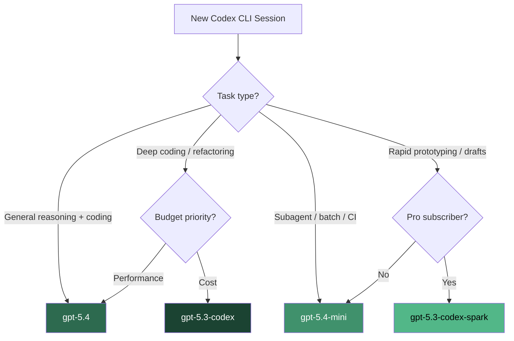
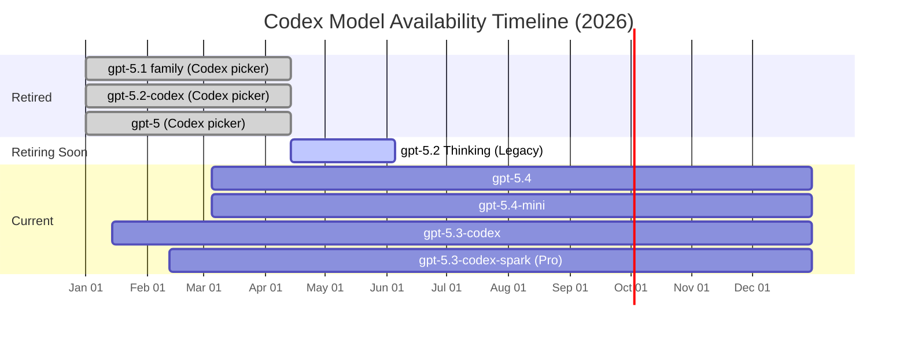

# The April 2026 Model Deprecation Wave: Migrating Your Codex CLI Configuration


On 14 April 2026, OpenAI completed the largest model retirement in Codex CLI's history. Six models — `gpt-5.2-codex`, `gpt-5.1-codex-mini`, `gpt-5.1-codex-max`, `gpt-5.1-codex`, `gpt-5.1`, and `gpt-5` — were removed from the ChatGPT sign-in model picker [^1]. If your `config.toml` still references any of them, your sessions are either failing or silently falling back to a default you didn't choose. This article covers exactly what changed, what's still available, and how to update your configuration for the post-deprecation landscape.

## What Was Removed and Why

The retirement rolled out in two phases [^1]:

| Date | Action |
|---|---|
| 7 April 2026 | Models hidden from the model picker UI |
| 14 April 2026 | Models fully removed for ChatGPT sign-in users |

The six retired models span three generations:

- **GPT-5.0**: The original GPT-5, now superseded twice over
- **GPT-5.1 family**: `gpt-5.1`, `gpt-5.1-codex`, `gpt-5.1-codex-mini`, `gpt-5.1-codex-max` — the first Codex-specialised variants
- **GPT-5.2 family**: `gpt-5.2-codex` — the model that introduced native context compaction [^2]

The strategic rationale is straightforward: GPT-5.4 incorporates the frontier coding capabilities of GPT-5.3-Codex into a single mainline reasoning model [^3]. Maintaining six legacy model endpoints that fewer than 8% of active sessions still used (per the Discussion #17038 deprecation notice [^4]) was no longer justifiable.

### The API Escape Hatch

Critically, this deprecation **only affects ChatGPT sign-in users**. If you authenticate with an API key, you can still access `gpt-5.2` and `gpt-5.1` models via the API — OpenAI has announced no API retirement date for these [^5]. The `gpt-5.2-codex` and `gpt-5.1-codex-*` variants, however, are fully deprecated across both surfaces.

## The Current Model Lineup

After the April 14 retirement, five models remain available in Codex CLI [^6]:

| Model | Context | Input Cost | Output Cost | Best For |
|---|---|---|---|---|
| `gpt-5.4` | 1.0M tokens | \$2.50/MTok | \$15.00/MTok | General-purpose flagship; coding + reasoning + computer use |
| `gpt-5.4-mini` | 400K tokens | \$0.75/MTok | \$4.50/MTok | Fast iteration, subagents, lightweight tasks |
| `gpt-5.3-codex` | 400K tokens | \$1.75/MTok | \$14.00/MTok | Terminal-first deep coding; highest Terminal-Bench score |
| `gpt-5.3-codex-spark` | 128K tokens | Research preview | Research preview | Near-instant iteration at 1,000+ tok/s (Pro only) |
| `gpt-5.2` | 200K tokens | Legacy pricing | Legacy pricing | Legacy; retires from ChatGPT on 5 June 2026 |

⚠️ `gpt-5.2` Thinking remains accessible in the Legacy Models section for paid ChatGPT users, but retires on 5 June 2026 [^3]. If you're still on `gpt-5.2`, migrate now rather than facing a second forced migration in seven weeks.

## Model Selection Decision Framework

The post-deprecation landscape simplifies the decision to three practical choices. `gpt-5.3-codex-spark` is a specialist tool for Pro subscribers, and `gpt-5.2` is on borrowed time.



### GPT-5.4 vs GPT-5.3-Codex: The Nuanced Choice

These two models are closer in coding performance than you might expect [^7]:

- **SWE-Bench Pro**: GPT-5.4 leads narrowly at 57.7% vs 56.8%
- **Terminal-Bench 2.0**: GPT-5.3-Codex leads at 77.3% vs 75.1% — the benchmark most relevant to CLI users
- **OSWorld (computer use)**: GPT-5.4 dominates at 75% vs 64%, crossing the human expert baseline of 72.4%
- **Context window**: GPT-5.4 offers 1.0M tokens vs 400K — significant for monorepo work

The practical rule: if you're doing pure terminal-first coding and want to save 30% on input tokens, `gpt-5.3-codex` remains the better choice [^7]. For everything else — especially workflows involving computer use, knowledge work, or sessions approaching 400K tokens — `gpt-5.4` is the stronger default.

### GPT-5.4-mini: The Subagent Workhorse

At \$0.75 per million input tokens, `gpt-5.4-mini` is 70% cheaper than `gpt-5.4` and runs over 2× faster [^8]. It approaches `gpt-5.4` performance on SWE-Bench Pro and OSWorld-Verified [^8], making it the clear choice for:

- Subagent workers in multi-agent orchestration
- CI/CD pipeline tasks via `codex exec`
- Batch processing with `spawn_agents_on_csv`
- Any high-volume, latency-sensitive workflow

## Updating Your Configuration

### Basic Migration

If your `config.toml` references a retired model, update it:

```toml
# Before (broken after April 14)
model = "gpt-5.2-codex"

# After — choose your default
model = "gpt-5.4"
```

### Profile-Based Model Routing

The deprecation is a good prompt to adopt profiles if you haven't already. Define task-appropriate model selections rather than a single global default [^9]:

```toml
# ~/.codex/config.toml

model = "gpt-5.4"
approval_policy = "on-request"

[profiles.deep-code]
model = "gpt-5.3-codex"
model_reasoning_effort = "high"

[profiles.fast]
model = "gpt-5.4-mini"
model_reasoning_effort = "low"

[profiles.ci]
model = "gpt-5.4-mini"
approval_policy = "full-auto"
model_reasoning_effort = "medium"
```

Switch between them at launch:

```bash
# Deep refactoring session
codex --profile deep-code

# Quick CI fix
codex --profile ci

# Or override inline
codex --model gpt-5.4-mini
```

You can also switch mid-session with the `/model` command [^9] — useful when you start a session in planning mode with `gpt-5.4` and want to hand off implementation to a cheaper model.

### Multi-Agent Configuration Updates

If you're running multi-agent workflows with TOML-defined subagents, ensure every agent block specifies a current model. Subagents that inherited a now-retired model from a parent configuration will fail silently or fall back unpredictably:

```toml
# In your orchestrator's agent TOML
[[agents]]
name = "implementer"
model = "gpt-5.4-mini"        # Explicit — don't rely on inheritance
model_reasoning_effort = "medium"
instructions_file = "AGENTS.md"

[[agents]]
name = "reviewer"
model = "gpt-5.4"             # Flagship for review quality
model_reasoning_effort = "high"
```

### API Key Users: Keeping Access to Legacy Models

If you need `gpt-5.2` via the API (for reproducibility, regression testing, or gradual migration), configure a model provider with your API key [^10]:

```toml
model = "gpt-5.2"
model_provider = "openai-api"

[model_providers.openai-api]
name = "OpenAI API (direct)"
base_url = "https://api.openai.com/v1"
env_key = "OPENAI_API_KEY"
```

⚠️ This is a temporary measure. Plan your migration to `gpt-5.4` or `gpt-5.3-codex` before the API deprecation announcement arrives.

## The Deprecation Timeline at a Glance



## Verifying Your Migration

After updating `config.toml`, verify your configuration is clean:

```bash
# Check which model your default profile uses
codex --model gpt-5.4 --version

# Verify each profile loads correctly
codex --profile deep-code --version
codex --profile ci --version

# Check mid-session with /status
# (inside a session, /status shows the active model and rate limits)
```

If you use [Agnix](2026-04-13-agnix-linting-codex-cli-agent-configurations.md) for configuration linting, update to v0.18.0+ which includes CDX-CFG-042: a rule that flags references to retired models [^11].

## What This Means for the Ecosystem

The April deprecation wave signals OpenAI's consolidation strategy: fewer, more capable models rather than a sprawling family tree [^3]. GPT-5.4 absorbs the specialist coding capabilities that previously required a dedicated `-codex` variant. The only remaining specialist is `gpt-5.3-codex`, which survives because it still holds the Terminal-Bench crown [^7] and powers the Spark real-time inference pathway.

For teams, the consolidation simplifies model governance. Instead of managing policies across six models with varying capability profiles, enterprise `requirements.toml` files can now restrict to three: `gpt-5.4` for production work, `gpt-5.4-mini` for automation, and `gpt-5.3-codex` for teams that need the terminal-first edge.

For CI/CD pipelines, audit your GitHub Actions workflows and `codex exec` scripts. Any `--model` flag referencing a retired model will cause immediate failures. A quick grep across your repositories saves a production incident:

```bash
# Find references to retired models in your codebase
grep -rn 'gpt-5\.\(0\|1\|2-codex\)' \
  --include='*.toml' --include='*.yml' --include='*.yaml' \
  --include='*.sh' --include='*.md'
```

## Citations

[^1]: [Codex Changelog — April 2026](https://developers.openai.com/codex/changelog) — Model picker and retirement timeline details.
[^2]: [Codex Model Lineage: The Context Compaction Breakthrough](https://codex.danielvaughan.com/2026/03/28/codex-model-lineage-context-compaction/) — GPT-5.2-Codex native compaction history.
[^3]: [Introducing GPT-5.4 — OpenAI](https://openai.com/index/introducing-gpt-5-4/) — GPT-5.4 launch announcement, consolidation of coding capabilities, GPT-5.2 Thinking retirement date.
[^4]: [Codex model deprecations — Discussion #17038](https://github.com/openai/codex/discussions/17038) — Community discussion and usage statistics.
[^5]: [OpenAI API Deprecations](https://developers.openai.com/api/docs/deprecations) — API-level model retirement schedule.
[^6]: [Models — Codex Developer Docs](https://developers.openai.com/codex/models) — Current model lineup and recommendations.
[^7]: [GPT-5.4 vs GPT-5.3 Codex: Should Developers Upgrade?](https://www.nxcode.io/resources/news/gpt-5-4-vs-gpt-5-3-codex-upgrade-comparison-2026) — Benchmark comparison data.
[^8]: [Introducing GPT-5.4 mini and nano — OpenAI](https://openai.com/index/introducing-gpt-5-4-mini-and-nano/) — GPT-5.4-mini performance and pricing.
[^9]: [Config Basics — Codex Developer Docs](https://developers.openai.com/codex/config-basic) — Profile system and model switching.
[^10]: [Advanced Configuration — Codex Developer Docs](https://developers.openai.com/codex/config-advanced) — Model provider configuration.
[^11]: [Agnix: Linting Your Codex CLI Agent Configurations](2026-04-13-agnix-linting-codex-cli-agent-configurations.md) — Configuration linting with retired model detection. ⚠️ CDX-CFG-042 rule existence unverified.
