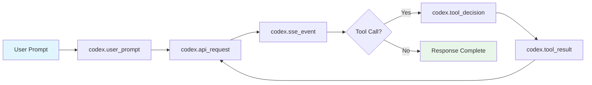
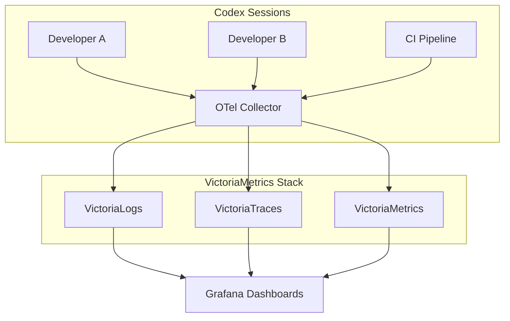

# Codex CLI Observability with OpenTelemetry: Tracing Agent Sessions, Tool Calls, and API Requests


---

As coding agents move from individual experimentation to team-wide adoption, the question shifts from "does it work?" to "how well is it working, and what is it costing us?" Codex CLI ships with built-in OpenTelemetry (OTel) support [^1], giving teams a standards-based pipeline for tracing every API request, tool invocation, and approval decision their agents make. This article covers the full observability stack: configuration, event schema, metrics derivation, backend integration, and enterprise deployment patterns.

## Why Agent Observability Matters

A single developer running Codex interactively can eyeball costs and spot problems. A team of forty developers, each running multiple agent sessions daily — some with sub-agents, some in CI/CD pipelines via `codex exec` — cannot. Without structured telemetry, you are flying blind on:

- **Token spend** — which models, sessions, and developers consume the most tokens
- **Tool approval patterns** — how often agents request dangerous operations, and whether your policy configuration is too permissive or too restrictive
- **API reliability** — retry rates, error distributions, and latency percentiles
- **Session behaviour** — context compaction frequency, conversation length distributions, and sub-agent delegation patterns

OpenTelemetry provides the standard plumbing to answer these questions using your existing observability infrastructure [^2].

## The `[otel]` Configuration Block

All telemetry configuration lives in `~/.codex/config.toml` under the `[otel]` section. By default, telemetry is **disabled** — no data leaves your machine until you explicitly opt in [^1].

### Minimal Setup

```toml
[otel]
environment = "production"
exporter = { otlp-http = {
  endpoint = "https://otel-collector.internal:4318/v1/logs",
  protocol = "binary"
}}
```

This sends structured log events over OTLP/HTTP with Protobuf encoding. For gRPC transport:

```toml
[otel]
environment = "production"
exporter = { otlp-grpc = {
  endpoint = "https://otel-collector.internal:4317"
}}
```

### Full Configuration Reference

The `[otel]` block supports three independent exporter channels [^3]:

| Key | Type | Default | Purpose |
|-----|------|---------|---------|
| `environment` | `string` | `"dev"` | Environment tag on all emitted events |
| `exporter` | `none \| otlp-http \| otlp-grpc` | `none` | Log event exporter |
| `trace_exporter` | `none \| otlp-http \| otlp-grpc` | `none` | Distributed trace exporter |
| `metrics_exporter` | `none \| statsig \| otlp-http \| otlp-grpc` | `statsig` | Metrics pipeline exporter |
| `log_user_prompt` | `boolean` | `false` | Include raw prompts in telemetry |

Each exporter variant accepts the same sub-keys:

```toml
[otel.exporter.otlp-http]
endpoint = "https://collector.example.com/v1/logs"
protocol = "binary"                    # or "json"
headers = { "x-api-key" = "${OTLP_TOKEN}" }

[otel.exporter.otlp-http.tls]
ca-certificate = "/etc/ssl/ca.pem"
client-certificate = "/etc/ssl/client.pem"
client-private-key = "/etc/ssl/client-key.pem"
```

The `trace_exporter` block mirrors this structure at `otel.trace_exporter.<variant>` [^3].

### Environment Variable Override

For ephemeral environments and CI pipelines, standard OTel environment variables work alongside the TOML configuration:

```bash
export OTEL_RESOURCE_ATTRIBUTES="env=ci,team.id=platform,department=engineering"
```

Resource attributes are merged with TOML-configured values, enabling team-level segmentation without modifying shared configuration files [^4].

## Event Schema: What Codex Emits

Every OTel event includes a common set of attributes [^1] [^4]:

| Attribute | Description |
|-----------|-------------|
| `service.name` | Always `codex_cli_rs` |
| `app.version` | CLI version (e.g. `0.121.0`) |
| `env` | From `otel.environment` |
| `conversation.id` | Unique session identifier |
| `model` | Active model (e.g. `gpt-5.4`) |
| `terminal.type` | Terminal emulator in use |
| `auth_mode` | Authentication method |
| `session_source` | How the session was initiated |

### Structured Log Events

Codex emits seven distinct event types [^1]:



#### `codex.conversation_starts`

Emitted once per session. Captures the model, reasoning effort level, sandbox mode, approval policy, and connected MCP servers [^1]. This is your baseline for understanding session configuration across the team.

#### `codex.api_request`

Every outbound API call, including retries. Key fields: `attempt` count, HTTP `status`, `duration_ms`, and `error` details [^1]. This is where you detect rate limiting, model availability issues, and latency regressions.

#### `codex.sse_event`

Server-sent event stream processing. On `response.completed` events, includes token counts broken down by category: `input_tokens`, `output_tokens`, `cached_tokens`, and `reasoning_tokens` [^1] [^4]. These four counters are the foundation of cost attribution.

#### `codex.websocket_request` and `codex.websocket_event`

For WebSocket-based transports (WebRTC voice, Realtime API). Captures per-message kind, success/failure, and error details [^1].

#### `codex.user_prompt`

Captures prompt length. Content is **redacted by default** — only emitted when `log_user_prompt = true` [^1]. Enterprise deployments should generally leave this disabled unless operating under explicit data-handling agreements.

#### `codex.tool_decision`

Records every tool approval decision: the tool name, whether it was approved or denied, and critically, whether the decision came from configuration (auto-approved by policy) or from user interaction [^1]. This event is invaluable for tuning approval policies — if 95% of tool decisions are user-approved `shell` commands of the same pattern, you probably need a more permissive rule.

#### `codex.tool_result`

Tool execution outcome: duration, success/failure, and an output snippet [^1]. Correlating tool duration with tool type reveals which operations are bottlenecking your agent sessions.

## Metrics: Counters and Histograms

When the metrics pipeline is enabled, Codex emits counters and duration histograms for API, stream, and tool activity [^1]. Default metadata tags include `auth_mode`, `originator`, `session_source`, `model`, and `app.version`.

Note that the log exporter and the metrics exporter are **independent channels** — you can send logs to one backend and metrics to another [^3]. A common pattern is using the default Statsig metrics exporter for OpenAI's own analytics while routing logs and traces to your internal observability stack.

## Backend Integration Patterns

### Pattern 1: SigNoz Cloud

SigNoz provides a pre-built Codex dashboard template [^5]:

```toml
[otel]
log_user_prompt = false
exporter = { otlp-grpc = {
  endpoint = "https://ingest.eu.signoz.cloud:443",
  headers = { "signoz-ingestion-key" = "${SIGNOZ_KEY}" }
}}
trace_exporter = { otlp-grpc = {
  endpoint = "https://ingest.eu.signoz.cloud:443",
  headers = { "signoz-ingestion-key" = "${SIGNOZ_KEY}" }
}}
```

The SigNoz Sessions tab shows individual sessions with user, model, prompt count, duration, tool calls, token totals, and error counts — expandable to turn-by-turn event timelines [^5].

### Pattern 2: VictoriaMetrics Stack

For self-hosted deployments, the VictoriaMetrics stack accepts OTLP data across three storage engines [^4]:

```toml
[otel]
environment = "production"

[otel.exporter.otlp-http]
endpoint = "http://otel-collector:4318/v1/logs"
protocol = "binary"

[otel.trace_exporter.otlp-http]
endpoint = "http://otel-collector:4318/v1/traces"
protocol = "binary"
```



VictoriaLogs supports LogsQL queries for filtering Codex events — for example, querying all tool denials across the team in the last 24 hours [^4]. Community dashboards are available in the `VictoriaMetrics-Community/vibe-coding-dashboards` repository [^4].

### Pattern 3: Oodle AI-Native Observability

Oodle provides purpose-built AI agent observability, tracking ten metric types including time-to-first-token, end-to-end turn duration, and token usage by category [^6]:

```toml
[otel]
environment = "production"
metrics_exporter = { otlp-http = {
  endpoint = "https://otel.oodle.ai/v1/metrics",
  headers = { "x-api-key" = "${OODLE_KEY}", "x-instance-id" = "${OODLE_INSTANCE}" }
}}
```

Oodle's Sessions tab reconstructs full conversation timelines grouped by `conversation.id`, showing the interleaving of API calls, tool executions, and approval decisions [^6].

## Enterprise Deployment: Team-Wide Configuration

### Managed Configuration Distribution

Use the system-level config at `/etc/codex/config.toml` to enforce telemetry across all developers in an organisation [^3]:

```toml
# /etc/codex/config.toml — distributed via MDM or Ansible
[otel]
environment = "production"
log_user_prompt = false

[otel.exporter.otlp-grpc]
endpoint = "https://otel-gateway.corp.internal:4317"
headers = { "x-team-token" = "${CODEX_OTEL_TOKEN}" }

[otel.trace_exporter.otlp-grpc]
endpoint = "https://otel-gateway.corp.internal:4317"
headers = { "x-team-token" = "${CODEX_OTEL_TOKEN}" }
```

Because system config has the lowest precedence [^3], developers can layer personal overrides (e.g. `environment = "dev"`) without disabling the enterprise telemetry pipeline.

### Profile-Scoped Telemetry

Different profiles can route to different backends:

```toml
[profiles.ci]
model = "gpt-5.4-mini"

[profiles.ci.otel]
environment = "ci"
exporter = { otlp-http = {
  endpoint = "https://ci-collector.internal:4318/v1/logs"
}}
```

This keeps CI pipeline telemetry separate from interactive developer sessions, reducing noise in both directions.

### Cost Attribution with Resource Attributes

Combine `OTEL_RESOURCE_ATTRIBUTES` with your collector's routing rules to attribute costs per team, project, or cost centre:

```bash
# Set in developer shell profile or CI environment
export OTEL_RESOURCE_ATTRIBUTES="team.id=platform,project=api-gateway,cost_centre=CC-4521"
```

Then use your backend's query language to aggregate token counts by `team.id` or `cost_centre` — the `codex.sse_event` token fields provide the raw data [^4].

## Security Considerations

- **Prompt redaction**: `log_user_prompt` defaults to `false` for good reason — prompts may contain proprietary code, credentials, or sensitive business logic [^1]. Enable it only in controlled environments with appropriate data-handling agreements.
- **mTLS**: Both exporter variants support full mTLS via `tls.ca-certificate`, `tls.client-certificate`, and `tls.client-private-key` [^3]. Use these in zero-trust environments rather than relying solely on header-based authentication.
- **Tool output snippets**: `codex.tool_result` includes output snippets that could contain secrets. Ensure your OTel collector pipeline includes scrubbing processors before forwarding to shared backends.
- **Async flush**: Exporters operate asynchronously and flush on shutdown [^1], so short-lived `codex exec` sessions in CI should allow a brief grace period for final event delivery.

## What's Missing (and What's Coming)

The current OTel implementation has notable gaps:

- **No native metrics export to OTLP** ⚠️ — Codex exports logs and traces natively, but metrics currently default to Statsig. You can configure `metrics_exporter` for OTLP, but the metric catalogue is less mature than the event catalogue [^3] [^4].
- **No sub-agent correlation** ⚠️ — multi-agent v2 sessions spawn child agents, but trace context propagation between parent and child agent sessions is not yet implemented. You can correlate manually via `conversation.id` patterns.
- **No cost fields on events** ⚠️ — token counts are emitted but not multiplied by per-model pricing. Cost calculation must happen in your analytics layer.

The guardian review system (v0.121.0) already emits `review_id` identifiers and timeout events [^7], suggesting that governance telemetry will deepen in future releases. The analytics schema PR (#17055) points toward a more structured metrics catalogue.

## Citations

[^1]: OpenAI, "Advanced Configuration — Codex," [https://developers.openai.com/codex/config-advanced](https://developers.openai.com/codex/config-advanced)
[^2]: OpenTelemetry, "What is OpenTelemetry?" [https://opentelemetry.io/docs/what-is-opentelemetry/](https://opentelemetry.io/docs/what-is-opentelemetry/)
[^3]: OpenAI, "Configuration Reference — Codex," [https://developers.openai.com/codex/config-reference](https://developers.openai.com/codex/config-reference)
[^4]: VictoriaMetrics, "Vibe coding tools observability with VictoriaMetrics Stack and OpenTelemetry," [https://victoriametrics.com/blog/vibe-coding-observability/](https://victoriametrics.com/blog/vibe-coding-observability/)
[^5]: SigNoz, "OpenAI Codex Observability & Monitoring with OpenTelemetry," [https://signoz.io/docs/codex-monitoring/](https://signoz.io/docs/codex-monitoring/)
[^6]: Oodle, "OpenAI Codex — AI Agent Observability," [https://docs.oodle.ai/ai-agent-observability/codex](https://docs.oodle.ai/ai-agent-observability/codex)
[^7]: OpenAI, "Codex CLI Changelog," [https://developers.openai.com/codex/changelog](https://developers.openai.com/codex/changelog)
