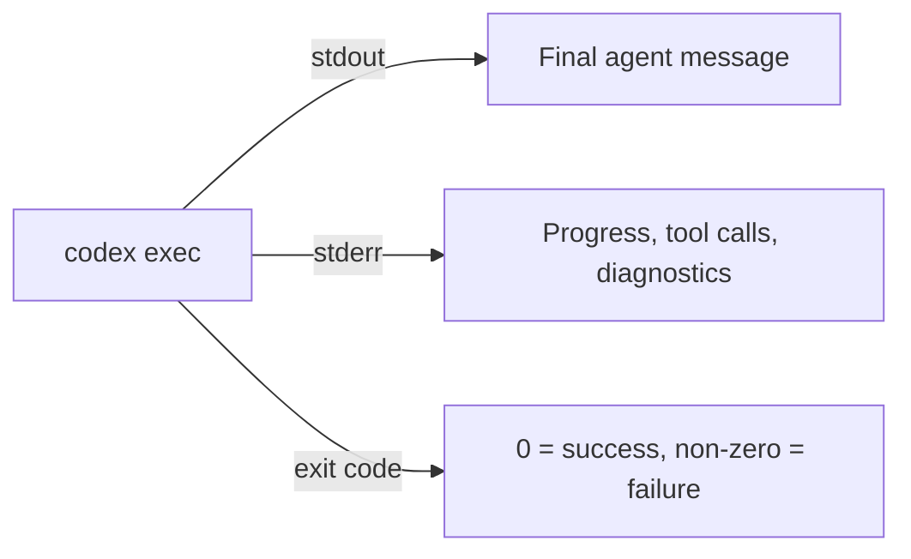

# Codex Exec as a Unix Citizen: Stdin Piping, Structured Output, and Shell Composition


---

The Unix philosophy — small tools, text streams, composable pipelines — has shaped how developers think about automation for over fifty years. With the prompt-plus-stdin workflow landing in v0.118.0 (PR #15917, merged 28 March 2026)[^1], `codex exec` now fits cleanly into that tradition. This article covers the three capabilities that make it work: stdin piping, structured JSON output, and shell composition patterns that chain Codex into existing toolchains.

## The Prompt-Plus-Stdin Model

Before PR #15917, `codex exec` accepted either a positional prompt argument or piped stdin — not both simultaneously[^1]. That limitation forced awkward workarounds: writing prompts to temporary files, or concatenating instructions and data into a single stdin blob the model had to parse.

The fix is elegant. When `codex exec` receives both a positional prompt and piped stdin, the prompt becomes the instruction and stdin is wrapped in `<stdin>...</stdin>` tags as structured context[^2]. Two invocation patterns now cover every use case:

### Pattern 1: Prompt-Plus-Stdin

Pipe data while providing an explicit instruction:

```bash
npm test 2>&1 | codex exec "summarise the failing tests and propose the smallest likely fix"
```

The positional argument is the instruction; piped content is appended as context. This is the pattern you will reach for most often.

### Pattern 2: Stdin-Only (Full Prompt from Pipe)

When the piped content _is_ the prompt, use the `-` sentinel or omit the prompt argument entirely:

```bash
echo "Refactor the auth module to use dependency injection" | codex exec -
```

Backward compatibility is preserved: if no positional argument is supplied and stdin is a pipe, Codex treats stdin as the full prompt, exactly as it did before v0.118.0[^1].

## Stdout, Stderr, and Exit Codes

`codex exec` follows the Unix convention of separating data from diagnostics[^3]. Understanding this separation is essential for shell composition:



- **stdout** carries only the final agent message — the text you want to capture or pipe downstream[^3].
- **stderr** streams live progress: tool invocations, approval prompts, model reasoning. Visible in the terminal but invisible to downstream pipes.
- **Exit codes** map to pipeline semantics: zero for success, non-zero for failures including API errors, sandbox violations, and required-MCP-server initialisation failures[^3].

This means `codex exec "summarise this repo" > summary.txt` captures a clean summary file while progress streams to the terminal. No post-processing needed.

## Structured Output with `--output-schema`

Free-text output works for human consumption but breaks automation. The `--output-schema` flag accepts a JSON Schema file and constrains the final response to conform to it[^4]:

```bash
codex exec "find security issues in the codebase" \
  --output-schema ./analysis-schema.json \
  -o ./analysis.json
```

Where `analysis-schema.json` defines the shape:

```json
{
  "type": "object",
  "properties": {
    "summary": { "type": "string" },
    "issues": {
      "type": "array",
      "items": {
        "type": "object",
        "properties": {
          "file": { "type": "string" },
          "severity": { "enum": ["critical", "high", "medium", "low"] },
          "description": { "type": "string" },
          "suggested_fix": { "type": "string" }
        },
        "required": ["file", "severity", "description"]
      }
    }
  },
  "required": ["summary", "issues"]
}
```

The `-o` flag writes the final message to a file, but you can equally pipe it to `jq` for further processing. The output is valid JSON — no markdown fences, no preamble[^4].

### Current Limitation

`--output-schema` cannot yet be combined with `codex exec resume` (Issue #14343)[^5]. If your pipeline resumes a session, you will need to validate the output shape yourself.

## JSON Lines Event Stream

The `--json` flag replaces the human-readable progress display with a newline-delimited JSON (JSONL) event stream on stdout[^3]. Each line is a self-contained JSON object with a `type` field:

```bash
codex exec --json "refactor the auth module" > events.jsonl
```

Key event types include:

| Event Type | Contents |
|---|---|
| `thread.started` | Session ID, model, configuration |
| `turn.started` | Turn index, prompt text |
| `item.started` | Tool call begin (name, arguments) |
| `item.completed` | Tool result or agent message |
| `turn.completed` | Turn summary, token counts |

Extract just the final agent message with `jq`:

```bash
codex exec --json "summarise the repo" \
  | jq -r 'select(.type=="item.completed" and .item.type=="agent_message") | .item.text'
```

This is particularly powerful in CI/CD where you need both the machine-readable event log for auditing and a human-readable summary for pull request comments[^6].

## Shell Composition Patterns

With stdin piping, structured output, and clean stdout/stderr separation, `codex exec` composes naturally with standard Unix tools. Here are five production-tested patterns.

### 1. Log Analysis Pipeline

Pipe application logs through Codex for root-cause analysis:

```bash
tail -n 200 /var/log/app/error.log \
  | codex exec "identify the likely root cause, cite the most important errors, and suggest three debugging steps"
```

The 200-line tail keeps context within token limits while giving the model enough signal to reason about the failure[^2].

### 2. Test Failure Triage

Chain test output directly into Codex for automated triage:

```bash
pytest --tb=short 2>&1 \
  | codex exec --output-schema ./test-triage-schema.json \
    "classify each failing test as regression, flaky, or new-failure; suggest the most likely fix for regressions" \
  -o ./triage.json
```

Downstream tooling can parse `triage.json` to auto-label GitHub issues or post Slack summaries[^4].

### 3. API Response Transformation

Use Codex as an intelligent `jq` for complex transformations:

```bash
curl -s https://api.example.com/v2/inventory \
  | codex exec "extract all items with stock below 10, format as a CSV with columns: id, name, stock, reorder_url"
```

The output streams directly to stdout, ready for redirection to a file or further piping[^2].

### 4. Git Diff Analysis

Analyse staged changes before committing:

```bash
git diff --cached \
  | codex exec --output-schema ./review-schema.json \
    "review this diff for bugs, security issues, and style violations" \
  -o ./review.json
```

This slots into a `pre-commit` hook. If `review.json` contains critical findings, the hook exits non-zero to block the commit.

### 5. Multi-Stage Pipeline

Chain multiple Codex invocations for complex workflows:

```bash
# Stage 1: Extract requirements from a spec
cat SPEC.md \
  | codex exec "extract testable requirements as a numbered list" \
  > requirements.txt

# Stage 2: Generate test stubs from requirements
cat requirements.txt \
  | codex exec --full-auto --sandbox workspace-write \
    "generate pytest test stubs for each requirement in tests/test_spec.py"
```

Each stage is a separate `codex exec` invocation with its own sandbox policy — the first is read-only (default), the second writes to the workspace[^3].

## Automation Flags Reference

The flags that matter most for pipeline integration:

```toml
# Equivalent config.toml settings for CI profiles
[profiles.ci]
model = "gpt-5.4-mini"
approval_mode = "full-auto"
sandbox = "workspace-write"
```

| Flag | Purpose | Pipeline Use |
|---|---|---|
| `--ephemeral` | Skip session persistence | Disposable CI jobs |
| `--full-auto` | No approval prompts | Unattended execution |
| `--sandbox <mode>` | Permission boundary | `read-only` for analysis, `workspace-write` for generation |
| `--json` | JSONL event stream | Audit logs, event processing |
| `--output-schema <path>` | Constrained JSON output | Downstream automation |
| `-o <path>` | Write final message to file | Artifact capture |
| `--skip-git-repo-check` | Run outside Git repos | Ad-hoc scripting |
| `-c key=value` | Inline config overrides | Per-job tuning |

## CI/CD Integration: GitHub Actions Example

A practical GitHub Actions workflow that uses `codex exec` as a pipeline stage:


```yaml
jobs:
  security-scan:
    runs-on: ubuntu-latest
    steps:
      - uses: actions/checkout@v4
      - name: Run Codex security analysis
        env:
          CODEX_API_KEY: ${{ secrets.CODEX_API_KEY }}
        run: |
          codex exec --full-auto --ephemeral \
            --output-schema .codex/security-schema.json \
            "scan for security vulnerabilities, focusing on injection risks and auth bypass" \
            -o security-report.json
      - name: Check for critical findings
        run: |
          CRITICAL=$(jq '[.issues[] | select(.severity=="critical")] | length' security-report.json)
          if [ "$CRITICAL" -gt 0 ]; then
            echo "::error::Found $CRITICAL critical security issues"
            exit 1
          fi
```


The `--ephemeral` flag avoids cluttering CI runners with session rollout files[^3]. The `CODEX_API_KEY` environment variable handles authentication without interactive sign-in[^7].

## Session Resume in Pipelines

For multi-stage pipelines where context must persist across steps, `codex exec resume` carries the full conversation forward[^3]:

```bash
# Stage 1: Analyse
codex exec --json "analyse the codebase architecture" > stage1.jsonl
SESSION_ID=$(jq -r 'select(.type=="thread.started") | .session_id' stage1.jsonl)

# Stage 2: Act on the analysis
codex exec resume "$SESSION_ID" --full-auto \
  "based on your analysis, refactor the three highest-priority modules"
```

The resumed session retains the model's understanding of the codebase from stage 1, avoiding redundant file reads and context rebuilding[^3].

## Performance Considerations

When building pipelines around `codex exec`, keep these constraints in mind:

- **Token budget**: Piped stdin counts against the context window. For large inputs, truncate or summarise before piping — the `tail -n 200` pattern is not arbitrary[^2].
- **Cold start**: Each `codex exec` invocation starts a fresh session (unless resuming). MCP server initialisation adds latency; use `--ephemeral` and avoid unnecessary MCP servers in CI profiles.
- **Model selection**: Use `--model gpt-5.4-mini` or `gpt-5.3-codex-spark` for high-throughput pipeline stages where speed matters more than reasoning depth[^8]. Reserve `gpt-5.4` for stages requiring complex analysis.
- **Cost**: Each pipeline stage is a separate API call. Structured output schemas reduce wasted tokens on formatting but do not reduce reasoning tokens.

## Comparison with Claude Code

Claude Code's `claude -p` offers similar pipeline semantics — stdin piping, stdout capture, and `--output-format json` for structured output[^9]. The key differences:

| Capability | `codex exec` | `claude -p` |
|---|---|---|
| Stdin piping | v0.118.0+ (PR #15917) | Supported since launch |
| Structured output | `--output-schema` (JSON Schema file) | `--output-format json` (model-directed) |
| Event stream | `--json` (JSONL) | `--verbose` (streaming markdown) |
| Session resume | `codex exec resume` | `claude -p --continue` |
| Sandbox modes | `read-only` / `workspace-write` / `danger-full-access` | Permission-based approval |

Codex's schema-file approach gives tighter control over output shape; Claude Code's approach is more flexible but less predictable for automation[^9].

## Citations

[^1]: [Support Codex CLI stdin piping for `codex exec` — PR #15917](https://github.com/openai/codex/pull/15917), Joe Liccini, merged 28 March 2026.
[^2]: [Non-interactive mode — Codex CLI Documentation](https://developers.openai.com/codex/noninteractive), OpenAI, accessed April 2026.
[^3]: [Command line options — Codex CLI Reference](https://developers.openai.com/codex/cli/reference), OpenAI, accessed April 2026.
[^4]: [Structured output with `--output-schema` — Codex CLI Features](https://developers.openai.com/codex/cli/features), OpenAI, accessed April 2026.
[^5]: [Add `--output-schema` support to `codex exec resume` — Issue #14343](https://github.com/openai/codex/issues/14343), openai/codex, open.
[^6]: [Automating Code Quality and Security Fixes with Codex CLI on GitLab — OpenAI Cookbook](https://cookbook.openai.com/examples/codex/secure_quality_gitlab), OpenAI, 2026.
[^7]: [Authentication — Codex CLI Documentation](https://developers.openai.com/codex/auth), OpenAI, accessed April 2026.
[^8]: [Model selection — Codex CLI Documentation](https://developers.openai.com/codex/cli), OpenAI, accessed April 2026.
[^9]: [Claude Code CLI usage — Anthropic Documentation](https://docs.anthropic.com/en/docs/claude-code), Anthropic, accessed April 2026.
