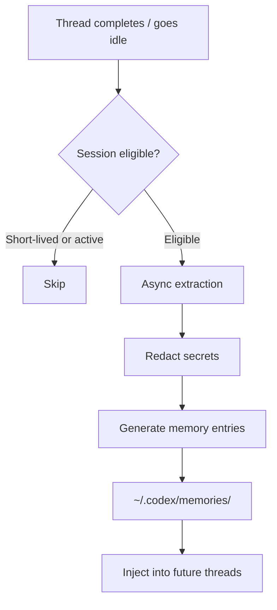
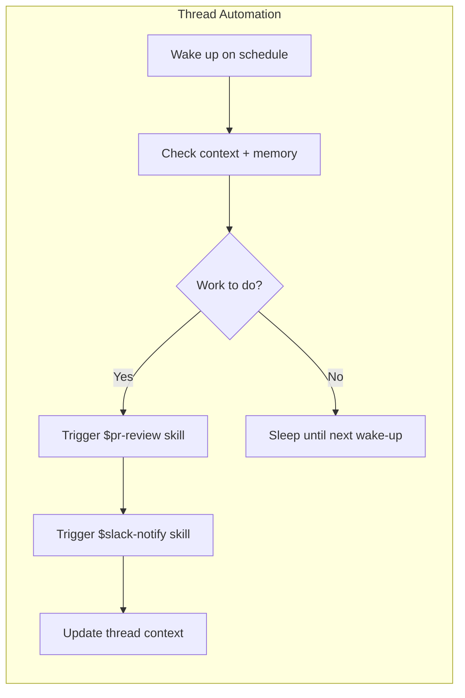

# From Reactive to Proactive: How Codex Memory + Thread Automations Create Self-Directing Agents


---

For most of its life, Codex CLI has been a sophisticated executor: you tell it what to do, and it does it well. Platform release 26.415 and CLI v0.121.0 change that dynamic fundamentally. With proactive memory, context-aware suggestions, and thread automations, Codex agents can now identify work, propose next steps, and execute recurring tasks without human initiation[^1]. This article examines the mechanics behind each feature and how they combine to create self-directing agent workflows.

## The Shift from Reactive to Proactive

Thibault Sottiaux, head of Codex at OpenAI, framed the strategic intent clearly in a recent press briefing: "We're building the super app out in the open. This release is about developers. In the future, we will broaden it up to a wider audience"[^2]. The ambition is a unified workspace — ChatGPT, Codex, and Atlas browser merged into a single context-aware environment where agents don't just respond to prompts but actively surface work[^3].

The practical implication: Codex can now propose useful follow-ups when you start a new session, drawing on project context, connected plugins, and accumulated memory to suggest where to pick up[^4]. Rather than the developer maintaining a mental model of outstanding tasks, the agent does it.

## How Codex Memories Work

### Storage and Generation

Memories are stored locally under `~/.codex/memories/` (configurable via `CODEX_HOME`). The system maintains summaries, durable entries, recent inputs, and supporting evidence from prior threads as generated state files[^5]. After a thread becomes sufficiently idle, Codex asynchronously processes eligible sessions to extract memory entries. Short-lived or still-active sessions are skipped to avoid capturing incomplete work[^5].



### Configuration

Enable memories in `config.toml` under the `[features]` section:

```toml
[features]
memories = true

[memories]
generate_memories = true    # New threads become memory inputs
use_memories = true          # Existing memories inject into future sessions
extract_model = "o4-mini"    # Model for per-thread extraction
consolidation_model = "o3"   # Model for global consolidation
```

The `/memories` slash command within the TUI or app provides per-thread control — selectively enabling or disabling memory generation and retrieval for individual sessions[^5].

### What Gets Remembered

Memories carry stable preferences, project conventions, and recurring work patterns into future threads[^1]. Crucially, secrets are automatically redacted from generated memory fields[^5]. The system is designed as a supplementary local recall layer — mandatory team guidelines should remain in `AGENTS.md` or checked-in documentation[^5].

## Thread Automations: Heartbeat-Style Recurring Agents

Thread automations are the scheduling primitive that makes proactive agents possible. Unlike standalone automations that start fresh each run, thread automations are heartbeat-style recurring wake-up calls attached to the current thread, preserving full conversation context across executions[^6].

### Scheduling Options

Thread automations support three scheduling modes[^6]:

| Mode | Use Case | Example |
|------|----------|---------|
| **Minute-based intervals** | Active follow-up loops | Check build status every 5 minutes |
| **Daily schedules** | Regular check-ins | Morning standup summary at 09:00 |
| **Custom cron syntax** | Flexible cadences | Every weekday at market close |

### Writing Durable Prompts

The documentation emphasises that thread automation prompts must be *durable* — they should describe what Codex should do each time the thread wakes up, how to decide whether there is something important to report, and when to stop or ask for input[^6]. A poorly written prompt results in noise; a well-crafted one creates autonomous value.

Example of a durable automation prompt:

```
Check the status of open PRs in this repository. If any PR has new review
comments since the last check, summarise the feedback and suggest responses.
If all PRs are approved, report that and stop the automation. If a PR has
been open for more than 48 hours without review, flag it for escalation.
```

### Skill Integration

Thread automations can trigger skills using `$skill-name` syntax, enabling complex automation sequences without additional configuration[^6]. This means a single thread automation can orchestrate PR checks, Slack notifications, and code analysis by chaining skills together.



## Combining Memory and Automations: Self-Directing Patterns

The real power emerges when memory and thread automations work together. Here are three patterns for enterprise teams.

### Pattern 1: Autonomous Backlog Grooming

A thread automation runs daily, querying the project's issue tracker via an MCP plugin. Memories retain knowledge of past triage decisions, team preferences, and recurring issue categories. Over successive runs, the agent learns which issues the team typically prioritises and can pre-label, estimate, and suggest sprint assignments without explicit instruction.

### Pattern 2: Recurring Maintenance Agents

Set up a weekly thread automation that runs the test suite, checks dependency freshness, and reviews security advisories. Memory accumulates knowledge of which dependencies the team has previously decided to pin, which test failures are known flaky, and what the team's upgrade cadence looks like. Each run produces a more targeted report than the last.

### Pattern 3: Context-Aware Morning Briefings

Platform 26.415 introduced context-aware suggestions that help developers pick up relevant follow-ups when they start or return to Codex[^1]. Combined with memories of ongoing work streams and a morning thread automation, Codex can greet you with a prioritised task list drawn from GitHub notifications, Slack threads, and in-progress branches — all without you asking.

## Comparison with Claude Code's Memory Approach

The architectural differences between Codex and Claude Code memory systems reflect fundamentally different design philosophies:

| Aspect | Codex | Claude Code |
|--------|-------|-------------|
| **Storage** | `~/.codex/memories/` — auto-generated state files | `~/.claude/projects/<project>/memory/` — MEMORY.md + topic files |
| **Generation** | Async extraction after thread idle | Auto-saved during sessions |
| **Retrieval** | Model-driven injection into new threads | Grep-based keyword matching[^7] |
| **Cross-session** | Proactive — suggests work on session start | Passive — available when queried |
| **Portability** | Local, no export protocol | Local, no export protocol[^7] |
| **Consolidation** | Dedicated consolidation model pass | Manual via MEMORY.md editing |

Claude Code's grep-based retrieval works well with dozens of notes but can degrade after months of accumulated history when exact keyword recall becomes difficult[^7]. Codex's model-driven approach trades compute cost for more semantically aware retrieval, and crucially, enables the proactive suggestion surface that Claude Code currently lacks.

## Enterprise Implications

### The Agentic Pod Model

For teams running agentic pods — multiple Codex agents working in parallel across isolated worktrees — proactive memory creates a new dynamic. Pod agents can surface their own work items based on accumulated project knowledge, shifting the developer's role from task dispatcher to reviewer[^3]. The multi-agent parallel execution model, combined with thread automations, means pods can self-organise recurring maintenance work.

### Governance Considerations

Proactive agents raise governance questions that teams should address early:

1. **Memory scope**: Memories are local by default. Teams sharing a codebase need `AGENTS.md` for authoritative guidelines, with memories supplementing individual workflow preferences[^5].
2. **Automation boundaries**: Thread automations should have explicit stop conditions to prevent runaway execution.
3. **Secret handling**: While memory generation automatically redacts secrets, teams should audit `~/.codex/memories/` periodically, particularly in shared environments[^5].
4. **EU/UK availability**: Computer use and memory features face delayed rollout in the EU and UK[^2]. ⚠️ The exact timeline for EU/UK memory availability has not been publicly confirmed.

## Practical Getting Started

To begin experimenting with self-directing agent workflows:

```bash
# Enable memories in your config
cat >> ~/.codex/config.toml << 'EOF'
[features]
memories = true

[memories]
generate_memories = true
use_memories = true
EOF

# Start a thread and work normally — memories generate automatically
codex

# Create a thread automation from within a session
# Use the app UI or /automation command to set schedule
```

Then write durable prompts for your automations, test them manually first, and iterate. The most effective self-directing agents emerge from well-scoped automation prompts paired with several sessions' worth of accumulated memory.

## What Comes Next

Sottiaux's vision of the "super app built in the open" implies this is early innings[^2]. The current memory system is local and individual; team-shared memory, cross-agent memory protocols, and more sophisticated consolidation strategies are natural next steps. Thread automations will likely gain richer triggering conditions beyond time-based schedules — event-driven wake-ups from webhook sources, for instance.

For now, the combination of proactive memory and thread automations represents the most significant architectural shift in Codex's interaction model since the move from cloud-only to CLI. Agents that tell you what to do, rather than waiting to be told, change the developer's relationship with their tools entirely.

## Citations

[^1]: OpenAI, "Codex Changelog — Version 26.415," *OpenAI Developers*, April 2026. [https://developers.openai.com/codex/changelog](https://developers.openai.com/codex/changelog)

[^2]: K. Notopoulos, "OpenAI's latest Codex update builds the groundwork for its upcoming super app," *Engadget*, April 2026. [https://www.engadget.com/ai/openais-latest-codex-update-builds-the-groundwork-for-its-upcoming-super-app-170000019.html](https://www.engadget.com/ai/openais-latest-codex-update-builds-the-groundwork-for-its-upcoming-super-app-170000019.html)

[^3]: "Exploring OpenAI Codex: Features of the 2026 SuperApp," *Digital Strategy AI*, April 2026. [https://digitalstrategy-ai.com/2026/04/14/exploring-openai-codex-features/](https://digitalstrategy-ai.com/2026/04/14/exploring-openai-codex-features/)

[^4]: "OpenAI's superapp is taking shape as Codex goes beyond coding," *The New Stack*, 2026. [https://thenewstack.io/openais-superapp-takes-shape/](https://thenewstack.io/openais-superapp-takes-shape/)

[^5]: OpenAI, "Memories — Codex," *OpenAI Developers*, 2026. [https://developers.openai.com/codex/memories](https://developers.openai.com/codex/memories)

[^6]: OpenAI, "Automations — Codex App," *OpenAI Developers*, 2026. [https://developers.openai.com/codex/app/automations](https://developers.openai.com/codex/app/automations)

[^7]: "Claude Code Memory System Explained: 4 Layers, 5 Limits, and a Fix," *Milvus Blog*, 2026. [https://milvus.io/blog/claude-code-memory-memsearch.md](https://milvus.io/blog/claude-code-memory-memsearch.md)
