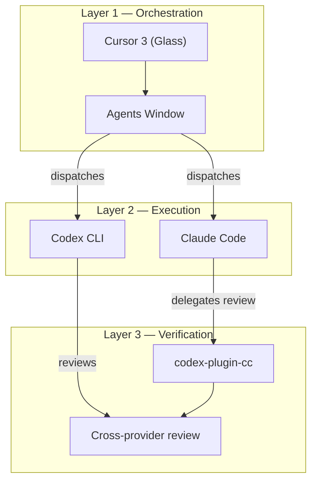
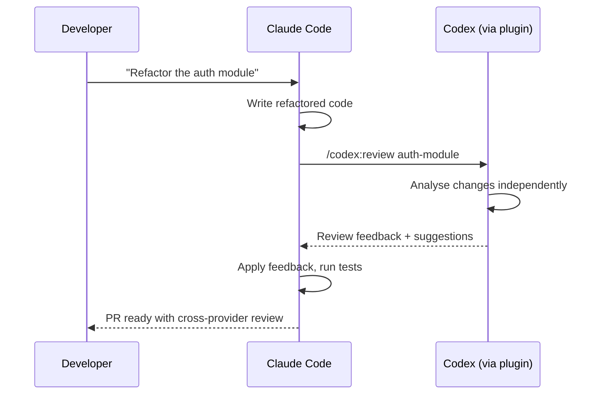

# The Composable AI Coding Stack: How Cursor, Claude Code, and Codex Became Three Layers


---

Nobody planned this architecture. Cursor, Claude Code, and Codex CLI were built by three separate companies with three separate business models, yet by April 2026 they have settled into a composable three-layer stack that senior engineers are adopting as a single workflow. The layers — orchestration, execution, and verification — emerged from market forces, protocol convergence, and one quietly published GitHub repository.

This article maps the stack, examines the evidence for each layer, and considers what the "bottleneck is orchestration, not generation"[^1] thesis means for how we structure engineering teams.

## The Three Layers



The model is not a rigid taxonomy — tools bleed across boundaries — but it captures the dominant usage pattern reported by teams running all three together[^1].

## Layer 1: Orchestration — Cursor 3

On 2 April 2026, Cursor shipped version 3 under the internal codename "Glass"[^2]. The release replaced the Composer chat pane with a dedicated **Agents Window**: a persistent orchestration surface where developers dispatch, monitor, and coordinate multiple AI agents simultaneously[^3].

Key architectural decisions in Glass:

- **Parallel agent execution.** Pro and Business plans include compute budgets for running cloud agents in parallel. Local agents, worktree agents, and remote SSH agents all appear in a unified sidebar[^2].
- **Multi-environment mobility.** An agent session can be moved from cloud to local mid-task, preserving context[^3].
- **Model-agnostic dispatch.** The orchestration layer is decoupled from the execution model — developers choose which LLM backs each agent[^2].

Glass positions Cursor not as a code generator but as an **agent harness**. The three primitives of Cursor's agent model — Instructions, Tools, and Model — map directly to the harness engineering pattern: system prompt, tool surface, and backend model are configured independently[^4].

```toml
# .cursor/agents.toml — hypothetical agent configuration
[agent.refactor]
model = "claude-sonnet-4-20250514"
tools = ["file_edit", "codebase_search", "terminal"]
instructions = ".cursor/rules/refactor.md"

[agent.review]
model = "codex-gpt-5.4"
tools = ["file_read", "codebase_search"]
instructions = ".cursor/rules/review.md"
```

The shift is significant: Cursor's competitive moat is no longer autocomplete quality but **orchestration UX** — the ability to keep a developer in flow while five agents work in parallel across repositories.

## Layer 2: Execution — Claude Code and Codex CLI

The execution layer is where tokens become commits. Claude Code and Codex CLI both operate as terminal-native agents that read codebases, run tests, and open pull requests, but they occupy different niches.

### Claude Code by the Numbers

SemiAnalysis reported in February 2026 that approximately 4% of all public GitHub commits were authored by Claude Code[^5]. At the current trajectory, that figure is projected to exceed 20% by end of year[^5]. A Pragmatic Engineer survey of 906 software engineers (February 2026) gave Claude Code a 46% "most loved" rating, the highest of any AI coding tool[^1].

Claude Code's execution strengths centre on long-context reasoning. Practitioners report it handles nuanced refactoring across large context windows more reliably than alternatives[^6]. Its terminal-native design — no IDE dependency — makes it composable by default.

### Codex CLI by the Numbers

Codex CLI surpassed 3 million weekly active users in April 2026, up from 2 million just one month prior — a 50% jump[^7]. The open-source repository has accumulated 67,000 GitHub stars and over 400 contributors[^1].

Codex CLI's execution strengths lean towards parallelisable throughput. Its cloud sandbox model makes it well suited to batch operations: running test suites across multiple configurations, processing large refactoring jobs, or handling multi-file migrations[^6].

### The Plugin That Broke the Wall

On 30 March 2026, OpenAI published `codex-plugin-cc` on GitHub[^8]. The plugin installs as an MCP server inside Claude Code, exposing Codex CLI's capabilities as tools that Claude Code can invoke. It provides two categories of functionality: **review commands** (use one model to write, another to challenge) and **delegation commands** (`/codex:rescue`, `/codex:status`, `/codex:result`, `/codex:cancel`) for managing background Codex tasks from within a Claude Code session[^9].

The strategic calculus is clear. Claude Code reached an estimated \$2.5 billion in annualised revenue by early 2026[^9]. Rather than competing for that install base, OpenAI chose to embed inside it — the classic "if you can't beat them, ship a plugin" manoeuvre.

## Layer 3: Verification — Cross-Provider Review

The verification layer is the newest and arguably the most consequential. It addresses the **sycophancy problem**: a single model reviewing its own output tends to agree with itself[^9].

Cross-provider review — where one model writes code and a different provider's model challenges it — is the most promising mitigation strategy yet. The `codex-plugin-cc` plugin operationalises this: Claude writes, Codex reviews (or vice versa), with neither model having an incentive to rubber-stamp the other's work.



This pattern matters because the verification bottleneck is real. Teams using high-adoption multi-agent workflows report 98% more PRs merged but also 91% longer code review times and 154% larger PR sizes[^10]. Code review — not code generation — is now the throughput constraint.

## MCP: The Shared Protocol

None of this composability works without a shared protocol. The Model Context Protocol (MCP) has become the integration bus connecting these layers. OpenAI adopted MCP across ChatGPT in March 2025; Google confirmed Gemini support in April 2025[^1]. By 2026, MCP is the de facto standard for tool registration, permission negotiation, and context sharing between agents[^11].

The `codex-plugin-cc` plugin is itself an MCP server. Cursor's tool system speaks MCP. The protocol's simplicity — JSON-RPC over stdio or HTTP — means any tool author can expose capabilities to any agent in the stack without vendor lock-in.

## What This Means for Engineering Teams

The "bottleneck is orchestration, not generation" thesis has practical implications:

1. **Invest in harness engineering, not prompt engineering.** The highest-leverage work is configuring agent instructions, tool surfaces, and review policies — not crafting individual prompts.

2. **Budget for verification.** If your agents are generating 98% more PRs, your review infrastructure needs to scale proportionally. Cross-provider review is one strategy; structured output schemas and automated test gates are others.

3. **Treat composition as architecture.** The three-layer stack is not an accident — it reflects a genuine separation of concerns. Teams that formalise orchestration, execution, and verification as distinct responsibilities will iterate faster than those treating AI tools as interchangeable.

4. **Watch the orchestration layer.** Cursor owns the UX surface today, but alternatives like `mco` (a neutral orchestration CLI for Claude Code, Codex, and Gemini CLI)[^12] and `takt`[^13] are emerging. The orchestration layer is the next contested ground.

The composable AI coding stack was not designed by committee. It emerged because three companies independently optimised for different constraints, and MCP gave them a lingua franca. The result is something rarer than a platform: a **stack** — layered, substitutable, and greater than the sum of its parts.

---

## Citations

[^1]: "Cursor, Claude Code, and Codex are merging into one AI coding stack nobody planned," The New Stack, April 2026. [https://thenewstack.io/ai-coding-tool-stack/](https://thenewstack.io/ai-coding-tool-stack/)

[^2]: "Meet the new Cursor," Cursor Blog, April 2026. [https://cursor.com/blog/cursor-3](https://cursor.com/blog/cursor-3)

[^3]: "Cursor 3 Launches Unified Workspace for AI Coding Agents," eWEEK, April 2026. [https://www.eweek.com/news/cursor-3-unified-workspace-ai-coding-agents/](https://www.eweek.com/news/cursor-3-unified-workspace-ai-coding-agents/)

[^4]: "Best practices for coding with agents," Cursor Blog, 2026. [https://cursor.com/blog/agent-best-practices](https://cursor.com/blog/agent-best-practices)

[^5]: "Claude Code is the Inflection Point," SemiAnalysis, February 2026. [https://newsletter.semianalysis.com/p/claude-code-is-the-inflection-point](https://newsletter.semianalysis.com/p/claude-code-is-the-inflection-point)

[^6]: "Claude Code vs Cursor: The Real Difference Between Execution AI and Editor AI," Emergent, 2026. [https://emergent.sh/learn/claude-code-vs-cursor](https://emergent.sh/learn/claude-code-vs-cursor)

[^7]: "OpenAI sees Codex users spike to 1.6 million, positions...," Fortune, March 2026. [https://fortune.com/2026/03/04/openai-codex-growth-enterprise-ai-agents/](https://fortune.com/2026/03/04/openai-codex-growth-enterprise-ai-agents/)

[^8]: "openai/codex-plugin-cc," GitHub, March 2026. [https://github.com/openai/codex-plugin-cc](https://github.com/openai/codex-plugin-cc)

[^9]: "When Rivals Collaborate: Installing OpenAI's Codex Plugin in Claude Code," Medium, March 2026. [https://medium.com/@markchen69/when-rivals-collaborate-installing-openais-codex-plugin-in-claude-code-5d3e503ce493](https://medium.com/@markchen69/when-rivals-collaborate-installing-openais-codex-plugin-in-claude-code-5d3e503ce493)

[^10]: "Orchestration era needs intent," Pathmode Blog, 2026. [https://pathmode.io/blog/orchestration-era-needs-intent](https://pathmode.io/blog/orchestration-era-needs-intent)

[^11]: "Introducing Codex Plugin for Claude Code," OpenAI Developer Community, 2026. [https://community.openai.com/t/introducing-codex-plugin-for-claude-code/1378186](https://community.openai.com/t/introducing-codex-plugin-for-claude-code/1378186)

[^12]: "mco — Orchestrate AI coding agents," GitHub, 2026. [https://github.com/mco-org/mco](https://github.com/mco-org/mco)

[^13]: "Orchestrating Codex, Cursor, and Claude Code with takt," Zenn, 2026. [https://zenn.dev/coji/articles/takt-multi-agent-coding-experience](https://zenn.dev/coji/articles/takt-multi-agent-coding-experience)
