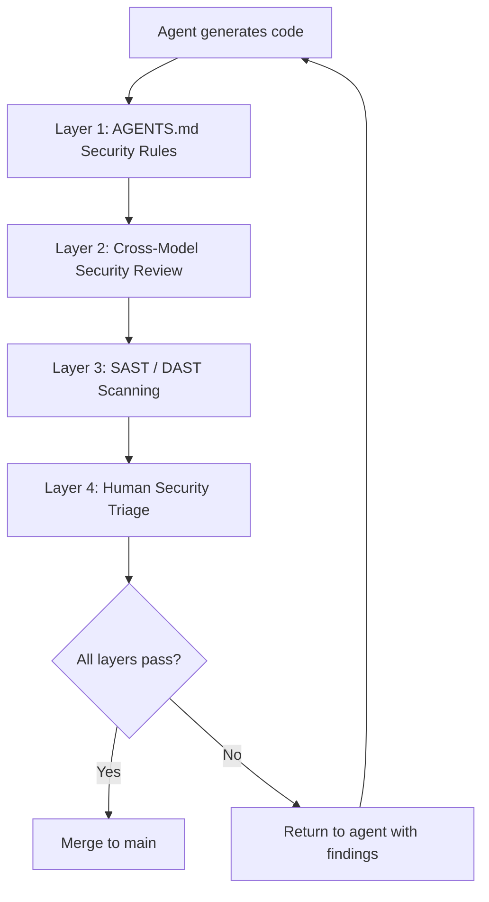
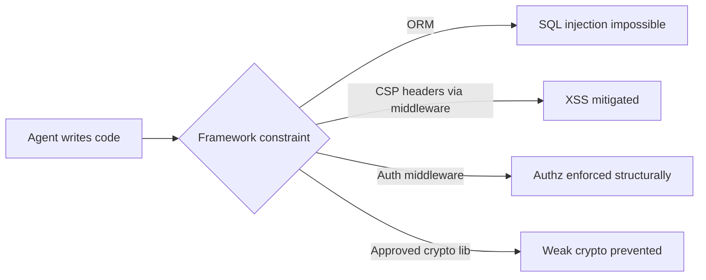

# Cross-Model Security Testing for AI-Generated Code: Building a Defence-in-Depth Pipeline


---

AI coding agents write functional code at impressive speed. They do not, however, write *secure* code at impressive speed. Veracode's Spring 2026 GenAI Code Security Update found the overall security pass rate across 100+ LLMs stuck at approximately 55% — a figure that has barely moved since tracking began in 2024 [^1]. Roughly 45% of AI-generated code ships with OWASP Top 10 vulnerabilities baked in [^2]. Java fares worst, with a 72% failure rate; cross-site scripting defences fail in 86% of generated samples, and log injection appears in 88% [^1].

These are not theoretical numbers. The Cloud Security Alliance reports that by mid-2025, AI-generated code was adding over 10,000 new security findings per month across studied repositories — a tenfold increase from December 2024 [^3]. CVSS 7.0+ vulnerabilities appear 2.5 times more often in AI-generated code than in human-written code [^2].

The answer is not to stop using coding agents. The answer is to build a pipeline that treats every line of agent-generated code as untrusted until proven otherwise — using multiple models, multiple tools, and multiple layers of verification.

## Why Single-Model Review Fails

When the same model (or the same model family) generates code and then reviews it, the review inherits the model's blind spots. Research into feedback-driven security patching (FDSP) demonstrates the issue: GPT-4 can reduce its own residual vulnerability rate from 40.2% to 7.4% with structured self-repair prompts [^4], but it consistently misses the same categories of weakness — business logic flaws, authorisation boundary violations, and time-of-check-to-time-of-use races.

The fundamental problem: secure code and insecure code are often functionally equivalent [^1]. Models optimised for functional correctness have no training signal that distinguishes between the two. A `SELECT` statement with parameterised queries and one with string concatenation both return the same rows.

Cross-model review breaks this symmetry. Different model families have different training corpora, different RLHF reward signals, and different blind spots. A vulnerability that GPT-5.4 introduces might be caught by Claude's security reasoning, and vice versa.

## The Defence-in-Depth Pipeline

A production-grade security pipeline for AI-generated code has four layers. Each layer catches a different class of vulnerability, and no single layer is sufficient alone.



### Layer 1: AGENTS.md Security Checklists

The first line of defence is preventing the agent from generating insecure patterns in the first place. Codex CLI reads `AGENTS.md` files from the repository root, walking the directory tree and concatenating instructions up to the `project_doc_max_bytes` limit (32 KiB by default) [^5]. Claude Code reads `CLAUDE.md` with similar semantics.

A security-focused `AGENTS.md` section might look like this:

```markdown
## Security Rules

- NEVER use string concatenation or interpolation in SQL queries.
  Always use parameterised queries or an ORM query builder.
- NEVER disable CSRF protection, even in API endpoints.
- ALL user input MUST be validated against an allowlist schema
  before processing. Reject-by-default.
- NEVER commit secrets, API keys, or credentials. Use environment
  variables or a secrets manager.
- ALL cryptographic operations MUST use the project's approved
  library (see security/approved-crypto.md). No hand-rolled crypto.
- HTTP responses MUST include Content-Security-Policy,
  X-Content-Type-Options, and Strict-Transport-Security headers.
- Log injection: sanitise all user-controlled data before logging.
  Use structured logging only.
```

These rules are not perfect — they rely on the model's compliance. But they materially reduce the incidence of common vulnerability classes. Think of them as the equivalent of compiler warnings: not a guarantee, but a first filter that catches the obvious issues before heavier tooling runs.

### Layer 2: Cross-Model Security Review

This is the layer most teams skip, and it is arguably the highest-value addition to any AI security pipeline. The pattern: after one model generates code, a *different* model family reviews it specifically for security.

In Codex CLI, this can be implemented using `codex exec` with a structured output schema:

```bash
# Generate code with the primary model
codex --model gpt-5.4 "Implement the payment webhook handler per AGENTS.md"

# Review with a different model via codex exec
git diff HEAD | codex exec \
  --model gpt-5.3-codex \
  --output-schema '{"findings": [{"cwe": "string", "severity": "string", "file": "string", "line": "number", "description": "string", "recommendation": "string"}], "pass": "boolean"}' \
  "You are a security auditor. Review this diff for OWASP Top 10 vulnerabilities, CWE violations, and business logic flaws. Be adversarial. Assume the code is insecure until proven otherwise."
```

For maximum coverage, run reviews across model families:

```bash
#!/usr/bin/env bash
# cross-model-security-review.sh
set -euo pipefail

DIFF=$(git diff --cached)
MODELS=("gpt-5.3-codex" "claude-sonnet-4" "gemini-2.5-pro")
FAILURES=0

for MODEL in "${MODELS[@]}"; do
  RESULT=$(echo "$DIFF" | codex exec \
    --model "$MODEL" \
    --output-schema '{"findings": [], "pass": "boolean"}' \
    "Security audit this diff. Report CWE IDs, severity, and remediation.")

  PASS=$(echo "$RESULT" | jq -r '.pass')
  if [ "$PASS" != "true" ]; then
    echo "❌ $MODEL found security issues:"
    echo "$RESULT" | jq '.findings[]'
    FAILURES=$((FAILURES + 1))
  else
    echo "✅ $MODEL: no issues found"
  fi
done

if [ "$FAILURES" -ge 2 ]; then
  echo "🚨 Majority of reviewers found issues. Blocking merge."
  exit 1
fi
```

The majority-vote approach is deliberate. A single model flagging an issue might be a false positive. Two or more models independently identifying the same vulnerability class is a strong signal.

⚠️ Note: using non-OpenAI models with `codex exec` requires configuring alternative model providers in `config.toml`. The exact provider configuration syntax varies by model vendor.

### Layer 3: SAST and DAST Integration

Cross-model review catches semantic vulnerabilities that pattern-matching tools miss. But static and dynamic analysis tools catch structural issues that LLMs overlook — dependency vulnerabilities, configuration weaknesses, and runtime behaviour.

#### Agentic SAST in 2026

The SAST landscape has shifted towards *agentic* integration. Tools like DryRun Security now expose security insights directly to coding agents via MCP servers, enabling real-time feedback during code generation rather than post-hoc scanning [^6]. Semgrep, Checkmarx, and Snyk all ship MCP integrations or webhook-based agent connectors.

A typical CI pipeline combining agent review with traditional scanning:


```yaml
# .github/workflows/security-pipeline.yml
name: Defence-in-Depth Security
on: [pull_request]

jobs:
  cross-model-review:
    runs-on: ubuntu-latest
    steps:
      - uses: actions/checkout@v4
      - name: Cross-model security review
        run: ./scripts/cross-model-security-review.sh
        env:
          OPENAI_API_KEY: ${{ secrets.OPENAI_API_KEY }}

  sast:
    runs-on: ubuntu-latest
    steps:
      - uses: actions/checkout@v4
      - name: Semgrep SAST
        uses: semgrep/semgrep-action@v1
        with:
          config: p/owasp-top-ten
      - name: Run AccuKnox scan
        uses: accuknox/scan-action@v7.3

  dast:
    runs-on: ubuntu-latest
    needs: [sast]
    steps:
      - name: OWASP ZAP dynamic scan
        uses: owasp/zap-scan-action@v2.12
        with:
          target: ${{ env.STAGING_URL }}

  security-gate:
    runs-on: ubuntu-latest
    needs: [cross-model-review, sast, dast]
    steps:
      - name: Aggregate and gate
        run: |
          echo "All security layers passed. PR eligible for human review."
```


AccuKnox v7.3 reports 92% detection of business logic flaws with 67% fewer false positives than pattern-matching tools [^7]. OWASP ZAP v2.12 catches 85% of API-related vulnerabilities at under 5% false positive rate [^7]. Neither replaces the other — SAST catches what DAST cannot reach (dead code paths, unreachable branches) and DAST catches what SAST cannot reason about (runtime configuration, authentication flows).

#### MCP-Based Real-Time Scanning

For teams using Codex CLI with MCP servers, security scanning can happen *during* code generation rather than after:

```toml
# config.toml
[mcp_servers.security-scanner]
command = "npx"
args = ["@dryrun/security-mcp", "--rules", "owasp-top-10"]
```

This surfaces CWE findings as tool responses within the agent session, allowing the agent to self-correct before committing [^6].

### Layer 4: Human Security Triage

The final layer is irreplaceable. Automated tools — whether LLM-based or traditional — cannot reason about business context, threat models, or organisational risk appetite. A human security reviewer focuses on:

- **Authorisation logic**: Does the code enforce the correct access boundaries?
- **Data flow**: Does sensitive data cross trust boundaries it should not?
- **Threat model alignment**: Does the implementation match the project's threat model?
- **Residual risk acceptance**: Are flagged issues genuine risks or acceptable trade-offs?

Codex Security, which entered research preview in March 2026, automates the *detection* portion of this layer by building project-specific threat models and ranking findings by real-world impact [^8]. But the *decision* — ship, fix, or accept — remains human.

## Framework-First Security Strategy

The most effective long-term defence is not scanning generated code but constraining the code the agent can generate. This means:

1. **Use frameworks that are secure by default.** An ORM that parameterises queries by construction eliminates SQL injection at the framework level, regardless of what the agent writes.
2. **Provide agent-accessible security libraries.** Reference them in `AGENTS.md` so the agent uses the approved crypto, auth, and input validation libraries rather than rolling its own.
3. **Enforce architectural boundaries.** Use Codex CLI's execution policy rules (Starlark-based `prefix_rule()` syntax) to forbid direct database access from API handlers, enforcing the repository layer pattern.



This shifts security left of the agent, making entire vulnerability classes structurally impossible rather than relying on detection after the fact.

## Measuring Pipeline Effectiveness

Track these metrics to evaluate your defence-in-depth pipeline:

| Metric | Target | Source |
|--------|--------|--------|
| Pre-merge vulnerability escape rate | < 5% | SAST/DAST findings in production |
| Cross-model agreement rate | > 70% | Review script output |
| Mean time to remediate (MTTR) | < 4 hours | Issue tracker |
| False positive rate | < 15% | Manual triage feedback |
| AGENTS.md compliance rate | > 90% | Spot-check audits |

Cisco's Project CodeGuard demonstrated a 50% reduction in security flaws through AI-guided development with structured pipelines [^7]. The key insight: each layer of defence contributes incrementally, and the compound effect is what matters.

## Conclusion

AI coding agents are not going away, and neither are the security vulnerabilities they introduce. The 55% security pass rate is not a temporary growing pain — it reflects a fundamental misalignment between training objectives (functional correctness) and security requirements (semantic correctness under adversarial conditions).

The defence-in-depth pipeline — AGENTS.md rules, cross-model review, SAST/DAST scanning, and human triage — does not make AI-generated code perfectly secure. Nothing does. What it does is reduce the probability of a vulnerability reaching production at each layer, turning a 45% vulnerability rate into something manageable.

Start with `AGENTS.md` security rules today. Add cross-model review this week. Wire up SAST/DAST this sprint. The pipeline pays for itself the first time it catches an SQL injection that three layers of AI review missed but Semgrep caught in 200 milliseconds.

---

## Citations

[^1]: Veracode, "Spring 2026 GenAI Code Security Update: Despite Claims, AI Models Are Still Failing Security," April 2026. [https://www.veracode.com/blog/spring-2026-genai-code-security/](https://www.veracode.com/blog/spring-2026-genai-code-security/)

[^2]: SQ Magazine, "AI Coding Security Vulnerability Statistics 2026: Alarming Data," 2026. [https://sqmagazine.co.uk/ai-coding-security-vulnerability-statistics/](https://sqmagazine.co.uk/ai-coding-security-vulnerability-statistics/)

[^3]: Cloud Security Alliance, "Vibe Coding's Security Debt: The AI-Generated CVE Surge," 2026. [https://labs.cloudsecurityalliance.org/research/csa-research-note-ai-generated-code-vulnerability-surge-2026/](https://labs.cloudsecurityalliance.org/research/csa-research-note-ai-generated-code-vulnerability-surge-2026/)

[^4]: arXiv, "Guiding AI to Fix Its Own Flaws: An Empirical Study on LLM-Driven Secure Code Generation," 2025. [https://arxiv.org/html/2506.23034v1](https://arxiv.org/html/2506.23034v1)

[^5]: OpenAI, "Custom instructions with AGENTS.md – Codex Developers," 2026. [https://developers.openai.com/codex/guides/agents-md](https://developers.openai.com/codex/guides/agents-md)

[^6]: DryRun Security, "Top 10 AI SAST Tools for 2026 and How to Enforce Code Policy in Agentic Coding Workflows," 2026. [https://www.dryrun.security/blog/top-ai-sast-tools-2026](https://www.dryrun.security/blog/top-ai-sast-tools-2026)

[^7]: DasRoot, "Secure AI Code Generation in Enterprise Environments," April 2026. [https://dasroot.net/posts/2026/04/secure-ai-code-generation-enterprise/](https://dasroot.net/posts/2026/04/secure-ai-code-generation-enterprise/)

[^8]: OpenAI, "Security – Codex Developers," 2026. [https://developers.openai.com/codex/security](https://developers.openai.com/codex/security)
