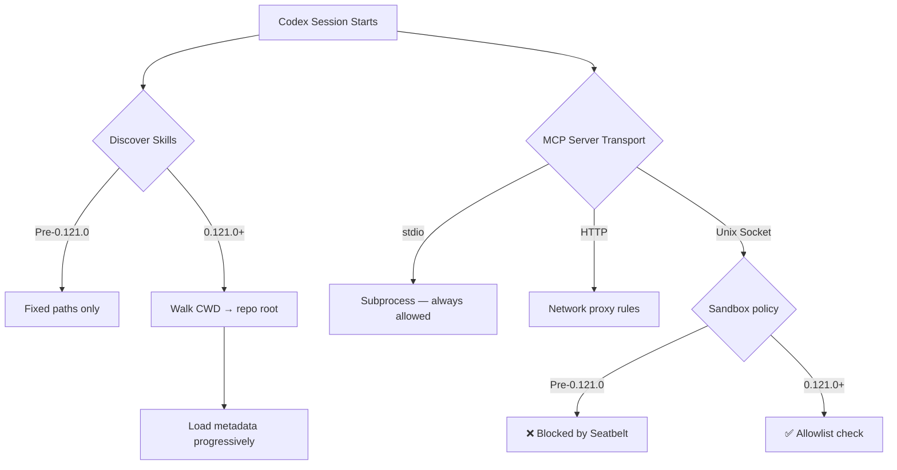
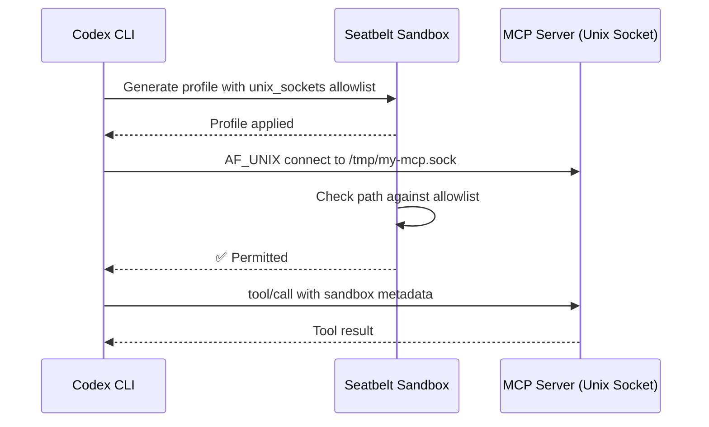

# Filesystem-Aware Skill Loading and Unix Socket Sandbox Allowlists


Version 0.121.0 of Codex CLI, released on 15 April 2026, shipped two complementary changes that significantly improve how skills are discovered and how sandboxed sessions interact with local services. PR #17720 introduced filesystem-aware skill loading[^1], whilst PR #17654 added Unix socket allowlists to the macOS Seatbelt sandbox[^2]. Together, they resolve a class of problems that surfaced as teams began running MCP servers over Unix domain sockets inside sandboxed Codex sessions.

This article examines both changes, explains the architecture behind them, and shows how to configure your environment to take advantage of them.

---

## The Problem: Skills That Vanish and Sockets That Block

Prior to 0.121.0, Codex CLI's skill discovery was path-unaware. The scanner walked a fixed set of directories — `$CODEX_HOME/skills`, `/etc/codex/skills`, and the repository's `.agents/skills` — but did not account for the *filesystem context* of the current session. If you launched Codex from a nested workspace inside a monorepo, skills defined at the repository root's `.agents/skills` were found, but skills in an intermediate directory were silently skipped[^3].

Simultaneously, MCP servers communicating over Unix domain sockets were blocked by the macOS Seatbelt sandbox profile. The sandbox's network policy treated all `AF_UNIX` connect attempts as network operations, denying them unless `network_access` was set to `true` — which defeated the purpose of sandboxing[^4]. Linux users with Landlock + seccomp were partially affected too, though Issue #16910 tracked a separate fix for sandbox-local `AF_UNIX` sockets on that platform[^5].



## Filesystem-Aware Skill Loading

### How Discovery Now Works

PR #17720 changed the skill scanner to perform a bottom-up directory walk from the current working directory to the repository root (detected via `.git`), checking for `.agents/skills` at every level[^1]. This mirrors how Codex already discovers `AGENTS.md` and `AGENTS.override.md` files — hierarchically, with closer scopes taking precedence[^6].

The full resolution order is now:

1. `.agents/skills` in `$CWD`
2. `.agents/skills` in each parent directory up to the repository root
3. `.agents/skills` at the repository root
4. `$CODEX_HOME/skills` (default `~/.codex/skills`), including `.system/` built-ins
5. `/etc/codex/skills` (admin/system-wide)

At each level, Codex reads only frontmatter metadata — `name`, `description`, and optional `agents/openai.yaml` — deferring full instruction loading until the skill is actually invoked[^7]. This progressive disclosure keeps context windows lean even in repositories with dozens of skills.

### AbsolutePathBuf and Path Safety

A companion change in PR #17407 replaced bare `PathBuf` with `AbsolutePathBuf` throughout the skill-loading and `codex_home` modules[^1]. This is a type-level guarantee that every path the skill loader handles has been canonicalised, eliminating a category of bugs where relative paths or symlink cycles could cause duplicate skill registrations or — in edge cases — path traversal outside the repository sandbox.

### Practical Example: Monorepo Skill Organisation

Consider a monorepo with distinct skill sets per service:

```
my-monorepo/
├── .agents/skills/
│   └── shared-lint/
│       └── SKILL.md
├── services/
│   ├── api/
│   │   └── .agents/skills/
│   │       └── api-deploy/
│   │           └── SKILL.md
│   └── web/
│       └── .agents/skills/
│           └── web-test/
│               └── SKILL.md
```

When you run `codex` from `services/api/`, the scanner now finds both `api-deploy` (local) and `shared-lint` (root), but *not* `web-test`. Previously, `api-deploy` would have been invisible because only the root `.agents/skills` was checked.

Symlinked skill folders continue to work — Codex follows symlink targets during scanning[^7]. This lets teams maintain a single canonical skill directory and symlink it into multiple service subtrees without duplication.

### Disabling Unwanted Skills

If a parent directory exposes a skill you want to suppress locally, the existing `config.toml` mechanism still applies:

```toml
[[skills.config]]
path = "/absolute/path/to/unwanted-skill/SKILL.md"
enabled = false
```

This is evaluated after discovery, so the skill is found but never loaded into context[^7].

---

## Unix Socket Sandbox Allowlists

### The macOS Seatbelt Problem

Codex's macOS sandbox uses Apple's Seatbelt framework to enforce kernel-level restrictions on file and network access[^8]. Before 0.121.0, the generated Seatbelt profile contained a blanket `(deny network*)` rule with exceptions only for TCP/UDP connections matching the managed proxy's domain allowlist. Any `AF_UNIX` connect — even to a socket at a known, safe path — was denied.

This was particularly painful for MCP server operators. A common pattern is to run an MCP server as a local daemon listening on a Unix domain socket (e.g., `/tmp/my-mcp.sock` or `/var/run/mcp-tools.sock`), then point Codex at it. With the old sandbox profile, the only workaround was `sandbox = "danger-full-access"`, which is unacceptable in enterprise environments[^9].

### The Allowlist Solution

PR #17654 introduced a per-socket allowlist in the permissions configuration[^2]. The new `[permissions.<name>.network.unix_sockets]` table lets you declare exactly which socket paths Codex may connect to:

```toml
[permissions.default.network]
enabled = true
mode = "limited"

[permissions.default.network.unix_sockets]
"/tmp/my-mcp.sock" = "allow"
"/var/run/docker.sock" = "allow"
"/tmp/dangerous.sock" = "none"
```

Each key is an absolute socket path; the value is either `allow` or `none`[^10]. The Seatbelt profile generator reads this table and emits targeted `(allow network-outbound (remote unix-socket (path-literal ...)))` rules for each allowed path, keeping everything else denied.

### The Nuclear Option

For development environments where enumerating every socket is impractical, a boolean escape hatch exists:

```toml
[permissions.default.network]
dangerously_allow_all_unix_sockets = true
```

This bypasses the per-path allowlist and permits `AF_UNIX` connect to any absolute socket path[^10]. The `dangerously_` prefix is intentional — this should never appear in managed enterprise configurations.

### Sandbox State in MCP Tool Metadata

A related change in PR #17763 now sends sandbox state through MCP tool metadata[^1]. This means MCP servers can introspect whether the calling Codex session is sandboxed and adjust their behaviour accordingly — for example, refusing destructive operations when running inside a restricted sandbox.



### Enterprise Managed Configuration

For organisations deploying Codex at scale, the Unix socket allowlist integrates with the managed configuration system. Administrators can enforce socket policies via `/etc/codex/requirements.toml` or macOS MDM profiles[^11]:

```toml
# /etc/codex/requirements.toml
[permissions.enforced.network.unix_sockets]
"/var/run/approved-mcp.sock" = "allow"
```

When a requirement is set, users cannot override it with a less restrictive policy in their personal `config.toml`. The `dangerously_allow_all_unix_sockets` flag is also controllable via requirements, allowing admins to explicitly block the escape hatch.

---

## Putting It All Together

The combination of filesystem-aware skills and socket allowlists unlocks a workflow that was previously impossible without disabling the sandbox entirely:

1. **Define per-service skills** in nested `.agents/skills` directories — Codex now discovers them from any working directory within the repository.
2. **Run MCP servers over Unix domain sockets** for low-latency, no-network-overhead tool serving — the sandbox permits connections to declared socket paths.
3. **Ship managed configurations** that enforce both skill discovery scopes and socket policies — enterprise teams get security without sacrificing functionality.

### Quick Migration Checklist

- **Update to Codex CLI ≥ 0.121.0** (`codex --version` to verify)[^1]
- **Audit existing skills**: if you have skills in nested `.agents/skills` directories that weren't being discovered, they will now appear automatically — check for naming collisions
- **Add socket allowlists**: if you run MCP servers over Unix domain sockets on macOS, add their paths to `[permissions.default.network.unix_sockets]`
- **Remove workarounds**: if you set `sandbox = "danger-full-access"` solely to enable socket-based MCP servers, you can now revert to `workspace-write` with explicit socket allowlists
- **Test in CI**: run `codex --sandbox read-only` in CI to verify that your skill discovery and MCP socket configuration work under the most restrictive sandbox

---

## What's Next

Issue #16910 tracks equivalent Unix socket support for the Linux Landlock + seccomp sandbox[^5], which is expected in a near-future release. The skill loading changes are platform-agnostic and already work on Linux, macOS, and WSL2.

The broader trajectory is clear: Codex CLI is moving towards fine-grained, composable security policies where every resource — filesystem paths, network domains, Unix sockets — has an explicit allowlist rather than a binary on/off switch. The skill system is evolving in parallel, with filesystem awareness being one step towards a future where skills can declare their own permission requirements and have them enforced automatically.

---

## Citations

[^1]: [Codex CLI Changelog — v0.121.0 (2026-04-15)](https://developers.openai.com/codex/changelog) — PRs #17720, #17407, #17654, #17763 listed in April 2026 release notes.
[^2]: [PR #17654 — Support Unix socket allowlists in macOS sandbox](https://github.com/openai/codex/pull/17654)
[^3]: [Codex CLI Features — Agent Skills](https://developers.openai.com/codex/cli/features) — pre-0.121.0 skill discovery behaviour.
[^4]: [Codex Sandboxing Documentation](https://developers.openai.com/codex/concepts/sandboxing) — macOS Seatbelt sandbox architecture.
[^5]: [Issue #16910 — Linux sandbox: support safe sandbox-local AF_UNIX sockets](https://github.com/openai/codex/issues/16910)
[^6]: [Agent Skills Documentation](https://developers.openai.com/codex/skills) — hierarchical skill resolution and progressive disclosure.
[^7]: [Skills in OpenAI Codex — blog.fsck.com](https://blog.fsck.com/2025/12/19/codex-skills/) — skill structure, symlink support, and discovery mechanics.
[^8]: [Codex Security Documentation](https://developers.openai.com/codex/security) — platform-native sandbox enforcement.
[^9]: [Codex CLI Managed Configuration](https://developers.openai.com/codex/enterprise/managed-configuration) — enterprise sandbox policies.
[^10]: [Codex Configuration Reference — permissions.network.unix_sockets](https://developers.openai.com/codex/config-reference) — TOML syntax for socket allowlists.
[^11]: [Codex Enterprise Managed Configuration](https://developers.openai.com/codex/enterprise/managed-configuration) — requirements.toml enforcement and MDM integration.
