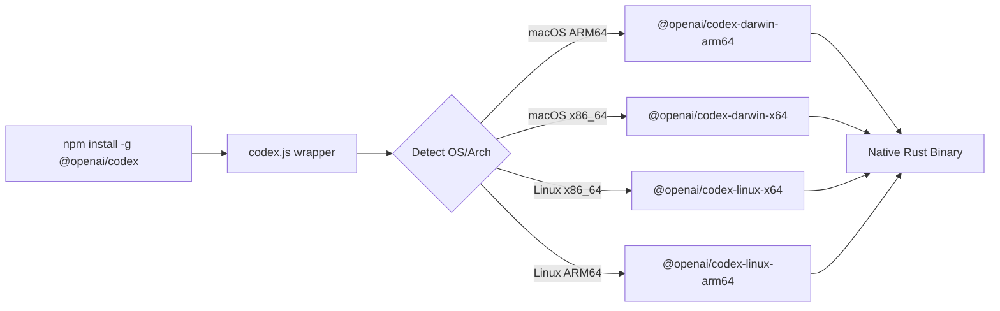
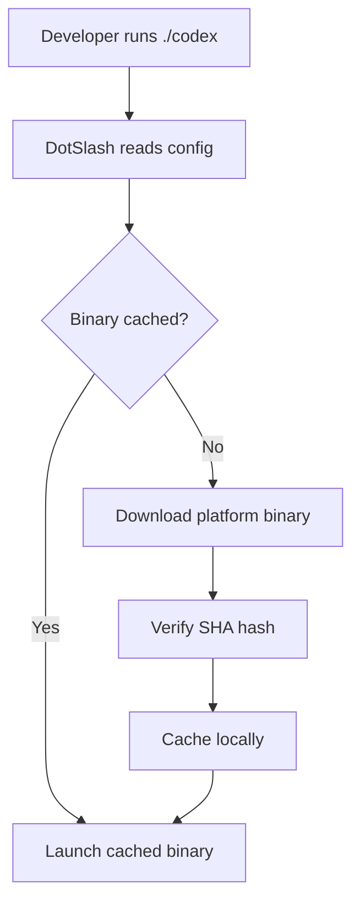
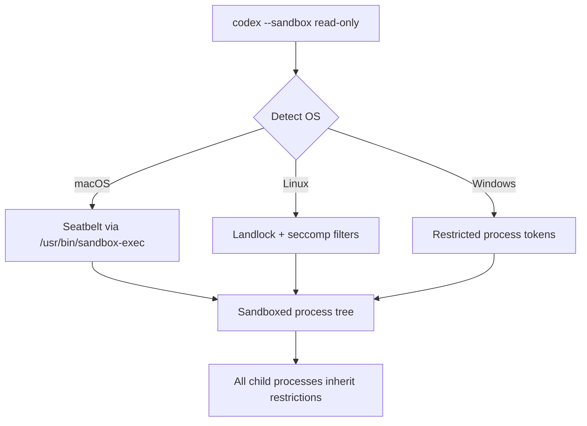

# The Node.js-Free Codex CLI: Rust Binary Installer and Enterprise Deployment


---

In May 2025, OpenAI announced the rewrite of Codex CLI from TypeScript to Rust[^1]. By early 2026, the Rust implementation became the default experience, eliminating the Node.js v22+ runtime dependency that had been a persistent friction point for adoption[^2]. Today, with 95.6% of the codebase in Rust and releases averaging nearly two per day[^3], Codex CLI is a standalone native binary distributed through multiple channels — each with distinct trade-offs for enterprise teams.

This article examines the binary distribution architecture, installation channels, sandboxing infrastructure, and enterprise deployment strategies that the Rust rewrite enables.

## Why Node.js Had to Go

The original TypeScript implementation used the `ink` React-based terminal UI framework, which mandated a Node.js v22+ runtime[^2]. For individual developers, this was a minor inconvenience. For enterprise environments with locked-down machines, controlled package registries, and strict dependency auditing requirements, it was a blocker.

The Rust rewrite addressed four core motivations[^2]:

1. **Zero-dependency installation** — no runtime requirement beyond the OS itself
2. **Native security bindings** — direct access to macOS Seatbelt and Linux Landlock/seccomp
3. **Performance** — no garbage collection overhead, lower memory consumption
4. **Extensibility** — a wire protocol enabling multi-language agent extensions

## Binary Distribution Architecture

The npm package still exists (`@openai/codex`), but the binary it delivers is fundamentally different from the old TypeScript bundle. The `codex-cli/bin/codex.js` wrapper is now a thin Node.js shim that detects the host platform and architecture, then spawns the correct native binary from a `vendor/` directory[^4].



The wrapper uses asynchronous `spawn` to forward signals like `SIGINT` correctly to the native process[^4]. The build pipeline (`codex-cli/scripts/build_npm_package.py`) hydrates the `vendor/` directory with pre-compiled binaries for each target, including bundled tools like `rg` (ripgrep) and, on Windows, `codex-command-runner`[^4].

### Platform Support Matrix

| Platform | Architecture | Binary Type | Notes |
|----------|-------------|-------------|-------|
| macOS 12+ | ARM64, x86_64 | Native Mach-O | Seatbelt sandboxing via `/usr/bin/sandbox-exec`[^5] |
| Ubuntu 20.04+/Debian 10+ | x86_64, ARM64 | Statically-linked musl | Maximum portability across distributions[^4] |
| Windows 11 | x86_64, ARM64 | WSL2 recommended | Native sandbox with restricted tokens[^6] |

The musl-linked Linux builds deserve particular attention for enterprise deployments — they carry zero shared library dependencies, making them suitable for minimal container images and air-gapped environments.

## Installation Channels

### Homebrew (Recommended for macOS/Linux)

```bash
brew install --cask codex
```

This installs the pre-built binary directly with no Node.js dependency[^7]. Upgrades follow the standard `brew upgrade` mechanism. For teams already using Homebrew in their developer environment provisioning, this is the lowest-friction path.

### npm (Cross-Platform)

```bash
npm i -g @openai/codex
```

Despite using npm as the delivery mechanism, the installed binary is native Rust — Node.js is only needed for the thin wrapper shim[^4]. The latest stable release series is v0.121.0 as of mid-April 2026[^8].

### GitHub Releases (Direct Download)

```bash
# Download the latest release for your platform
curl -L https://github.com/openai/codex/releases/latest/download/codex-linux-x64.tar.gz | tar xz
sudo mv codex /usr/local/bin/
```

Each release (tagged as `rust-vX.X.X`) publishes approximately 93 assets covering all supported platforms[^8]. This channel is ideal for air-gapped deployments where package managers are unavailable.

### DotSlash (Team Version Pinning)

This is where enterprise deployment gets interesting. DotSlash enables project-specific version pinning through a lightweight configuration file committed to source control[^9].

```bash
# Commit a single lightweight file to your repo
# All contributors get the same Codex version regardless of platform
cp codex .dotslash/codex
git add .dotslash/codex
```

The DotSlash configuration references hashes from `.github/dotslash-config.json` to verify binary integrity across platforms[^4]. When a developer runs the pinned `codex` command, DotSlash fetches the correct platform-specific binary, verifies its hash, and caches it locally.



This approach ensures deterministic tooling across a team without requiring every developer to manage their own installation.

## The Cargo Workspace Architecture

The `codex-rs` directory contains a Cargo workspace with 69 member crates[^10], organised into functional groups:

| Crate | Purpose |
|-------|---------|
| `codex-core` | Business logic, reusable library for Rust/native applications |
| `codex-tui` | Full-screen terminal interface built on Ratatui |
| `codex-exec` | Headless CLI for non-interactive automation and CI |
| `codex-cli` | Multitool unifying TUI and exec through subcommands |
| `install-context` | ⚠️ Installation context detection (limited public documentation) |

The `install-context` crate appears to handle detection of how Codex was installed (npm, Homebrew, direct binary, DotSlash), which influences upgrade prompts and telemetry. Documentation on this crate remains sparse as of April 2026.

All crate names follow the `codex-` prefix convention, and the workspace is designed to be built from the top-level `codex-rs` directory to keep shared configuration, features, and build scripts aligned[^6].

## Sandbox Architecture for Enterprise

The Rust rewrite's most significant enterprise benefit is kernel-level sandboxing — not container-based isolation, but direct OS security framework integration[^5]:



Three sandbox policies are available via the `--sandbox` flag[^6]:

- **`read-only`** (default) — restricts filesystem write access
- **`workspace-write`** — permits writing within the workspace directory whilst blocking network access
- **`danger-full-access`** — disables sandboxing entirely

Critically, sandbox policies apply to the entire process tree spawned by the agent[^5]. This means any shell commands, subprocesses, or tools invoked by Codex inherit the same restrictions — a significant improvement over application-level sandboxing.

## Enterprise Deployment Patterns

### Corporate Proxy Support

Recent releases added custom CA certificate support for corporate proxies[^11], addressing a common enterprise blocker. Teams behind TLS-inspecting proxies can now configure Codex to trust their corporate root certificates.

### Hooks for Policy Enforcement

The hooks system enables teams to intercept or augment prompts, opening the door to audit logging, policy enforcement, and automated context injection[^11]:

```toml
# .codex/config.toml
[hooks]
user_prompt = "/usr/local/bin/corporate-policy-check"
```

### CI/CD Integration

The `codex-exec` crate provides a headless binary purpose-built for non-interactive automation[^6]. Combined with the `workspace-write` sandbox policy and musl-linked binaries, this enables secure CI pipeline integration without containerisation overhead.

### Authentication

Codex CLI supports authentication via ChatGPT Plus, Pro, Business, Edu, and Enterprise plans, as well as direct API key usage[^12]. Enterprise SSO integration flows through the existing OpenAI organisational account infrastructure.

## Migration from npm-Based Installations

For teams currently running the npm-installed version, migration is straightforward:

```bash
# Remove the npm installation
npm uninstall -g @openai/codex

# Install via Homebrew (recommended)
brew install --cask codex

# Or download directly
curl -L https://github.com/openai/codex/releases/latest/download/codex-$(uname -s | tr '[:upper:]' '[:lower:]')-$(uname -m).tar.gz | tar xz
```

Configuration files in `~/.codex/` are fully compatible — the Rust binary reads the same `config.toml` and respects the same `RUST_LOG` environment variable for debugging[^6].

## Conclusion

The Node.js-free Codex CLI represents more than a language rewrite. The combination of zero-dependency binaries, kernel-level sandboxing, DotSlash version pinning, and enterprise hooks transforms Codex from a developer productivity tool into an enterprise-deployable agent platform. With 3 million weekly users as of April 2026[^3] and nearly all Fortune 100 companies already on OpenAI infrastructure, the Rust binary installer removes the last significant barrier to standardised enterprise adoption.

## Citations

[^1]: [OpenAI Rewrites Codex CLI in Rust, Saying Goodbye to Node.js](https://www.aibase.com/news/18549)
[^2]: [Codex CLI is Going Native — GitHub Discussion #1174](https://github.com/openai/codex/discussions/1174)
[^3]: [OpenAI Codex Statistics 2026 — Gradually AI](https://www.gradually.ai/en/codex-statistics/)
[^4]: [DeepWiki — Installation and Setup | openai/codex](https://deepwiki.com/openai/codex/1.1-installation-and-setup)
[^5]: [A Deep Dive on Agent Sandboxes — Pierce Freeman](https://pierce.dev/notes/a-deep-dive-on-agent-sandboxes)
[^6]: [codex-rs README — GitHub](https://github.com/openai/codex/blob/main/codex-rs/README.md)
[^7]: [Codex CLI Official Documentation](https://developers.openai.com/codex/cli)
[^8]: [OpenAI Codex Releases — GitHub](https://github.com/openai/codex/releases)
[^9]: [Codex CLI install.md — GitHub](https://github.com/openai/codex/blob/main/docs/install.md)
[^10]: [Cargo Workspace Structure — DeepWiki](https://deepwiki.com/openai/codex/7.1-mcp-server-configuration-and-management)
[^11]: [OpenAI Codex CLI ships v0.116.0 with Enterprise Features — Augment Code](https://www.augmentcode.com/learn/openai-codex-cli-enterprise)
[^12]: [CLI — Codex | OpenAI Developers](https://developers.openai.com/codex/cli)
