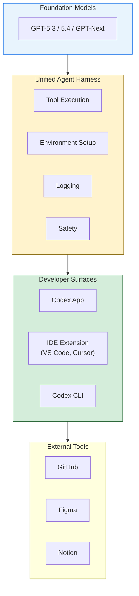

# OpenAI Codex Day Keynote — Enterprise Adoption and Model Roadmap

**Source:** OpenAI Codex Day event (BloomsYard), in-person talk transcript
**Author:** OpenAI Developer Relations (speaker unnamed)
**Date saved:** 2026-04-16
**Content age:** Current as of April 2026
---

## Summary

An OpenAI speaker at the Codex Day hackathon event presented Codex adoption metrics, the GPT model evolution for coding, enterprise case studies (Cisco, Datadog, and an internal OpenAI team), and the Unified Agent Harness architecture. The talk frames a shift from IDE autocomplete to pair programming to agentic delegation as the three eras of AI-assisted coding.

---

## Key Points

### Adoption Metrics (as of April 2026)

- **Enterprise adoption up more than 5x** since 1 January 2026 (*Fortune*, March 4, 2026; the Codex Day speaker rounded to "400%")
- **5x more messages per user** — a proxy for how much work developers delegate to Codex
- **Over 1 million downloads** of the Codex app in its first week of release (VentureBeat, eWeek; the speaker cited 1.5M but contemporaneous reporting confirmed 1M+)
- **3 million+ weekly active users** (up from under 500K at start of year) — "hockey stick" growth
- The speaker stated: "There's nothing stopping this growth. The only way to go is up."

### Three Eras of AI-Assisted Coding

1. **IDE Autocomplete** — Function completion in VS Code, Cursor, etc. Still used for small tasks.
2. **Pair Programming** — Back-and-forth with a coding agent to add/modify features. "This is where Cursor really shines."
3. **Agentic Delegation** — Long-running tasks where you give Codex a spec or feature request and it plans, implements, reviews, and delivers. "You focus on what humans should focus best on, which is taking the architecture decisions, figuring out the constraints."

### Model Evolution Timeline

| Model | Key Advancement |
|-------|----------------|
| **GPT-5 Codex** (Sept 2025) | First specialised coding model. Built for agentic coding + code review. "State-of-the-art even right now for code review." |
| **GPT-5.1 Codex** | Trained for long-running tasks. Learned context compaction — how to compact context and relearn forgotten context. |
| **GPT-5.2 Codex** | First model with "true increase in cybersecurity capabilities." Doubled down on large codebase performance. |
| **GPT-5.3 Codex** | 25% faster than 5.2. New benchmarks on SWE-bench Pro and TerminalBench. |
| **GPT-5.4** | **First unified model** (chat + code combined). 2x more token efficient than 5.2. 1.5x faster. One model for chat, knowledge work, and coding. |
| **GPT-Next** | Upcoming. Mentioned in architecture slide alongside 5.3 and 5.4. |

### Enterprise Case Studies

**Internal OpenAI Team ("Harness Engineering"):**
- **3 engineers (grew to 7), 5 months, zero hand-written lines of code**
- Product now in production serving millions of users
- Codex wrote ~1 million lines of code across **~500 NPM packages**, 1,500+ PRs merged
- 3.5 PRs/engineer/day, rising to 5–10 with GPT-5.2; ~1 billion tokens/day (~\$2–3K daily)
- Tasks ran for **24+ hours** continuously (GPT-5.1-Codex-Max system card says "more than 24 hours"; speaker said 36)
- Mandate: "push Codex as much as possible" — humans focused on architecture, constraints, and code review
- Source: OpenAI blog <https://openai.com/index/harness-engineering/>; Latent Space podcast <https://www.latent.space/p/harness-eng>

**Cisco:**
- Embedded Codex directly into software engineering workflows
- **20% faster build times**
- **Over 1,500 engineering hours saved per month** across the org (source: <https://news.aibase.com/news/24796>)
- **10–15x faster defect remediation**
- Engineer quote: "They don't see Codex as a tool; they started treating it as a team member."

**Datadog:**
- Integrated Codex into code review workflow
- **More than 1,000 engineers** using Codex regularly (OpenAI official case study says "more than 1,000"; speaker said 1,500; source: <https://openai.com/index/datadog/>)
- Found Codex could have flagged **22% of past defects faster**

### Codex App vs CLI

- The Codex app (released January 2026) replaced the CLI for power users
- Features: multiple workspaces, multiple projects simultaneously, parallel feature work, integrated code review
- Peter Steinberger (PSPDFKit creator, now on Codex team) was cited as a power user whose workflow informed the app design
- Speaker: "I started dogfooding this app sometime in December, and I haven't touched the CLI after that."

### Unified Agent Harness Architecture

The architecture stack described:

- The harness manages: context pulling, model communication, tool execution, environment setup, logging, safety
- Sits between the models and all developer-facing surfaces

### SDLC Evolution

The speaker described the software development lifecycle shifting:

- **Traditional**: Plan → Build → Review → Deploy → Fix (sequential)
- **Agentic coding era (Copilot/Cursor)**: Accelerated plan + build, but review became the bottleneck
- **Codex era**: Automated code reviews, parallel feature requests, continuous agent-driven review of deployed code

---

## Notable Quotes

- "A team of literally three engineers worked for five months to build a product which is right now in production across millions of users. The kicker here is that this team wrote zero lines of code themselves."
- "You focus on what humans should focus best on, which is taking the architecture decisions, figuring out the constraints, and reviewing code."
- "They don't see Codex as a tool; they started treating it as a team member." (Cisco engineer)
- "Cursor used GPT-5.2 to build a browser from scratch over a week... millions of lines of code."
- "Instead of focusing on really large context windows, we focused on training the model to learn how to compact its context and then learn whatever it had forgotten." (on GPT-5.1)

---

## Personal Notes

This is a first-party OpenAI presentation with hard adoption numbers and named enterprise customers. The "three engineers, zero hand-written code" case study is directly relevant to the Agentic Pod model — it validates the small-team, high-delegation approach. The 400% enterprise growth figure and 3M WAU number establish market context for the series. The model evolution timeline (especially GPT-5.1's context compaction training) is relevant to Article 10 on context management. The Cisco and Datadog case studies provide enterprise credibility for Articles 11 and 12.
