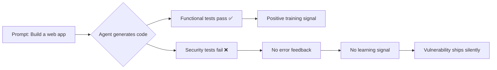
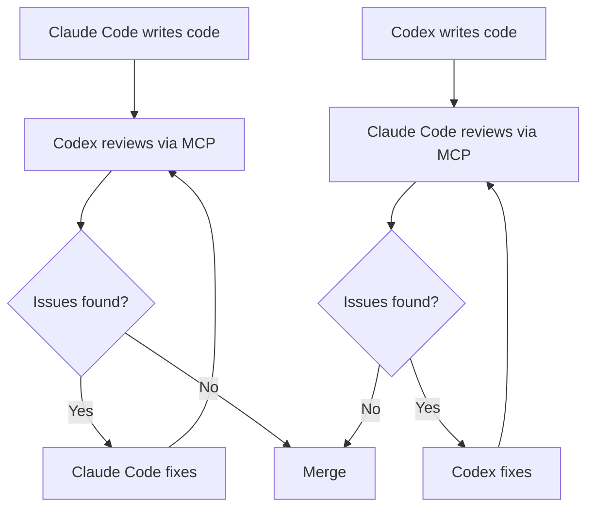

# The Security Decisions AI Agents Make: What Codex and Claude Code Miss When You Don't Ask


---

Every time you prompt Codex or Claude Code to "build me a web app," the agent silently makes dozens of security decisions on your behalf — which hashing algorithm, whether to add rate limiting, how to handle JWT secrets. The trouble is that both agents consistently get several of those decisions wrong, and the gaps are remarkably similar despite their very different model lineages.

This article examines the empirical evidence from three independent benchmarks published in early 2026, extracts the patterns that matter for senior developers, and proposes concrete mitigations using AGENTS.md, sandbox policy, and cross-model review loops.

## The Evidence: Three Benchmarks, One Conclusion

### Amplifying.ai: 12 Sessions, 33 Exploits

Amplifying.ai ran 12 identical sessions — six with Claude Code (Opus 4.6) and six with Codex (GPT-5.4) — each tasked with building the same web application from identical prompts[^1]. They then executed 33 exploit tests against each output.

The headline findings:

| Behaviour | Claude Code (Opus 4.6) | Codex (GPT-5.4) |
|---|---|---|
| Password hashing | bcrypt (every session) | PBKDF2 or scrypt (alternating) |
| Rate limiting added | 0/6 sessions | 0/6 sessions |
| Security headers added | 0/6 sessions | 0/6 sessions |
| Password validation (min length) | Accepts single-char passwords | Accepts single-char passwords |

Neither agent volunteered rate limiting or security headers in any session[^1]. The cryptographic choices differed — Claude reliably reached for bcrypt whilst Codex alternated between PBKDF2 and scrypt — but neither validated password strength beyond checking the field was non-empty.

### Help Net Security: 30 Pull Requests, 143 Vulnerabilities

A separate study built two realistic applications — FaMerAgen (allergy tracking) and Road Fury (multiplayer game) — using Claude Code, Codex, and Gemini without security guidance in prompts[^2]. Across 30 pull requests and 38 scans:

- **87% of PRs** contained at least one vulnerability (26 of 30)
- **143 security issues** were identified in total
- **Broken access control** appeared across all three agents in both applications
- **Absent rate limiting**: middleware was occasionally _defined_ but never _connected_ to the application

The ten recurring vulnerability classes included hardcoded JWT fallback secrets, missing WebSocket authentication, OAuth state parameter omissions, and insecure direct object references[^2].

### Endor Labs Agent Security League: 200 Tasks, 77 CWEs

The Agent Security League, built on Carnegie Mellon's SusVibes benchmark, provides the most rigorous evaluation to date[^3]. It consists of 200 tasks drawn from 108 real-world open-source Python projects covering 77 CWE categories. Each task is constructed from a historical vulnerability fix.

| Agent | Model | Functional Pass | Secure Pass |
|---|---|---|---|
| Cursor | Claude Opus 4.6 | 84.4% | 7.8% |
| Claude Code | Claude Opus 4.6 | 81.0% | 8.4% |
| Codex | GPT-5.4 | 62.6% | 17.3% |

The gap is staggering: functional capability has climbed to 84%, but security correctness hovers between 7% and 17%[^3]. Over 80% of AI-generated code in realistic development tasks contains security vulnerabilities.

## Why Agents Fail at Security



The root cause is structural. Vulnerable code produces no immediate error feedback, unlike functional failures that throw exceptions or fail tests[^3]. Writing secure code requires threat model awareness, adversarial input anticipation, and CWE pattern knowledge — none of which generate training signal from standard test suites.

As Endor Labs put it: treat agent output like "a pull request from a prolific but junior developer"[^3].

## Framework Choice Is Your Strongest Security Lever

One of the most actionable findings from the Amplifying.ai benchmark is that **framework selection matters more than model selection** for security outcomes[^1]:

- **FastAPI** applications achieved **92–96%** security compliance
- **Next.js** applications achieved **73–75%** compliance

This 20-point gap reflects the security-by-default posture of each framework. FastAPI's dependency injection, Pydantic validation, and automatic OpenAPI schema generation enforce constraints that agents would otherwise skip. Next.js's flexibility — particularly around API routes and middleware — leaves more room for agents to make poor choices.

**Practical takeaway**: if security matters (it does), steer your agents towards opinionated frameworks that enforce safe defaults.

## Supply-Chain Tradeoffs: Libraries vs Standard Library

Claude Code and Codex exhibit fundamentally different dependency strategies[^1]:

- **Claude Code** is library-heavy — it imports security primitives like `bcrypt`, `python-jose`, and `passlib` as third-party packages
- **Codex** is stdlib-heavy — it assembles equivalent functionality from `hashlib`, `hmac`, and `secrets`

Neither approach is inherently superior. Library-heavy code benefits from battle-tested implementations but expands the supply-chain attack surface. Stdlib-heavy code avoids dependency risk but reimplements cryptographic patterns that are easy to get subtly wrong.

The Amplifying.ai study across 2,430 Claude Code responses and 1,452 Codex tool picks found that "custom/DIY" was the number-one recommendation in 12 of 20 tool categories[^4] — a finding that should concern anyone who remembers the left-pad incident.

## Mitigations That Actually Work

### 1. Security Blocks in AGENTS.md

The most immediate fix is explicit security instructions in your `AGENTS.md` file[^5]. Agents follow written constraints reliably — the problem is that they don't _volunteer_ security practices unprompted.

```toml
# .agents/AGENTS.md — Security block

## Security Requirements

All endpoints MUST include:
- Rate limiting (100 requests/minute per IP for public, 1000 for authenticated)
- Security headers: HSTS, X-Content-Type-Options, X-Frame-Options, CSP
- Input validation with maximum length constraints
- Password minimum 12 characters, complexity requirements enforced server-side

Authentication:
- JWT secrets from environment variables, never hardcoded
- Refresh token rotation with revocation support
- OAuth state parameter validation mandatory

Never:
- Accept single-character passwords
- Define middleware without connecting it to the application
- Use fallback secrets for JWT signing
- Skip WebSocket authentication when REST endpoints are authenticated
```

This addresses the "didn't ask" problem directly. The Amplifying.ai benchmark showed 0/12 sessions adding rate limiting or security headers — but this was because the prompts didn't request them[^1]. AGENTS.md makes security requirements durable across every session.

### 2. Cross-Model Review Loops

Different models have different blind spots. When GPT-5.4 reviewed Claude-generated code, it identified three critical issues Claude had missed: a return code logic bug, a terminal injection vulnerability, and a path double-application problem[^6].

The architecture uses MCP to bridge agents. OpenAI's `codex-plugin-cc` enables Codex to act as a reviewer within Claude Code sessions[^7]:



Cross-provider review adds latency and cost. Reserve it for production-grade code, security-sensitive logic, or authentication flows[^6].

### 3. Sandbox Policy as Defence in Depth

Codex CLI's sandbox architecture provides technical enforcement where AGENTS.md provides behavioural guidance[^8]. The default configuration disables network access and restricts file writes to the workspace:

```toml
# config.toml — Security-hardened profile
[profiles.secure]
sandbox_workspace_write = true
network_access = false
ask_for_approval = "untrusted"
```

The `untrusted` approval mode automatically runs read-only operations but requires explicit approval for state-mutating commands[^8]. On macOS this uses Seatbelt policies; on Linux, `bwrap` with `seccomp` filters.

### 4. Scan Every PR, Not Just Final Builds

Static analysis tools miss the class of bugs agents produce most — logic and authorisation flaws that require contextual analysis[^2]. The Help Net Security study found that pattern-based scanners identified zero issues in code where dynamic testing found every vulnerability.

The recommended approach:

1. **PR-level scanning** with contextual security analysis (not just regex-based)
2. **Full codebase analysis** alongside PR diffs to catch trust boundary violations
3. **Recurring issue checks**: hardcoded JWT defaults, missing brute-force protections, non-revocable refresh tokens[^2]

### 5. Codex Security for Threat Modelling

OpenAI's Codex Security, which entered research preview in March 2026, analyses repositories to build project-specific threat models, identifies vulnerabilities classified by real-world impact, and pressure-tests findings in a sandboxed environment[^9]. This addresses the contextual analysis gap that static scanners miss.

## The Uncomfortable Truth

The broader industry statistics reinforce the benchmark findings. Approximately 45% of AI-generated code introduces known security flaws[^10]. Around 92% of security professionals express concern about AI-driven security risks[^10]. Yet the productivity gains are real and adoption is accelerating.

The path forward isn't to stop using coding agents — it's to stop trusting them with security decisions they're not equipped to make. Explicit AGENTS.md constraints, cross-model review, sandbox enforcement, and contextual security scanning together close the gap between what agents deliver and what production requires.

Treat every agent-generated PR as code from a brilliant but security-naive colleague. Because that's exactly what it is.

## Citations

[^1]: Amplifying.ai, "AI Agent Security Benchmark: Claude Code vs Codex," [https://amplifying.ai/research](https://amplifying.ai/research), April 2026.

[^2]: Help Net Security, "AI coding agents keep repeating decade-old security mistakes," [https://www.helpnetsecurity.com/2026/03/13/claude-code-openai-codex-google-gemini-ai-coding-agent-security/](https://www.helpnetsecurity.com/2026/03/13/claude-code-openai-codex-google-gemini-ai-coding-agent-security/), March 2026.

[^3]: Endor Labs, "Is AI Coding Safe? Introducing the Agent Security League," [https://www.endorlabs.com/learn/is-ai-coding-safe-introducing-the-agent-security-league](https://www.endorlabs.com/learn/is-ai-coding-safe-introducing-the-agent-security-league), March 2026.

[^4]: Amplifying.ai, "What Claude Code Actually Chooses," [https://amplifying.ai/research/claude-code-picks](https://amplifying.ai/research/claude-code-picks), April 2026.

[^5]: OpenAI, "Custom instructions with AGENTS.md," [https://developers.openai.com/codex/guides/agents-md](https://developers.openai.com/codex/guides/agents-md), 2026.

[^6]: DEV Community, "How I Made Claude Code and GPT-5.4 Review Each Other's Code," [https://dev.to/tsunamayo7/how-i-made-claude-code-and-gpt-54-review-each-others-code-i74](https://dev.to/tsunamayo7/how-i-made-claude-code-and-gpt-54-review-each-others-code-i74), 2026.

[^7]: OpenAI, "codex-plugin-cc: Use Codex from Claude Code," [https://github.com/openai/codex-plugin-cc](https://github.com/openai/codex-plugin-cc), 2026.

[^8]: OpenAI, "Agent approvals & security – Codex," [https://developers.openai.com/codex/agent-approvals-security](https://developers.openai.com/codex/agent-approvals-security), 2026.

[^9]: OpenAI, "Codex Security research preview," [https://developers.openai.com/codex/changelog](https://developers.openai.com/codex/changelog), March 2026.

[^10]: SQ Magazine, "AI Coding Security Vulnerability Statistics 2026," [https://sqmagazine.co.uk/ai-coding-security-vulnerability-statistics/](https://sqmagazine.co.uk/ai-coding-security-vulnerability-statistics/), 2026.
