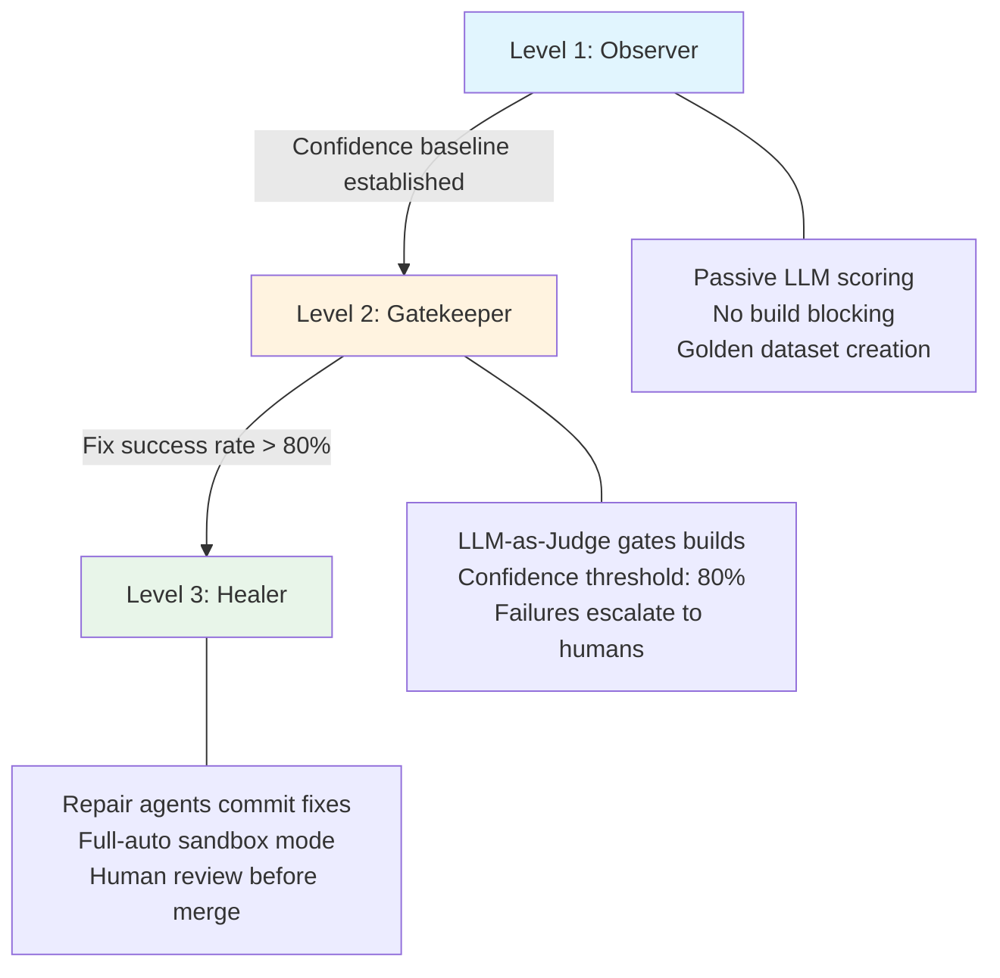
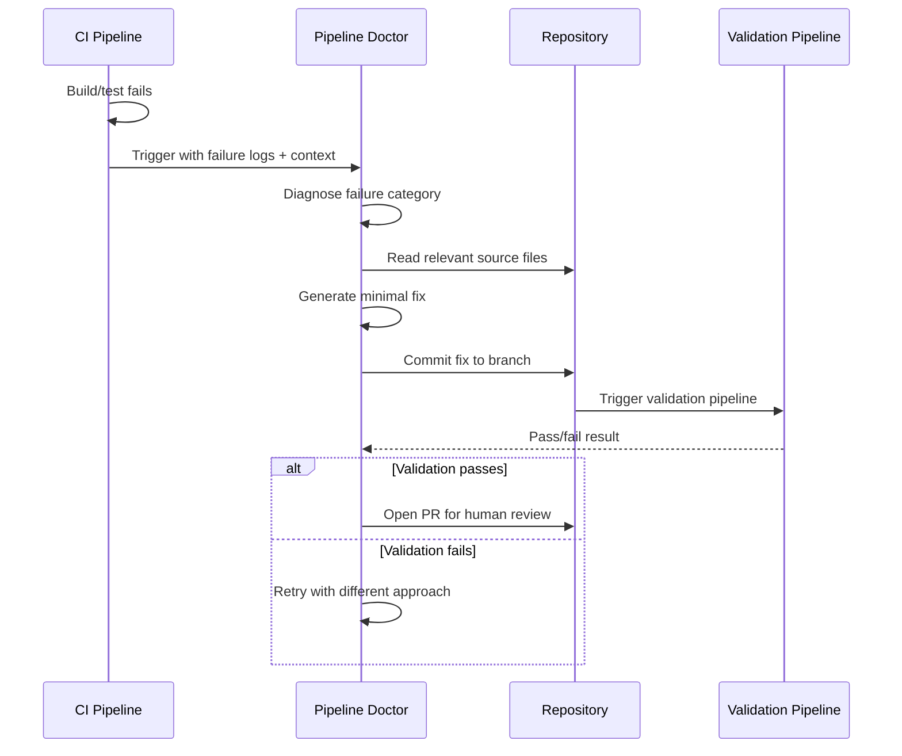
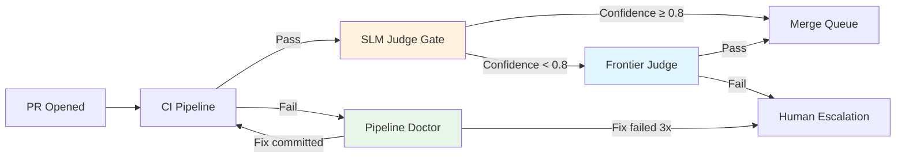

# Self-Healing CI/CD for Agentic Systems: The Pipeline Doctor Pattern and LLM-as-a-Judge


Traditional CI/CD pipelines were designed for deterministic software. A test either passes or fails; a build either compiles or doesn't. But agentic AI systems produce probabilistic outputs — they don't return Y, they return Y-ish[^1]. This fundamental mismatch has driven a new generation of self-healing CI patterns that replace binary assertions with confidence-scored evaluations, and manual triage with autonomous repair agents.

This article covers the three-level self-healing maturity model, the Pipeline Doctor pattern for autonomous failure remediation, and how LLM-as-a-Judge replaces brittle assertions — all mapped to Codex CLI's permission model and `codex exec` command.

## The Three-Level Self-Healing Maturity Model

The industry has converged on a three-level progression for self-healing CI, each mapping cleanly to Codex CLI's approval modes[^2]:



### Level 1: Observer (`suggest` approval mode)

Deploy LLM-as-a-Judge in passive mode. The judge scores every build without blocking anything, building a "golden dataset" of what good looks like[^1]. In Codex CLI terms, this maps to `suggest` approval mode — the agent analyses and recommends but never writes.

```bash
codex exec "Analyse the CI logs at /tmp/build-output.log. \
  Score each test result for correctness on a 0-1 scale. \
  Output a JSON summary with pass/fail/confidence for each test suite." \
  --output-schema '{"type":"object","properties":{"suites":{"type":"array","items":{"type":"object","properties":{"name":{"type":"string"},"pass":{"type":"boolean"},"confidence":{"type":"number"}}}}}}' \
  --sandbox-mode read-only
```

### Level 2: Gatekeeper (`auto-edit` approval mode)

Promote the judge to a blocking gate. If the judge scores an output below the confidence threshold, fail the build[^1]. The agent can now modify test expectations and configuration but not production code.

### Level 3: Healer (`full-auto` approval mode)

Grant the repair agent write access. The agent reads logs, diagnoses failures, commits fixes, and re-runs the pipeline[^2]. This maps to `full-auto` mode — Codex CLI's convenience alias that enables `workspace-write` sandbox with `on-request` approval policy[^3].

## The Pipeline Doctor Pattern

The Pipeline Doctor is an architectural pattern where CI failure events trigger specialised repair agents rather than simply notifying developers[^2]. The pattern has three phases:



### Implementing Pipeline Doctor with Codex CLI

The OpenAI Cookbook provides an official pattern for CI autofix using `codex-action`[^4]. The workflow triggers on `workflow_run` completion with failure status:


```yaml
name: Self-Healing CI
on:
  workflow_run:
    workflows: ["CI Build"]
    types: [completed]

jobs:
  autofix:
    if: ${{ github.event.workflow_run.conclusion == 'failure' }}
    runs-on: ubuntu-latest
    permissions:
      contents: write
      pull-requests: write
    steps:
      - uses: actions/checkout@v4
        with:
          ref: ${{ github.event.workflow_run.head_branch }}

      - uses: openai/codex-action@main
        with:
          prompt: |
            You are working in this repository. The CI build failed.
            Read the failure logs, identify the root cause, implement
            the minimal fix needed, and verify it passes locally.
          codex_args: '["--config","sandbox_mode=\"workspace-write\""]'
        env:
          OPENAI_API_KEY: ${{ secrets.OPENAI_API_KEY }}

      - uses: peter-evans/create-pull-request@v6
        with:
          commit-message: "fix(ci): auto-fix failing tests via Codex"
          branch: codex/auto-fix-${{ github.event.workflow_run.id }}
          title: "fix(ci): automated repair for ${{ github.event.workflow_run.head_branch }}"
```


### Production Evidence: Elastic's 24-PR Month

Elastic's Control Plane team provides the strongest production evidence for the Pipeline Doctor pattern. They integrated Claude Code into their Buildkite CI to automatically fix broken Renovate dependency PRs[^5]. Results from the first month:

- **24 broken PRs fixed** autonomously
- **22 commits** by the repair agent (22 July – 22 August 2025)
- **~20 days** of estimated developer time saved
- **~500 dependencies** managed across core services

Critical to their success was a well-maintained `CLAUDE.md` file (analogous to `AGENTS.md` in Codex CLI) that taught the agent preferred coding practices[^5]. They also enforced safety guardrails: auto-merge was disabled so every AI-generated fix required human review, and `--allowedTools` restricted which commands the agent could execute.

### Nx Cloud: Two-Thirds Fix Rate

Nx Cloud's self-healing CI uses project-graph awareness to achieve approximately a two-thirds success rate on broken PRs[^6]. The system leverages Nx's dependency graph to understand which projects are affected by a failure, providing the repair agent with targeted context rather than the entire monorepo. Nx shipped a Claude Code plugin in Q1 2026 that bundles LLM metadata with Nx plugins, improving agent context for repair tasks[^7].

## LLM-as-a-Judge: Beyond Binary Assertions

LLM-as-a-Judge replaces rigid `assert x == y` checks with confidence-scored evaluations from a secondary model[^8]. This is essential when testing agentic outputs that are correct but not identical — a refactored function, an alternative algorithm, or a differently-worded commit message.

### The Judge Returns Structured Scores

Instead of boolean pass/fail, the judge returns structured evaluations:

```json
{
  "criterion": "code_correctness",
  "pass": true,
  "confidence": 0.94,
  "reasoning": "Implementation handles edge cases correctly, uses appropriate error types"
}
```

### The SLM Cost Trick

Running a frontier model as judge on every PR introduces meaningful cost and latency. The emerging pattern is to fine-tune a small language model (8B parameters) as a specialised judge[^9]. JudgeLM research demonstrates that fine-tuned judges at 7B–33B parameters achieve agreement rates exceeding 90%, surpassing human-to-human agreement on evaluation benchmarks[^10].

The practical deployment pattern recommended across the industry[^8]:

| Gate | Model | When |
|---|---|---|
| String-match + execution evals | None (deterministic) | Every commit |
| Fine-tuned SLM judge (8B) | Llama 3.3 8B fine-tuned | Every PR |
| Frontier LLM judge | GPT-5.4 / Claude Opus 4.6 | Nightly / pre-release |

This tiered approach delivers <1% of frontier model cost for routine evaluations while reserving expensive models for comprehensive pre-release quality gates[^1].

### Codex Exec as Judge

`codex exec` with `--output-schema` provides a natural interface for LLM-as-a-Judge in CI pipelines:

```bash
#!/bin/bash
# judge.sh — evaluate agent-generated code against acceptance criteria

DIFF=$(git diff main...HEAD)
CRITERIA="articles/acceptance-criteria.md"

codex exec "You are a code review judge. Evaluate this diff against the \
  acceptance criteria. Score each criterion 0-1. Flag any security concerns." \
  --input <(echo "$DIFF") \
  --output-schema '{
    "type": "object",
    "properties": {
      "overall_pass": {"type": "boolean"},
      "overall_confidence": {"type": "number"},
      "criteria_scores": {
        "type": "array",
        "items": {
          "type": "object",
          "properties": {
            "criterion": {"type": "string"},
            "score": {"type": "number"},
            "note": {"type": "string"}
          }
        }
      },
      "security_flags": {"type": "array", "items": {"type": "string"}}
    }
  }' \
  --sandbox-mode read-only \
  --model gpt-5.4-mini
```

The `--output-schema` flag ensures the judge returns structured JSON that downstream pipeline steps can parse with `jq`, enabling programmatic gate decisions[^11].

## GitHub Agentic Workflows: The Platform-Native Approach

GitHub Agentic Workflows, in technical preview since February 2026, provide a platform-native alternative to custom self-healing pipelines[^12]. Instead of YAML, you write Markdown files with YAML frontmatter that describe automation goals in natural language:

```markdown
---
name: fix-ci-failures
on:
  workflow_run:
    workflows: ["CI"]
    types: [completed]
permissions:
  contents: read
safe-outputs:
  - create-pull-request
  - add-comment
  - noop
tools:
  - gh
  - npm
---

Analyse the CI failure logs. Classify the failure as transient
(network timeout, rate limit) or permanent (compilation error,
breaking change). For permanent failures, create a fix PR. For
transient failures, add a comment. Never raise minimum SDK versions
or delete tests.
```

The security model is noteworthy: workflows run read-only by default, with write operations channelled through declared "safe outputs". The agent requests; a gated job decides[^12]. Tiago Pascoal demonstrated this pattern fixing Dependabot dependency PRs in a Kotlin Android project, with the agent distinguishing between infrastructure issues and code problems[^13].

## Organisational Implications

### The Maturity Ladder

Most teams should start at Level 1 (Observer) and progress only after building confidence in judge accuracy. Elastic's experience shows that "tuning AI agents' behaviour marks the difference between failure and success"[^5] — jumping straight to Level 3 without establishing guardrails invites cascading automated damage.

### What to Heal and What Not To

Self-healing works best for:

- **Dependency bumps** (Renovate/Dependabot PRs with breaking API changes)
- **Linting and formatting** failures
- **Flaky test stabilisation** (retry logic, timeout adjustments)
- **Configuration drift** (environment variable changes, version pinning)

Self-healing should **not** attempt:

- Architectural changes
- Security-sensitive code modifications
- Performance regressions (these need profiling, not patching)
- Test deletions (⚠️ a common agent shortcut that masks real failures)

### Cost Economics

The cost equation favours self-healing once a team manages more than a handful of dependencies. Elastic's 20 days saved in one month[^5] against the cost of API calls and compute for the repair agent represents a significant return. The SLM judge pattern keeps ongoing evaluation costs minimal — a fine-tuned 8B model running on a single GPU costs orders of magnitude less than developer hours spent triaging flaky CI[^1].

## Putting It Together: A Complete Self-Healing Pipeline



This architecture combines the Pipeline Doctor for failure remediation with tiered LLM-as-a-Judge for quality gating. The SLM judge handles routine evaluations cheaply, escalating only uncertain cases to a frontier model. Human developers remain the final authority on merge decisions — self-healing CI eliminates toil, not oversight.

## Citations

[^1]: Optimum Partners, "Building Self-Healing CI/CD Pipelines for Agentic AI Systems," 2026. [https://optimumpartners.com/insight/how-to-architect-self-healing-ci/cd-for-agentic-ai/](https://optimumpartners.com/insight/how-to-architect-self-healing-ci/cd-for-agentic-ai/)

[^2]: Semaphore, "AI-Driven CI: Exploring Self-Healing Pipelines," 2026. [https://semaphore.io/blog/self-healing-ci](https://semaphore.io/blog/self-healing-ci)

[^3]: OpenAI, "Codex CLI `--full-auto` description," GitHub Issue #6522. [https://github.com/openai/codex/issues/6522](https://github.com/openai/codex/issues/6522)

[^4]: OpenAI, "Use Codex CLI to automatically fix CI failures," OpenAI Cookbook. [https://developers.openai.com/cookbook/examples/codex/autofix-github-actions](https://developers.openai.com/cookbook/examples/codex/autofix-github-actions)

[^5]: Elastic, "CI/CD pipelines with agentic AI: How to create self-correcting monorepos," Elasticsearch Labs. [https://www.elastic.co/search-labs/blog/ci-pipelines-claude-ai-agent](https://www.elastic.co/search-labs/blog/ci-pipelines-claude-ai-agent)

[^6]: Nx, "AI-Powered Self-Healing CI," Nx Docs. [https://nx.dev/docs/features/ci-features/self-healing-ci](https://nx.dev/docs/features/ci-features/self-healing-ci)

[^7]: Nx, "Nx 2026 Roadmap: Expanding Agent Autonomy, Improving Performance," Nx Blog. [https://nx.dev/blog/nx-2026-roadmap](https://nx.dev/blog/nx-2026-roadmap)

[^8]: Label Your Data, "LLM as a Judge: A 2026 Guide to Automated Model Assessment." [https://labelyourdata.com/articles/llm-as-a-judge](https://labelyourdata.com/articles/llm-as-a-judge)

[^9]: Monte Carlo Data, "LLM-As-Judge: 7 Best Practices & Evaluation Templates." [https://www.montecarlodata.com/blog-llm-as-judge/](https://www.montecarlodata.com/blog-llm-as-judge/)

[^10]: Zhu et al., "JudgeLM: Fine-tuned Large Language Models are Scalable Judges," ICLR 2025 Spotlight. [https://arxiv.org/abs/2310.17631](https://arxiv.org/abs/2310.17631)

[^11]: OpenAI, "Codex CLI for CI/CD: codex exec, Non-Interactive Mode and Pipeline Integration," codex-resources. Published 2026-03-26.

[^12]: GitHub, "GitHub Agentic Workflows are now in technical preview," GitHub Changelog, 13 February 2026. [https://github.blog/changelog/2026-02-13-github-agentic-workflows-are-now-in-technical-preview/](https://github.blog/changelog/2026-02-13-github-agentic-workflows-are-now-in-technical-preview/)

[^13]: Tiago Pascoal, "Self-Healing CI: Using GitHub Agentic Workflows to Automatically Fix CI Failures," 12 March 2026. [https://pascoal.net/2026/03/12/self-healing-ci-using-gh-aw/](https://pascoal.net/2026/03/12/self-healing-ci-using-gh-aw/)
