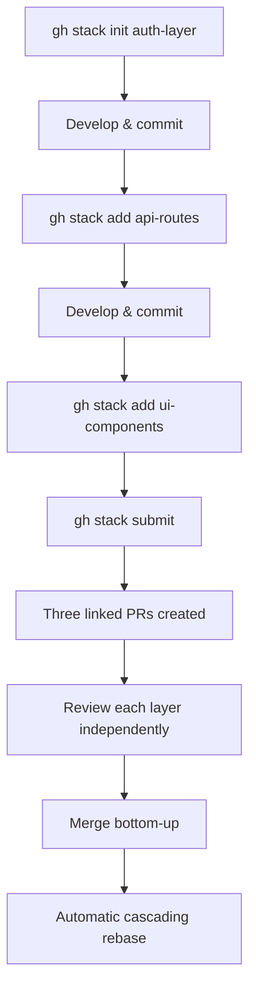
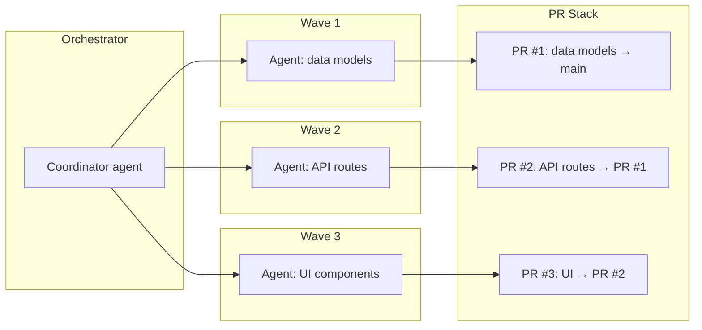

# Stacked PRs Meet Coding Agents: GitHub gh stack, Sapling, and the codex-pr-body Skill Pattern


---

On 13 April 2026 GitHub shipped **native stacked pull requests** in private preview [^1][^2]. The same week, OpenAI's team merged a new project skill — `codex-pr-body` — that writes stacked-PR-aware descriptions and restricts Sapling operations to read-only for safety ⚠️[^3]. Together these two events signal a shift: stacked PRs are no longer a power-user niche — they are becoming an agent-native primitive.

This article covers the `gh stack` CLI, how it compares with Graphite and Sapling, the enterprise skill pattern emerging from `codex-pr-body`, and what stacked PRs mean for multi-agent orchestration.

## Why Stacked PRs, Why Now

Large pull requests are demonstrably harder to review. Microsoft's internal research found that review quality degrades sharply once a PR exceeds roughly 200 lines of changed code [^4]. The traditional response — "please split your PR" — shifts mechanical toil onto the author with no tooling support.

Stacked PRs solve this by treating a chain of dependent branches as a first-class unit. Each layer in the stack targets the branch below it rather than `main`, forming an ordered chain that ultimately lands on the trunk [^1]. Reviewers see only the diff for their layer; CI runs against the final target; merging cascades automatically.

The timing is not coincidental. AI coding agents now produce code far faster than teams can review it. Claude Code accounts for roughly 4% of GitHub commits as of March 2026 [^5], and Codex CLI sits at 3 million weekly active users [^6]. The bottleneck has moved from generation to review — exactly the problem stacked PRs address.

## GitHub's gh stack CLI

GitHub's implementation ships as a CLI extension with a companion web UI [^1][^7].

### Installation

```bash
gh extension install github/gh-stack
```

### Core Commands

| Command | Purpose |
|---------|---------|
| `gh stack init [name]` | Initialise a stack and create the first branch |
| `gh stack add [name]` | Add a new layer to the stack |
| `gh stack push` | Push all branches to remote |
| `gh stack submit` | Push branches and create/update linked PRs |
| `gh stack sync` | Fetch, rebase, push, and synchronise PR state |
| `gh stack view` | Display stack status with branch and PR links |

### Workflow



### Platform Integration

The `gh stack` CLI is entirely optional — stacks can be created via the GitHub UI, API, or standard Git workflow [^8]. What makes the native approach distinctive:

- **Stack navigator**: PR headers display a stack map so reviewers can navigate between layers [^1].
- **Branch protection**: Rules enforce against the **final target branch**, not the immediate base [^1].
- **CI behaviour**: Every PR runs CI as if targeting the final branch, eliminating false greens from stale bases [^1].
- **Merge cascading**: Merging lower PRs automatically rebases the remaining stack onto `main` [^9].

Stacks merge bottom-up — you can merge any contiguous group starting from the lowest unmerged PR, but you cannot skip layers [^9].

### Agent Skills Integration

GitHub ships an agent skill for stacked PRs:

```bash
npx skills add github/gh-stack
```

This teaches AI coding agents (Copilot, Cursor, Codex) to create, manage, and merge stacked PRs without human intervention [^1][^2]. The skill follows the standard SKILL.md format — instructions, optional scripts, and references bundled into a `.agents/skills/` directory [^10].

## The Competitive Landscape

GitHub's entry validates the stacking category but poses existential risk to startups built on GitHub's former lack of native support [^2][^11].

| Tool | Maturity | Agent Integration | Key Differentiator |
|------|----------|-------------------|--------------------|
| **GitHub (`gh stack`)** | Private preview | `npx skills add github/gh-stack` | Native platform integration |
| **Graphite (`gt`)** | Production | Claude Code skills exist | Advanced automation, squash merge support |
| **Sapling (`sl`)** | Production | `codex-pr-body` uses it ⚠️ | Commit-level stacking, ReviewStack UI |
| **stax** | Active | AI worktree lanes | Rust CLI, `st resolve` AI conflict resolution |
| **Aviator** | Production | No agent skills yet | MergeQueue focus |
| **Jujutsu (`jj`)** | Active | No agent skills yet | Commit-level, operation log |

Graphite retains advantages in squash merge compatibility, conflict resolution UX, and stack visualisation maturity [^11]. However, the pattern is well-established: integrated features that are "good enough" tend to displace specialised external tools over time [^2].

Sapling, Meta's open-source SCM, takes a different approach — stacking at the **commit level** rather than the branch level. The `sl pr submit --stack` command creates one PR per commit in the stack [^12]. ReviewStack provides a purpose-built GitHub PR interface for stacked changes [^12].

## The codex-pr-body Skill Pattern

⚠️ *The following details about `codex-pr-body` (reported as PR #18033) are sourced from internal project notes and could not be independently verified via public sources at the time of writing.*

The `codex-pr-body` skill represents a notable pattern: the first **team-authored project skill** shipped alongside production code rather than as a community contribution [^3]. It encodes several design decisions worth examining:

1. **Stacked-PR awareness**: The skill writes descriptions covering only the net diff between base and head — not the full stack. Each PR body explains its layer, not the entire feature.

2. **Sapling safety restrictions**: The skill restricts Sapling CLI usage to `smartlog`-only, preventing the agent from modifying the stack structure. This is a practical application of the principle of least privilege applied to SCM operations.

3. **Author content preservation**: Existing content in PR bodies is preserved rather than overwritten, supporting human-agent collaboration on descriptions.

This pattern — **SCM-aware, read-restricted, author-preserving** — is likely to become the template for enterprise PR skills.

### Enterprise Skill Architecture

The `codex-pr-body` skill follows the standard Codex skill structure [^10]:

```
.agents/skills/codex-pr-body/
├── SKILL.md          # Trigger conditions and instructions
├── scripts/          # PR body generation logic
├── references/       # Style guides, templates
└── agents/
    └── openai.yaml   # Metadata and policy
```

OpenAI's own usage of skills for repository maintenance — achieving 457 merged PRs in three months, up from 316 in the prior quarter — demonstrates the throughput gains when skills encode team workflows [^13].

## Stacked PRs and Multi-Agent Orchestration

Stacked PRs map naturally onto **wave-based orchestration**, where a coordinating agent decomposes a task into ordered subtasks and dispatches them to worker agents.



Each wave produces one PR targeting the previous wave's branch. The `gh stack submit` command creates the linked chain. A dedicated **review agent** can review each layer independently, seeing only that layer's diff [^14].

### The AI Worktree Pattern

The `stax` tool extends this further with **worktree lanes** — isolated Git worktrees for concurrent agent sessions [^14]:

```bash
st wt c fix-tests --agent claude -- "fix flaky integration tests"
st wt c add-export --agent codex -- "add CSV export to /reports"
```

Each worktree runs an independent agent session while maintaining branch visibility and stackability. Combined with `st submit --squash`, this preserves clean one-commit-per-PR presentation upstream whilst allowing unconstrained local iteration [^14].

## Practical Adoption Guide

### For teams already using Graphite

No immediate action required. Graphite remains more mature for production stacking workflows. Monitor `gh stack` as it exits private preview — the migration path will be straightforward given both tools operate on standard Git branches.

### For teams new to stacking

1. **Join the waitlist** at [gh.io/stacksbeta](https://gh.io/stacksbeta) for native GitHub support [^1].
2. **Install the agent skill**: `npx skills add github/gh-stack` [^1].
3. **Start small**: Use two-layer stacks (refactor → feature) before attempting deep chains.
4. **Set merge strategy**: Bottom-up merging is mandatory — design stack layers accordingly [^9].

### For Codex CLI users

The `codex-pr-body` skill pattern suggests a workflow:

1. Use wave orchestration to decompose tasks into ordered subtasks.
2. Each subtask agent creates one branch in the stack via `gh stack add`.
3. `codex-pr-body` (or a custom equivalent) writes per-layer descriptions.
4. `gh stack submit` creates the linked PR chain.
5. A review agent examines each layer's focused diff independently.

### Configuration Example

A minimal `AGENTS.md` encoding this workflow:

```markdown
## PR Workflow

- When creating PRs for multi-step features, use `gh stack` to create stacked PRs.
- Use `$codex-pr-body` after code changes to generate stacked-PR-aware descriptions.
- Never modify the stack structure directly — use `gh stack` commands only.
- Each PR should represent one logical unit of work, reviewable independently.
```

## What to Watch

- **General availability timeline**: `gh stack` is private preview only — no public GA date yet [^1][^8].
- **Squash merge support**: GitHub has not yet confirmed whether stacked PRs support squash merging, a critical requirement for many teams [^11].
- **Graphite response**: Whether Graphite differentiates on advanced features or pivots to complement native stacking.
- **Agent skill ecosystem**: The `github/gh-stack` skill is the first platform vendor to ship an agent skill for a core GitHub feature — expect Azure DevOps and GitLab to follow.

## Citations

[^1]: [GitHub Stacked PRs — Official Documentation](https://github.github.com/gh-stack/), GitHub, April 2026.
[^2]: [GitHub Ships Stacked PRs, Graphite Feels the Heat](https://www.agent-wars.com/news/2026-04-13-github-stacked-prs), Agent Wars, 13 April 2026.
[^3]: Internal project notes — `codex-pr-body` (PR #18033) details sourced from `notes/github-stacked-prs-agent-skill-integration.md`. ⚠️ Not independently verified via public sources.
[^4]: [GitHub recalls Phabricator with preview of Stacked PRs](https://www.theregister.com/2026/04/14/github_stacked_prs/), The Register, 14 April 2026.
[^5]: [The Composable AI Coding Stack](https://www.thenewstack.io), The New Stack / SemiAnalysis, March 2026.
[^6]: [Codex CLI at One Year](2026-04-15-codex-cli-at-one-year-from-research-preview-to-3-million-users.md), codex-resources, April 2026.
[^7]: [Quick Start — GitHub Stacked PRs](https://github.github.com/gh-stack/getting-started/quick-start/), GitHub, April 2026.
[^8]: [GitHub Stacked PRs Private Beta: Waitlist Required](https://byteiota.com/github-stacked-prs-private-beta-waitlist-required/), byteiota, April 2026.
[^9]: [Working with Stacked PRs — GitHub Stacked PRs](https://github.github.com/gh-stack/guides/stacked-prs/), GitHub, April 2026.
[^10]: [Agent Skills — Codex](https://developers.openai.com/codex/skills), OpenAI Developers, April 2026.
[^11]: [GitHub adds Stacked PRs to speed complex code reviews](https://www.infoworld.com/article/4158575/github-adds-stacked-prs-to-speed-complex-code-reviews.html), InfoWorld, April 2026.
[^12]: [Sapling Stack Documentation](https://sapling-scm.com/docs/git/sapling-stack/), Sapling SCM.
[^13]: [Using skills to accelerate OSS maintenance](https://developers.openai.com/blog/skills-agents-sdk), OpenAI Developers, 2026.
[^14]: [Stacked PRs and AI Worktrees](https://georgheiler.com/2026/03/17/stacked-prs-and-ai-worktrees/), Georg Heiler, 17 March 2026.
