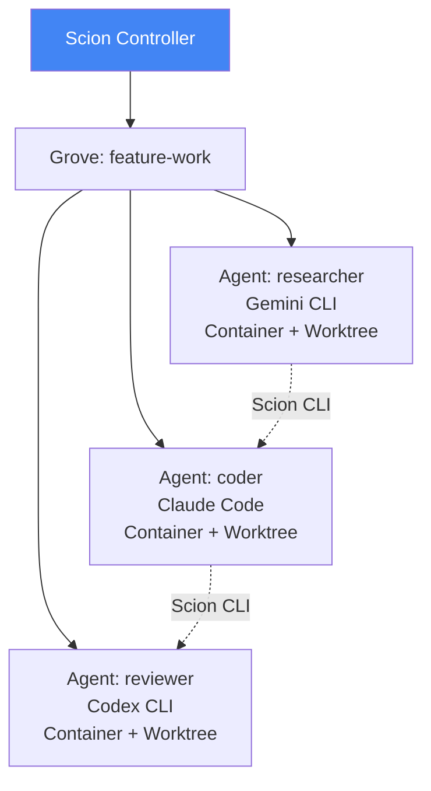
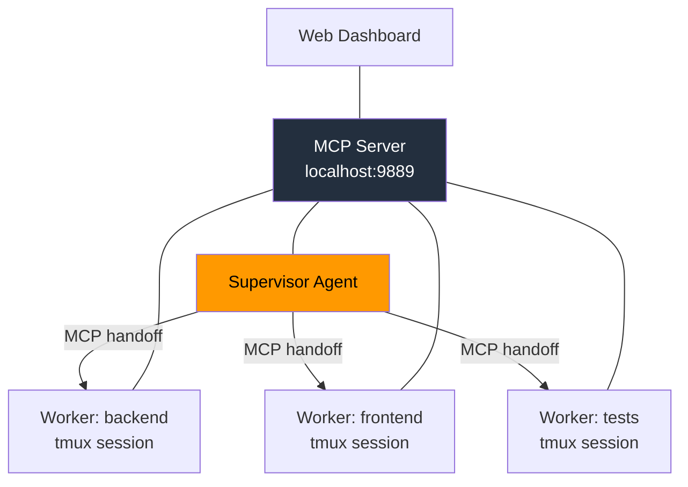
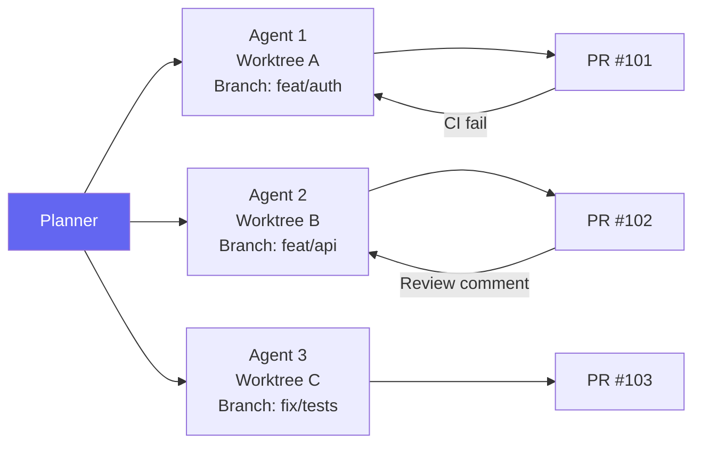
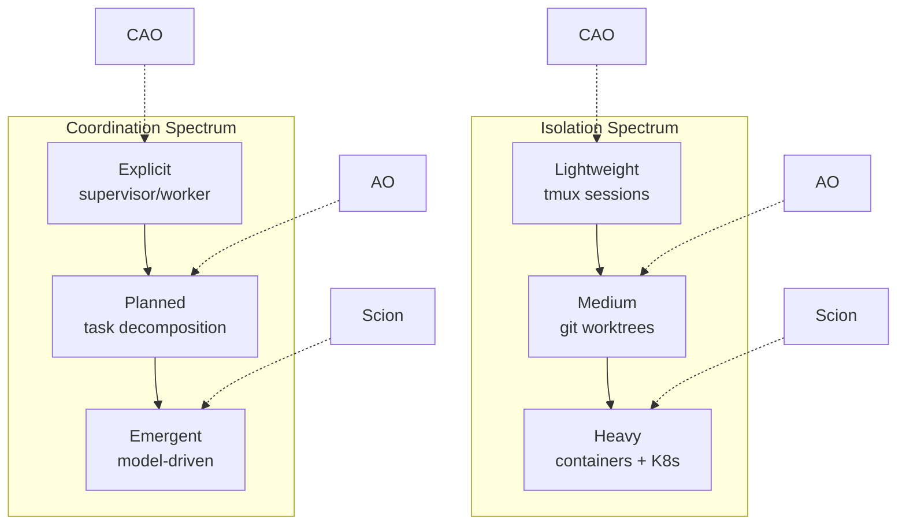

# The Agent Orchestrator Landscape: Scion, CAO, ComposioHQ, and Choosing Your Multi-Agent Runtime


---

Running a single Codex CLI session is productive. Running five in parallel — each with its own worktree, branch, and PR — is transformative. But the moment you scale beyond one agent, you need coordination: who works on what, how do they avoid conflicts, and what happens when CI breaks at 3 AM? Three serious orchestrators have emerged in April 2026 to answer these questions, each embodying a fundamentally different architectural philosophy.

## The Three Contenders

| | **Google Scion** | **AWS CAO** | **ComposioHQ AO** |
|---|---|---|---|
| **Released** | 7 April 2026 [^1] | April 2026 [^2] | Early 2026 [^3] |
| **Isolation model** | Container per agent | tmux session per agent | Git worktree per agent |
| **Coordination** | Emergent (agents learn CLI) | MCP server + supervisor | Planner + plugin slots |
| **Codex support** | Partial (stabilising) [^4] | First-class provider [^5] | Via agent plugin interface [^3] |
| **Runtimes** | Docker, Podman, Apple containers, K8s [^1] | tmux (local) | tmux (local) |
| **Stars (approx.)** | ~2K [^1] | ~1.5K [^2] | ~4.7K [^3] |

## Google Scion: The Container Hypervisor

Google describes Scion as a "hypervisor for agents" [^1] — infrastructure for running groups of specialised agents with isolated identities, credentials, and workspaces. It was open-sourced on 7 April 2026 under the GoogleCloudPlatform organisation [^1].

### Architecture

Each agent receives its own container, git worktree, and credentials [^6]. The worktree is created at `../.scion_worktrees/<grove>/<agent>` with a dedicated branch, then mounted into the container as `/workspace` [^6]. This means agents can execute arbitrary commands — including destructive ones — without affecting each other or the host.



### Design Philosophy

Scion's core tenet is "isolation over constraints" [^6]. Rather than embedding safety rules into agent prompts, it enforces guardrails at the infrastructure level — network policies, filesystem mounts, credential scoping. Agents are free to do whatever they need inside their sandbox.

Coordination is emergent: agents dynamically learn Scion's CLI tool, and the models themselves decide how to spawn sub-agents and distribute work [^1]. There is no hard-coded supervisor/worker hierarchy. This makes Scion uniquely flexible but also less predictable — you are relying on the model's judgement for task decomposition.

### Supported Harnesses

Gemini CLI and Claude Code have full integration [^4]. Codex CLI has partial support with recent stabilisation work including telemetry reconciliation, proper `auth.json` generation, and unified flag formatting [^4]. The Codex harness defaults to `--full-auto` approval mode with resume support [^4].

### When to Use Scion

Scion shines when you need **strong isolation** across heterogeneous agents — mixing Gemini, Claude, and Codex on the same project, potentially scaling to Kubernetes clusters [^6]. It is the right choice for enterprise teams who need container-level security boundaries and want vendor-agnostic orchestration. The trade-off: container overhead and an experimental stability profile.

## AWS CLI Agent Orchestrator (CAO): The Lightweight Supervisor

CAO (pronounced "kay-oh") [^2] takes a different approach: tmux sessions as the isolation primitive, with MCP as the coordination backbone.

### Architecture

A supervisor agent coordinates workflow management and delegates tasks to specialised worker agents [^2]. Each agent runs in an isolated tmux session, communicating through a shared MCP server [^7]. The MCP server identifies callers by their `CAO_TERMINAL_ID` and routes messages accordingly [^7].



### Role-Based Tool Control

CAO controls what tools each agent can use through role profiles [^7]. Built-in roles — `supervisor`, `developer`, `reviewer` — map to sensible defaults, whilst `allowedTools` provides fine-grained override [^7]. The `cao-server` runs on `http://localhost:9889` and exposes REST APIs for session management [^7].

```toml
# Example CAO agent profile
[agent.backend]
role = "developer"
provider = "codex"
allowedTools = ["file_read", "file_write", "bash"]

[agent.reviewer]
role = "reviewer"
provider = "claude-code"
allowedTools = ["file_read", "comment"]
```

### Codex CLI Integration

Codex CLI is a first-class provider in CAO [^5], with dedicated documentation covering configuration, authentication, and approval modes. CAO also supports Amazon Q Developer CLI, Claude Code, and Kiro CLI [^2].

### When to Use CAO

CAO is ideal when you want **explicit orchestration patterns** with minimal infrastructure overhead. No containers, no Kubernetes — just tmux and an MCP server. The supervisor/worker model is predictable and auditable. The web dashboard provides visibility into running agents. Best suited for teams already invested in the AWS ecosystem or those who prefer structured coordination over emergent behaviour.

## ComposioHQ Agent Orchestrator (AO): The Git-Native Automator

AO focuses on one thing above all else: **autonomous PR workflows**. Each agent gets a worktree, a branch, and a PR — then AO handles everything that follows [^3].

### Architecture

AO's architecture is built around eight pluggable abstraction slots [^8]: runtime, agent, workspace, tracker, SCM, notifier, terminal, and lifecycle. The default configuration (tmux + Claude Code + worktree + GitHub) requires zero setup beyond `ao init` [^8].



### Autonomous CI and Review Handling

This is AO's killer feature. When CI fails on a PR, the originating agent automatically receives the failure, diagnoses it, pushes a fix, and retries [^3]. When reviewers leave comments, those comments are routed back to the agent for resolution [^3]. This creates a closed loop that can run unattended for hours.

### CLI Interface

```bash
# Spawn an agent on a task
ao spawn --task "Implement OAuth2 flow" --agent claude-code

# Check status across all agents
ao status

# Send ad-hoc instructions to a running agent
ao send agent-1 "Also add rate limiting to the token endpoint"

# Open the web dashboard
ao dashboard
```

AO ships with 3,288 tests [^8] — notably more than either Scion or CAO — suggesting a more mature codebase despite the lower profile.

### When to Use AO

AO is the right choice when your primary workflow is **parallel PR generation with autonomous CI remediation**. It is git-native to its core: worktrees, branches, and PRs are first-class concepts rather than afterthoughts. The plugin architecture means you can swap Claude Code for Codex without changing your workflow. Best for teams running high-volume feature work where the bottleneck is PR throughput.

## Architectural Comparison



The three orchestrators sit at different points on two axes: **isolation weight** and **coordination style**. There is no universally correct position — the right choice depends on your constraints:

- **Regulatory/security requirements** push you towards Scion's container isolation
- **Existing tmux/MCP investment** makes CAO a natural extension
- **PR throughput optimisation** favours AO's git-native automation
- **Multi-vendor agent mixing** is currently best served by Scion

## Mapping to Agentic Pod Roles

For teams building agentic pods (persistent multi-agent teams), these orchestrators map to different pod architectures:

| Pod Role | Scion | CAO | AO |
|---|---|---|---|
| **Architect** | Grove coordinator | Supervisor agent | Planner |
| **Developer** | Container agent | Worker (developer role) | Spawned agent |
| **Reviewer** | Container agent | Worker (reviewer role) | Automated via PR comments |
| **CI Guardian** | Manual/hooks | MCP-triggered | Built-in CI loop |
| **Memory** | Agent memory (orthogonal concern) [^1] | Session context | ⚠️ Not yet documented |

## Getting Started with Codex CLI

All three orchestrators support Codex CLI to varying degrees. For the fastest path to parallel Codex agents:

1. **AO** — install via source, run `ao init`, spawn agents with `ao spawn --agent codex`
2. **CAO** — install via npm, configure a Codex provider profile, use MCP coordination [^5]
3. **Scion** — install Docker, configure a Codex harness with API key auth, launch a grove [^4]

## What to Watch

The orchestrator landscape is moving fast. Key developments to track:

- **Scion's Codex harness** graduating from partial to full support [^4]
- **OpenAI Symphony** — OpenAI's own orchestration layer, currently in preview [^9]
- **Convergence of MCP** as the standard coordination protocol across all three platforms
- **Kubernetes-native orchestration** as Scion matures its K8s runtime [^6]

The multi-agent future is not about picking one orchestrator forever — it is about understanding the trade-offs well enough to choose the right tool for each project's constraints.

## Citations

[^1]: [Google Open Sources Experimental Multi-Agent Orchestration Testbed Scion — InfoQ](https://www.infoq.com/news/2026/04/google-agent-testbed-scion/)
[^2]: [Introducing CLI Agent Orchestrator — AWS Open Source Blog](https://aws.amazon.com/blogs/opensource/introducing-cli-agent-orchestrator-transforming-developer-cli-tools-into-a-multi-agent-powerhouse/)
[^3]: [ComposioHQ/agent-orchestrator — GitHub](https://github.com/ComposioHQ/agent-orchestrator)
[^4]: [Supported Agent Harnesses — Scion Documentation](https://googlecloudplatform.github.io/scion/supported-harnesses/)
[^5]: [Codex CLI Provider Documentation — CAO](https://github.com/awslabs/cli-agent-orchestrator/blob/main/docs/codex-cli.md)
[^6]: [Scion Concepts — Scion Documentation](https://googlecloudplatform.github.io/scion/concepts/)
[^7]: [CLI Agent Orchestrator: When One AI Agent Isn't Enough — DEV Community](https://dev.to/pinishv/cli-agent-orchestrator-when-one-ai-agent-isnt-enough-dc9)
[^8]: [Agent Orchestrator Architecture Design — ComposioHQ](https://github.com/ComposioHQ/agent-orchestrator/blob/main/artifacts/architecture-design.md)
[^9]: [Competitive Landscape: AO vs T3 Code vs OpenAI Symphony vs Cmux — ComposioHQ Discussion](https://github.com/ComposioHQ/agent-orchestrator/discussions/526)
