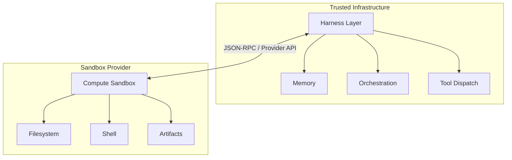
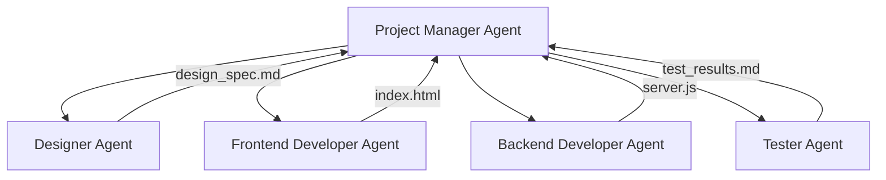

# The Agents SDK Harness and Portable Sandbox Manifests: Running Codex Workflows Across Seven Compute Providers


---

On April 16, 2026, OpenAI shipped the most significant update to the Agents SDK since its launch: a model-native harness that standardises how agents interact with filesystems, shells, and code editing tools, plus a `Manifest` abstraction that makes agent workspaces portable across seven sandbox providers[^1]. For Codex CLI users, this changes the deployment story entirely — you can now define an agent's workspace once and run it on E2B, Modal, Docker, Daytona, Cloudflare, Blaxel, Runloop, or Vercel without rewriting orchestration code.

This article breaks down the architecture, walks through practical Codex CLI integration patterns, and examines what portable sandboxes mean for enterprise agent deployment.

## The Harness-Compute Separation

The central design insight is splitting the *harness* (the agent's reasoning loop, tool dispatch, and memory) from the *compute* (where commands actually execute)[^2]. Prior to this update, most Agents SDK deployments co-located both: the agent ran in the same environment where it executed code. That works for prototyping but creates problems at scale — credential leakage, noisy-neighbour resource contention, and no way to swap providers without rewriting agent code.



In the separated model, the harness runs in trusted infrastructure (your CI runner, your Kubernetes cluster, your laptop) while compute runs in an isolated sandbox[^2]. Credentials remain outside the model-generated execution environment. If a sandbox crashes, the harness can snapshot state and rehydrate on a fresh instance.

## The Manifest Abstraction

A `Manifest` describes the fresh-session workspace contract — what files, directories, repositories, and storage mounts an agent needs before it starts working[^3]. It is declarative, provider-agnostic, and serialisable.

### Entry Types

| Entry | Purpose | Example |
|-------|---------|---------|
| `File` | Synthetic file with inline content | Config files, seed data |
| `Dir` | Empty directory placeholder | Output directories |
| `LocalFile` / `LocalDir` | Host filesystem materialisation | Source code, test fixtures |
| `GitRepo` | Repository fetch at sandbox creation | Cloning project repos |
| `S3Mount` / `GCSMount` / `R2Mount` / `AzureBlobMount` | Cloud storage mounts | Training data, large assets |
| `environment` | Environment variables | API keys, feature flags |
| `users` / `groups` | OS account provisioning | Permission-scoped execution |

### Defining a Manifest

```python
from agents.sandbox import Manifest
from agents.sandbox.entries import File, LocalDir, Dir

manifest = Manifest(entries={
    "src": LocalDir(src="/path/to/project"),
    "output": Dir(),
    "AGENTS.md": File(content=b"""# Project Agent Instructions
- Run tests with `cargo nextest run`
- Format with `cargo fmt --all`
- Never modify files in vendor/
"""),
})
```

The key design principle: workspace paths must be relative, never absolute[^3]. Mounts skip serialisation in snapshots, so credentials in cloud storage mounts are never persisted to disk.

## Sandbox Providers

The SDK ships with client classes for seven providers, plus a Unix-local option for development[^3]:

| Provider | Client Class | Best For |
|----------|-------------|----------|
| Unix-local | `UnixLocalSandboxClient` | Development, fast iteration |
| Docker | `DockerSandboxClient` | Local container isolation |
| E2B | `E2BSandboxClient` | Managed cloud execution |
| Modal | `ModalSandboxClient` | Serverless, burst workloads |
| Vercel | `VercelSandboxClient` | Frontend-heavy, built-in previews |
| Cloudflare | `CloudflareSandboxClient` | Edge execution, low latency |
| Daytona | `DaytonaSandboxClient` | Full development environments |
| Blaxel | `BlaxelSandboxClient` | AI-native execution |
| Runloop | `RunloopSandboxClient` | Devbox infrastructure |

Switching providers is a one-line change:

```python
from agents.run import RunConfig
from agents.sandbox import SandboxRunConfig
from agents.sandbox.sandboxes.e2b import E2BSandboxClient

run_config = RunConfig(
    sandbox=SandboxRunConfig(
        client=E2BSandboxClient()
    )
)
```

Replace `E2BSandboxClient()` with `ModalSandboxClient()` or `DockerSandboxClient(docker_from_env())` and everything else stays identical[^3].

## Capabilities: What the Harness Provides

The harness attaches *capabilities* to agents — standardised behaviours that work identically regardless of sandbox provider[^3]:

```python
from agents.sandbox.capabilities import (
    Shell, Filesystem, Compaction, Skills, Memory
)

agent = SandboxAgent(
    name="Codex Integration Agent",
    model="gpt-5.4",
    instructions="...",
    default_manifest=manifest,
    capabilities=[
        Shell(),           # Command execution
        Filesystem(),      # File read/write/edit, image inspection
        Compaction(),      # Context trimming for long runs
        Skills(),          # Skill discovery and materialisation
        Memory(),          # Persistent learning across runs
    ],
)
```

`Capabilities.default()` includes `Filesystem()`, `Shell()`, and `Compaction()`[^3]. The `Memory()` capability deserves attention — it generates artefacts (`MEMORY.md`, `memory_summary.md`, `raw_memories.md`) that persist agent learnings across sessions, conceptually similar to Codex CLI's own memory system[^4].

## Connecting Codex CLI via MCP

The most practical integration point for Codex CLI users is the MCP server bridge. Codex CLI exposes itself as an MCP server, and the Agents SDK can orchestrate it as a tool within a `SandboxAgent`[^5].

```python
from agents.mcp import MCPServerStdio
from agents.sandbox import SandboxAgent, Manifest
from agents.sandbox.entries import LocalDir

async with MCPServerStdio(
    name="Codex CLI",
    params={
        "command": "codex",
        "args": ["mcp-server"],
    },
    client_session_timeout_seconds=360000,
) as codex_mcp_server:
    agent = SandboxAgent(
        name="Project Architect",
        model="gpt-5.4",
        instructions="""You orchestrate development tasks.
Use the codex tool for code generation and the codex-reply
tool to continue conversations. Track threadIds for session
continuity.""",
        default_manifest=Manifest(
            entries={"project": LocalDir(src="./my-project")}
        ),
        mcp_servers=[codex_mcp_server],
    )
```

The Codex MCP server exposes two tools: `codex()` for initiating sessions (with `prompt`, `approval-policy`, `sandbox`, `model`, and `cwd` parameters) and `codex-reply()` for continuing them via `threadId`[^5]. This means you can run a Codex CLI agent *inside* a portable sandbox, getting both Codex's code generation capabilities and the harness's provider-agnostic isolation.

## Multi-Agent Orchestration Pattern

The OpenAI cookbook demonstrates a hierarchical pattern that maps cleanly onto enterprise workflows[^6]:



Each specialist agent uses Codex CLI via MCP for code generation, whilst the Project Manager enforces artefact-driven gating — it validates that `design_spec.md` exists before handing off to developers, and checks for `index.html` and `server.js` before invoking the tester[^6]. The critical detail is that all agents share the same `Manifest`, so they operate on the same workspace state.

```python
from agents import Agent, Runner
from agents.extensions.handoff_prompt import RECOMMENDED_PROMPT_PREFIX

project_manager = Agent(
    name="Project Manager",
    instructions=f"""{RECOMMENDED_PROMPT_PREFIX}
Coordinate the team. Validate artifacts exist before handoffs.
Use approval-policy 'never' and sandbox 'workspace-write'.""",
    model="gpt-5.4",
    mcp_servers=[codex_mcp_server],
    handoffs=[designer, frontend_dev, backend_dev, tester],
)

result = await Runner.run(
    project_manager,
    "Build a real-time dashboard with WebSocket backend",
    max_turns=30,
)
```

Multi-agent projects using this pattern typically complete in around 11 minutes[^6].

## Temporal Integration for Durable Workflows

For production deployments where agents must survive crashes, restarts, and long idle periods, Temporal provides a durability layer[^7]. The integration wraps the `SandboxAgent` in a Temporal workflow:

```python
# The idle loop — zero compute when waiting
while not self._done:
    await workflow.wait_condition(
        lambda: (len(self._pending_messages) > 0
                 or self._pause_requested
                 or self._done),
    )
```

When no messages are pending, the workflow consumes zero compute — it could idle for seconds or weeks[^7]. State persists indefinitely; crashes trigger replay from the last completed state.

The most compelling feature is session forking across sandbox providers. The `fork_session` operation pauses the source sandbox, snapshots workspace state, and launches a new workflow on a different provider — enabling Docker-to-Daytona transitions mid-conversation without losing context[^7]. A single Temporal worker can support Docker, Daytona, E2B, and local Unix environments simultaneously via the `OpenAIAgentsPlugin`[^7].

## Session State Management

The SDK resolves sandbox state in a defined priority order[^3]:

1. **Live session reuse** — `run_config.sandbox.session` points to an active sandbox
2. **Resumed RunState** — deserialised from a previous run's checkpoint
3. **Explicit serialisation** — `run_config.sandbox.session_state`
4. **Fresh session** — materialise from `manifest` or `agent.default_manifest`

This resolution chain means you can build workflows that resume exactly where they left off, even after provider switches or infrastructure failures.

## Enterprise Deployment Considerations

### Credential Isolation

The harness-compute separation directly addresses a common enterprise concern: API keys and database credentials never enter the sandbox[^2]. The harness manages authentication in trusted infrastructure, issuing only scoped, time-limited tokens to the sandbox. For Codex CLI's MCP bridge, this means the `OPENAI_API_KEY` stays in the harness process, not in the sandboxed Codex session.

### Audit and Observability

Every tool invocation, file operation, and handoff is captured in the OpenAI Traces dashboard[^6]. Combined with Codex CLI's own OpenTelemetry support[^8], you get end-to-end visibility from orchestration decision through to shell command execution. Enterprise teams running Codex CLI with the `[otel]` config block can correlate harness traces with agent-level spans.

### Cost Model

All harness and sandbox capabilities launch at standard API pricing with no separate tier required[^1]. The practical implication: you pay for model tokens and sandbox provider compute independently. Modal and E2B charge per-second; Docker and Unix-local are free (your own infrastructure). For teams already using Codex CLI with ChatGPT sign-in, the Agents SDK integration requires an API key — this is a separate cost centre from the subscription.

### Compliance

Sandbox isolation, credential separation, and audit-ready tracing address SOC 2 and GDPR requirements directly[^9]. The `Manifest` system's explicit workspace definition creates an auditable record of exactly what data entered each sandbox session. ⚠️ Specific compliance certifications for individual sandbox providers vary and should be verified independently.

## Comparison with Codex CLI Native Sandboxing

Codex CLI ships with its own sandbox system — bubblewrap on Linux, Seatbelt on macOS, restricted tokens on Windows[^10]. How does this relate to the Agents SDK harness?

| Dimension | Codex CLI Native | Agents SDK Harness |
|-----------|-----------------|-------------------|
| **Scope** | Single agent session | Multi-agent orchestration |
| **Isolation** | Process-level (bwrap/Seatbelt) | Provider-level (VM/container/edge) |
| **Portability** | Platform-specific | Seven providers + custom |
| **State management** | JSONL rollout files | Manifest + snapshots + Temporal |
| **Memory** | `~/.codex/memory/` | `MEMORY.md` artefacts in workspace |
| **Best for** | Interactive terminal use | Programmatic orchestration |

They are complementary, not competing. In a typical production setup, you would run the Agents SDK harness for orchestration, with Codex CLI as an MCP tool inside a sandboxed environment, whilst Codex CLI's own sandbox provides an additional inner isolation layer for shell commands.

## Getting Started

```bash
# Install dependencies
pip install openai-agents

# For Docker sandboxes
pip install 'openai-agents[docker]'

# For E2B
pip install 'openai-agents[e2b]'

# For Modal
pip install 'openai-agents[modal]'
```

The complete multi-agent example with Codex CLI MCP integration is available in the OpenAI cookbook[^6]. The Temporal durability extension ships in the official repository under `examples/sandbox/extensions/temporal`[^7].

## What This Means for Codex CLI Users

The Agents SDK harness does not replace Codex CLI — it extends its reach. Where Codex CLI excels at interactive, terminal-first agentic work, the harness adds programmatic orchestration with portable compute. The `Manifest` system solves the "it works on my machine" problem for agent deployments, and the seven-provider ecosystem means you are not locked into any single vendor.

For enterprise teams, this is the missing piece: a way to run Codex-powered agents in production with proper credential isolation, durable state management, and provider-agnostic deployment — all at standard API pricing.

---

## Citations

[^1]: [OpenAI Agents SDK harness and sandbox update](https://www.helpnetsecurity.com/2026/04/16/openai-agents-sdk-harness-and-sandbox-update/) — Help Net Security, April 16, 2026
[^2]: [OpenAI's Agents SDK separates the harness from the compute](https://thenewstack.io/openai-agents-sdk-sandboxes/) — The New Stack, April 2026
[^3]: [Sandbox Agents API documentation](https://developers.openai.com/api/docs/guides/agents/sandboxes) — OpenAI Developer Docs
[^4]: [The Next Evolution of the Agents SDK](https://www.agilesoftlabs.com/blog/2026/04/the-next-evolution-of-agents-sdk) — AgileSoft Labs, April 2026
[^5]: [Use Codex with the Agents SDK](https://developers.openai.com/codex/guides/agents-sdk) — OpenAI Developer Docs
[^6]: [Building Consistent Workflows with Codex CLI & Agents SDK](https://developers.openai.com/cookbook/examples/codex/codex_mcp_agents_sdk/building_consistent_workflows_codex_cli_agents_sdk) — OpenAI Cookbook
[^7]: [Introducing Temporal and agentic sandboxes: The OpenAI Agents SDK](https://temporal.io/blog/introducing-temporal-and-agentic-sandboxes-openai-agents-sdk) — Temporal Blog
[^8]: [Codex CLI changelog](https://developers.openai.com/codex/changelog) — OpenAI Developer Docs
[^9]: [OpenAI Agents SDK improves governance with sandbox execution](https://www.artificialintelligence-news.com/news/openai-agents-sdk-improves-governance-sandbox-execution/) — AI News, April 2026
[^10]: [Codex CLI sandbox documentation](https://developers.openai.com/codex/concepts/sandboxing) — OpenAI Developer Docs
