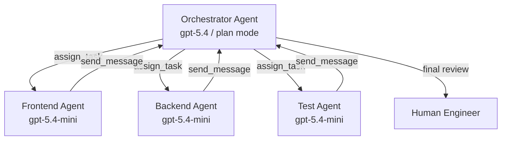
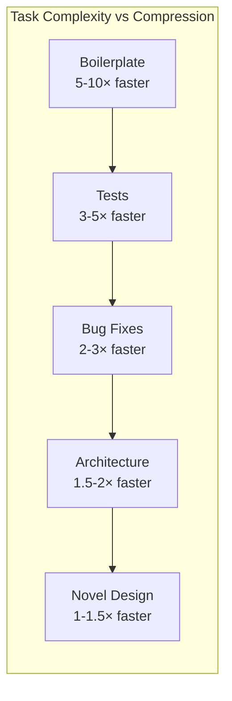

# Anthropic's Eight Agentic Coding Trends Through a Codex CLI Lens: A Practitioner's Response


---

Anthropic's *2026 Agentic Coding Trends Report*, published in March 2026, identifies eight trends reshaping how software gets built [^1]. Drawing on case studies from Rakuten, TELUS, Zapier, and CRED, the report argues that engineering is shifting from direct implementation toward agent orchestration and strategic oversight [^2]. While Anthropic naturally centres the narrative around Claude Code — which hit a \$1 billion annualised run rate faster than any previous AI tool [^3] — the trends themselves are tool-agnostic. Every one of them maps directly to Codex CLI capabilities that are shipping today.

This article walks through each trend, connects it to concrete Codex CLI features, and offers a practitioner's assessment of where the report gets it right, where it oversimplifies, and what it misses entirely.

## The Delegation Paradox

Before examining the eight trends, it is worth noting the report's most striking finding: developers use AI in roughly 60% of their work, yet report being able to fully delegate only 0–20% of tasks [^4]. Meanwhile, 27% of AI-assisted work consists of tasks that would not have been attempted otherwise — fixing papercuts, building internal dashboards, running experiments that were never worth the effort [^4].

This is the delegation paradox. AI dramatically expands what gets done without dramatically expanding what gets *trusted*. Every trend in the report should be read through this lens: the bottleneck is not capability but confidence.

## Trend 1: The Development Lifecycle Collapses

**Anthropic's claim:** Engineering roles are reorganising around agent supervision. Agents handle writing, testing, debugging, and documentation while engineers focus on architecture and decision-making [^1].

**In Codex CLI:** This is the `plan` → `auto-edit` → `full-auto` progression baked into the approval model. Plan mode forces architectural thinking before execution. Auto-edit delegates implementation whilst retaining review at each file change. Full-auto is the end state — but the report's own data suggests most teams are not there yet [^4].

```toml
# config.toml — progressive trust per profile
[profiles.architect]
approval_policy = "on-failure"
model = "gpt-5.4"

[profiles.implementer]
approval_policy = "unless-allow-listed"
model = "gpt-5.4-mini"
```

The practical pattern: senior engineers work in plan mode, setting the direction. Subagents execute in auto-edit. Nobody runs full-auto in production without execpolicy rules constraining what the agent can touch [^5].

## Trend 2: Single Agents Evolve Into Coordinated Teams

**Anthropic's claim:** Organisations are transitioning from single agents to hierarchical multi-agent teams. 57% of organisations now deploy multi-step agent workflows [^3].

**In Codex CLI:** Multi-agent v2 (GA since v0.117.0) provides the infrastructure for this trend [^6]. Path-based addressing (`/root/agent_a`), structured messaging via `send_message` and `assign_task`, and the `spawn_agents_on_csv` fan-out pattern enable exactly the orchestrator-worker topology the report describes.



Where the report undersells this: it does not mention the **cost implication** of multi-agent workflows. Each subagent carries its own context window. A five-agent fan-out on GPT-5.4 can consume \$15–30 in a single task [^7]. The `max_threads` and `job_max_runtime_seconds` guardrails in `[agents]` config exist precisely because unconstrained agent spawning is a billing hazard [^6].

## Trend 3: Agents Go End-to-End

**Anthropic's claim:** Agents expand from brief, isolated tasks to sustained work spanning hours or days, with human checkpoints at key milestones [^1].

**In Codex CLI:** Two features converge here. **Goal mode** (v0.122 alpha) introduces persistent objectives with token budgets and autonomous continuation — the agent pursues a high-level goal across multiple turns without re-prompting [^8]. **Thread automations** (v26.415) enable scheduled thread wake-ups, letting a Codex agent resume long-running work on a cron schedule [^9].

```toml
# Goal mode config (experimental, v0.122)
[goal]
token_budget = 500000
checkpoint_interval = "30m"
```

The critical missing piece the report glosses over: **context compaction**. Long-running agents inevitably hit context window limits. Codex CLI's two-tier compaction system (local `compact.rs` and server-side `/responses/compact`) handles this, but compaction is lossy [^10]. A 4-hour agent session that compacts three times may lose track of decisions made in hour one. The `compact_prompt` config key lets you specify what must survive compaction, which is essential for any end-to-end workflow.

## Trend 4: Agents Learn When to Ask for Help

**Anthropic's claim:** Newer agent systems detect uncertainty and flag risks, requesting human input at decision points rather than attempting everything independently [^1].

**In Codex CLI:** This maps to the three-tier approval model (`suggest` → `auto-edit` → `full-auto`) combined with MCP elicitations [^11]. When a custom MCP server encounters an ambiguous situation, it can trigger an `mcpServer/elicitation/request` to surface structured questions to the user. The agent pauses, asks, and resumes — exactly the "intelligent help-seeking" the report describes.

The AMBIG-SWE research from ICLR 2026 quantifies the problem: agents that do not ask clarifying questions drop their resolve rate from 48.8% to 28% [^12]. Codex CLI addresses this through plan mode (forced disambiguation before execution), steer mode (mid-turn correction), and AGENTS.md as ambient disambiguation (encoding project conventions so the agent does not need to ask) [^12].

Where this gets interesting: Codex and Claude Code approach the problem from opposite ends. Claude Code tends toward longer planning phases and more verbose reasoning. Codex CLI defaults to action, with approval gates as the safeguard [^13]. Neither is definitively better — the right choice depends on whether your team's bottleneck is speed or correctness.

## Trend 5: Agents Spread Beyond Software Engineers

**Anthropic's claim:** Agent support expands into legacy languages (COBOL, Fortran) and opens to security professionals, operations staff, designers, and data specialists [^1].

**In Codex CLI:** The new **Chats** feature (v26.415) directly enables this — projectless threads that operate without a codebase, suited for research, writing, planning, and tool-driven workflows [^14]. Combined with image generation via `gpt-image-1.5` and the 90+ new plugins (Atlassian Rovo, Microsoft Suite, Neon), Codex is deliberately expanding beyond its developer core [^15].

The CLI has always been surprisingly accessible. `codex exec "explain what this Terraform plan does" < plan.txt` requires no programming knowledge — just a terminal and a question [^16]. The barrier is cultural, not technical: non-engineers need to see coding agents as workflow tools, not developer tools.

## Trend 6: More Code, Shorter Timelines

**Anthropic's claim:** Delivery timelines compress. Work that once took weeks can be done in days, shifting which ideas get funded and built [^1].

**In Codex CLI:** TELUS saved 500,000 engineering hours and accelerated shipping by 30% [^3]. Rakuten completed a complex task in a 12.5-million-line library in 7 hours with 99.9% accuracy [^3]. These numbers are impressive but require context: both deployments involved significant investment in agent scaffolding — AGENTS.md files, custom skills, MCP server integration, and review pipelines.

The timeline compression is real but non-linear. Simple tasks (boilerplate generation, test writing, documentation) compress 5–10×. Complex architectural work compresses 1.5–2×. The net effect depends entirely on your codebase's agent-readiness — how well-structured your AGENTS.md is, how testable your code is, how mature your CI pipeline is [^17].



## Trend 7: Non-Engineers Embrace Agentic Coding

**Anthropic's claim:** Domain experts in sales, legal, marketing, and operations use agents to solve local process problems without waiting for engineering resources [^1]. Zapier achieved 89% AI adoption company-wide with 800+ deployed agents [^3].

**In Codex CLI:** This trend is where the CLI/App split matters most. Non-engineers are unlikely to adopt a terminal-based tool regardless of how capable it is. The Codex App's GUI, Chats feature, and plugin-driven workflows are the real enablers here [^14]. The CLI's role is infrastructure: skills and plugins built by engineers that non-engineers consume through the App's interface.

The Zapier 89% adoption figure is remarkable but should be contextualised: Zapier's entire business model is workflow automation. Their workforce self-selects for comfort with tools that connect systems. Extrapolating their adoption rate to a law firm or manufacturing company would be misleading.

## Trend 8: Agents Help Defenders — and Attackers — Scale

**Anthropic's claim:** Agentic tools present dual-use potential. Agents can conduct deeper code reviews and hardening, but the same capabilities scale for attackers [^1].

**In Codex CLI:** The Amplifying.ai benchmark (April 2026) exposed this starkly: in 12 sessions testing Claude Code (Opus 4.6) vs Codex (GPT-5.4), neither tool volunteered rate limiting (0/12), security headers (0/12), or rejected single-character passwords (9/12 accepted them) [^18]. The defence must be intentional.

Codex CLI's security surface includes execution policy rules (Starlark-based command governance), permission profiles (v0.122), governed repo mode, and `requirements.toml` for enterprise-mandated constraints [^5] [^19]. The cross-model review pattern — using Claude Code to review Codex output and vice versa — reduces single-model blind spots by 17% according to community benchmarks [^18].

```toml
# AGENTS.md security block (recommended)
## Security Requirements
- ALL endpoints MUST include rate limiting
- ALL user inputs MUST be validated and sanitised
- ALL API routes MUST include authentication
- Run OWASP dependency check before marking complete
- NEVER store secrets in code or config files
```

## What the Report Misses

Three significant omissions stand out:

**1. Cost governance.** The report celebrates productivity gains without acknowledging that multi-agent workflows can cost \$50–200 per complex task [^7]. Token budgets, model cascading (GPT-5.4 for planning, GPT-5.4-mini for execution), and reasoning effort tuning are essential practitioner concerns that the report ignores entirely.

**2. Context loss in long sessions.** Trend 3 (end-to-end agents) assumes agents maintain perfect context across hours of work. In practice, context compaction is lossy, and agents lose track of earlier decisions [^10]. The compaction-reread loop problem (issue #16812) has been documented in the Codex community and has no clean solution yet [^10].

**3. The open-source contribution crisis.** More agents generating more code creates more pull requests. The COBOL modernisation and non-engineer coding trends (5 and 7) will accelerate the "AI slopageddon" that has already overwhelmed open-source maintainers [^20]. Multiple major projects have adopted invitation-only contribution models specifically because of agent-generated PR floods [^20].

## The Practitioner's Take

Anthropic's report is directionally correct but operationally thin. The eight trends describe where the industry is heading. They do not describe how to get there without burning through your budget, losing context in long sessions, or shipping insecure code because your agent did not know to ask.

For Codex CLI users, the practical response to these trends is:

1. **Invest in AGENTS.md** — it is the single highest-leverage configuration for every trend in the report
2. **Use model cascading** — orchestrator on GPT-5.4, workers on GPT-5.4-mini, triage on Spark
3. **Set token budgets** — unconstrained agents are expensive agents
4. **Build security into AGENTS.md** — agents will not add security unless explicitly told to
5. **Measure before scaling** — multi-agent workflows are powerful but their cost scales non-linearly

The gap between Anthropic's vision and daily practice is not a technology problem. It is a configuration and governance problem. The tools exist. The challenge is using them deliberately.

## Citations

[^1]: Anthropic, "2026 Agentic Coding Trends Report," March 2026. [https://resources.anthropic.com/2026-agentic-coding-trends-report](https://resources.anthropic.com/2026-agentic-coding-trends-report)

[^2]: NYU Shanghai RITS, "Anthropic's 2026 Agentic Coding Trends Report: From Assistants to Agent Teams." [https://rits.shanghai.nyu.edu/ai/anthropics-2026-agentic-coding-trends-report-from-assistants-to-agent-teams](https://rits.shanghai.nyu.edu/ai/anthropics-2026-agentic-coding-trends-report-from-assistants-to-agent-teams)

[^3]: PassHulk, "Anthropic's 2026 Agentic Coding Trends: 8 Shifts Redefining Development." [https://passhulk.com/blog/anthropic-agentic-coding-trends-summary/](https://passhulk.com/blog/anthropic-agentic-coding-trends-summary/)

[^4]: Anthropic Societal Impacts research, cited in 2026 Agentic Coding Trends Report. Developers use AI in ~60% of work but fully delegate only 0–20% of tasks; 27% of AI-assisted work is additive.

[^5]: OpenAI, "Execution Policy Rules — Codex CLI." [https://developers.openai.com/codex/rules](https://developers.openai.com/codex/rules)

[^6]: OpenAI, "Subagents — Codex." [https://developers.openai.com/codex/subagents](https://developers.openai.com/codex/subagents)

[^7]: OpenAI, "Models — Codex." GPT-5.4 pricing at \$2.50/\$10 per 1M input/output tokens. [https://developers.openai.com/codex/models](https://developers.openai.com/codex/models)

[^8]: Codex CLI v0.122.0-alpha PRs for goal mode — persistent objectives with token budgets and autonomous continuation. [https://github.com/openai/codex/releases](https://github.com/openai/codex/releases)

[^9]: OpenAI, "Automations — Codex App." Thread automations enable scheduled agent wake-ups. [https://developers.openai.com/codex/app/automations](https://developers.openai.com/codex/app/automations)

[^10]: OpenAI, "Codex Changelog — Context Compaction." Two-tier compaction system (local compact.rs + server-side /responses/compact). [https://developers.openai.com/codex/changelog](https://developers.openai.com/codex/changelog)

[^11]: OpenAI, "Model Context Protocol — Codex." MCP elicitations enable server-driven structured user input. [https://developers.openai.com/codex/mcp](https://developers.openai.com/codex/mcp)

[^12]: AMBIG-SWE, ICLR 2026 (Carnegie Mellon). Agents that do not ask clarifying questions drop resolve rates from 48.8% to 28%.

[^13]: TokenCalculator, "Best AI IDE & CLI Tools April 2026." Codex CLI leads Terminal-Bench 2.0 at 77.3%; Claude Code leads SWE-bench at 80.9%. [https://tokencalculator.com/blog/best-ai-ide-cli-tools-april-2026-claude-code-wins](https://tokencalculator.com/blog/best-ai-ide-cli-tools-april-2026-claude-code-wins)

[^14]: OpenAI, "Features — Codex App." Chats are projectless threads for research, writing, and planning. [https://developers.openai.com/codex/app/features](https://developers.openai.com/codex/app/features)

[^15]: OpenAI, "Codex for (almost) everything," April 16, 2026. 90+ new plugins including Atlassian Rovo, CircleCI, CodeRabbit, GitLab Issues, Microsoft Suite. [https://openai.com/index/codex-for-almost-everything/](https://openai.com/index/codex-for-almost-everything/)

[^16]: OpenAI, "CLI — Codex." `codex exec` non-interactive scripting mode. [https://developers.openai.com/codex/cli](https://developers.openai.com/codex/cli)

[^17]: Tessl, "8 trends shaping software engineering in 2026 according to Anthropic's Agentic Coding Report." [https://tessl.io/blog/8-trends-shaping-software-engineering-in-2026-according-to-anthropics-agentic-coding-report/](https://tessl.io/blog/8-trends-shaping-software-engineering-in-2026-according-to-anthropics-agentic-coding-report/)

[^18]: Amplifying.ai benchmark, April 2026. 12 sessions testing Claude Code (Opus 4.6) vs Codex (GPT-5.4) on identical app-building tasks without security requirements.

[^19]: OpenAI, "Agent Approvals & Security — Codex." Permission profiles and governed repo mode. [https://developers.openai.com/codex/agent-approvals-security](https://developers.openai.com/codex/agent-approvals-security)

[^20]: Codex CLI Discussion #9956, invitation-only contribution model. Multiple projects adopted restrictive contribution policies due to AI-generated PR floods.
