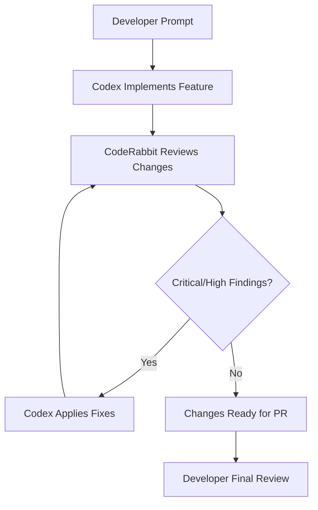
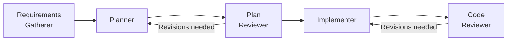

# The Automated Review-Fix Loop: CodeRabbit, Cross-Provider Review, and Closing the Quality Gap in Agent-Generated Code


Agent-generated code ships fast, but quality remains the bottleneck. The Hacker News consensus on Codex is blunt: the code "can be quite sloppy" and "requires multiple review passes" [^1]. The April 16 plugin wave — over 90 new plugins including CodeRabbit, Atlassian Rovo, CircleCI, and GitLab Issues [^2] — finally gives Codex CLI users the tooling to close this gap automatically, inside the same session where code is being written.

This article covers the three-level review-fix loop pattern: from manual slash commands through autonomous stop-hook loops to full multi-AI governance pipelines.

## Why Built-In `/review` Isn't Enough

Codex CLI's native `/review` command inspects diffs against a base branch or uncommitted changes and reports prioritised findings [^3]. It works well for a quick sanity check, but it has structural limitations:

- **Single-model sycophancy** — the same model that wrote the code is reviewing it. Research consistently shows LLMs are less critical of their own output [^4].
- **No pattern-specific detectors** — `/review` applies general reasoning rather than specialised analysis for race conditions, memory leaks, or framework-specific anti-patterns.
- **No autonomous remediation loop** — findings are reported but not automatically acted upon.

The review-fix loop pattern solves all three by introducing an independent reviewer and automating the iteration cycle.

## Level 1: CodeRabbit as a Codex Plugin

CodeRabbit's Codex plugin, released April 15 2026 [^5], embeds specialised code review directly into the agent session. Installation takes under a minute:

```bash
# Install the CodeRabbit CLI
curl -fsSL https://cli.coderabbit.ai/install.sh | sh

# Authenticate
coderabbit auth login

# Install the plugin from the Codex marketplace
# In Codex App: Plugins → Search "CodeRabbit" → Add to Codex
# In Codex CLI: /plugins → search → install
```

Once installed, a natural-language prompt triggers the full review pipeline:

```
Review my current changes with CodeRabbit
```

The agent handles prerequisite checks (CLI installed? authenticated?), executes the review against the working branch, and returns findings ordered by severity — all without leaving the session [^5].

### The Three Output Modes

CodeRabbit's CLI supports three output formats, each suited to different contexts [^6]:

```bash
coderabbit --agent          # Structured JSON for agent workflows
coderabbit --plain          # Human-readable terminal output
coderabbit --interactive    # Interactive TUI with navigation
```

The `--agent` flag is critical for plugin integration: it produces machine-parseable JSON that Codex can reason over, enabling the autonomous fix loop.

### The Review-Then-Fix Pattern

The real power emerges when you chain review and remediation in a single prompt:

```
Implement the authentication middleware, then review the changes with
CodeRabbit and fix any issues found. Repeat until no critical or high
severity findings remain.
```

Codex implements the feature, triggers CodeRabbit, reads the severity-ordered findings, applies fixes, and re-reviews — iterating until the quality bar is met. CodeRabbit detects race conditions, memory leaks, and logic errors that generic linting misses [^5], providing genuinely useful feedback rather than surface-level style complaints.



### AGENTS.md Integration

On CodeRabbit's Pro plan, the reviewer reads your `AGENTS.md` file for coding standards and architectural preferences [^6], ensuring reviews are calibrated to your project's conventions rather than generic best practices.

## Level 2: Cross-Provider Review with codex-plugin-cc

The sycophancy problem runs deeper than single-session review. OpenAI's official `codex-plugin-cc` [^7] enables a fundamentally different pattern: one model writes, another reviews.

The plugin exposes Codex as a tool within Claude Code sessions (and vice versa), enabling cross-provider review where GPT-5.4 reviews Claude Opus 4.7's output or Claude reviews Codex's implementation. This eliminates the self-review bias entirely.

### The SKILL.md Review Loop

The simplest cross-provider pattern uses a SKILL.md file to create a `/codex-review` slash command [^8]:

```bash
mkdir -p .claude/skills/codex-review
```

The skill writes a review plan to a temporary file, launches `codex exec` in read-only sandbox mode, and loops until the reviewer approves:

```bash
codex exec -m gpt-5.3-codex -s read-only \
  "Review the changes and respond with VERDICT: APPROVED or VERDICT: REVISE"
```

Key architectural decisions in this pattern:

- **Read-only sandbox** enforces separation between the reviewer and implementer roles
- **Session IDs** bound to temp file paths enable concurrent safety across multiple review loops
- **Maximum 5 rounds** prevents infinite loops when the implementer and reviewer disagree

### The Stop Hook Auto-Trigger

Hamel Husain's `claude-review-loop` plugin [^9] takes cross-provider review further by using Claude Code's Stop Hook to intercept session termination:

```json
{
  "hooks": {
    "Stop": [{
      "command": "./review-loop.sh",
      "timeout_ms": 900000
    }]
  }
}
```

When Claude Code attempts to finish, the hook fires, launching up to four parallel Codex sub-agents for review. If issues are found, the hook returns `{"decision": "block", "reason": "..."}` and feeds the review findings back to Claude for remediation. The loop continues until all reviewers approve.

⚠️ The default configuration uses `--dangerously-bypass-approvals-and-sandbox`. For production use, override via the `REVIEW_LOOP_CODEX_FLAGS` environment variable with `--sandbox read-only`.

## Level 3: Multi-AI Quality Gates for Teams

Enterprise teams need more than ad-hoc review loops. The third level introduces structured, multi-stage quality gates with governance controls.

### The Sequential Pipeline

The `claude-codex` plugin by Z-M-Huang implements a five-stage pipeline [^8]:



Each stage can use a different model and provider, with the pipeline looping until all reviewers approve. This maps directly to Codex CLI's multi-agent TOML configuration:

```toml
[agents.plan-reviewer]
model = "gpt-5.4"
sandbox_mode = "read-only"
instructions = "Review the implementation plan. Focus on architectural risks."

[agents.code-reviewer]
model = "gpt-5.3-codex"
sandbox_mode = "read-only"
instructions = "Review code changes. Check for security vulnerabilities, race conditions, and test coverage."
```

### GitHub Agent HQ Integration

For teams already using GitHub's Agentic Workflows, the review-fix loop integrates at the platform level [^10]. Copilot, Claude, and Codex can all be assigned to the same issue, with each agent producing independent implementations that compete for merge. The Codex Agent on GitHub supports automatic review via `@codex` mentions, with AGENTS.md steering the review criteria.

### Enterprise Governance Considerations

The Futurum Group's analysis of CodeRabbit's plugin raises valid concerns about embedded AI review in enterprise contexts [^11]:

- **Audit trails** — review findings must be persisted and traceable for compliance (SOC 2, HIPAA)
- **Customisable review policies** — teams need control over which rules are enforced vs advisory
- **Transparency** — AI review decisions require explainable rationales, not opaque severity scores

Codex CLI's `PostToolUse` hooks can capture review findings into structured logs [^12], and the `codex exec --json` JSONL output provides the raw event stream for compliance systems.

## Practical Configuration

A production-ready `config.toml` combining CodeRabbit with cross-provider review:

```toml
[model_providers.default]
model = "gpt-5.4"

[mcp_servers.coderabbit]
command = "coderabbit"
args = ["mcp-server"]
enabled = true

[[hooks.PostToolUse]]
command = "review-audit-logger.sh"
timeout_ms = 5000
```

Pair this with an AGENTS.md section:

```markdown
## Code Review Standards
- All changes MUST pass CodeRabbit review before PR creation
- Critical and high severity findings MUST be resolved
- Medium findings SHOULD be resolved; document exceptions
- Use `coderabbit --agent` for structured review output
```

## The Quality Ceiling Question

The review-fix loop pattern is powerful but not a silver bullet. Each iteration consumes tokens — a 5-round loop with CodeRabbit and a cross-provider reviewer can cost 3-5× a single implementation pass. The diminishing returns curve is steep: most value comes from the first review round, with subsequent rounds primarily catching edge cases introduced by the fixes themselves.

The pragmatic approach: use Level 1 (CodeRabbit plugin) for daily development, Level 2 (cross-provider) for security-sensitive or architecture-critical changes, and Level 3 (multi-AI pipeline) only for team-wide governance where the audit trail matters more than the token cost.

## Citations

[^1]: Hacker News discussion, "Ask HN: Is Codex really on Par with Claude Code?", April 2026. [https://news.ycombinator.com/item?id=47750069](https://news.ycombinator.com/item?id=47750069)
[^2]: OpenAI Codex Changelog, April 16 2026 — 90+ new plugins including Atlassian Rovo, CircleCI, CodeRabbit, GitLab Issues, Microsoft Suite. [https://developers.openai.com/codex/changelog](https://developers.openai.com/codex/changelog)
[^3]: OpenAI Codex CLI Features — Review mode documentation. [https://developers.openai.com/codex/cli/features](https://developers.openai.com/codex/cli/features)
[^4]: ETH Zurich, Gloaguen et al. — LLM-generated AGENTS.md files hurt performance by 3% while increasing costs 20-23%, demonstrating self-review bias. Referenced in existing knowledge base analysis.
[^5]: CodeRabbit, "CodeRabbit Plugin for Codex", April 15 2026. [https://www.coderabbit.ai/blog/coderabbit-plugin-for-codex](https://www.coderabbit.ai/blog/coderabbit-plugin-for-codex)
[^6]: CodeRabbit Documentation — Codex Integration. [https://docs.coderabbit.ai/cli/codex-integration](https://docs.coderabbit.ai/cli/codex-integration)
[^7]: OpenAI, `codex-plugin-cc` — Official Codex plugin for Claude Code enabling cross-provider review. [https://github.com/openai/codex-plugin-cc](https://github.com/openai/codex-plugin-cc)
[^8]: SmartScope, "Automating the Claude Code × Codex Review Loop — Three Levels", 2026. [https://smartscope.blog/en/blog/claude-code-codex-review-loop-automation-2026/](https://smartscope.blog/en/blog/claude-code-codex-review-loop-automation-2026/)
[^9]: Hamel Husain, `claude-review-loop` — Claude Code plugin for automated review with Codex. [https://github.com/hamelsmu/claude-review-loop](https://github.com/hamelsmu/claude-review-loop)
[^10]: GitHub Changelog, "Model selection for Claude and Codex agents on github.com", April 14 2026. [https://github.blog/changelog/2026-04-14-model-selection-for-claude-and-codex-agents-on-github-com/](https://github.blog/changelog/2026-04-14-model-selection-for-claude-and-codex-agents-on-github-com/)
[^11]: Futurum Group, "Does CodeRabbit's Codex Plugin Signal the End of Context-Switching in Code Review?", April 2026. [https://futurumgroup.com/insights/does-coderabbits-codex-plugin-signal-the-end-of-context-switching-in-code-review/](https://futurumgroup.com/insights/does-coderabbits-codex-plugin-signal-the-end-of-context-switching-in-code-review/)
[^12]: OpenAI Codex Hooks documentation — PostToolUse event reference. [https://developers.openai.com/codex/hooks](https://developers.openai.com/codex/hooks)
