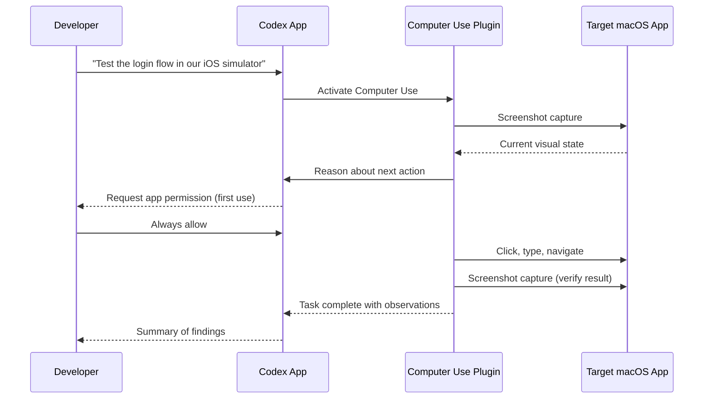
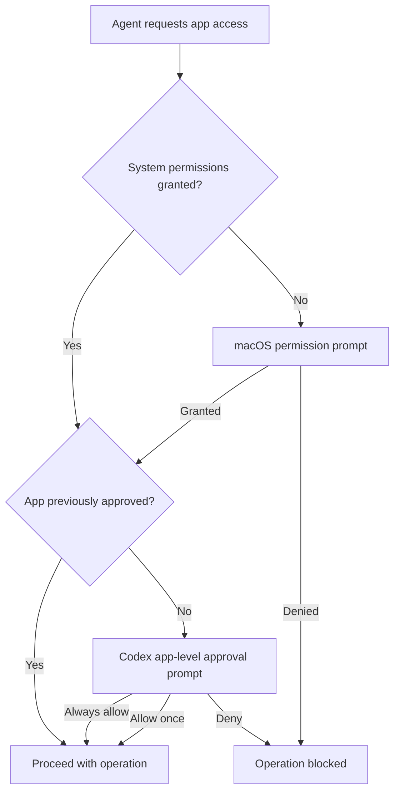
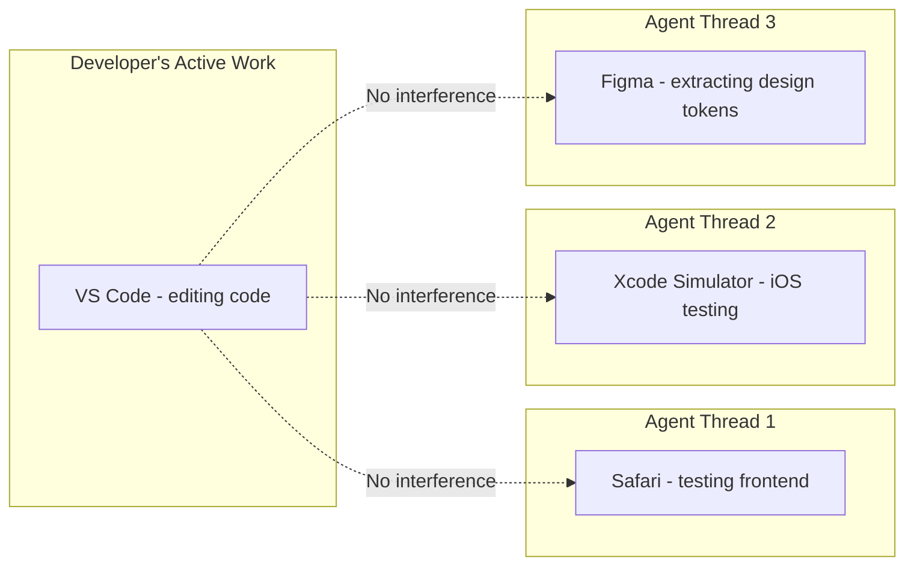
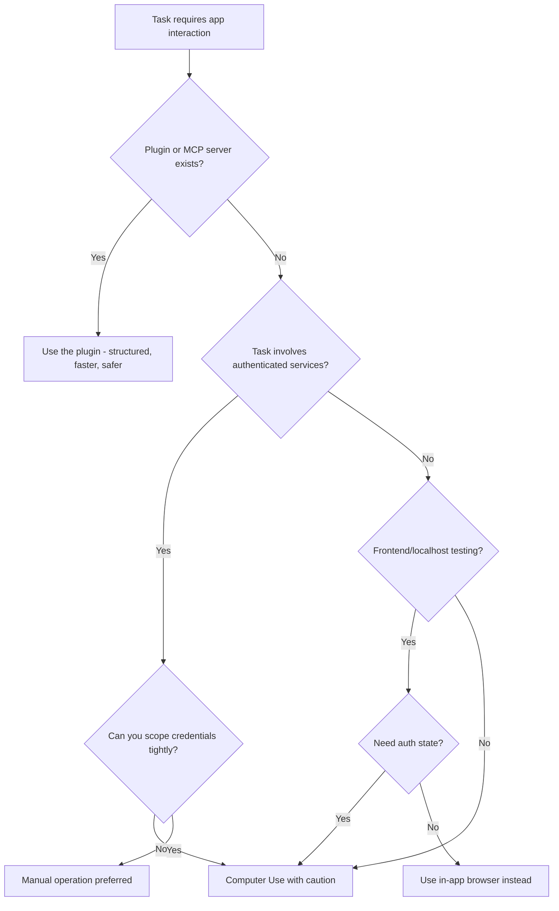

# Codex App Computer Use: Background GUI Automation on macOS Without Surrendering Your Desktop

On 16 April 2026, OpenAI shipped Computer Use in the Codex desktop app (version 26.415), enabling agents to operate macOS applications by seeing the screen, clicking, and typing with their own cursor — all running in the background without commandeering the user's desktop [^1][^2]. This is a fundamentally different proposition from both Anthropic's Claude Computer Use API (research preview since March 2026) and traditional GUI automation frameworks like Selenium or Accessibility Inspector scripts. Where Claude's implementation requires a dedicated virtual display or takes over the user's screen, Codex runs multiple agents in parallel against different applications whilst the developer continues working undisturbed [^3].

This article dissects the architecture, security model, practical workflows, and limitations of Codex App Computer Use for senior developers evaluating whether it belongs in their toolkit.

## How Computer Use Works

Computer Use operates as a **plugin** within the Codex desktop app, not as a built-in CLI feature [^4]. The agent captures screenshots of target application windows, reasons about the visual state using GPT-5.4's computer use capabilities (75% on OSWorld, surpassing the 72.4% human baseline) [^5], and dispatches mouse clicks, keyboard input, and clipboard operations to achieve the requested goal.

The key architectural choice is **background cursor isolation**. Each Codex agent thread gets its own cursor context, separate from the user's active cursor. This means you can continue writing code in your editor whilst an agent operates Safari, Xcode, or Figma in a different window [^3].

## Installation and Permissions

Computer Use requires two macOS system-level permissions [^4]:

1. **Screen Recording** — allows the plugin to capture application window contents
2. **Accessibility** — enables click, type, and window navigation operations

Installation is straightforward:

1. Open **Settings → Plugins** in the Codex app
2. Install the **Computer Use** plugin
3. Grant permissions when macOS prompts (verifiable in **System Settings → Privacy & Security**)

Beyond system permissions, Computer Use implements an **app-level approval system**. The first time Codex attempts to interact with any application, it requests explicit permission [^4]. You can select "Always allow" for trusted applications, creating a per-app allowlist managed in Codex settings.

## Invocation Patterns

There are three ways to trigger Computer Use within a Codex thread [^6]:

| Pattern | Example | When to Use |
|---|---|---|
| `@Computer Use` mention | "Using @Computer Use, check the layout in Safari" | Explicit invocation when multiple tools could apply |
| App name mention | "@Chrome navigate to localhost:3000" | When a dedicated plugin doesn't exist for the app |
| Implicit reference | "Test the login flow in the simulator" | Codex infers Computer Use is needed from context |

An important routing rule: if a dedicated plugin exists for the target application, Codex will prefer the plugin over Computer Use [^6]. This means `@Slack` routes to the Slack plugin (structured API access) rather than visually operating the Slack window. Computer Use acts as the **fallback** for applications without plugin coverage — which, despite the 111 new plugins shipped with 26.415 [^2], still represents the vast majority of desktop software.

## Background Parallel Execution

The headline capability is running multiple Computer Use agents simultaneously without disrupting the developer's workflow [^3]. Each agent operates on its own window context:

There is, however, a critical constraint: **do not run two Computer Use tasks against the same application simultaneously** [^6]. The visual context becomes unstable when two agents compete for the same window, leading to action conflicts and incorrect state reasoning.

## Security Model

Computer Use introduces a unique security surface that sits outside Codex's existing sandbox model:

### What the Sandbox Covers

File edits and shell commands executed during a Computer Use session still respect the standard Codex approval and sandbox settings [^4]. If your sandbox is configured for `workspace-write`, the agent cannot modify files outside the project directory even when triggered through a GUI workflow.

### What the Sandbox Does Not Cover

GUI operations themselves — clicking buttons, entering text, navigating menus — happen through macOS Accessibility APIs and are **not governed by the file-system sandbox** [^4]. A Computer Use agent interacting with a web browser inherits whatever authentication state that browser has. If you are signed into your production AWS console in Chrome, the agent can see and interact with it.

### Hard Restrictions

The plugin enforces four non-negotiable restrictions [^4]:

- **Cannot automate terminal applications** — prevents recursive self-invocation and sandbox bypass
- **Cannot control Codex itself** — blocks agents from approving their own operations
- **Cannot authenticate as administrator** — no sudo-equivalent GUI escalation
- **Cannot approve macOS security prompts** — system-level dialogs remain human-gated

### Practical Security Guidance

OpenAI's official documentation recommends [^4]:

1. Keep tasks narrowly scoped — avoid broad "do whatever is needed" prompts
2. Stay present during sensitive operations — Computer Use is not designed for unattended credential-touching workflows
3. Avoid concurrent secrets exposure — do not have password managers visible while agents are operating
4. Treat browser interactions as account-level actions — the agent acts with your logged-in identity

⚠️ There is currently no way to configure a separate browser profile or sandboxed browser instance for Computer Use. The agent operates against whatever browser state is visible, which creates a meaningful risk surface for authenticated services.

## The In-App Browser Alternative

Shipped alongside Computer Use, the Codex in-app browser (powered by Atlas) offers a more controlled alternative for web-based workflows [^7]. It supports previewing localhost development servers and public pages, with the ability to place comments directly on rendered elements for the agent to address.

Critically, the in-app browser **does not support** [^7]:

- Authentication flows
- Signed-in pages
- Browser profiles, cookies, or extensions
- Existing browser tabs

This makes it safer for frontend iteration — no risk of the agent encountering your production credentials — but useless for workflows requiring authenticated state.

| Capability | Computer Use (via Browser) | In-App Browser (Atlas) |
|---|---|---|
| Authenticated pages | ✅ Uses existing session | ❌ No auth support |
| localhost preview | ✅ | ✅ |
| Element-level comments | ❌ | ✅ |
| Production risk | Higher | Minimal |
| Plugin/MCP integration | ❌ Visual only | ❌ Visual only |

For frontend development loops, the in-app browser is the safer choice. For testing authenticated flows or interacting with desktop applications, Computer Use is the only option.

## Codex vs Claude: Computer Use Compared

Anthropic shipped Claude Computer Use as a research preview on 23 March 2026, with Claude Opus 4.7 (released 16 April 2026) achieving 98.5% visual acuity [^8][^9]. The two implementations differ architecturally:

| Aspect | Codex Computer Use | Claude Computer Use |
|---|---|---|
| **Delivery** | Desktop app plugin | API (beta tool) |
| **Execution** | Background, multi-agent | Takes over display or requires virtual display |
| **Model** | GPT-5.4 (75% OSWorld) [^5] | Opus 4.7 (98.5% visual acuity) [^9] |
| **Platform** | macOS only | Platform-agnostic (API-driven) |
| **Auth model** | App-level permission prompts | Developer-managed containers |
| **Parallel agents** | ✅ Multiple agents, separate cursors | Requires separate virtual displays |
| **CLI integration** | Desktop app only (no `codex exec`) | Via API + SDK |
| **Regional availability** | Not in EEA/UK/Switzerland [^4] | Generally available |

Claude's API-driven approach gives developers more control — you can run it in a Docker container with a virtual framebuffer, isolating it from your real desktop entirely. Codex's approach trades that isolation for convenience: no container setup, no virtual displays, just grant permissions and go.

⚠️ The regional restriction is significant. Developers in the EU, UK, and Switzerland cannot use Codex Computer Use at launch, whilst Claude Computer Use has no such restriction [^4].

## Practical Workflow: iOS Simulator Testing

A concrete example combining Computer Use with standard Codex capabilities:

1. **Thread setup**: Open a project thread for your iOS app
2. **Build**: Ask Codex to build and launch the app in the iOS Simulator (standard shell command)
3. **Visual testing**: "Using @Computer Use, navigate through the onboarding flow in the iOS Simulator and report any layout issues on smaller screen sizes"
4. **Fix**: Codex identifies a truncated label on iPhone SE, edits the SwiftUI view (standard file edit with sandbox approval)
5. **Verify**: "Check the fix in the simulator" — Computer Use re-launches and verifies

This workflow mixes shell commands (governed by sandbox), file edits (governed by approval mode), and GUI operations (governed by Computer Use permissions) in a single thread. The sandbox and approval settings remain enforced for steps 2 and 4; only step 3 and 5 operate through the Computer Use permission layer.

## Thread Automations and Computer Use

With thread automations (also shipped in 26.415), Computer Use workflows can be scheduled [^7]. A thread automation preserves the full conversation context across scheduled runs. Combined with Computer Use, this enables patterns like:

- **Nightly visual regression**: Schedule a thread to launch the development server, navigate key pages via Computer Use, and screenshot the results for comparison
- **Periodic monitoring**: Wake a thread every hour to check a dashboard application for anomalies
- **Cross-day testing**: Resume a testing thread the next morning, with the agent already aware of yesterday's findings

⚠️ Automated Computer Use tasks require the Mac to remain unlocked and the target applications to remain accessible. If the Mac locks during a scheduled automation, the Computer Use operation fails silently [^6].

## Known Limitations

- **macOS only** — no Windows or Linux support at launch [^4]
- **No EEA/UK/Switzerland availability** — regulatory constraints [^4]
- **No CLI integration** — Computer Use is a desktop app plugin; `codex exec` cannot trigger it [^4]
- **No browser profile isolation** — agents use whatever browser state is visible [^4]
- **No same-app parallelism** — two agents cannot operate the same application concurrently [^6]
- **Mac must remain unlocked** — screen lock terminates Computer Use operations [^6]
- **Desktop app changes are opaque** — GUI modifications do not appear in the Codex review pane until saved to disk [^4]
- **No terminal automation** — by design, to prevent sandbox bypass [^4]

## When to Use Computer Use (and When Not To)

The decision hierarchy from OpenAI's own documentation is clear: plugins and MCP servers first, Computer Use as a fallback for GUI-only workflows [^4]. Senior developers should resist the temptation to use Computer Use for everything — it is slower, less reliable, and harder to reproduce than structured API or CLI interactions.

## Citations

[^1]: [OpenAI (@OpenAI) on X, 16 April 2026](https://x.com/OpenAI/status/2044827932145897652) — "With computer use on macOS, Codex can now use any app by seeing, clicking, and typing with its own cursor."
[^2]: [9to5Mac — "OpenAI's Codex app adds three key features for expanding beyond agentic coding", 16 April 2026](https://9to5mac.com/2026/04/16/openais-codex-app-adds-three-key-features-for-expanding-beyond-agentic-coding/)
[^3]: [The Decoder — "OpenAI turns Codex into an always-on coding agent that watches your screen", April 2026](https://the-decoder.com/openai-turns-codex-into-an-always-on-coding-agent-that-watches-your-screen/)
[^4]: [OpenAI Developers — "Computer Use – Codex app"](https://developers.openai.com/codex/app/computer-use)
[^5]: [OpenAI — GPT-5.4 benchmarks; OSWorld 75% surpassing human 72.4% baseline](https://openai.com/index/introducing-upgT-5-4/) ⚠️ Benchmark figure from existing article #137; primary source may have been updated
[^6]: [OpenAI Developers — "Use your computer with Codex" use case guide](https://developers.openai.com/codex/use-cases/use-your-computer-with-codex)
[^7]: [OpenAI Developers — "Features – Codex app"](https://developers.openai.com/codex/app/features)
[^8]: [Anthropic — Claude Computer Use research preview, March 2026](https://platform.claude.com/docs/en/agents-and-tools/tool-use/computer-use-tool)
[^9]: [GitHub Changelog — "Claude Opus 4.7 is generally available", 16 April 2026](https://github.blog/changelog/2026-04-16-claude-opus-4-7-is-generally-available/) — 98.5% visual acuity for computer use
