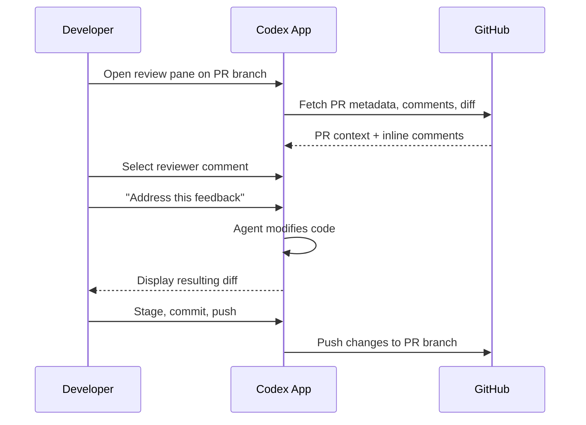
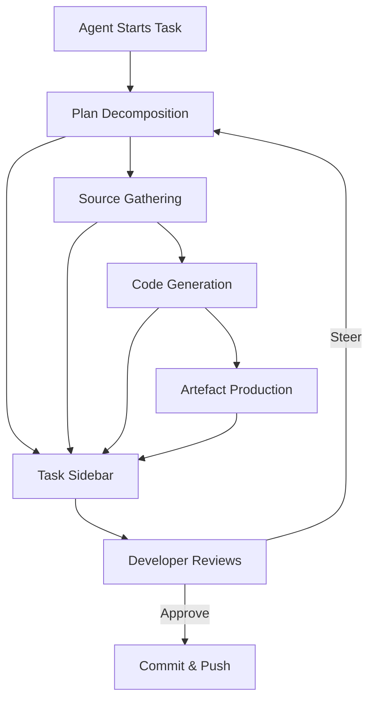

# Inside the Codex App Workspace: PR Review Pane, Task Sidebar, and Artifact Viewer in Platform 26.415


---

Platform 26.415, released on 16 April 2026, added three workspace features to the Codex App that shift it from a terminal-with-AI towards a unified development surface[^1]. The PR review pane brings GitHub review comments into the editor. The task sidebar exposes the agent's plan, sources, and generated artefacts in real time. The artifact viewer previews non-code outputs — PDFs, spreadsheets, slide decks — without leaving the window. Together with projectless chats and deeper Git integration, these features mean developers can now research, code, review, and ship from a single interface.

This article walks through each feature, its configuration, and the workflows it enables.

## The PR Review Pane

### What It Does

The review pane pulls GitHub pull request context — reviewer comments, changed files, and diffs — directly into the Codex App sidebar[^2]. Comments appear inline alongside the diff, so you can point Codex at a specific piece of feedback and ask it to address the issue in the current thread[^3].

### Prerequisites

The feature requires three things:

1. **GitHub CLI (`gh`) installed and authenticated** — run `gh auth login` if you haven't already[^2].
2. **Your project checked out on the PR branch** — the app reads the current branch to locate the corresponding pull request.
3. **Codex has GitHub access** to the repository — either via the GitHub integration in Codex settings or through your `gh` session.

If authentication is missing or incomplete, the review pane loads but PR details will be absent.

### Workflow



The key insight is that inline comments give the agent far more precise context than a general instruction like "fix the review feedback"[^3]. Each comment is anchored to specific lines, so Codex can scope its changes tightly rather than guessing what the reviewer meant.

### Automatic Reviews via GitHub Integration

For teams that want Codex to review every PR before a human does, the GitHub integration supports two modes[^4]:

- **Manual**: comment `@codex review` on any pull request.
- **Automatic**: enable "Automatic reviews" in Codex settings to trigger reviews on every new PR.

Codex reacts with a 👀 emoji, then posts a standard GitHub code review covering regressions, missing tests, security issues, and documentation gaps[^4]. Reviewers see only P0 and P1 issues by default — to surface lower-priority findings like typos, add explicit guidance in your `AGENTS.md`[^5].

When a review comment needs fixing, `@codex fix it` spawns a cloud task that resolves the issue and pushes an update to the PR[^4].

### AGENTS.md Review Guidelines

Custom review behaviour is controlled through a `Review guidelines` section in `AGENTS.md`[^5]:

```markdown
## Review guidelines

- Flag typos and grammar issues as P0 issues
- Flag potential missing documentation as P1 issues
- Flag missing tests as P1 issues
- Don't log PII. Verify that authentication middleware wraps every route.
```

The system applies guidance from the closest `AGENTS.md` to each changed file, so you can place broad rules at the repository root and package-specific scrutiny deeper in the directory tree[^5]. The optional "Security Best Practices" skill focuses reviews on secrets, authentication flows, and dependency changes[^4].

## The Task Sidebar

### What It Does

The task sidebar is a live panel that surfaces the agent's plan, sources, generated artefacts, and task summary while Codex works[^6]. Rather than watching a stream of tool calls scroll past, you get a structured view of what the agent is doing, what it has produced, and what it intends to do next.

### Key Capabilities

- **Plan visibility**: see the agent's decomposed steps and current progress.
- **Source tracking**: view which files, URLs, or context the agent has consulted.
- **Artefact inspection**: open generated files directly from the sidebar.
- **Summary**: a concise overview of the task's state, useful when returning to a thread after a break.
- **Context-aware suggestions**: the sidebar can propose relevant follow-ups when you start or return to Codex[^1].

### Practical Patterns

The task sidebar is most valuable during longer-running agent sessions — goal mode tasks, multi-file refactors, or cloud agent operations. Instead of scrolling through the conversation to find what the agent changed, you check the sidebar for the artefact list and click through to inspect each file.

For team leads reviewing agent work, the summary provides a quick audit trail: what was the objective, what sources informed the decision, and what was produced.



## The Artifact Viewer

### What It Does

The artifact viewer previews non-code generated files in the sidebar — PDFs, spreadsheets, documents, and presentations — before you commit or share them[^6]. This is particularly useful for agents generating reports, data exports, or documentation artefacts.

### Usage

You describe the structure you want — sheets, columns, charts, slide sections, validation checks — and Codex generates the file[^6]. The viewer renders a preview inline, so you can inspect the output and request revisions in the same thread without opening an external application.

This closes a workflow gap where agents could generate `.xlsx` or `.pdf` files but you had to manually open them to verify the output. Now verification happens in-context, keeping the feedback loop tight.

## Projectless Chats

### What They Are

Chats are threads you start without choosing a project folder first[^7]. They use a Codex-managed threads directory (`~/.codex/threads` by default) and are designed for work that doesn't belong to a specific codebase:

- **Research and triage**: investigate a bug report across multiple repositories before deciding where to fix it.
- **Planning**: draft an architecture document or RFC.
- **Plugin-heavy workflows**: run skills and MCP tools without needing a project context.
- **Analysis**: process data, generate reports, or collect sources.

### Projects vs Chats

| Aspect | Projects | Chats |
|---|---|---|
| Directory | Scoped to a specific folder | `~/.codex/threads` |
| Git integration | Full (diff, stage, commit, push, PR) | None |
| Sandbox | Project-scoped | Codex-managed |
| Use case | Coding, refactoring, reviews | Research, planning, analysis |

The distinction matters because projects carry the full trust model — sandbox policies, `AGENTS.md`, config layering — while chats operate in a lighter context suitable for exploratory work.

## Deeper Git Integration

Platform 26.415 also expanded the app's built-in Git tooling[^6]:

- **Diff pane**: displays changes with inline commenting. You can add comments on specific code chunks and ask Codex to address them.
- **Staging and reverting**: stage or revert individual chunks or entire files from the diff view.
- **Commit, push, and PR creation**: complete the Git workflow without switching to a terminal.
- **Multiple terminal tabs**: run builds, tests, or Git commands in parallel terminals scoped to the current project.

Combined with the PR review pane, this means the entire pull request lifecycle — branch, code, test, review, fix, push — can happen within the Codex App window.

## Multi-Window and Multi-Project

A single Codex window can manage multiple projects simultaneously, each functioning like a CLI session scoped to a specific directory[^7]. With the addition of multi-window support in 26.415[^1], you can run parallel projects across separate windows — useful for monorepo workflows where you need to coordinate changes across packages.

Three operating modes are available per project[^7]:

- **Local**: direct work in the current project directory.
- **Worktree**: an isolated Git worktree for parallel changes without affecting the main working tree.
- **Cloud**: remote execution in a configured environment.

## IDE Synchronisation

When the Codex IDE Extension is active in the same project, the app and editor automatically synchronise[^7]. Threads, file context, and agent state are shared, so you can start a task in VS Code and continue it in the Codex App — or vice versa — without losing context.

## What This Means for CLI Users

These features are App-exclusive — the CLI remains focused on terminal workflows. But the architectural direction is clear: the App is becoming the primary surface for interactive development, while the CLI serves automation (`codex exec`), CI/CD pipelines, and developers who prefer terminal-first workflows.

For teams evaluating which surface to standardise on, the decision framework is straightforward:

- **App**: PR reviews, artefact generation, multi-project coordination, visual inspection.
- **CLI**: scripting, pipelines, headless environments, SSH sessions, Unix composition.
- **Both**: the IDE extension bridges them, synchronising context across surfaces.

## Citations

[^1]: OpenAI, "Introducing upgrades to Codex," April 16 2026. [https://openai.com/index/introducing-upgrades-to-codex/](https://openai.com/index/introducing-upgrades-to-codex/)

[^2]: OpenAI Developers, "Review — Codex App," April 2026. [https://developers.openai.com/codex/app/review](https://developers.openai.com/codex/app/review)

[^3]: OpenAI Developers, "Features — Codex App," April 2026. [https://developers.openai.com/codex/app/features](https://developers.openai.com/codex/app/features)

[^4]: OpenAI Developers, "Review pull requests faster — Codex use cases," April 2026. [https://developers.openai.com/codex/use-cases/github-code-reviews](https://developers.openai.com/codex/use-cases/github-code-reviews)

[^5]: OpenAI Developers, "Use Codex in GitHub," April 2026. [https://developers.openai.com/codex/integrations/github](https://developers.openai.com/codex/integrations/github)

[^6]: OpenAI Developers, "Codex Changelog — Platform 26.415," April 16 2026. [https://developers.openai.com/codex/changelog](https://developers.openai.com/codex/changelog)

[^7]: 9to5Mac, "OpenAI's Codex Mac app adds three key features that go beyond agentic coding," April 16 2026. [https://9to5mac.com/2026/04/16/openais-codex-app-adds-three-key-features-for-expanding-beyond-agentic-coding/](https://9to5mac.com/2026/04/16/openais-codex-app-adds-three-key-features-for-expanding-beyond-agentic-coding/)
