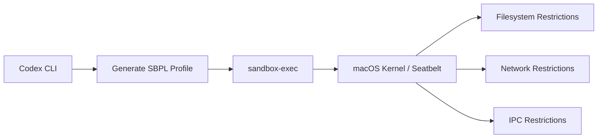
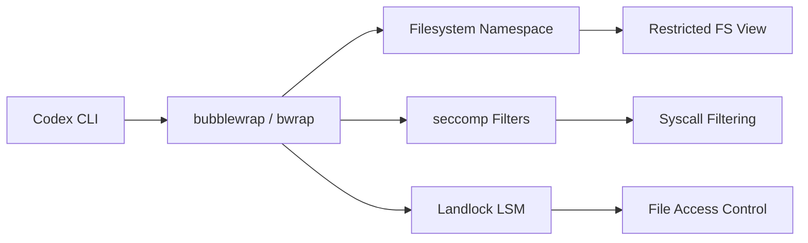
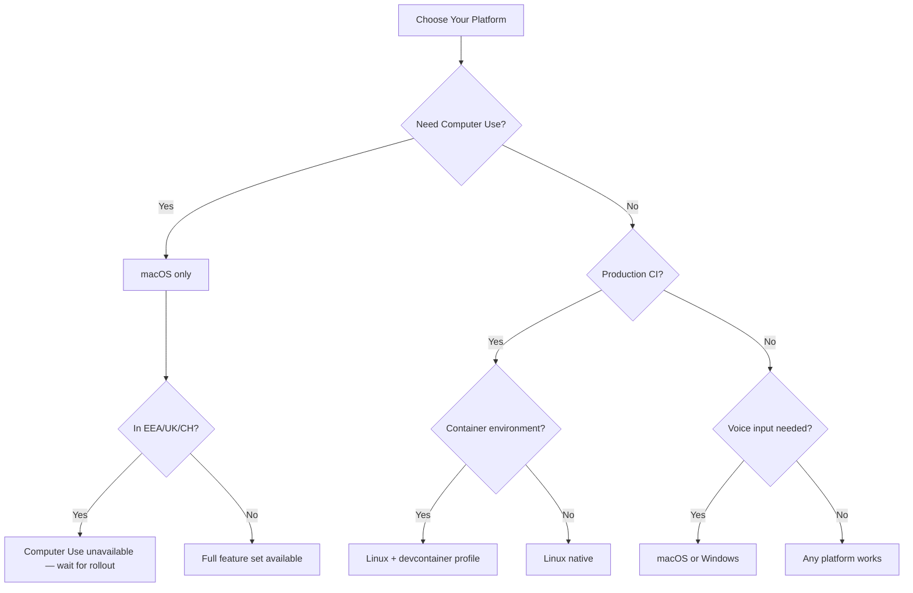

# The macOS Premium: Which Codex Features Only Work on Apple Hardware


---

Codex CLI markets itself as a cross-platform terminal agent — macOS, Linux, and Windows via WSL2. That's technically true: the core coding agent works everywhere. But once you move beyond `codex "fix this bug"`, you'll find that significant features ship macOS-first, some never leave it, and the sandbox implementations differ in ways that matter for CI pipelines and enterprise deployments. This article maps the full platform disparity as of CLI 0.121.0 and App 26.415 (April 2026).

## The Platform Feature Matrix

| Feature | macOS | Linux | Windows (Native) | Windows (WSL2) |
|---|---|---|---|---|
| Core agent loop | ✅ | ✅ | ✅ (experimental) | ✅ |
| Sandbox enforcement | Seatbelt | bubblewrap + seccomp | AppContainer (experimental) | bubblewrap + seccomp |
| Computer Use | ✅ (not EEA/UK/CH) | ❌ | ❌ | ❌ |
| Voice input (Wispr) | ✅ | ❌ | ✅ | ❌ |
| Memory & context | ✅ (not EEA/UK/CH) | ✅ | ✅ | ✅ |
| MCP servers | ✅ | ✅ | ✅ | ✅ |
| Desktop app | ✅ | ❌ | ✅ | N/A |
| Menu bar / system tray | ✅ | ❌ | ✅ | N/A |
| Codex exec | ✅ | ✅ | Partial | ✅ |

The pattern is clear: Linux gets full CLI parity but misses every GUI-dependent feature. Windows native remains experimental across the board. WSL2 inherits Linux's sandbox maturity but can't bridge to Windows-side GUI features [^1].

## Sandbox Deep Dive: Seatbelt vs bubblewrap

Both platforms enforce the same three permission levels — `read-only` (suggest mode), `workspace-write` (default), and `danger-full-access` — but the enforcement mechanisms are fundamentally different [^2].

### macOS: Seatbelt

On macOS, Codex generates a Sandbox Profile Language (SBPL) script dynamically and passes it to `sandbox-exec`. Apple's Seatbelt framework enforces kernel-level restrictions without requiring any additional installation [^3]. The sandbox profile is tailored per permission level: in `workspace-write` mode, write access is restricted to the project directory and Codex's own data paths, with network access limited to the OpenAI API endpoint.

Recent improvements in CLI 0.121.0 replaced the old generic Unix-socket path rule with explicit `AF_UNIX` permissions for socket creation, bind, and outbound connect. This fixed reliability issues with MCP servers and local helper processes that use IPC sockets [^4].



For debugging, `codex debug seatbelt <command>` lets you test arbitrary commands through the sandbox before running them in a real session [^5].

### Linux: bubblewrap + seccomp + Landlock

Linux sandboxing is a layered stack. The primary mechanism is bubblewrap (`bwrap`), which constructs a restricted filesystem namespace. On top of that, seccomp filters block dangerous syscalls, and Landlock LSM provides an additional filesystem access control layer [^6].

bubblewrap must be installed separately:

```bash
# Ubuntu/Debian
sudo apt install bubblewrap

# Fedora
sudo dnf install bubblewrap
```

If no `bwrap` executable is found on `PATH`, Codex falls back to a bundled helper — but this requires unprivileged user namespace support in the kernel [^2]. Starting from CLI 0.115.0, WSL1 is no longer supported because the sandbox moved exclusively to bubblewrap [^7].



A legacy Landlock-only mode is still available via `features.use_legacy_landlock = true`, though it has a known regression in v0.121.0 where `apply_patch` fails for workspace edits [^8].

### Windows: AppContainer (Experimental)

Native Windows gained an AppContainer-based sandbox in early 2026 that restricts filesystem writes and blocks network access by default [^9]. It's labelled experimental by OpenAI and lacks the maturity of either the Seatbelt or bubblewrap implementations. For production workloads on Windows, WSL2 remains the recommended path — it provides the same bubblewrap/seccomp stack as native Linux [^7].

## Computer Use: macOS Exclusive

Computer Use is the most significant macOS-exclusive feature. Shipped in Codex App 26.415 (16 April 2026), it allows Codex to see and operate graphical user interfaces — clicking, typing, navigating menus, and taking screenshots of desktop applications [^10].

### How It Works

The feature requires two macOS system permissions:

1. **Screen Recording** — allows Codex to capture the target application's window
2. **Accessibility** — enables synthetic clicks, keystrokes, and navigation

These are granted via System Settings → Privacy & Security when first prompted [^10].

### What It Cannot Do

- Automate terminal apps or Codex itself
- Authenticate as administrator
- Approve security/privacy permission prompts
- Bypass existing Codex sandbox settings for file edits and shell commands [^10]

### Regional Restrictions

Computer Use is unavailable in the European Economic Area, United Kingdom, and Switzerland at launch, due to privacy regulation compliance requirements. OpenAI has indicated broader rollout will follow once regulatory requirements are met [^11].

There is no timeline for Linux or Windows support. The feature's dependency on macOS Accessibility APIs and Screen Recording frameworks makes a straightforward port unlikely — Linux would require X11/Wayland integration with an entirely different permission model.

## Voice Input: macOS and Windows Only

Codex 0.105.0 (February 2026) shipped native voice input using the Wispr Flow transcription engine. Hold the spacebar, speak, release — the transcribed text appears in the TUI prompt [^12].

The feature works on macOS and Windows but **not on Linux**. This is a Wispr platform limitation rather than a Codex architectural decision. Developers on Linux who want voice input must use external tools like Nerd Dictation or system-level speech-to-text and paste the result manually.

## CI/CD Implications: What Linux Runners Miss

For teams running Codex in CI pipelines (typically Linux containers), the platform gaps are mostly irrelevant — Computer Use and voice input aren't CI concerns. The real issues are:

1. **bubblewrap in containers** — Docker containers often lack the kernel capabilities for user namespaces. You may need `--privileged` or specific capability grants (`CAP_SYS_ADMIN`) for bwrap to function [^6].

2. **Landlock kernel version** — Landlock requires Linux kernel 5.13+. Older CI runner images may not support it, forcing the legacy fallback path [^8].

3. **Devcontainer profiles** — CLI 0.121.0 added secure devcontainer profiles with bubblewrap support, allowing Codex to run sandboxed inside development containers. This is Linux-only and represents a feature where Linux actually leads macOS [^13].

```toml
# codex.toml — force legacy landlock if bwrap unavailable
[features]
use_legacy_landlock = true
```

⚠️ Note: the legacy Landlock path has a known regression in 0.121.0 with `apply_patch`. Test thoroughly before relying on it in CI.

## Platform Decision Guide



## The Bottom Line

macOS is the first-class Codex platform. It gets features first (Computer Use, voice), its sandbox requires zero setup, and the desktop app provides GUI integration that Linux and Windows can't match. Linux is the production workhorse — mature sandbox, CI-friendly, and the only platform with devcontainer profile support. Windows native is catching up but remains experimental; WSL2 is the pragmatic choice for Windows developers who need reliability.

If you're choosing hardware for a Codex-heavy workflow, macOS gives you everything. If you're building CI pipelines, Linux is the only serious option. If you're on Windows, install WSL2 and don't look back.

## Citations

[^1]: [CLI – Codex | OpenAI Developers](https://developers.openai.com/codex/cli)
[^2]: [Sandbox – Codex | OpenAI Developers](https://developers.openai.com/codex/concepts/sandboxing)
[^3]: [Sandboxing Implementation | openai/codex | DeepWiki](https://deepwiki.com/openai/codex/5.6-sandboxing-implementation)
[^4]: [Improve macOS Seatbelt network and unix socket handling — PR #12702](https://github.com/openai/codex/pull/12702)
[^5]: [Codex CLI: The Definitive Technical Reference — Blake Crosley](https://blakecrosley.com/guides/codex)
[^6]: [codex-rs/linux-sandbox/README.md — GitHub](https://github.com/openai/codex/blob/main/codex-rs/linux-sandbox/README.md)
[^7]: [Windows – Codex | OpenAI Developers](https://developers.openai.com/codex/windows)
[^8]: [v0.121.0: apply_patch fails with use_legacy_landlock=true — Issue #18069](https://github.com/openai/codex/issues/18069)
[^9]: [How To Install Codex CLI on Windows (2026 Guide) | ITECS](https://itecsonline.com/post/how-to-install-codex-cli-on-windows-2026-guide)
[^10]: [Computer Use – Codex app | OpenAI Developers](https://developers.openai.com/codex/app/computer-use)
[^11]: [OpenAI Codex "For (Almost) Everything" Update Complete Guide | Oflight](https://www.oflight.co.jp/en/columns/openai-codex-for-everything-mac-computer-use-memory-2026)
[^12]: [Codex 0.105.0 Ships Voice Input, Sleep Prevention, and a Complete Subagent Overhaul | Awesome Agents](https://awesomeagents.ai/news/codex-0-105-voice-subagents-overhaul/)
[^13]: [Changelog – Codex | OpenAI Developers](https://developers.openai.com/codex/changelog)
