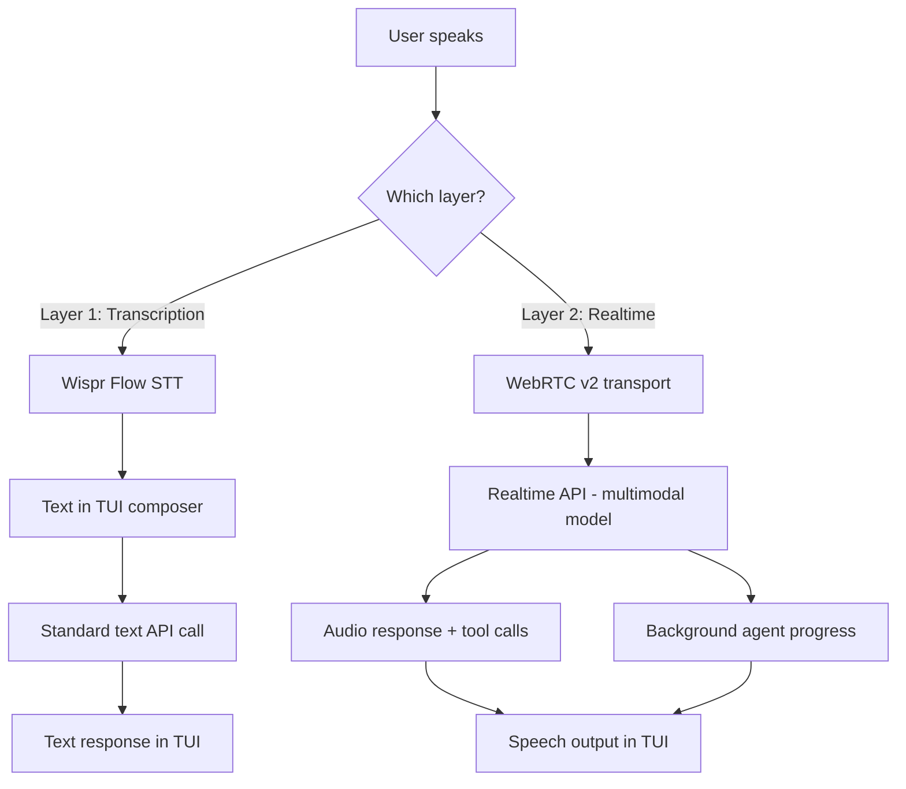
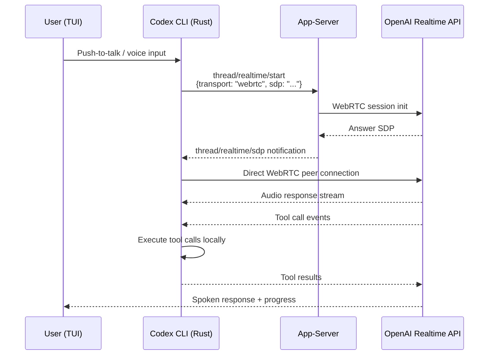

# Voice-Driven Development in Codex CLI: From Push-to-Talk to Realtime V2 WebRTC


---

Terminal-based coding agents have spent the past year competing on context windows, tool use, and autonomy modes. But the interface itself — typing prompts into a text field — remained stubbornly unchanged. In February 2026, Codex CLI v0.105.0 shipped native voice input[^1], and by April the realtime subsystem had migrated to a full WebRTC v2 transport with two-way audio, background agent progress streaming, and configurable voice selection[^2]. This article traces the evolution from simple push-to-talk transcription to a proper realtime voice agent architecture, and shows how to configure it for daily use.

## The Two Layers of Codex Voice

Codex CLI's voice capabilities operate at two distinct layers, and conflating them is a common source of confusion.

**Layer 1 — Voice Transcription (v0.105.0+):** A push-to-talk interface that converts speech to text in the TUI composer. You hold the spacebar, speak, release, and the transcribed text appears as if you had typed it[^1]. This uses the Wispr Flow transcription engine[^3] and is purely speech-to-text — the agent still responds in text.

**Layer 2 — Realtime Voice Sessions (v0.119.0+):** A persistent connection to OpenAI's Realtime API via WebRTC, enabling two-way audio conversation with the agent. The agent can speak responses back, stream progress updates while working, and maintain conversational context across tool calls[^2].



## Enabling Voice Transcription

Voice transcription is opt-in — a deliberate design choice, since accidental spacebar holds in a terminal tool would be disruptive without an explicit toggle[^1].

### Configuration

Add to your `config.toml`:

```toml
[features]
voice_transcription = true
```

Once enabled, the spacebar becomes a push-to-talk key when the composer is focused. Hold to record, release to transcribe. The transcribed text lands in the composer where you can edit it before sending.

### Platform Support

The Wispr Flow engine currently supports macOS and Windows[^3]. Linux support remains absent — a notable gap for a tool whose core audience skews heavily towards Linux[^1]. Third-party alternatives like Spokenly (via MCP)[^4] and WhisperTyping[^5] fill this gap with varying degrees of integration quality.

### Mixing Input Modes

You can freely mix voice and typed input within the same session. A practical pattern: speak a high-level instruction ("refactor the authentication module to use JWT"), then type specific file paths or code snippets that are awkward to dictate.

## Realtime V2: The WebRTC Architecture

Version 0.119.0 (10 April 2026) marked the migration of realtime voice sessions to the v2 WebRTC path as the default transport[^2]. This is not merely a protocol swap — it fundamentally changes how voice interacts with the agent loop.

### How It Works

OpenAI's Realtime API uses a native multimodal model that processes audio directly via a persistent WebRTC connection[^6]. Unlike the chained architecture (STT → LLM → TTS), the speech-to-speech path handles audio natively without intermediate transcription, reducing latency significantly.

The Codex CLI implementation routes WebRTC session establishment through the existing `thread/realtime/start` method[^7]. When WebRTC transport is specified, the system handles SDP (Session Description Protocol) negotiation and emits the answer SDP via a `thread/realtime/sdp` notification[^7].



### Transport Options

The app-server supports two transport modes for realtime sessions[^8]:

- **WebSocket** (legacy): Omit the `transport` parameter. Better for server-side agent execution and environments where WebRTC NAT traversal is problematic.
- **WebRTC** (default since v0.119.0): Pass `{ "type": "webrtc", "sdp": "..." }`. Lower latency, better for interactive desktop use where the TUI or a webview owns the `RTCPeerConnection`.

### Audio Device Configuration

Since v0.107.0, realtime voice sessions support hardware device selection[^9]. Configuration persists under a top-level `[audio]` section in `config.toml`:

```toml
[audio]
microphone = "MacBook Pro Microphone"
speaker = "External Headphones"
```

The `/audio` slash command opens an interactive device picker within the TUI, and selections are written back to the `[audio]` config section automatically[^9]. If a configured device becomes unavailable, Codex falls back to system defaults.

## The April 2026 Realtime Evolution

Three releases in quick succession transformed Codex's realtime capabilities from experimental to production-ready:

### v0.119.0 — WebRTC Default (10 April)

WebRTC became the default transport. Voice selection was added, and the TUI gained native media support for audio playback[^2]. The app-server received full coverage for the v2 flow, meaning the Codex desktop app could leverage the same realtime infrastructure.

### v0.120.0 — Background Agent Progress (11 April)

Realtime V2 gained the ability to stream background agent progress while work is still running[^10]. Previously, initiating a voice conversation while the agent was executing tool calls created an awkward silence. Now the agent can narrate its progress — "I'm running the test suite, three failures so far" — while continuing to work.

Follow-up responses are queued until the active response completes[^10], preventing the jarring interruptions that plagued v0.116.0 (which had addressed self-interruption during audio playback but not the queuing problem)[^11].

### v0.121.0 — Output Modality and Transcript Events (15 April)

Added realtime and app-server APIs for output modality configuration, transcript completion events, and raw turn item injection[^12]. Output modality lets you control whether the agent responds in audio, text, or both. Transcript completion events enable downstream consumers (logging, hooks, analytics) to capture a text record of spoken interactions. Raw turn item injection allows programmatic insertion of context into the realtime conversation — useful for feeding tool results back into the voice session.

User text mirroring was also implemented, with caps on mirrored user turns to prevent context bloat in long voice sessions[^12].

## Practical Workflow Patterns

### Pattern 1: Voice-First Code Review

Start a realtime session and ask the agent to walk through recent changes:

```bash
# Enable realtime in your profile
codex --profile voice-review
```

With a `voice-review` profile in `config.toml`:

```toml
[profiles.voice-review]
model = "gpt-5.4"

[profiles.voice-review.features]
voice_transcription = true
```

Speak: "Review the changes in the last three commits and explain any potential issues." The agent reads the diffs, executes analysis, and speaks its findings while you review code on a second monitor.

### Pattern 2: Hands-Free CI Triage

When a CI pipeline fails and you are away from the keyboard, voice mode lets you triage without touching the terminal:

1. "Show me the failing tests from the last CI run"
2. "What changed in the authentication module since yesterday?"
3. "Fix the type error in line 47 of auth_handler.rs"

Each instruction triggers tool execution with spoken progress updates via the Realtime V2 background streaming[^10].

### Pattern 3: Accessibility

For developers with repetitive strain injuries or mobility constraints, voice-first interaction removes the keyboard bottleneck entirely. The combination of voice input (Layer 1 or Layer 2) with the agent's ability to execute file edits, run commands, and manage git operations means the entire development loop can be voice-driven.

## Codex Voice vs Claude Code Voice

Anthropic shipped Claude Code's `/voice` command on 3 March 2026[^13], six days after Codex v0.105.0. The competitive comparison is instructive:

| Feature | Codex CLI | Claude Code |
|---|---|---|
| **Release** | 25 Feb 2026 (v0.105.0)[^1] | 3 Mar 2026[^13] |
| **Mechanism** | Push-to-talk (spacebar)[^1] | Push-to-talk (spacebar)[^13] |
| **Transcription engine** | Wispr Flow[^3] | Built-in (Anthropic)[^13] |
| **Two-way audio** | Yes (Realtime V2)[^2] | Text responses only ⚠️ |
| **Platform support** | macOS, Windows[^3] | macOS, Windows, Linux[^13] |
| **Transport** | WebRTC v2[^2] | N/A (STT only) |
| **Background narration** | Yes (v0.120.0)[^10] | No |
| **Transcription cost** | Free (no rate limit impact)[^13] | Free[^13] |

The key differentiator: Codex offers genuine two-way voice conversation via the Realtime API, while Claude Code provides speech-to-text input only. However, Claude Code's Linux support and broader language coverage give it an edge for transcription-only use cases[^13].

## Known Limitations and Gotchas

**Transcript echo loops:** Issue #12902 documents a scenario where voice transcription can rapidly consume usage limits through a transcript echo loop[^14]. The v0.121.0 caps on mirrored user turns partially address this, but developers should monitor token usage during extended voice sessions.

**Self-interruption:** While v0.116.0 addressed audio playback self-interruption[^11], rapid-fire voice inputs can still cause the agent to abandon a partially-spoken response. The queuing mechanism in v0.120.0 mitigates this for background progress, but not for direct conversational responses.

**No Linux voice transcription:** The Wispr Flow dependency limits native voice transcription to macOS and Windows[^3]. Linux users must rely on third-party MCP integrations like Spokenly[^4] or system-level tools like WhisperTyping[^5].

**Sandbox interaction:** Voice sessions that trigger sandboxed tool execution may experience brief audio gaps while the sandbox processes commands. This is inherent to the architecture — the Realtime API maintains the audio stream, but tool execution latency is unavoidable.

## What Comes Next

The trajectory is clear: voice is shifting from an input convenience to a first-class interaction mode. The v0.121.0 output modality API suggests OpenAI is building towards sessions where voice, text, and visual output (images, diagrams) coexist naturally. The raw turn item injection API hints at programmatic voice orchestration — imagine a CI hook that initiates a voice debrief when a deploy fails, narrating the failure analysis through your headphones.

For now, the practical advice is straightforward: enable `voice_transcription` in your `config.toml`, experiment with realtime sessions for code review and triage, and keep an eye on the `[audio]` configuration as device management matures.

---

## Citations

[^1]: "Codex 0.105.0 Ships Voice Input, Sleep Prevention, and a Complete Subagent Overhaul", Awesome Agents, February 2026 — [https://awesomeagents.ai/news/codex-0-105-voice-subagents-overhaul/](https://awesomeagents.ai/news/codex-0-105-voice-subagents-overhaul/)

[^2]: Codex Changelog, "Codex CLI 0.119.0", OpenAI Developers, 10 April 2026 — [https://developers.openai.com/codex/changelog](https://developers.openai.com/codex/changelog)

[^3]: "Programming Enters the 'Walkie-Talkie' Era: Claude Launches Voice Code Writing with Free Transcription Tokens", 36Kr, March 2026 — [https://eu.36kr.com/en/p/3706836859777409](https://eu.36kr.com/en/p/3706836859777409)

[^4]: "Voice Input for OpenAI Codex CLI via MCP", Spokenly — [https://spokenly.app/blog/voice-dictation-for-developers/codex](https://spokenly.app/blog/voice-dictation-for-developers/codex)

[^5]: "Voice Typing for Codex CLI on Windows", WhisperTyping — [https://whispertyping.com/tech/voice-typing-for-codex-cli/](https://whispertyping.com/tech/voice-typing-for-codex-cli/)

[^6]: "Realtime API with WebRTC", OpenAI Platform Documentation — [https://platform.openai.com/docs/guides/realtime-webrtc](https://platform.openai.com/docs/guides/realtime-webrtc)

[^7]: "feat: WebRTC transport for realtime start", PR #16960, openai/codex, GitHub — [https://github.com/openai/codex/pull/16960](https://github.com/openai/codex/pull/16960)

[^8]: "App-Server README", openai/codex, GitHub — [https://github.com/openai/codex/blob/main/codex-rs/app-server/README.md](https://github.com/openai/codex/blob/main/codex-rs/app-server/README.md)

[^9]: "Add realtime audio device config", PR #12849, openai/codex, GitHub — [https://github.com/openai/codex/pull/12849](https://github.com/openai/codex/pull/12849)

[^10]: Codex Changelog, "Codex CLI 0.120.0", OpenAI Developers, 11 April 2026 — [https://developers.openai.com/codex/changelog](https://developers.openai.com/codex/changelog)

[^11]: Codex Changelog, "Codex CLI 0.116.0", OpenAI Developers, 19 March 2026 — [https://developers.openai.com/codex/changelog](https://developers.openai.com/codex/changelog)

[^12]: "Release 0.121.0", openai/codex, GitHub — [https://github.com/openai/codex/releases/tag/rust-v0.121.0](https://github.com/openai/codex/releases/tag/rust-v0.121.0)

[^13]: "Claude Code rolls out a voice mode capability", TechCrunch, 3 March 2026 — [https://techcrunch.com/2026/03/03/claude-code-rolls-out-a-voice-mode-capability/](https://techcrunch.com/2026/03/03/claude-code-rolls-out-a-voice-mode-capability/)

[^14]: "Voice transcription/realtime can rapidly consume usage limits (possible transcript echo loop)", Issue #12902, openai/codex, GitHub — [https://github.com/openai/codex/issues/12902](https://github.com/openai/codex/issues/12902)
