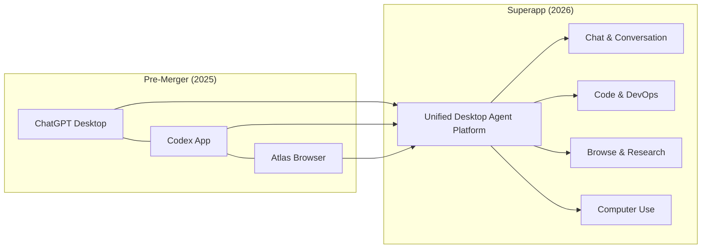
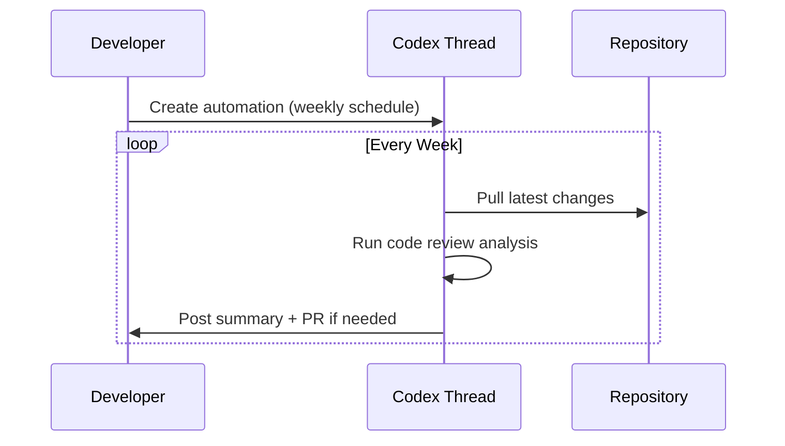
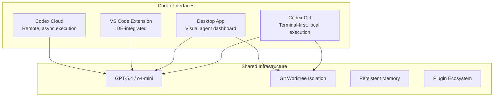
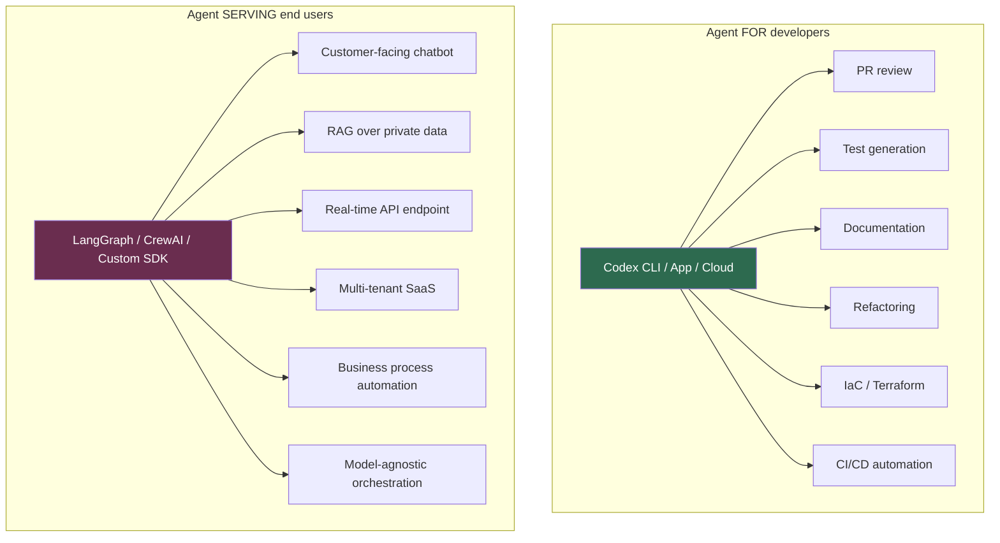
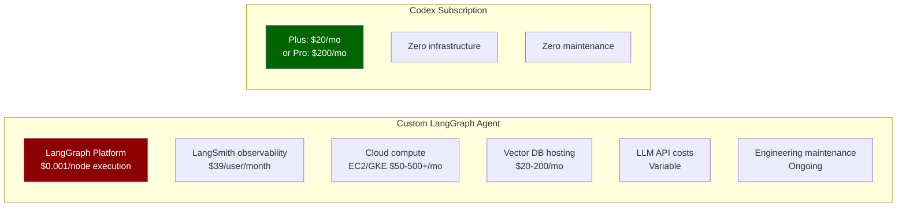
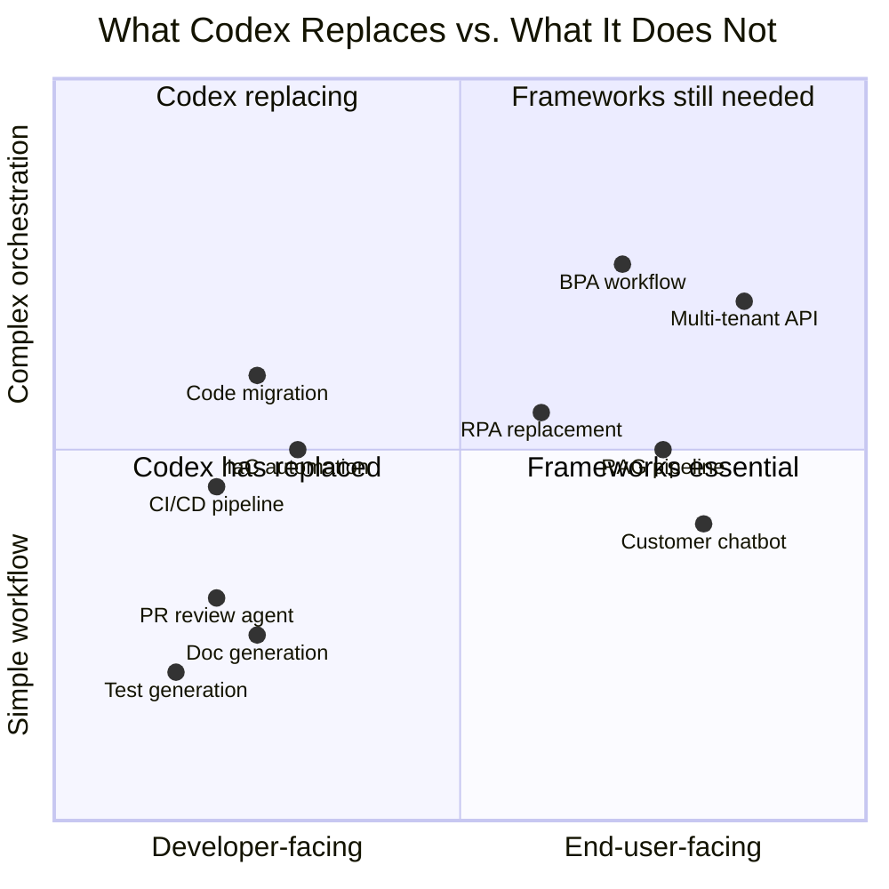
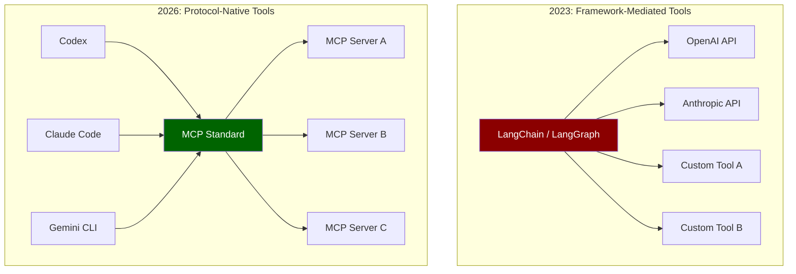

# Codex For Almost Everything: OpenAI's Pivot from Coding Tool to General Agent Platform

---

When OpenAI published "Codex For Almost Everything" on 14 April 2026, it signalled the most significant brand repositioning since the platform launched as a cloud coding agent in May 2025[^1]. Combined with Platform 26.415's feature drop — background computer use on macOS, an integrated Atlas browser, thread automations, 111 new plugins, and an artifact viewer — Codex is no longer just a coding assistant. It is becoming a general-purpose agent platform that happens to be exceptionally good at code.

This article unpacks what the positioning shift means, how the desktop superapp consolidation is reshaping workflows, **what Codex now replaces** — including custom agents built with LangGraph, LangChain and CrewAI — **what it does not**, and what CLI-first developers should be paying attention to.

## The Superapp Consolidation

On 19 March 2026, OpenAI confirmed it would merge three separate products — the ChatGPT desktop application, the Codex coding platform, and the Atlas AI browser — into a single desktop "superapp"[^2]. The rationale is straightforward: reduce product fragmentation and create a unified surface where agentic AI can coordinate across browsing, coding, and conversation without context-switching.

The merger is not cosmetic. Anthropic's near-simultaneous Claude Code desktop redesign on 14 April — which introduced a multi-session sidebar, coordinator mode for parallel sub-agents, and an agent dashboard metaphor[^3] — demonstrates that both major players see the same future: the AI coding tool as a general-purpose agent command centre.

## Platform 26.415: The Feature Drop That Changes Everything

The 26.415 release shipped a set of capabilities that collectively push Codex well beyond code[^4]:

### Background Computer Use (macOS)

Codex can now observe, click, and type within native macOS applications using its own cursor — entirely in the background[^5]. Multiple agents operate in parallel without interfering with the user's own mouse and keyboard. As Ari Weinstein put it: "It's a magical feeling to have agents using your apps in the background, and still get to use your computer at the same time"[^5].

This is the bridge to non-coding tasks. GUI-only applications — design tools, spreadsheet workflows, simulator testing — become accessible to Codex agents for the first time. The feature is currently unavailable in the EEA, UK, and Switzerland[^4].

### Atlas In-App Browser

The integrated Atlas browser allows agents to preview local and public pages, with users able to comment directly on rendered content and instruct the agent to address specific visual feedback[^4]. For developers, this means front-end iteration loops — render, review, annotate, fix — happen without leaving the Codex window.

### Thread Automations

Threads can now be scheduled to wake on a recurring basis with full conversation history preserved[^4]. Think of it as cron for your AI agent: set a project, define a schedule, and let Codex execute recurring tasks — weekly code review summaries, repository maintenance sweeps, dependency update checks.

### Projectless Threads and Artifact Viewer

Conversations no longer require a project folder, opening Codex to research, writing, planning, and analysis tasks outside codebases[^4]. The new artifact viewer previews generated PDFs, spreadsheets, and presentations before committing or sharing — positioning Codex as a document production tool, not merely a code generator.

### 111 New Plugins

The curated plugin collection combines skills, application integrations, and MCP servers[^5], expanding the surface area of what Codex agents can interact with. This is the platform play: every plugin is a new domain Codex can operate in autonomously.

## Codex-FAE: The Enterprise Autonomous Agent

The "Codex For Almost Everything" (Codex-FAE) system represents the enterprise-facing manifestation of this pivot. It connects directly to existing APIs, reads context from organisational data, and completes multi-step tasks without requiring human approval at each decision point[^1].

Key details:

| Aspect | Detail |
|--------|--------|
| **Pricing** | \$500/month enterprise seats[^1] |
| **Pro tier** | \$100/month (10× usage limits vs Plus)[^5] |
| **Developer API** | Limited alpha[^1] |
| **Weekly active users** | 3 million (5× growth in three months)[^5] |
| **Growth rate** | 70% month-over-month usage increase[^5] |

The \$500/month enterprise pricing — alongside the sharp drop in legacy RPA firm share prices on 15 April[^1] — signals that OpenAI sees Codex-FAE as a direct replacement for traditional Robotic Process Automation across finance, legal, and operational domains.

## What This Means for CLI Users

The Codex CLI remains a first-class citizen. There are now four ways to use Codex: the desktop app, the VS Code extension, the CLI, and Codex Cloud[^6]. They share the same underlying models and execution engine, but differ in interface and workflow:

For CLI developers, the practical implications are:

1. **Thread automations are CLI-accessible** — scheduled tasks can be configured from the terminal and run in cloud mode
2. **Memory is shared** — preferences and project context set in the desktop app persist to CLI sessions and vice versa
3. **Computer use is desktop-only** — background macOS interaction requires the desktop app; the CLI cannot drive GUI applications
4. **Plugins work across interfaces** — MCP servers configured for the desktop app are available in CLI sessions within the same project

The CLI's strength — lightweight, scriptable, composable with Unix pipelines — remains its differentiator. The desktop app is where the general-agent capabilities live.

## Competitive Positioning: Codex vs Claude Code

The timing of Codex's pivot is no coincidence. Anthropic's Claude Code desktop redesign, also released on 14 April, introduced parallel sub-agent orchestration, a coordinator mode, and a rebuilt diff viewer[^3]. The two platforms are converging on the same vision but from different starting points:

| Dimension | Codex | Claude Code |
|-----------|-------|-------------|
| **Architecture** | Autonomous execution — submit and review[^7] | Collaborative — step-by-step review[^7] |
| **SWE-bench** | ~49%[^7] | 72.5%[^7] |
| **Token efficiency** | 3× fewer tokens for equivalent tasks[^7] | Higher token consumption |
| **Computer use** | Native macOS background agents[^5] | Via Cowork desktop automation[^3] |
| **Open source** | CLI is open source[^6] | Proprietary |
| **Parallel agents** | Native multi-agent in worktrees | Coordinator mode (new)[^3] |

⚠️ The SWE-bench figures above are from third-party comparisons and may not reflect the latest model updates from either vendor.

Codex's advantage is breadth: computer use, browser integration, plugins, and enterprise pricing create a wider platform surface. Claude Code's advantage is depth: higher benchmark scores on complex multi-file refactoring and a more collaborative interaction model that some developers prefer for nuanced architectural work.

## What Codex Replaces: The Agent Framework Question

The superapp pivot raises an uncomfortable question for anyone who has invested in building custom AI agents with frameworks like LangGraph, LangChain, CrewAI, or AutoGen: **does Codex make those frameworks redundant?**

The answer splits cleanly along one axis: who is the end user of the agent?

### The key distinction

Codex is an **agent that writes code for developers**. It is not an **agent built in code that serves production end users**. If you need a chatbot answering customer questions over your private knowledge base at 200ms latency, a real-time data pipeline agent, or a multi-modal workflow agent handling images and documents for external users — you still need a framework, or direct SDK calls, to build and serve that[^superapp1].

### What Codex has replaced

For coding-adjacent tasks, the displacement is already happening:

| Task | Previous approach | Codex replacement | Status |
|------|-------------------|-------------------|--------|
| **PR review** | Custom LangChain agent calling OpenAI API, hosted on AWS Lambda | Turn on automatic Codex reviews; define custom review agents via TOML config | ✅ Fully replaced |
| **Test generation** | CrewAI "QA agent" with role prompts, running in a container | `codex "write tests for src/auth/"` — native to the agent loop | ✅ Fully replaced |
| **Documentation** | LangChain RAG pipeline indexing code → generating docs | Codex reads the codebase directly; AGENTS.md provides standards | ✅ Fully replaced |
| **CI/CD automation** | Custom GitHub Actions calling LLM APIs with LangChain | Codex CLI Triggers: event-driven GitHub automation[^triggers] | ✅ Fully replaced |
| **Infrastructure as Code** | LangGraph agent with Terraform tool bindings | HashiCorp official Agent Skills + TerraShark skill[^hashicorp] | ✅ Largely replaced |
| **Code migration** | Multi-step LangGraph pipeline with planning/execution/validation nodes | Single Codex cloud task with SPEC.md and AGENTS.md context | ✅ Fully replaced |
| **Dependency updates** | Renovate + custom LangChain review agent | Codex thread automation on weekly schedule | ✅ Fully replaced |

At Wonderful, engineers reported that "Codex CLI has completely replaced every other agentic harness for core technology and architecture work requiring deep reasoning and understanding"[^nxcode].

The pattern is clear: **if your custom agent's end user was a developer on your team, Codex almost certainly replaces it**.

### What Codex has not replaced

For production-facing systems, the frameworks remain essential:

**Production API endpoints.** Codex tasks take 1–30 minutes to complete. It is an asynchronous developer tool, not a real-time backend. If your LangGraph agent serves customer requests at sub-second latency behind a REST API, Codex cannot replace it[^n8n].

**RAG over private data.** This is an explicitly acknowledged gap. A GitHub discussion on the Codex repo (#4015) details that RAG server integration "only works via an API" and implementing it with packaged tools "is currently either very difficult or simply impossible." Without native RAG integration, Codex cannot replace a LangChain pipeline that indexes your proprietary documents and answers questions over them[^rag].

**Model-agnostic orchestration.** Codex is locked to OpenAI models. LangChain's Deep Agents framework supports 100+ model providers with multi-tenant deployment and user-level isolation. If your enterprise requires model portability or you are running Claude, Gemini, or open-source models in production, Codex is not an option[^langchain].

**Non-coding business workflows.** While OpenAI positions Codex as a "gateway to enterprise AI agents beyond coding" with ambitions for finance, legal, and operations, this remains aspirational. CrewAI claims 50% of Fortune 500 companies use it for agent orchestration in non-coding domains[^crewai]. The \$500/month Codex-FAE enterprise tier targets this gap, but Computer Use and projectless threads are early capabilities, not mature replacements for domain-specific workflow engines.

**Deterministic enterprise controls.** LangGraph provides durable checkpointing, explicit state machines, and human-in-the-loop gates for scenarios "where failures carry significant costs"[^langgraph]. Codex's approval modes (suggest/auto-edit/full-auto) are coarser-grained than a LangGraph state machine with custom routing logic at every node.

### The LangChain exodus

The displacement is not hypothetical. According to RoboRhythms, 42% of teams have quit LangChain; 45% who experimented never deployed to production; and 23% of adopters eventually removed it entirely[^roborhythms]. The core reason: in 2022, you needed LangChain because OpenAI had no function calling, Anthropic had no tool use, and memory management was entirely manual. By 2026, model providers handle all of this natively.

As one developer community analysis put it: "LangChain solved 2023 problems. Frontier models now handle function calling, memory management, and multi-step reasoning natively"[^roborhythms].

But LangChain is not standing still. LangChain and LangGraph both reached 1.0 in 2026[^langchain10], and the Deep Agents framework explicitly positions itself against Codex on multi-tenant deployment, model portability, and persistent memory stores.

### Cost: build-your-own vs subscribe

The economics strongly favour Codex for coding-agent use cases:

| | Custom LangGraph agent | Codex subscription |
|---|---|---|
| **Monthly cost (5 developers)** | \$500–2,000+ (compute + API + observability + vector DB) | \$100–1,000 (5× Plus or Pro seats) |
| **Setup time** | Days to weeks | Minutes |
| **Maintenance** | Ongoing engineering effort | Zero — OpenAI maintains the platform |
| **Model updates** | Manual integration | Automatic |
| **Infrastructure** | You manage it | OpenAI manages it |

For a team that was running a LangGraph PR-review agent on AWS — paying for Lambda invocations, a Pinecone index, LangSmith tracing, and the engineering time to keep it running — replacing it with Codex's built-in review at \$20/month/developer is an obvious win.

### Harness engineering: the alternative paradigm

OpenAI's answer to "how do you orchestrate agents at scale?" is not "use a framework" — it is **harness engineering**: "the discipline of designing environments, constraints, and feedback loops that make AI coding agents reliable at scale"[^harness].

The three pillars:

1. **Context engineering** — AGENTS.md files, repository-local documentation, dynamic observability data fed to agents
2. **Architectural constraints** — deterministic linters, LLM-based auditors, structural tests, pre-commit hooks
3. **Entropy management** — scheduled "garbage collection" agents that detect drift and enforce standards

OpenAI's own Symphony framework — open-source, Elixir/BEAM-based — manages hundreds of isolated "implementation runs" simultaneously, handling the complete PR lifecycle: planning, code generation, testing, review, and merge[^symphony]. This is multi-agent orchestration, but built as infrastructure rather than application code.

The insight is sharp: LangChain demonstrated that harness optimisation outpaces model optimisation — by modifying only harness infrastructure, they improved their coding agent from 52.8% to 66.5% on benchmarks, jumping from Top 30 to Top 5[^nxcode]. The harness matters more than the model. And if the harness is Codex's AGENTS.md + Skills + MCP + subagents, you do not need LangGraph to build it.

### Codex + Agents SDK: complementary, not replacement

One nuance worth noting: OpenAI itself positions Codex CLI as an MCP server that integrates with its own Agents SDK[^agentssdk]. This enables hierarchical workflows where Codex handles code tasks while other agents — potentially built with the Agents SDK — coordinate higher-level business logic. The relationship is complementary: Codex is the specialist worker; the Agents SDK (or LangGraph, or CrewAI) can be the orchestrator for workflows that extend beyond code.

### The UiPath angle

The RPA incumbents are not ignoring this. UiPath has "pivoted the entire company" to enable its platform to be used "primarily" by coding agents, supporting tools like Claude Code and Codex[^uipath]. Rather than AI replacing RPA, the emerging pattern is coding agents handling the full automation lifecycle: authoring, deploying, diagnosing failures, proposing fixes, and closing the loop. Codex writes the automations; UiPath runs them.

### Verdict: the replacement matrix

**Bottom line:** If you are building a LangGraph agent whose job is to help your engineering team — reviewing PRs, writing tests, generating docs, managing infrastructure — stop building it. Codex does this natively, cheaper, and better. If you are building an agent that serves external end users in production at scale, with model portability, real-time latency, and RAG over private data — frameworks remain essential, and Codex is a tool your agents can use, not a replacement for them.

## Enterprise Evidence: Replacement in Practice

The replacement pattern is not theoretical. Three first-party case studies demonstrate what happens when enterprises adopt Codex instead of building custom agent infrastructure.

### Cisco: from custom tooling to native Codex

Cisco integrated Codex across their engineering organisation and reported: 20% reduction in build times, over 1,500 engineering hours saved per month, and a 10–15× improvement in defect resolution throughput through their CodeWatch system[^cisco]. Before Codex, achieving this level of automation would have required a bespoke multi-agent pipeline — likely LangGraph or an internal orchestration framework — with dedicated infrastructure, monitoring, and engineering maintenance. Cisco replaced all of that with Codex configuration and AGENTS.md context.

The framework migration story is particularly telling: Cisco moved framework migrations from weeks to days. A custom LangGraph agent for framework migration would require planning nodes, execution nodes, validation nodes, rollback logic, and careful state management. Codex handles the same task as a single cloud run with a SPEC.md and appropriate context.

### Datadog: Codex as code review infrastructure

Datadog deployed Codex for code review across more than 1,000 engineers[^datadog_case]. Their analysis found that 22% of examined production incidents could have been caught or flagged earlier by Codex review feedback. This is not a toy demo — it is a thousand-engineer organisation using Codex as production review infrastructure that would previously have required either a custom LangChain review agent or an expensive third-party tool.

The key architectural insight: Codex review agents can be specialised via TOML configuration files under `.codex/agents/`. A security-focused review agent, a performance-focused agent, and a correctness-focused agent can all run on the same PR — mimicking the multi-agent pattern that CrewAI popularised, but without any framework code, hosting, or maintenance[^codex_subagents].

### OpenAI internal: the Harness Engineering proof point

OpenAI's own "Harness Engineering" case study is the most dramatic evidence. A team of three engineers (growing to seven) spent five months building a production product serving millions of users — writing zero lines of code themselves. Codex generated approximately one million lines across roughly 500 NPM packages, merging 1,500+ PRs at a rate of 3.5 PRs per engineer per day, rising to 5–10 with GPT-5.2[^harness].

The team consumed approximately one billion tokens per day at a cost of \$2–3K daily[^latent_space]. They did not use LangGraph, LangChain, or any external orchestration framework. Their "framework" was AGENTS.md files, architectural constraints, and scheduled entropy-management agents — pure harness engineering.

This is the strongest possible counter-argument to "you need a framework to orchestrate agents at scale." OpenAI's answer: you need a harness, not a framework. And the harness is configuration, not code.

## The MCP and A2A Convergence

The framework displacement story cannot be understood without the protocol convergence happening underneath it.

### MCP under the Linux Foundation

In April 2026, the Linux Foundation's Agentic AI Foundation became the permanent governance home for both MCP (Model Context Protocol) and A2A (Agent-to-Agent Protocol), co-founded by OpenAI, Anthropic, Google, Microsoft, AWS, and Block[^linux_foundation]. This is significant because it means tool interoperability is becoming a shared standard rather than a competitive differentiator.

MCP Toolbox reached v1.0 as an open-source framework for secure agentic data access[^mcp_toolbox]. Microsoft shipped Agent Framework 1.0 with full MCP support built in. Google's ADK supports MCP natively. Every major platform now speaks the same tool protocol.

### What this means for frameworks

LangChain's original value proposition was abstracting tool integrations across providers. When every provider implements the same MCP standard, that abstraction layer loses most of its value. You do not need a LangChain `Tool` wrapper when both Codex and Claude Code can call the same MCP server directly.

The remaining framework value is in **orchestration logic** — state machines, branching workflows, durable checkpointing — not in tool abstraction. This is why LangGraph (the orchestration layer) has a stronger survival case than LangChain (the abstraction layer).

## Updated Competitive Landscape (April 2026)

The competitive picture has shifted significantly in the 48 hours since Platform 26.415 shipped.

### Claude Opus 4.7 (launched 16 April 2026)

Anthropic released Claude Opus 4.7 the same day as the Codex update — no coincidence[^opus47]. Key improvements: 13% lift on coding benchmarks, 3× more production tasks resolved, high-resolution vision support up to 3.75 megapixels (3× previous capacity), and a new tokenizer. Same price as Opus 4.6.

Claude Code's advantage deepens on raw coding capability. But Codex's advantage deepens on platform breadth. The two are diverging:

| Dimension | Codex (April 17) | Claude Code (April 17) |
|-----------|-------------------|------------------------|
| **Model** | GPT-5.4 / o4-mini | Claude Opus 4.7 |
| **SWE-bench direction** | Token efficiency focus | Raw accuracy focus |
| **Platform play** | Superapp (chat + code + browse + computer use) | Coding-first + Managed Agents cloud |
| **Enterprise** | \$500/mo Codex-FAE autonomous agents | \$0.08/hr managed agent runtime |
| **MCP** | 111+ plugins, full MCP support | Native MCP, Channels (Discord/Telegram) |
| **Open source** | CLI open source (Apache 2.0) | Proprietary |
| **Vision** | Standard | 3.75MP high-resolution (new) |

### Google ADK: the multi-language dark horse

Google's Agent Development Kit hit Java 1.0.0 in April 2026, completing a four-language ecosystem: Python, Java, Go, and TypeScript[^adk_java]. ADK is not a direct Codex competitor — it is an agent building framework — but it matters because:

1. **It runs on any model** — ADK supports Gemini, Claude, and OpenAI models via LiteLLM integration
2. **It deploys to Cloud Run** — serverless, scalable, production-ready from day one
3. **It speaks both MCP and A2A** — full protocol interoperability

For enterprises that need model-agnostic, self-hosted agent orchestration (the gap Codex cannot fill), ADK is emerging as a serious alternative to LangGraph — with Google's backing and Cloud Run's operational simplicity.

### The convergence thesis

The New Stack published "Cursor, Claude Code, and Codex are merging into one AI coding stack nobody planned"[^convergence] — arguing that these tools are becoming layers in a single development environment rather than competing products. The implication: the "which tool?" question matters less than the "what harness?" question. Harness engineering skills transfer across all three platforms.

## Migration Guide: Replacing a LangGraph Agent with Codex

For teams currently running custom LangGraph or LangChain agents for developer-facing tasks, here is a practical migration path.

### Step 1: Audit your agents

List every custom agent your team maintains. For each, answer:

- **Who is the end user?** Developer on the team → candidate for Codex replacement. External customer → keep the framework.
- **What does it do?** PR review, test generation, documentation, CI/CD, IaC → Codex handles natively.
- **What infrastructure does it run on?** Cloud compute you maintain → migration saves infrastructure cost.
- **Does it require model portability?** If it must run on Claude or Gemini → Codex cannot replace it.

### Step 2: Replace with Codex equivalents

| LangGraph pattern | Codex equivalent |
|---|---|
| `StateGraph` with planning → execution → validation nodes | Single Codex cloud task with SPEC.md + AGENTS.md context |
| Custom `Tool` wrappers for external APIs | MCP servers (standard protocol, zero glue code) |
| `HumanInTheLoop` checkpoints | Codex approval modes: suggest / auto-edit / full-auto |
| Scheduled `cron` trigger → Lambda → LangGraph | Codex thread automation (recurring schedule, built-in) |
| Multi-agent `CrewAI` roles (researcher + coder + reviewer) | Codex subagents via TOML config under `.codex/agents/` |
| `LangSmith` tracing and observability | Codex session transcripts + built-in token tracking |
| `Pinecone` vector store for code search | Codex reads the repo directly; AGENTS.md provides context |

### Step 3: Write the harness

The replacement is not "turn off LangGraph, turn on Codex." The replacement is:

1. **Write AGENTS.md** — encode the context, constraints, and standards your LangGraph agent's system prompt contained
2. **Write SPEC.md** — define the task specification with RFC 2119 requirements (MUST, SHOULD, MAY) that your agent's StateGraph enforced procedurally
3. **Configure review agents** — create `.codex/agents/security-reviewer.toml` and similar configs for each specialist role your CrewAI setup defined
4. **Set up triggers** — replace your Lambda/cron infrastructure with Codex thread automations or CLI triggers
5. **Delete the infrastructure** — tear down the Lambda functions, the vector store, the LangSmith subscription, and the Docker containers

### Step 4: Measure

Track the same metrics your custom agent generated:

- **Cost**: compare Codex subscription vs. previous infrastructure + API + engineering maintenance costs
- **Latency**: Codex tasks take 1–30 minutes; if your previous agent ran faster, note whether the difference matters for your workflow
- **Quality**: compare defect rates, review accuracy, or whatever signal your agent optimised for
- **Maintenance**: engineering hours spent maintaining the Codex harness (AGENTS.md, SPEC.md) vs. maintaining the LangGraph codebase

Most teams find the maintenance reduction alone justifies the migration. An AGENTS.md file is a markdown document. A LangGraph StateGraph is code that needs tests, dependency updates, runtime monitoring, and someone to be on call when it breaks.

## The Strategic Picture

OpenAI's Chief Product Officer described Codex-FAE as "a fundamental rearchitecting of what AI can do at work"[^1]. That framing is deliberate. By expanding Codex from a coding agent into a general autonomous platform, OpenAI is:

- **Capturing non-developer knowledge workers** via projectless threads, document generation, and computer use
- **Replacing RPA incumbents** with Codex-FAE's API-connected autonomous workflows at \$500/month
- **Building a plugin ecosystem** that creates switching costs and network effects
- **Unifying its product line** into a single superapp that reduces user confusion and increases engagement

For senior developers, the key takeaway is this: Codex is no longer just your coding assistant. It is becoming the operating environment through which AI agents interact with your entire digital workspace. Whether you access it via the CLI or the desktop app, understanding the full platform — computer use, automations, plugins, memory — is now essential to leveraging it effectively.

## Citations

[^1]: [OpenAI's Codex for Almost Everything moves AI from chatbot to autonomous operational engine — Startup Fortune](https://startupfortune.com/openais-codex-for-almost-everything-moves-ai-from-chatbot-to-autonomous-operational-engine/)
[^2]: [OpenAI to create desktop super app, combining ChatGPT app, browser and Codex app — CNBC](https://www.cnbc.com/2026/03/19/openai-desktop-super-app-chatgpt-browser-codex.html)
[^3]: [Anthropic tests Claude Code upgrade to rival Codex Superapp — Testing Catalog](https://www.testingcatalog.com/anthropic-tests-claude-code-upgrade-to-rival-codex-superapp/)
[^4]: [Codex Platform 26.415 Changelog — OpenAI Developers](https://developers.openai.com/codex/changelog)
[^5]: [OpenAI's Codex app adds three key features for expanding beyond agentic coding — 9to5Mac](https://9to5mac.com/2026/04/16/openais-codex-app-adds-three-key-features-for-expanding-beyond-agentic-coding/)
[^6]: [OpenAI Codex CLI — GitHub](https://github.com/openai/codex)
[^7]: [Codex vs Claude Code: which is the better AI coding agent? — Builder.io](https://www.builder.io/blog/codex-vs-claude-code)
[^triggers]: [Codex CLI Triggers: Event-Driven GitHub Automation — codex.danielvaughan.com](https://codex.danielvaughan.com/2026/04/01/codex-cli-triggers-event-driven-github-automation/)
[^hashicorp]: [Introducing HashiCorp Agent Skills — HashiCorp Blog](https://www.hashicorp.com/en/blog/introducing-hashicorp-agent-skills). See also: [TerraShark — Terraform Skill for Codex/Claude Code](https://github.com/LukasNiessen/terrashark)
[^nxcode]: [Harness Engineering Complete Guide: AI Agent Codex 2026 — NxCode](https://www.nxcode.io/resources/news/harness-engineering-complete-guide-ai-agent-codex-2026)
[^n8n]: [We Need to Re-learn What AI Agent Development Tools Are in 2026 — n8n Blog](https://blog.n8n.io/we-need-re-learn-what-ai-agent-development-tools-are-in-2026/)
[^rag]: [RAG Server Integration: Existing Gap — GitHub openai/codex Discussion #4015](https://github.com/openai/codex/discussions/4015)
[^langchain]: [Deep Agents: Comparison with Claude Agent SDK and Codex — LangChain Docs](https://docs.langchain.com/oss/python/deepagents/comparison)
[^crewai]: [The Great AI Agent Showdown of 2026 — Dev.to](https://dev.to/topuzas/the-great-ai-agent-showdown-of-2026-openai-autogen-crewai-or-langgraph-1ea8)
[^langgraph]: [LangGraph Agent Orchestration — LangChain](https://www.langchain.com/langgraph)
[^roborhythms]: [LangChain Is Quietly Losing Developers in 2026 — RoboRhythms](https://www.roborhythms.com/langchain-losing-developers-2026/)
[^langchain10]: [LangChain and LangGraph 1.0 Milestones — LangChain Blog](https://www.langchain.com/blog/langchain-langgraph-1dot0)
[^harness]: [Harness engineering: leveraging Codex in an agent-first world — OpenAI](https://openai.com/index/harness-engineering/)
[^symphony]: [OpenAI Releases Symphony: An Open-Source Agentic Framework — MarkTechPost](https://www.marktechpost.com/2026/03/05/openai-releases-symphony-an-open-source-agentic-framework-for-orchestrating-autonomous-ai-agents-through-structured-scalable-implementation-runs/)
[^agentssdk]: [Use Codex with the Agents SDK — OpenAI Developers](https://developers.openai.com/codex/guides/agents-sdk)
[^uipath]: [UiPath Unveils Agentic Automation Roadmap — The Cerbat Gem](https://www.thecerbatgem.com/2026/04/06/uipath-unveils-agentic-automation-roadmap-pushing-maestro-orchestration-and-coding-agents.html). See also: [Diginomica](https://diginomica.com/why-uipath-re-designing-its-platform-around-agents-build-automations-not-just-run-them)
[^superapp1]: [Claude Code, Codex, and Pi Can Create Their Own AI Agents Now — XDA Developers](https://www.xda-developers.com/claude-code-codex-and-pi-can-create-their-own-ai-agents-now-and-that-changes-everything/). See also: [Supalaunch Comparison](https://supalaunch.com/blog/claude-code-vs-codex-cli-comparison-best-ai-coding-agent-2026)
[^cisco]: [Cisco and OpenAI Codex Integration Results — AIBase](https://news.aibase.com/news/24796). 20% reduction in build times, 1,500+ engineering hours saved per month, 10–15× defect resolution improvement via CodeWatch. See also: SDxCentral, Digital Watch Observatory.
[^datadog_case]: [Datadog and Codex — OpenAI official case study](https://openai.com/index/datadog/). More than 1,000 engineers using Codex regularly; 22% of examined incidents where Codex feedback would have made a difference.
[^codex_subagents]: [Codex Subagents — OpenAI Developers](https://developers.openai.com/codex/subagents). Path-based addressing, structured inter-agent messaging, TOML-based custom agent configuration.
[^latent_space]: [Harness Engineering — Latent Space Podcast](https://www.latent.space/p/harness-eng), April 7, 2026. Deep dive into the 3-engineer team, token economics (~1B tokens/day, ~\$2–3K daily), and PR velocity metrics.
[^linux_foundation]: [Linux Foundation Agentic AI Foundation — governance home for MCP and A2A](https://www.linuxfoundation.org/). Co-founded by OpenAI, Anthropic, Google, Microsoft, AWS, and Block.
[^mcp_toolbox]: MCP Toolbox v1.0: Open-Source Framework for Secure Agentic Data Access. Referenced in [Seroter's Daily Reading List #765](https://seroter.com/), April 16, 2026.
[^opus47]: [Anthropic releases Claude Opus 4.7 — CNBC](https://www.cnbc.com/2026/04/16/anthropic-claude-opus-4-7-model-mythos.html). 13% coding benchmark lift, 3× more production tasks resolved, 3.75MP vision. See also: [AWS Blog](https://aws.amazon.com/blogs/aws/introducing-anthropics-claude-opus-4-7-model-in-amazon-bedrock/), [GitHub Changelog](https://github.blog/changelog/2026-04-16-claude-opus-4-7-is-generally-available/).
[^adk_java]: [Announcing ADK for Java 1.0.0 — Google Developers Blog](https://developers.googleblog.com/announcing-adk-for-java-100-building-the-future-of-ai-agents-in-java/). ADK now available in Python, Java, Go, and TypeScript.
[^convergence]: [Cursor, Claude Code, and Codex are merging into one AI coding stack nobody planned — The New Stack](https://thenewstack.io/ai-coding-tool-stack/)
