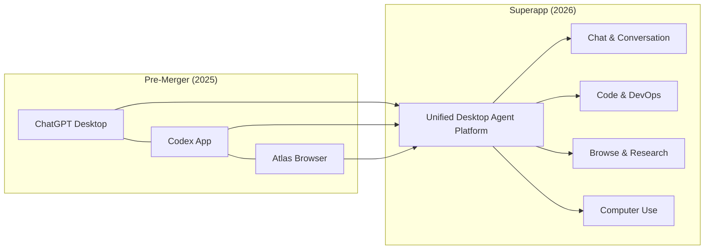
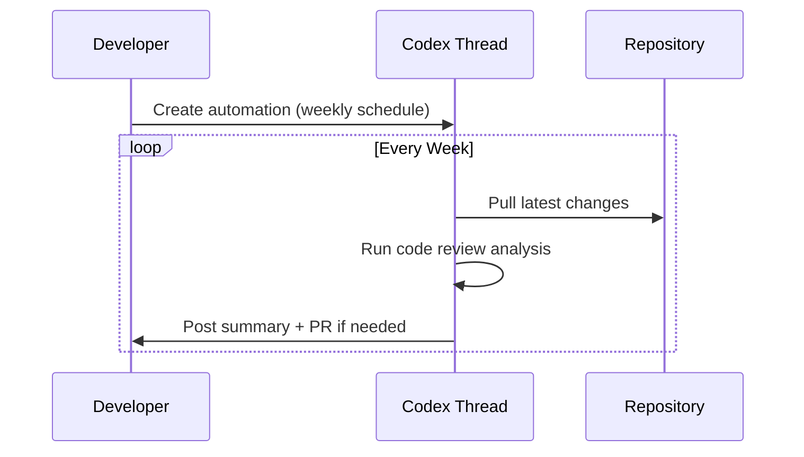
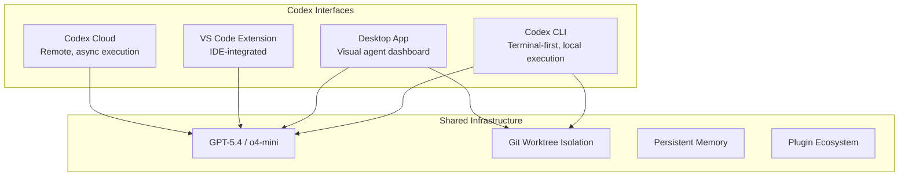

# Codex For Almost Everything: OpenAI's Pivot from Coding Tool to General Agent Platform

---

When OpenAI published "Codex For Almost Everything" on 14 April 2026, it signalled the most significant brand repositioning since the platform launched as a cloud coding agent in May 2025[^1]. Combined with Platform 26.415's feature drop — background computer use on macOS, an integrated Atlas browser, thread automations, 111 new plugins, and an artifact viewer — Codex is no longer just a coding assistant. It is becoming a general-purpose agent platform that happens to be exceptionally good at code.

This article unpacks what the positioning shift means, how the desktop superapp consolidation is reshaping workflows, and what CLI-first developers should be paying attention to.

## The Superapp Consolidation

On 19 March 2026, OpenAI confirmed it would merge three separate products — the ChatGPT desktop application, the Codex coding platform, and the Atlas AI browser — into a single desktop "superapp"[^2]. The rationale is straightforward: reduce product fragmentation and create a unified surface where agentic AI can coordinate across browsing, coding, and conversation without context-switching.

The merger is not cosmetic. Anthropic's near-simultaneous Claude Code desktop redesign on 14 April — which introduced a multi-session sidebar, coordinator mode for parallel sub-agents, and an agent dashboard metaphor[^3] — demonstrates that both major players see the same future: the AI coding tool as a general-purpose agent command centre.

## Platform 26.415: The Feature Drop That Changes Everything

The 26.415 release shipped a set of capabilities that collectively push Codex well beyond code[^4]:

### Background Computer Use (macOS)

Codex can now observe, click, and type within native macOS applications using its own cursor — entirely in the background[^5]. Multiple agents operate in parallel without interfering with the user's own mouse and keyboard. As Ari Weinstein put it: "It's a magical feeling to have agents using your apps in the background, and still get to use your computer at the same time"[^5].

This is the bridge to non-coding tasks. GUI-only applications — design tools, spreadsheet workflows, simulator testing — become accessible to Codex agents for the first time. The feature is currently unavailable in the EEA, UK, and Switzerland[^4].

### Atlas In-App Browser

The integrated Atlas browser allows agents to preview local and public pages, with users able to comment directly on rendered content and instruct the agent to address specific visual feedback[^4]. For developers, this means front-end iteration loops — render, review, annotate, fix — happen without leaving the Codex window.

### Thread Automations

Threads can now be scheduled to wake on a recurring basis with full conversation history preserved[^4]. Think of it as cron for your AI agent: set a project, define a schedule, and let Codex execute recurring tasks — weekly code review summaries, repository maintenance sweeps, dependency update checks.

### Projectless Threads and Artifact Viewer

Conversations no longer require a project folder, opening Codex to research, writing, planning, and analysis tasks outside codebases[^4]. The new artifact viewer previews generated PDFs, spreadsheets, and presentations before committing or sharing — positioning Codex as a document production tool, not merely a code generator.

### 111 New Plugins

The curated plugin collection combines skills, application integrations, and MCP servers[^5], expanding the surface area of what Codex agents can interact with. This is the platform play: every plugin is a new domain Codex can operate in autonomously.

## Codex-FAE: The Enterprise Autonomous Agent

The "Codex For Almost Everything" (Codex-FAE) system represents the enterprise-facing manifestation of this pivot. It connects directly to existing APIs, reads context from organisational data, and completes multi-step tasks without requiring human approval at each decision point[^1].

Key details:

| Aspect | Detail |
|--------|--------|
| **Pricing** | $500/month enterprise seats[^1] |
| **Pro tier** | $100/month (10× usage limits vs Plus)[^5] |
| **Developer API** | Limited alpha[^1] |
| **Weekly active users** | 3 million (5× growth in three months)[^5] |
| **Growth rate** | 70% month-over-month usage increase[^5] |

The $500/month enterprise pricing — alongside the sharp drop in legacy RPA firm share prices on 15 April[^1] — signals that OpenAI sees Codex-FAE as a direct replacement for traditional Robotic Process Automation across finance, legal, and operational domains.

## What This Means for CLI Users

The Codex CLI remains a first-class citizen. There are now four ways to use Codex: the desktop app, the VS Code extension, the CLI, and Codex Cloud[^6]. They share the same underlying models and execution engine, but differ in interface and workflow:

For CLI developers, the practical implications are:

1. **Thread automations are CLI-accessible** — scheduled tasks can be configured from the terminal and run in cloud mode
2. **Memory is shared** — preferences and project context set in the desktop app persist to CLI sessions and vice versa
3. **Computer use is desktop-only** — background macOS interaction requires the desktop app; the CLI cannot drive GUI applications
4. **Plugins work across interfaces** — MCP servers configured for the desktop app are available in CLI sessions within the same project

The CLI's strength — lightweight, scriptable, composable with Unix pipelines — remains its differentiator. The desktop app is where the general-agent capabilities live.

## Competitive Positioning: Codex vs Claude Code

The timing of Codex's pivot is no coincidence. Anthropic's Claude Code desktop redesign, also released on 14 April, introduced parallel sub-agent orchestration, a coordinator mode, and a rebuilt diff viewer[^3]. The two platforms are converging on the same vision but from different starting points:

| Dimension | Codex | Claude Code |
|-----------|-------|-------------|
| **Architecture** | Autonomous execution — submit and review[^7] | Collaborative — step-by-step review[^7] |
| **SWE-bench** | ~49%[^7] | 72.5%[^7] |
| **Token efficiency** | 3× fewer tokens for equivalent tasks[^7] | Higher token consumption |
| **Computer use** | Native macOS background agents[^5] | Via Cowork desktop automation[^3] |
| **Open source** | CLI is open source[^6] | Proprietary |
| **Parallel agents** | Native multi-agent in worktrees | Coordinator mode (new)[^3] |

⚠️ The SWE-bench figures above are from third-party comparisons and may not reflect the latest model updates from either vendor.

Codex's advantage is breadth: computer use, browser integration, plugins, and enterprise pricing create a wider platform surface. Claude Code's advantage is depth: higher benchmark scores on complex multi-file refactoring and a more collaborative interaction model that some developers prefer for nuanced architectural work.

## The Strategic Picture

OpenAI's Chief Product Officer described Codex-FAE as "a fundamental rearchitecting of what AI can do at work"[^1]. That framing is deliberate. By expanding Codex from a coding agent into a general autonomous platform, OpenAI is:

- **Capturing non-developer knowledge workers** via projectless threads, document generation, and computer use
- **Replacing RPA incumbents** with Codex-FAE's API-connected autonomous workflows at $500/month
- **Building a plugin ecosystem** that creates switching costs and network effects
- **Unifying its product line** into a single superapp that reduces user confusion and increases engagement

For senior developers, the key takeaway is this: Codex is no longer just your coding assistant. It is becoming the operating environment through which AI agents interact with your entire digital workspace. Whether you access it via the CLI or the desktop app, understanding the full platform — computer use, automations, plugins, memory — is now essential to leveraging it effectively.

## Citations

[^1]: [OpenAI's Codex for Almost Everything moves AI from chatbot to autonomous operational engine — Startup Fortune](https://startupfortune.com/openais-codex-for-almost-everything-moves-ai-from-chatbot-to-autonomous-operational-engine/)
[^2]: [OpenAI to create desktop super app, combining ChatGPT app, browser and Codex app — CNBC](https://www.cnbc.com/2026/03/19/openai-desktop-super-app-chatgpt-browser-codex.html)
[^3]: [Anthropic tests Claude Code upgrade to rival Codex Superapp — Testing Catalog](https://www.testingcatalog.com/anthropic-tests-claude-code-upgrade-to-rival-codex-superapp/)
[^4]: [Codex Platform 26.415 Changelog — OpenAI Developers](https://developers.openai.com/codex/changelog)
[^5]: [OpenAI's Codex app adds three key features for expanding beyond agentic coding — 9to5Mac](https://9to5mac.com/2026/04/16/openais-codex-app-adds-three-key-features-for-expanding-beyond-agentic-coding/)
[^6]: [OpenAI Codex CLI — GitHub](https://github.com/openai/codex)
[^7]: [Codex vs Claude Code: which is the better AI coding agent? — Builder.io](https://www.builder.io/blog/codex-vs-claude-code)
