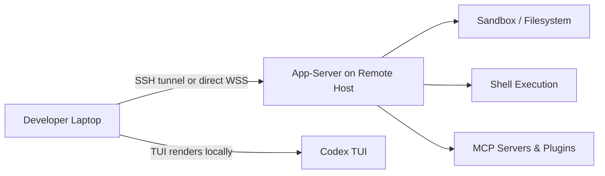
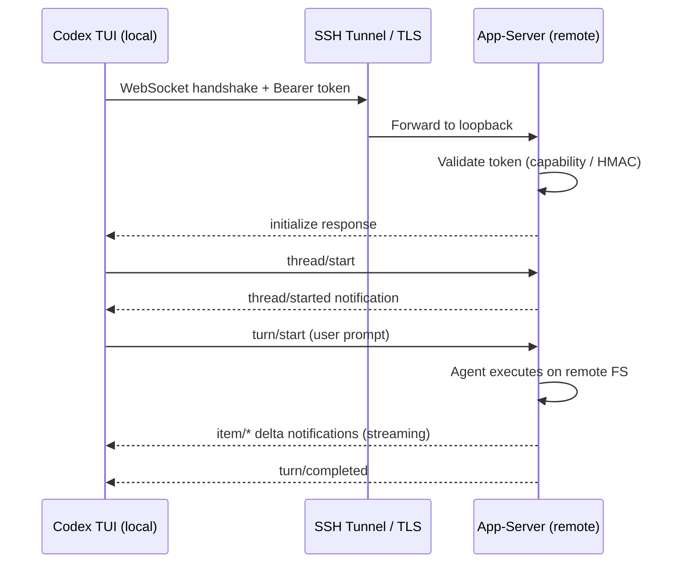

# Remote SSH and the App-Server Architecture: Running Codex Against Distant Machines


---

Professional development rarely happens on a single laptop. GPU rigs, staging clusters, production-like devboxes, and CI runners all live elsewhere. Until April 2026, Codex users who needed to work against remote filesystems relied on workarounds — `sshfs` mounts, `rsync` scripts, or running Codex headlessly inside a `tmux` session. The Codex App v26.415 release changed that with native **remote SSH connections** (alpha) [^1], backed by the Rust-based **app-server** that has been maturing since the 0.119.0 CLI release [^2]. This article unpacks the architecture, walks through setup, and covers the security model you need to understand before pointing Codex at a distant machine.

## Why Remote Matters

The original feature request — GitHub issue #10450, filed in February 2026 — accumulated over 560 upvotes [^3]. The community's requirements were clear: the remote filesystem must be the single source of truth (no local clone), commands must execute on the remote host, and developers must be able to connect to multiple machines simultaneously. VS Code's Remote SSH extension had set the expectation; Codex needed parity.

## Architecture Overview

The remote story rests on the **app-server**, a bidirectional JSON-RPC 2.0 service compiled as part of `codex-rs` [^4]. It exposes every Codex primitive — threads, turns, items, filesystem operations, approval flows, and MCP tool calls — over two transports:

| Transport | Mode | Use case |
|-----------|------|----------|
| **stdio** (default) | Newline-delimited JSON (JSONL) | Local embeddings, IDE extensions |
| **WebSocket** (experimental) | One JSON-RPC message per text frame | Remote TUI, third-party clients |



When you connect the TUI to a remote app-server, every file read, write, command execution, and agent turn happens on the remote host. The TUI is a thin rendering layer that sends JSON-RPC requests and streams back notifications [^4].

## Setting Up Remote SSH in the Codex App

The Codex App (v26.415) wraps the CLI plumbing behind a graphical flow [^1]. Under the hood, it reads your `~/.ssh/config`, resolves concrete host aliases, and starts the remote app-server over SSH.

### Prerequisites

1. **SSH config entry** with a concrete alias (pattern-only hosts are ignored) [^5]:

```
Host devbox
  HostName devbox.example.com
  User you
  IdentityFile ~/.ssh/id_ed25519
```

1. **Codex installed on the remote host** and available on the login shell's `PATH` [^5].
2. **Codex authenticated** on the remote host (run `codex auth` once).

### Connecting

Open **Settings → Connections** in the Codex App, add or enable the SSH host, then choose a remote project folder. Threads created against that project execute commands, read files, and write changes entirely on the remote system [^5].

## Setting Up Remote TUI via the CLI

For terminal purists, the CLI offers direct control over the app-server and TUI pairing.

### Start the app-server on the remote host

```bash
# On the remote machine — bind to loopback for SSH forwarding
codex app-server --listen ws://127.0.0.1:4500
```

### Forward the port and connect locally

```bash
# Terminal 1: SSH tunnel
ssh -L 4500:127.0.0.1:4500 devbox

# Terminal 2: connect the TUI
codex --remote ws://127.0.0.1:4500
```

The `--remote` flag accepts `ws://` and `wss://` addresses [^6]. For plain WebSocket connections, prefer loopback addresses or SSH port forwarding — the TUI will only send authentication tokens over `wss://` or loopback `ws://` URLs [^6].

### Remote `--cd` forwarding

Since CLI 0.119.0, the `--cd` flag propagates through to the remote app-server, so you can specify the working directory without logging in first [^2]:

```bash
codex --remote ws://127.0.0.1:4500 --cd /home/you/project
```

## Authentication and Security

The app-server supports three WebSocket authentication modes, each suited to a different trust boundary [^4][^6]:

### 1. No Auth (loopback only)

Suitable for `127.0.0.1` listeners behind SSH tunnels. Non-loopback listeners without auth log warnings and should not be used in shared environments.

### 2. Capability Token

Generate a random token on the remote host and share it with the client:

```bash
# Remote host
TOKEN_FILE="$HOME/.codex/codex-app-server-token"
install -d -m 700 "$(dirname "$TOKEN_FILE")"
openssl rand -base64 32 > "$TOKEN_FILE"
chmod 600 "$TOKEN_FILE"

codex app-server --listen ws://0.0.0.0:4500 \
  --ws-auth capability-token \
  --ws-token-file "$TOKEN_FILE"
```

```bash
# Local machine
export CODEX_REMOTE_AUTH_TOKEN="$(ssh devbox 'cat ~/.codex/codex-app-server-token')"
codex --remote wss://codex-devbox.example.com:4500 \
  --remote-auth-token-env CODEX_REMOTE_AUTH_TOKEN
```

### 3. Signed Bearer Token (HMAC-SHA256)

For enterprise deployments where token rotation and audience validation matter:

```bash
codex app-server --listen ws://0.0.0.0:4500 \
  --ws-auth signed-bearer-token \
  --ws-shared-secret-file /etc/codex/hmac-secret
```

Tokens must carry an `exp` claim; the server also validates `nbf`, `iss`, and `aud` when present [^4]. This mode pairs well with short-lived JWTs issued by an internal auth service.



### Security Best Practices

- **Never expose an unauthenticated app-server on a shared or public network** [^5].
- Use **SSH port forwarding** or a **VPN/mesh network** (e.g. Tailscale) rather than binding to `0.0.0.0` without TLS [^5].
- Apply the same trust posture as normal SSH access: **trusted keys, least-privilege accounts, no unauthenticated public listeners** [^5].
- Non-local `ws://` connections silently refuse to transmit auth tokens — always use `wss://` for non-loopback [^6].

## Backpressure and Reliability

Remote connections are subject to network latency and bandwidth constraints. The app-server implements bounded queues between transport, processing, and outbound stages [^4]. When the request queue saturates, the server returns JSON-RPC error code `-32001` with the message *"Server overloaded; retry later"*. Clients — including the TUI — handle this with exponential backoff and jitter.

A known issue (GitHub #18203) documents that the outbound queue limit of 128 messages can cause disconnections during long, output-heavy turns over slow links [^7]. The workaround is to ensure sufficient bandwidth or to use `optOutNotificationMethods` in the `initialize` handshake to suppress high-frequency delta notifications you do not need.

## The Experimental `exec-server` Subcommand

Alongside the app-server, CLI 0.119.0 introduced `codex exec-server` as a standalone WebSocket endpoint [^2]. Where `app-server` exposes the full thread/turn lifecycle, `exec-server` is a lighter-weight entry point for non-interactive automation — think CI pipelines that need to fire a single prompt against a remote codebase and collect the result. ⚠️ Documentation for `exec-server` remains sparse; treat it as experimental and expect breaking changes.

## Exec Mode over Remote

The `--remote` flag also applies to exec mode, enabling scripted workflows against remote hosts [^6]:

```bash
# Run a one-shot prompt against a remote app-server
codex exec --remote ws://127.0.0.1:4500 \
  "Find all TODO comments and create a tracking issue for each"

# Resume a previous conversation remotely
codex exec resume --last --remote ws://127.0.0.1:4500 \
  "Now fix the three highest-priority issues"
```

This unlocks **headless remote automation**: a CI job SSHs into a devbox, starts the app-server, runs a sequence of exec commands, and tears down — no interactive TUI required.

## Sandbox Behaviour on Remote Hosts

The sandbox policy is enforced on the remote host, not locally. On Linux remotes, Codex uses **bubblewrap** (`bwrap`) for process isolation; on macOS, it uses **Seatbelt** profiles [^8]. The v0.121.0 release added a secure devcontainer profile with bubblewrap support and macOS sandbox allowlists for Unix sockets [^9], which is particularly relevant for remote devcontainer workflows where Docker sockets and language server Unix sockets need explicit carve-outs.

Configure sandbox policy per-thread via the `thread/start` params:

```json
{
  "method": "thread/start",
  "params": {
    "sandbox": "workspaceWrite",
    "cwd": "/home/you/project"
  }
}
```

Or set the default in your remote host's `config.toml`:

```toml
[sandbox]
mode = "workspaceWrite"
writable_roots = ["/home/you/project"]
```

## When to Use Remote SSH vs. Other Patterns

| Scenario | Recommended approach |
|----------|---------------------|
| Codebase on a cloud devbox (e.g. GitHub Codespaces, Coder) | **Remote SSH** — keep the filesystem on the remote host |
| GPU-heavy ML training with code edits | **Remote SSH** — Codex agents run where the GPUs are |
| Local code, remote build server | **Remote exec mode** — fire build/test commands remotely |
| Pair programming across machines | **App-server + WebSocket** — multiple TUIs against one server |
| CI/CD pipeline integration | **exec-server** or **exec --remote** — headless, scriptable |

## Current Limitations

Remote SSH is still in alpha [^1], so expect rough edges:

- **Gradual rollout** — not all Codex App users have access yet.
- **No multi-host within a single thread** — each thread targets one remote host.
- **Outbound queue saturation** on slow links can drop connections [^7].
- **Plugin marketplace** operations (`codex marketplace add`) require network access from the remote host.
- **Realtime voice sessions** over remote are not yet supported in the app-server transport.

## Looking Ahead

The trajectory is clear: the app-server is becoming the universal harness for Codex, whether the client is a desktop app, a TUI over SSH, a VS Code extension, or a CI bot. The JSON-RPC protocol is documented, schema generation is built in (`codex app-server generate-json-schema`) [^4], and the authentication modes are ready for enterprise use. As the alpha matures, expect multi-host threads, connection pooling, and tighter integration with cloud development environments.

For now, if your code lives on a remote machine, the combination of SSH forwarding and the app-server gives you a first-class Codex experience without leaving your terminal.

---

## Citations

[^1]: OpenAI, "Codex App v26.415 Release Notes", April 16, 2026 — [https://developers.openai.com/codex/changelog](https://developers.openai.com/codex/changelog)

[^2]: OpenAI, "Codex CLI v0.119.0 Changelog — remote/app-server workflows", April 10, 2026 — [https://github.com/openai/codex/releases](https://github.com/openai/codex/releases)

[^3]: pocca2048 et al., "Remote Development in Codex Desktop App — Issue #10450", February 2026 — [https://github.com/openai/codex/issues/10450](https://github.com/openai/codex/issues/10450)

[^4]: OpenAI, "Codex App Server Documentation", 2026 — [https://developers.openai.com/codex/app-server](https://developers.openai.com/codex/app-server)

[^5]: OpenAI, "Remote connections — Codex Developer Documentation", 2026 — [https://developers.openai.com/codex/remote-connections](https://developers.openai.com/codex/remote-connections)

[^6]: OpenAI, "Codex CLI Features — Remote TUI mode", 2026 — [https://developers.openai.com/codex/cli/features](https://developers.openai.com/codex/cli/features)

[^7]: GitHub Issue #18203, "App-server disconnects remote TUI mid-turn when outbound queue fills (128 messages)", 2026 — [https://github.com/openai/codex/issues/18203](https://github.com/openai/codex/issues/18203)

[^8]: OpenAI, "Sandbox — Codex Developer Documentation", 2026 — [https://developers.openai.com/codex/concepts/sandboxing](https://developers.openai.com/codex/concepts/sandboxing)

[^9]: OpenAI, "Codex CLI v0.121.0 Changelog — secure devcontainer profile", April 15, 2026 — [https://developers.openai.com/codex/changelog](https://developers.openai.com/codex/changelog)
