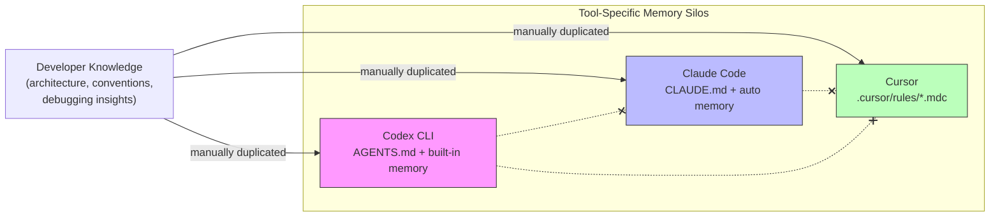
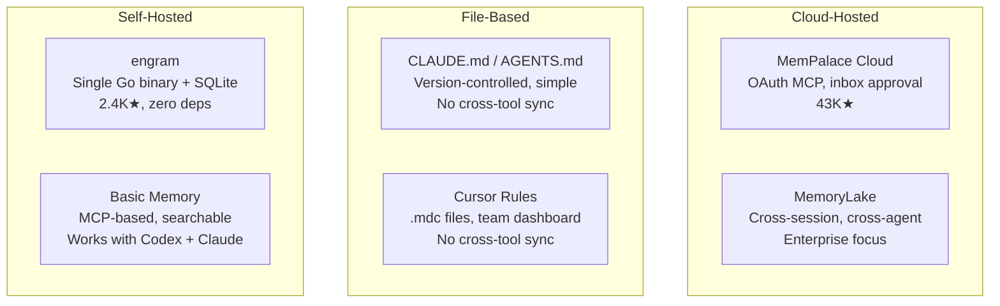
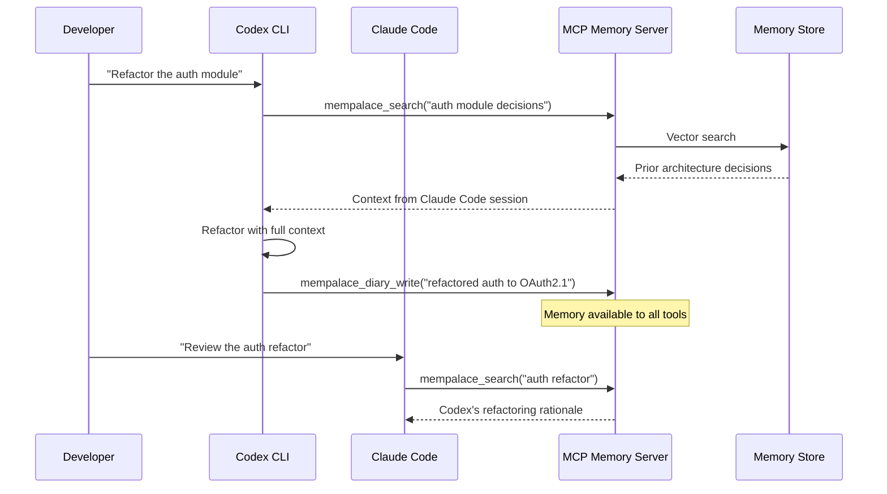

# Cross-Tool Agent Memory: MemPalace, Built-In Memory, and the Portability Problem


---

Every AI coding assistant now offers some form of persistent memory — yet none of them talk to each other. If your team uses Codex CLI for autonomous tasks, Claude Code for architecture reviews, and Cursor for daily editing, your collective project knowledge fragments across three incompatible silos. This article examines the current memory landscape, the emerging cross-tool solutions, and the governance questions enterprises cannot afford to ignore.

## The Memory Silo Problem

AI coding agents suffer from session amnesia: each new invocation starts from zero unless the tool provides a persistence mechanism[^1]. The practical cost is familiar to any team that has adopted multiple agents — you explain your database migration strategy to Codex, your API conventions to Claude Code, and your component architecture to Cursor, then repeat yourself when switching between them.

The core issue is not that memory does not exist. It is that **every tool invented its own format**.



## How Each Tool Remembers

### Codex CLI: AGENTS.md and Built-In Memory

Codex reads an instruction chain at session start, following a strict precedence: global scope (`~/.codex/AGENTS.md` or `AGENTS.override.md`), then project-root, then directory-local files[^2]. This gives you layered, version-controlled instructions that survive across sessions.

Since v0.107.0, Codex also has configurable built-in memories — facts persisted between sessions that can be managed with `/m_update` for indefinite storage or cleared entirely with `codex debug clear-memories`[^3]. Memory mode, reset, and deletion controls are available in both the TUI and app-server interfaces.

```bash
# Clear all stored memories when switching project context
codex debug clear-memories

# Memories persist at ~/.codex/memories/ by default
ls ~/.codex/memories/
```

### Claude Code: CLAUDE.md and Auto Memory

Claude Code uses `CLAUDE.md` files as its persistence layer — plain markdown files read at the start of every session containing build commands, conventions, and project layout[^4]. These files can be scoped per-project (repo root), per-user (`~/.claude/CLAUDE.md`), or per-organisation.

Auto memory, introduced in Claude Code v2.1.59, lets Claude accumulate knowledge autonomously without manual file edits: debugging insights, architecture notes, and workflow habits are captured and re-injected in subsequent sessions[^4]. Crucially, project-root `CLAUDE.md` survives context compaction — after `/compact`, Claude re-reads it from disc.

### Cursor: Rules and the Memory Bank Pattern

Cursor provides four rule storage mechanisms: project rules (`.cursor/rules/*.mdc`), user rules (global to machine), team rules (dashboard-scoped), and agent rules (`AGENTS.md` at repo root)[^5]. The community-developed "Memory Bank" pattern extends this with structured markdown files tracking project decisions, but it remains a convention rather than a built-in feature.

Cursor 2.4 (January 2026) added subagents and a skills marketplace, yet project knowledge still does not persist between coding sessions without explicit rule files[^6].

## The Cross-Tool Memory Landscape

### MemPalace Cloud Plugin

MemPalace, which launched on 5 April 2026 and accumulated 43,000+ GitHub stars within a week[^7], offers the most ambitious cross-tool approach. The Cloud Plugin provides a unified MCP-based memory layer across Claude Code, Codex CLI, Cursor, and Claude Desktop[^8].

Installation is tool-specific but converges on a single backend:

```bash
# Claude Code
claude plugin add github:cschnatz/mempalace-cloud-plugin

# Codex CLI
curl -sL https://www.mempalace.cloud/skill-packs/install-codex.sh | bash

# Cursor (add to MCP config)
# { "mcpServers": { "mempalace-cloud": { "url": "https://api.mempalace.cloud/mcp" } } }
```

The architecture uses OAuth MCP authentication with HTTP transport to `api.mempalace.cloud/mcp`[^8]. Fifteen-plus memory tools — including `mempalace_search`, `mempalace_kg_query`, and `mempalace_diary_write` — are exposed to any connected agent. The AI instruction framework emphasises proactive recall before responding and automatic capture after significant tasks.

The **inbox approval model** is MemPalace's governance differentiator: captured memories land in a review queue at `mempalace.cloud/inbox` before becoming permanent, with auto-approval after 24 hours if unreviewed[^8].

⚠️ Community code review has shown that MemPalace's headline LongMemEval benchmark numbers (96.6% accuracy) primarily reflect the underlying ChromaDB vector store rather than the advertised Palace architecture. The maintainers acknowledged most points within 48 hours[^7].

### Alternative Approaches

The memory space is crowded. A comparison of architectural trade-offs:



**engram** takes the opposite approach to MemPalace: a single Go binary with SQLite and FTS5, installable via `brew install`, compatible with any MCP client[^7]. No cloud account, no OAuth — but no cross-machine sync either.

**Basic Memory** provides persistent, searchable context through MCP for both Codex and Claude Code, positioning itself as infrastructure rather than a product[^9].

## MCP as the Unifying Transport Layer

The Model Context Protocol has emerged as the de facto standard for agent-tool integration. Introduced by Anthropic in November 2024, MCP uses a client-server architecture with JSON-RPC and OAuth 2.1 authentication at the transport layer[^10]. By April 2026, both OpenAI and Google have adopted it alongside Anthropic[^11].

For memory specifically, MCP's value is architectural: it decouples the memory store from the agent runtime. A memory MCP server can serve Codex, Claude Code, and Cursor simultaneously through the same protocol, eliminating the need for tool-specific plugins beyond initial configuration.



## Enterprise Governance: The Unresolved Questions

Cross-tool memory creates governance challenges that file-based approaches neatly avoided. A New America research brief published in April 2026 identifies three structural risks[^12]:

**Cross-service leakage.** An agent might infer sensitive information — health status from calendar patterns, financial stress from spending habits — and share it with unrelated tools through a shared memory layer. Purpose limitation under GDPR becomes nearly impossible when agents "recombine data dynamically to meet user intent"[^12].

**Consent model collapse.** Traditional click-through consent was already criticised as hollow. When a memory write in one tool cascades across dozens of services via MCP, advance specification of data use becomes impractical[^12].

**Audit impossibility.** GDPR's data minimisation principle requires knowing what data exists and where. Distributed agent memory makes this "nearly impossible" to enforce[^12].

The brief proposes three governance layers: foundational user protections (plain-language disclosures, interoperable memory dashboards, default retention limits), infrastructure safeguards (memory compartmentalisation, cryptographically signed action logs), and long-term fairness mechanisms (memory portability with revocable consent)[^12].

For enterprise teams, the practical implications are immediate:

- **Regulated industries** (healthcare, finance) may need memory-free modes for sensitive operations
- **Employee consent** for workplace agent memories requires explicit policy
- **The inbox/approval model** (as implemented by MemPalace) represents a minimum viable governance pattern — human-in-the-loop review before memories become permanent

## Practical Recommendations

1. **Start with file-based memory.** `AGENTS.md` and `CLAUDE.md` are version-controlled, auditable, and require no infrastructure. They solve 80% of the memory problem for single-tool workflows.

2. **Adopt MCP-based memory for multi-tool teams.** If your team genuinely uses multiple agents on the same codebase, a shared MCP memory server eliminates knowledge duplication. Evaluate MemPalace Cloud (managed, inbox approval) versus engram or Basic Memory (self-hosted, full control).

3. **Separate instruction memory from learned memory.** Instructions (build commands, conventions) belong in version-controlled files. Learned knowledge (debugging insights, architectural decisions) belongs in a searchable memory store. Mixing them creates maintenance headaches.

4. **Establish a memory governance policy before adopting cloud-hosted solutions.** Define retention periods, review cadences, and deletion procedures. The inbox approval pattern is a reasonable starting point but insufficient for regulated environments.

5. **Watch the protocol layer.** MCP is the current frontrunner, but A2A (Agent-to-Agent) protocol addresses inter-agent communication that MCP does not[^11]. The two are complementary — MCP for tool access, A2A for agent collaboration.

## What Comes Next

The agent memory race of 2026 has five competing repos with 80,000+ combined stars, four distinct architectures, and one unsolved problem: no standard schema for what a "memory" actually is[^7]. Until the ecosystem converges on a portable memory format — not just a transport protocol — switching between memory providers will remain as painful as switching between the agents themselves.

The teams that invest in clean memory hygiene now — structured instruction files, scoped learned knowledge, explicit governance — will be best positioned regardless of which architecture wins.

## Citations

[^1]: OSS Insight, "The Agent Memory Race of 2026: 5 Repos, 4 Architectures, 1 Unsolved Problem," April 2026. [https://ossinsight.io/blog/agent-memory-race-2026](https://ossinsight.io/blog/agent-memory-race-2026)

[^2]: OpenAI, "Custom instructions with AGENTS.md – Codex CLI," 2026. [https://developers.openai.com/codex/guides/agents-md](https://developers.openai.com/codex/guides/agents-md)

[^3]: Mervin Praison, "OpenAI Codex CLI Memory - Deep Dive," December 2025. [https://mer.vin/2025/12/openai-codex-cli-memory-deep-dive/](https://mer.vin/2025/12/openai-codex-cli-memory-deep-dive/)

[^4]: Anthropic, "How Claude remembers your project - Claude Code Docs," 2026. [https://code.claude.com/docs/en/memory](https://code.claude.com/docs/en/memory)

[^5]: Cursor, "Rules | Cursor Docs," 2026. [https://cursor.com/docs/context/rules](https://cursor.com/docs/context/rules)

[^6]: MemU, "Cursor 2.4 Introduces Subagents and a Skills Marketplace — But Project Knowledge Still Resets Every Session," January 2026. [https://memu.pro/blog/cursor-2-4-subagents-skills-memory](https://memu.pro/blog/cursor-2-4-subagents-skills-memory)

[^7]: OSS Insight, "The Agent Memory Race of 2026," April 2026. [https://ossinsight.io/blog/agent-memory-race-2026](https://ossinsight.io/blog/agent-memory-race-2026)

[^8]: cschnatz, "MemPalace Cloud Plugin — GitHub README," April 2026. [https://github.com/cschnatz/mempalace-cloud-plugin](https://github.com/cschnatz/mempalace-cloud-plugin)

[^9]: Basic Memory, "Add Memory to OpenAI Codex — Persistent Development Context," 2026. [https://docs.basicmemory.com/integrations/codex](https://docs.basicmemory.com/integrations/codex)

[^10]: Wikipedia, "Model Context Protocol," 2026. [https://en.wikipedia.org/wiki/Model_Context_Protocol](https://en.wikipedia.org/wiki/Model_Context_Protocol)

[^11]: Blockchain News, "MCP Emerges as Key AI Interoperability Standard for Multi-Agent Systems in 2026," 2026. [https://blockchain.news/ainews/mcp-model-context-protocol-emerges-as-key-ai-interoperability-standard-for-multi-agent-systems-in-2026](https://blockchain.news/ainews/mcp-model-context-protocol-emerges-as-key-ai-interoperability-standard-for-multi-agent-systems-in-2026)

[^12]: New America, "AI Agents and Memory: Privacy and Power in the Model Context Protocol (MCP) Era," April 2026. [https://www.newamerica.org/oti/briefs/ai-agents-and-memory/](https://www.newamerica.org/oti/briefs/ai-agents-and-memory/)
