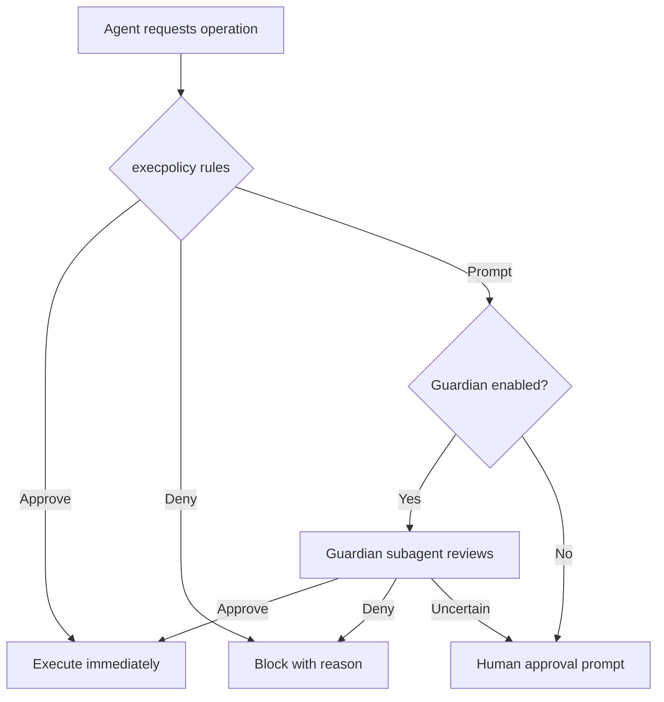

# What MIT Gets Right (and Misses) About Agentic Coding: From Missing Semester to Enterprise Patterns


---

In January 2026, MIT's *Missing Semester of Your CS Education* course added a dedicated Agentic Coding lecture to its curriculum[^1]. For a course that has spent six years teaching the practical tools CS programmes neglect — shell scripting, version control, debugging — this was a significant acknowledgement: coding agents are no longer experimental novelties but essential developer infrastructure. The lecture covers Claude Code, Codex CLI, and opencode[^1], walking students through worktree parallelism, MCP integrations, AGENTS.md conventions, subagents, and sandboxing.

It is, by any measure, a solid foundation. But it is a foundation aimed at individual developers working on coursework and side projects. For teams shipping production software under compliance constraints, there is a substantial gap between what MIT teaches and what enterprise agentic coding demands. This article maps that gap.

## What MIT Gets Right

### The Agent Mental Model

The lecture opens with a precise definition: coding agents are "conversational AI models with access to tools such as reading/writing files, web search, and invoking shell commands"[^1]. It then walks through the LLM completion loop, context windows, and the tool-calling harness pattern — the mechanical understanding that separates effective agent users from prompt-and-pray practitioners. This is exactly right. Without this mental model, developers cannot reason about why an agent fails, why context compaction loses information, or why a 200k-token window still is not enough for a monorepo.

### Worktree Parallelism

MIT correctly identifies that agents are slow and that parallelism is the answer[^1]. The lecture demonstrates running multiple agent instances across git worktrees — each with an isolated working copy — to tackle independent tasks simultaneously. This pattern maps directly to how production teams use Codex CLI's `codex exec` in CI pipelines and headless batch workflows[^2].

### MCP as the Integration Layer

The Model Context Protocol coverage is well-judged. The lecture explains MCP as an open protocol for connecting agents to external tools, references the Pulse and Glama directories for discovering MCP servers, and demonstrates practical integrations like reading Notion specifications[^1]. In enterprise settings, MCP has become the standard mechanism for connecting agents to internal toolchains — Jira, Confluence, Datadog, PagerDuty — so teaching it early is valuable.

### AGENTS.md and Context Management

The lecture covers AGENTS.md (and its Claude Code equivalent, CLAUDE.md) as files that pre-fill agent context with project-specific guidance[^1]. It also introduces skills as an indirection layer to avoid context bloat — selectively loading task-specific instructions rather than cramming everything into the system prompt. Both patterns are now standard in professional codebases; the Pydantic-AI repository's AGENTS.md is cited as a real-world example[^1].

### Subagents for Task Decomposition

MIT introduces subagents as task-specific agents spawned by a top-level orchestrator, using the example of a web research subagent that prevents context pollution in the primary coding thread[^1]. This is the right framing for students encountering the concept for the first time.

## Where MIT Stops and Enterprise Begins

### Execution Policy and Granular Approvals

The lecture mentions sandboxing and "yolo mode" (skipping all permission prompts), with a brief nod to containers and DevContainers[^1]. What it does not cover is the granular approval machinery that makes agents viable in regulated environments.

Codex CLI's `execpolicy` system provides rule-based control over what an agent can execute without human confirmation[^3]. Rules are defined in TOML files, checked via `codex execpolicy check --rules`, and emit JSON detailing the strictest matching decision[^3]. The approval surface is decomposed into five distinct categories: sandbox approvals, execpolicy-rule prompts, MCP prompts, `request_permissions` prompts, and skill-script approvals[^3]. Each can be independently configured to auto-approve, prompt, or auto-reject.

```toml
# Example: execpolicy rules for a CI environment
[[rules]]
match_command = "npm test"
decision = "approve"

[[rules]]
match_command = "rm -rf *"
decision = "deny"
reason = "Destructive filesystem operations blocked in CI"

[[rules]]
match_command = "curl *"
decision = "prompt"
reason = "Network access requires manual review"
```

For organisations that cannot afford a human in the loop for every shell command but equally cannot grant blanket autonomy, this granularity is non-negotiable.

### Guardian Review: Automated Safety Layers

Beyond static rules, Codex CLI's Guardian reviewer introduces an AI-powered approval layer[^4]. When `approvals_reviewer = "guardian_subagent"` is set, eligible approval requests are routed through a dedicated reviewer subagent instead of prompting the user[^4]. The Guardian gathers context about the proposed operation, assesses risk, and makes an approve/deny decision with rationale.



Since PR #18169 in April 2026, the Guardian uses a purpose-built `codex-auto-review` model slug rather than the primary frontier model[^5], reflecting OpenAI's shift toward specialised models for narrow agentic tasks. This reduces cost while improving review accuracy on security-relevant patterns.

### Multi-Agent v2: Beyond Basic Subagents

MIT's subagent coverage stops at the "spawn a helper, get a result" pattern. Codex CLI's multi-agent v2, which reached general availability in March 2026, introduces significantly more sophisticated coordination[^6]:

- **Path-based addressing** — subagents receive addresses like `/root/agent_a`, enabling structured inter-agent messaging[^6]
- **Steering instructions** — the orchestrator can send follow-up instructions to running subagents mid-execution[^6]
- **Concurrency controls** — configurable `max_threads` (default 6) and `max_depth` (default 1) prevent runaway agent proliferation[^7]
- **Per-worker timeouts** — `agents.job_max_runtime_seconds` caps individual subagent execution time[^7]
- **Custom agent types** — TOML-defined agent configurations with independent model selection, sandbox modes, and MCP server access[^7]

```toml
# Custom agent definition: security-reviewer.toml
name = "security-reviewer"
description = "Reviews code changes for security vulnerabilities"
developer_instructions = """
Analyse the diff for: SQL injection, XSS, path traversal,
credential exposure, and insecure deserialisation.
Report findings in SARIF format.
"""
model = "codex-auto-review"
sandbox_mode = "read-only"
```

The built-in agent types — `default`, `worker`, and `explorer` — serve as archetypes, but the real power lies in defining project-specific agents that encode team knowledge about security review, compliance checking, or domain-specific validation[^7].

### OpenTelemetry Observability

The MIT lecture does not mention observability. For a student writing a todo app, this is fine. For a team running dozens of agent sessions across a microservices codebase, it is a critical omission.

Codex CLI supports opt-in OpenTelemetry (OTel) export covering conversations, API requests, SSE/WebSocket stream activity, user prompts (redacted by default), tool approval decisions, and tool results[^8]. The `[otel]` configuration block in `~/.codex/config.toml` supports both `otlp-http` and `otlp-grpc` exporters[^8].

```toml
# ~/.codex/config.toml — OTel configuration
[otel]
enabled = true
exporter = "otlp-http"
endpoint = "https://otel-collector.internal:4318"
redact_prompts = true
service_name = "codex-cli"
env_tag = "production"
```

Event metadata includes service name, CLI version, environment tag, conversation ID, model, and sandbox/approval settings[^8]. When metrics are enabled, Codex emits counters and duration histograms for API, stream, and tool activity — integrating cleanly with Grafana, SigNoz, or any OTel-compatible backend[^9][^10].

For enterprise teams, this is how you answer "which agent session modified that production config file at 3 AM?" and "what is our monthly token spend broken down by team?"

### Managed Configuration and MDM Distribution

Individual developers configure Codex via `~/.codex/config.toml`. Enterprise administrators need to enforce policy at scale. Codex supports MDM-distributed configuration through `requirements_toml_base64` and filesystem-level `/etc/codex/requirements.toml`[^3], ensuring that security policies, model selections, and approval thresholds are consistent across an organisation regardless of individual developer preferences.

## The Curriculum Gap in Context

```mermaid
graph LR
    subgraph MIT["MIT Missing Semester Coverage"]
        A[Agent mental model]
        B[Worktree parallelism]
        C[MCP basics]
        D[AGENTS.md / Skills]
        E[Basic subagents]
        F[Container sandboxing]
    end

    subgraph Enterprise["Enterprise Patterns — Not Covered"]
        G[execpolicy rules]
        H[Guardian reviewer]
        I[Multi-agent v2 orchestration]
        J[OTel observability]
        K[Managed configuration / MDM]
        L[Permission profiles]
    end

    MIT --> Enterprise
    style MIT fill:#e8f5e9,stroke:#4caf50
    style Enterprise fill:#fff3e0,stroke:#ff9800
```



This is not a criticism of MIT's choices. The Missing Semester has always been about giving students the practical tools their degree programmes ignore. The Hacker News discussion around the 2026 revision reveals that even including agentic coding was contentious — several commenters argued it was "trendy" and should be omitted entirely[^11]. In that context, covering the fundamentals well is the right call.

But for senior developers and platform engineers reading this, the gap is worth mapping explicitly. If your team is adopting agentic coding based on what worked in a university setting, you will hit walls around:

1. **Compliance** — regulated industries need audit trails (OTel), not just sandboxes
2. **Cost control** — uncontrolled subagent spawning burns tokens; concurrency limits and purpose-built models matter
3. **Policy enforcement** — "yolo mode" is a liability; execpolicy rules and Guardian review are the production answer
4. **Coordination** — real codebases need multi-agent v2's structured messaging, not just fire-and-forget subagents
5. **Governance at scale** — MDM-distributed configuration ensures no developer opts out of security policy

## From Classroom to Production: A Migration Path

For teams transitioning from MIT-style agentic coding to enterprise patterns, the progression is straightforward:

1. **Start with AGENTS.md** — MIT gets this right; make it your first commit
2. **Add execpolicy rules** — define what agents can and cannot do before granting autonomy
3. **Enable Guardian review** — automate the approval decisions that do not require human judgement
4. **Configure OTel export** — route telemetry to your existing observability stack from day one
5. **Define custom agent types** — encode team-specific review, testing, and compliance workflows as TOML agent definitions
6. **Enforce via managed config** — distribute policies through MDM or `/etc/codex/requirements.toml`

MIT has given the next generation of developers a solid mental model for working with coding agents. The enterprise patterns described here are what turns that mental model into production-grade infrastructure.

---

## Citations

[^1]: MIT CSAIL, "Agentic Coding," *The Missing Semester of Your CS Education*, January 2026. [missing.csail.mit.edu/2026/agentic-coding](https://missing.csail.mit.edu/2026/agentic-coding/)

[^2]: OpenAI, "CLI — Codex," *OpenAI Developers*, 2026. [developers.openai.com/codex/cli](https://developers.openai.com/codex/cli)

[^3]: OpenAI, "Agent Approvals & Security — Codex," *OpenAI Developers*, 2026. [developers.openai.com/codex/agent-approvals-security](https://developers.openai.com/codex/agent-approvals-security)

[^4]: OpenAI, "Agent Approvals & Security — Guardian Reviewer," *OpenAI Developers*, 2026. [developers.openai.com/codex/agent-approvals-security](https://developers.openai.com/codex/agent-approvals-security)

[^5]: OpenAI, "PR #18169 — Use codex-auto-review for guardian reviews," *GitHub*, April 2026. [github.com/openai/codex](https://github.com/openai/codex)

[^6]: OpenAI, "Subagents — Codex," *OpenAI Developers*, 2026. [developers.openai.com/codex/subagents](https://developers.openai.com/codex/subagents)

[^7]: OpenAI, "Subagents — Configuration and Agent Types," *OpenAI Developers*, 2026. [developers.openai.com/codex/subagents](https://developers.openai.com/codex/subagents)

[^8]: OpenAI, "Advanced Configuration — Codex," *OpenAI Developers*, 2026. [developers.openai.com/codex/config-advanced](https://developers.openai.com/codex/config-advanced)

[^9]: SigNoz, "OpenAI Codex Observability & Monitoring with OpenTelemetry," 2026. [signoz.io/docs/codex-monitoring](https://signoz.io/docs/codex-monitoring/)

[^10]: Grafana Labs, "OpenAI Codex Integration," *Grafana Cloud Documentation*, 2026. [grafana.com/docs/grafana-cloud/monitor-infrastructure/integrations/integration-reference/integration-openai-codex](https://grafana.com/docs/grafana-cloud/monitor-infrastructure/integrations/integration-reference/integration-openai-codex/)

[^11]: Hacker News, "The Missing Semester of Your CS Education — Revised for 2026," 2026. [news.ycombinator.com/item?id=47124171](https://news.ycombinator.com/item?id=47124171)
