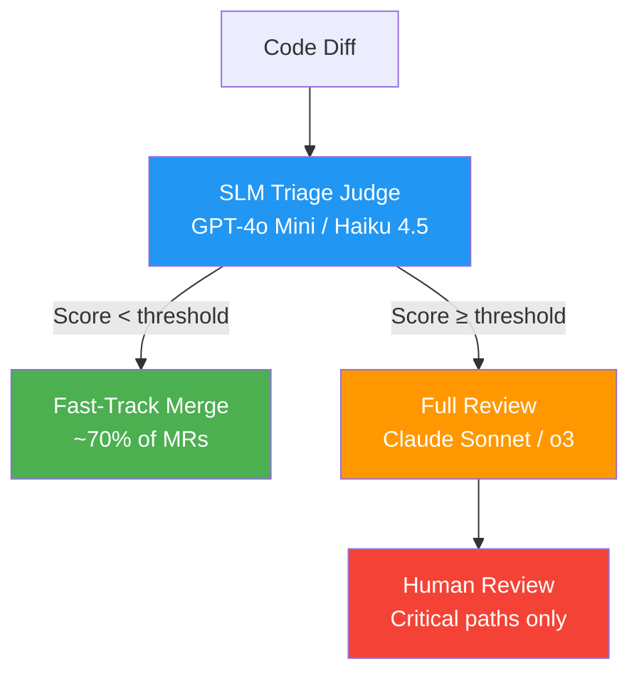

# The Real Cost of Multi-Model Review Loops: When Cross-Provider Quality Gates Eat Your Budget


Cross-model review — writing code with one agent and reviewing it with another — has become the de facto quality pattern in agentic coding workflows. But while teams celebrate the defect-detection improvements, few have done the arithmetic on what three-provider review loops actually cost per merge request. This article breaks down the numbers, identifies the diminishing-returns cliff, and presents the SLM-as-judge alternative that can cut review spend by an order of magnitude.

## Why Cross-Model Review Exists

Single-model pipelines have a well-documented blind spot: the same biases that cause a model to generate flawed code also cause it to miss those flaws during review[^1]. The "implement with Claude Code, review with Codex CLI" pattern — popularised by Aseem Shrey's production case study — addresses this by introducing model diversity. Shrey's setup detected 14 issues across 3 automated review rounds with zero manual reviews[^2].

The pattern has matured into three automation tiers: a lightweight `SKILL.md` slash command, Hamel Husain's `claude-review-loop` stop-hook plugin running up to 4 parallel sub-agents, and full team pipeline orchestration via frameworks like Z-M-Huang's orchestration plugin[^2]. Each tier trades simplicity for thoroughness — and cost.

## Current Token Pricing (April 2026)

Before modelling review costs, here are the rates that matter[^3][^4]:

| Model | Input ($/M tokens) | Output ($/M tokens) | Typical Role |
|---|---|---|---|
| Claude Opus 4.6 | \$5.00 | \$25.00 | Deep review |
| Claude Sonnet 4.6 | \$3.00 | \$15.00 | Implementation / review |
| GPT-5.4 | \$2.50 | \$15.00 | Implementation |
| o3 | \$2.00 | \$8.00 | Reasoning-heavy review |
| o4-mini | \$1.10 | \$4.40 | Lightweight review |
| Gemini 2.5 Pro (≤200K) | \$1.25 | \$10.00 | Review |
| Gemini 2.5 Flash | \$0.30 | \$2.50 | Triage / pre-filter |
| Claude Haiku 4.5 | \$1.00 | \$5.00 | Triage / SLM judge |
| GPT-4o Mini | \$0.15 | \$0.60 | Budget judge |

Output tokens cost 3–10× more than input tokens across every provider[^4]. This asymmetry is critical because review workflows are output-heavy: the reviewer generates detailed findings, suggested fixes, and sometimes complete replacement code.

## Modelling Review Cost Per Merge Request

Consider a typical merge request touching 800 lines of code (roughly 12,000 tokens of diff context). A single review round consumes approximately 15,000 input tokens (diff + system prompt + prior context) and generates around 4,000 output tokens (findings + explanations).

### Scenario 1: Single-Model Review (Claude Sonnet 4.6)

| | Input | Output | Total |
|---|---|---|---|
| Round 1 | \$0.045 | \$0.060 | \$0.105 |
| Round 2 (re-review after fixes) | \$0.054 | \$0.045 | \$0.099 |
| **Total** | | | **\$0.204** |

### Scenario 2: Two-Model Review (Claude Sonnet + o3)

| | Input | Output | Total |
|---|---|---|---|
| Claude Sonnet review | \$0.045 | \$0.060 | \$0.105 |
| o3 review | \$0.030 | \$0.032 | \$0.062 |
| Fix + re-review (Sonnet) | \$0.054 | \$0.045 | \$0.099 |
| **Total** | | | **\$0.266** |

### Scenario 3: Three-Model Review (Claude Opus + GPT-5.4 + Gemini 2.5 Pro)

| | Input | Output | Total |
|---|---|---|---|
| Claude Opus review | \$0.075 | \$0.100 | \$0.175 |
| GPT-5.4 review | \$0.038 | \$0.060 | \$0.098 |
| Gemini 2.5 Pro review | \$0.019 | \$0.040 | \$0.059 |
| Fix + re-review (Opus) | \$0.090 | \$0.075 | \$0.165 |
| **Total** | | | **\$0.497** |

At 40 merge requests per developer per month, the three-model loop costs roughly **\$20/developer/month** on review alone — before accounting for the implementation tokens. For a 50-person engineering team, that is \$1,000/month purely on automated review, or \$12,000 annually[^3].

## The Diminishing Returns Cliff


Research from CMU's STRUDEL lab on agentic tool adoption shows that quality improvements follow a steep diminishing-returns curve. Agentic tools substantially accelerate development when introduced as a repository's first AI tool (+36.3% commits), but yield minimal changes when layered on top of existing AI tooling (+3.1%)[^5]. The same pattern applies to review models: the second reviewer catches genuinely different classes of bugs, but the third reviewer's incremental catch rate drops sharply.

Anthropic's own 2026 Agentic Coding Trends Report notes that developers are "breaking their process into two steps — development and code review — often using different models for each phase," but stops short of recommending three or more reviewers[^6].

⚠️ No peer-reviewed study has yet quantified the exact incremental defect-detection rate for 2-model vs 3-model review in production codebases. The percentages in the diagram above are estimates based on the available research on model diversity and diminishing returns.

Meanwhile, static analysis warnings rise by approximately 18% and cognitive complexity by roughly 39% when agentic tools are stacked[^5]. More models does not automatically mean better code — it can mean more churn.

## The SLM-as-Judge Alternative

The February 2026 paper "Improving Code Generation via Small Language Model-as-a-judge" (IEEE/ACM ICSE 2026) demonstrated that fine-tuned SLMs achieve judging performance competitive with models 5–25× larger[^7]. The key findings:

- Fine-tuned SLMs achieved moderate agreement (Cohen's Kappa 0.45–0.57) with GPT-4.1-mini on code correctness judgements[^7]
- SLM judges outperformed the prior RankEF approach without requiring execution-based information[^7]
- Serving a 7B-parameter SLM is 10–30× cheaper than a 70–175B LLM, cutting GPU and cloud costs by up to 75%[^8]

For review loops, this suggests a compelling architecture:



An SLM triage layer using GPT-4o Mini (\$0.15/\$0.60 per M tokens) or Haiku 4.5 (\$1.00/\$5.00) pre-screens every merge request. Only those flagged as potentially problematic — typically 25–35% of routine MRs — proceed to a full frontier-model review. This reduces average review cost from \$0.27 (two-model) to approximately \$0.09 per MR.

## Configuring Model Routing in Practice

Codex CLI supports custom providers via `~/.codex/config.toml`, using the `model` and `model_provider` keys to select which API endpoint to target[^9]. However, native multi-model routing is not built in. For cross-provider workflows, an AI gateway is required.

Bifrost CLI provides the most mature gateway for this pattern, supporting 20+ providers and handling environment variable configuration, base URL routing, and API key management automatically[^10]. A typical configuration for a review-optimised pipeline:

```toml
# ~/.codex/config.toml — implementation model
model = "o4-mini"
model_provider = "openai"

# Review model configured via gateway
# CODEX_API_BASE=https://gateway.internal/v1
# Routes to Claude Sonnet for review tasks
```

For teams wanting to avoid gateway infrastructure, the simplest approach remains the SKILL.md pattern: Claude Code implements, a slash command exports the diff, and Codex CLI reviews in read-only sandbox mode[^2].

## Enterprise Budget Allocation Strategy

Based on the cost modelling above, here is a practical allocation framework:

| Budget Tier | Monthly/Dev | Strategy |
|---|---|---|
| **Lean** (<\$10) | \$5–8 | Single model + SLM triage gate |
| **Standard** (\$10–25) | \$12–18 | Two-model review (implement + review) with SLM pre-filter |
| **Premium** (\$25–50) | \$25–40 | Three-model with gateway routing, full Opus for critical paths |

The standard tier delivers the best cost-to-quality ratio for most teams. Reserve the premium tier for regulated industries (fintech, healthcare) where the compliance audit trail of multi-model consensus has value beyond defect detection.

## Key Takeaways

1. **Two-model review is the sweet spot.** The second reviewer adds genuine diversity; the third adds cost faster than quality.
2. **SLM triage cuts costs by 60–70%.** Route only flagged MRs to expensive frontier models.
3. **Output tokens dominate cost.** Review workflows are output-heavy — optimise reviewer verbosity before adding models.
4. **Use prompt caching aggressively.** Both Anthropic (90% input savings) and OpenAI (90% cached input discount) offer dramatic reductions for repeated context[^3][^4].
5. **Gateway infrastructure pays for itself** at roughly 20+ developers, where routing logic and spend controls prevent runaway costs[^10].

The multi-model review loop is a genuine quality improvement over single-model pipelines. But the third model is rarely worth its cost. Invest instead in an SLM triage layer and prompt caching — you will get 90% of the quality benefit at 30% of the spend.

## Citations

[^1]: Anthropic, "2026 Agentic Coding Trends Report," [https://resources.anthropic.com/2026-agentic-coding-trends-report](https://resources.anthropic.com/2026-agentic-coding-trends-report)
[^2]: SmartScope, "Automating the Claude Code × Codex Review Loop — Three Levels: SKILL.md, Plugin, and Pipeline," [https://smartscope.blog/en/blog/claude-code-codex-review-loop-automation-2026/](https://smartscope.blog/en/blog/claude-code-codex-review-loop-automation-2026/)
[^3]: TLDL, "LLM API Pricing 2026 — Compare GPT-5, Claude 4, Gemini 2.5, DeepSeek Costs," [https://www.tldl.io/resources/llm-api-pricing-2026](https://www.tldl.io/resources/llm-api-pricing-2026)
[^4]: CloudIDR, "Complete LLM Pricing Comparison 2026: We Analyzed 105 Models So You Don't Have To," [https://www.cloudidr.com/blog/llm-pricing-comparison-2026](https://www.cloudidr.com/blog/llm-pricing-comparison-2026)
[^5]: Agarwal et al., "AI IDEs or Autonomous Agents? Measuring the Impact of Coding Agents on Software Development," CMU STRUDEL, MSR 2026, [https://arxiv.org/html/2601.13597v2](https://arxiv.org/html/2601.13597v2)
[^6]: Anthropic, "2026 Agentic Coding Trends Report," [https://resources.anthropic.com/hubfs/2026%20Agentic%20Coding%20Trends%20Report.pdf](https://resources.anthropic.com/hubfs/2026%20Agentic%20Coding%20Trends%20Report.pdf)
[^7]: Crupi et al., "Improving Code Generation via Small Language Model-as-a-judge," IEEE/ACM ICSE 2026, [https://arxiv.org/abs/2602.11911](https://arxiv.org/abs/2602.11911)
[^8]: Iterathon, "Small Language Models Cut AI Costs 75% with Enterprise SLM Deployment," [https://iterathon.tech/blog/small-language-models-enterprise-2026-cost-efficiency-guide](https://iterathon.tech/blog/small-language-models-enterprise-2026-cost-efficiency-guide)
[^9]: MorphLLM, "Codex Provider Configuration: --provider, config.toml & Custom Endpoints," [https://www.morphllm.com/codex-provider-configuration](https://www.morphllm.com/codex-provider-configuration)
[^10]: Maxim, "Using OpenAI Codex CLI with Multiple Model Providers Using Bifrost," [https://www.getmaxim.ai/articles/using-openai-codex-cli-with-multiple-model-providers-using-bifrost/](https://www.getmaxim.ai/articles/using-openai-codex-cli-with-multiple-model-providers-using-bifrost/)
