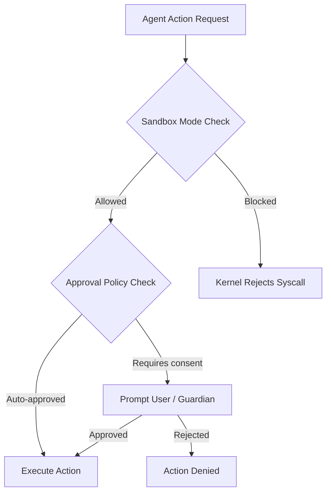
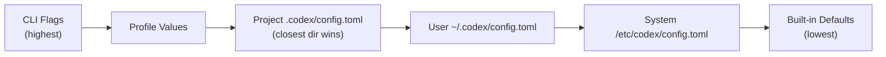
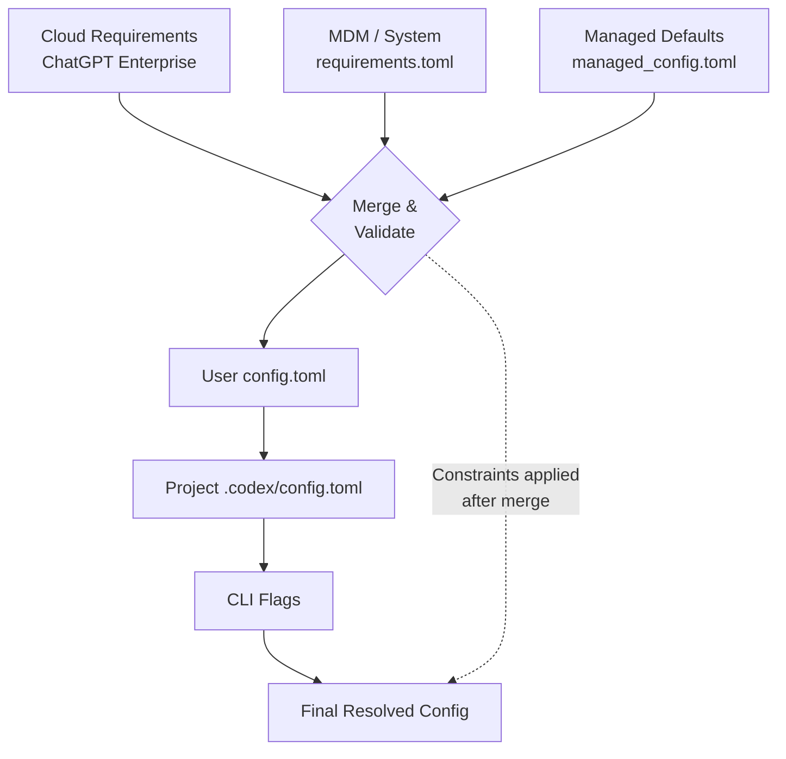

# Permission Profiles End-to-End: Governed Repo Mode and Enterprise Security Posture


---

Codex CLI's security model has matured from a simple `--full-auto` toggle into a layered enterprise security posture system. Permission profiles, granular approval policies, managed configuration enforcement, and project trust levels now form a coherent pipeline that lets organisations lock down agent behaviour without sacrificing developer velocity. This article walks through the full stack — from profile definition to cloud-enforced requirements — with practical configuration for production teams.

## The Two-Layer Security Model

Codex separates *capability* from *consent*[^1]. Two orthogonal axes govern every agent action:

| Layer | Controls | Settings |
|-------|----------|----------|
| **Sandbox mode** | What the agent *can technically do* | `read-only`, `workspace-write`, `danger-full-access` |
| **Approval policy** | When the agent *must ask first* | `untrusted`, `on-request`, `never` |

Sandbox enforcement happens at the kernel level — Seatbelt on macOS, Landlock plus seccomp on Linux[^2]. This is not application-level sandboxing; the kernel rejects disallowed syscalls before Codex even sees them. The approval policy layer is independent: both must align to achieve the desired security posture.



### Protected Paths

Even in `workspace-write` mode, certain paths remain read-only[^3]:

- `.git` directories and gitdir pointers
- `.agents/` and `.codex/` directories

This prevents the agent from tampering with its own configuration or corrupting version control state.

## Permission Profiles in config.toml

Profiles let you save named sets of configuration values and switch between them from the CLI[^4]. Define them under `[profiles.<name>]` in your `config.toml`:

```toml
# ~/.codex/config.toml
model = "gpt-5.4"
approval_policy = "on-request"
sandbox_mode = "workspace-write"

[profiles.strict]
model = "gpt-5.4"
approval_policy = "untrusted"
sandbox_mode = "read-only"

[profiles.ci-runner]
approval_policy = "never"
sandbox_mode = "workspace-write"
model_reasoning_effort = "low"
```

Activate a profile with `codex --profile strict "review this PR"` or `-p ci-runner`[^5]. You can also set a default profile at the top level:

```toml
profile = "strict"
```

### The Resolution Chain

When multiple configuration layers exist, Codex resolves values with a clear precedence hierarchy[^6]:



CLI arguments always win. Profile values override global settings but yield to explicit flags. Project-scoped configuration only loads when the project is trusted[^7] — untrusted projects skip `.codex/` layers entirely, falling back to user, system, and built-in defaults.

## Project Trust and Governed Repositories

Project trust is the gatekeeper for repository-scoped configuration. You declare trust explicitly in your user-level config[^8]:

```toml
# ~/.codex/config.toml
[projects."/home/dev/my-secure-repo"]
trust_level = "trusted"

[projects."/home/dev/untrusted-fork"]
trust_level = "untrusted"
```

When `trust_level = "untrusted"`, Codex ignores any `.codex/config.toml` in that repository. This is the foundation of governed repo mode: administrators classify repositories and enforce different security postures accordingly[^2]. A sensitive production repository can mandate `read-only` sandbox mode regardless of user defaults, whilst a personal playground can run with `workspace-write`.

Teams check their shared configuration into the repository under `.codex/config.toml`:

```toml
# .codex/config.toml (committed to repo)
approval_policy = "on-request"
sandbox_mode = "workspace-write"

[sandbox_mode.workspace-write]
network_access = false
exclude_slash_tmp = true

[shell_environment_policy]
inherit = "core"
include_only = ["PATH", "HOME", "LANG"]
```

Codex automatically picks up these settings when a developer opens the repository[^9], provided they have marked it as trusted. This creates a governed baseline that individual developers cannot weaken without explicitly overriding via CLI flags — and even CLI overrides can be constrained by enterprise requirements.

## Granular Approval Policies

The binary `on-request` / `never` split is too coarse for many teams. Granular approval policies let you selectively enable approval categories whilst auto-rejecting others[^10]:

```toml
approval_policy = { granular = {
  sandbox_approval = true,
  rules = true,
  mcp_elicitations = true,
  request_permissions = false,
  skill_approval = false
} }
```

| Category | What It Gates |
|----------|--------------|
| `sandbox_approval` | Sandbox escalation requests (e.g. requesting network access) |
| `rules` | Execution policy prompts from command rules |
| `mcp_elicitations` | MCP tool invocation requests |
| `request_permissions` | Permission expansion prompts |
| `skill_approval` | Skill-script execution approvals |

### The Guardian Subagent

For teams that want automated review without fully disabling approvals, Codex offers the Guardian subagent[^11]. Set `approvals_reviewer = "guardian_subagent"` to route eligible approval reviews through an AI reviewer instead of prompting the user directly:

```toml
approval_policy = "on-request"
approvals_reviewer = "guardian_subagent"
```

Guardian inherits sandbox and network settings from its parent session. Enterprise admins can constrain this with `allowed_approvals_reviewers` in their requirements to prevent users from bypassing Guardian review[^11].

## Enterprise Managed Configuration

Enterprise security posture in Codex operates through two mechanisms[^12]:

1. **Requirements** (`requirements.toml`) — admin-enforced constraints users *cannot* override
2. **Managed defaults** (`managed_config.toml`) — starting values users *can* modify during sessions

### Requirements: The Hard Ceiling

Requirements constrain security-sensitive settings. They are applied in this precedence order (earliest wins per field)[^12]:

1. Cloud-managed requirements (ChatGPT Business/Enterprise, configured at `chatgpt.com/codex/settings/managed-configs`)
2. macOS managed preferences via MDM (`com.openai.codex:requirements_toml_base64`)
3. System `requirements.toml` (`/etc/codex/` on Unix)

```toml
# /etc/codex/requirements.toml
allowed_approval_policies = ["on-request"]
allowed_sandbox_modes = ["read-only", "workspace-write"]
allowed_web_search_modes = ["cached"]
enforce_residency = true

[rules]
prefix_rules = [
  { pattern = [{ token = "rm" }], decision = "forbidden" },
  { pattern = [{ token = "curl" }], decision = "prompt" }
]

[mcp_servers.internal-docs]
identity = { command = "codex-mcp" }
```

This example prevents any user from selecting `danger-full-access` or `never` approval modes, forbids `rm` commands entirely, and forces a prompt before any `curl` invocation[^12].

### Managed Defaults: The Soft Floor

Managed defaults live at `/etc/codex/managed_config.toml` and provide organisational starting values[^12]. Unlike requirements, users can override these during sessions:

```toml
# /etc/codex/managed_config.toml
approval_policy = "on-request"
sandbox_mode = "workspace-write"

[sandbox_mode.workspace-write]
network_access = false

[otel]
exporter = "https://telemetry.internal.corp/v1/traces"
log_user_prompt = false
```



The key insight: requirements act as a *constraint filter* applied after all layers merge[^13]. A user can set `sandbox_mode = "danger-full-access"` in their config, but if requirements restrict to `["read-only", "workspace-write"]`, the final resolved configuration silently downgrades.

### macOS MDM Integration

For fleet management, Codex reads two preference keys under the `com.openai.codex` domain[^12]:

- `config_toml_base64` — managed defaults as base64-encoded TOML
- `requirements_toml_base64` — requirements as base64-encoded TOML

This integrates with standard MDM tools (Jamf, Mosyle, Kandji) for zero-touch enterprise deployment.

## MCP Sandbox Integration

MCP (Model Context Protocol) servers operate within the same sandbox boundary as the parent Codex session. The `mcp_servers` allowlist in requirements controls which MCP tools are available[^12]:

```toml
# Only allow approved MCP servers
[mcp_servers.docs]
identity = { command = "codex-mcp" }

[mcp_servers.jira]
identity = { command = "jira-mcp-server" }
```

MCP elicitation prompts — requests from MCP tools for additional permissions — are governed by the `mcp_elicitations` category in granular approval policies[^10]. This prevents a compromised or misconfigured MCP server from escalating permissions without either user consent or Guardian review.

## Practical Deployment: A Recommended Enterprise Posture

For a team rolling out Codex across an engineering organisation, here is a recommended layered configuration:

**System requirements** (`/etc/codex/requirements.toml`):

```toml
allowed_approval_policies = ["untrusted", "on-request"]
allowed_sandbox_modes = ["read-only", "workspace-write"]
allowed_web_search_modes = ["cached"]
allowed_approvals_reviewers = ["user", "guardian_subagent"]
```

**Managed defaults** (`/etc/codex/managed_config.toml`):

```toml
approval_policy = "on-request"
sandbox_mode = "workspace-write"
approvals_reviewer = "guardian_subagent"

[sandbox_mode.workspace-write]
network_access = false
exclude_slash_tmp = true
```

**Repository governed config** (`.codex/config.toml`, committed):

```toml
[shell_environment_policy]
inherit = "core"
include_only = ["PATH", "HOME", "LANG", "EDITOR"]
```

This setup ensures no developer can run in `danger-full-access` or disable approvals entirely, defaults everyone to Guardian-reviewed `workspace-write`, and lets individual repositories tighten further with shell environment restrictions.

## Key Takeaways

Permission profiles transform Codex CLI from a developer tool into an enterprise-governed agent platform. The architecture is deliberately layered: kernel-level sandbox enforcement provides the hard security boundary, approval policies add consent gates, profiles offer per-context switching, project trust governs repository-scoped configuration loading, and managed requirements give administrators an unbreakable ceiling. The result is a system where security teams can sleep at night whilst developers retain the flexibility to configure their workflows within approved boundaries.

---

## Citations

[^1]: [Agent approvals & security – Codex | OpenAI Developers](https://developers.openai.com/codex/agent-approvals-security)
[^2]: [Codex CLI: The Definitive Technical Reference - Blake Crosley](https://blakecrosley.com/guides/codex)
[^3]: [Agent approvals & security – Codex | OpenAI Developers](https://developers.openai.com/codex/agent-approvals-security)
[^4]: [Advanced Configuration – Codex | OpenAI Developers](https://developers.openai.com/codex/config-advanced)
[^5]: [Command line options – Codex CLI | OpenAI Developers](https://developers.openai.com/codex/cli/reference)
[^6]: [Config basics – Codex | OpenAI Developers](https://developers.openai.com/codex/config-basic)
[^7]: [Config basics – Codex | OpenAI Developers](https://developers.openai.com/codex/config-basic)
[^8]: [Configuration Reference – Codex | OpenAI Developers](https://developers.openai.com/codex/config-reference)
[^9]: [Admin Setup – Codex | OpenAI Developers](https://developers.openai.com/codex/enterprise/admin-setup)
[^10]: [Configuration Reference – Codex | OpenAI Developers](https://developers.openai.com/codex/config-reference)
[^11]: [Configuration System | openai/codex | DeepWiki](https://deepwiki.com/openai/codex/2.2-configuration-system)
[^12]: [Managed configuration – Codex | OpenAI Developers](https://developers.openai.com/codex/enterprise/managed-configuration)
[^13]: [Configuration System | openai/codex | DeepWiki](https://deepwiki.com/openai/codex/2.2-configuration-system)
