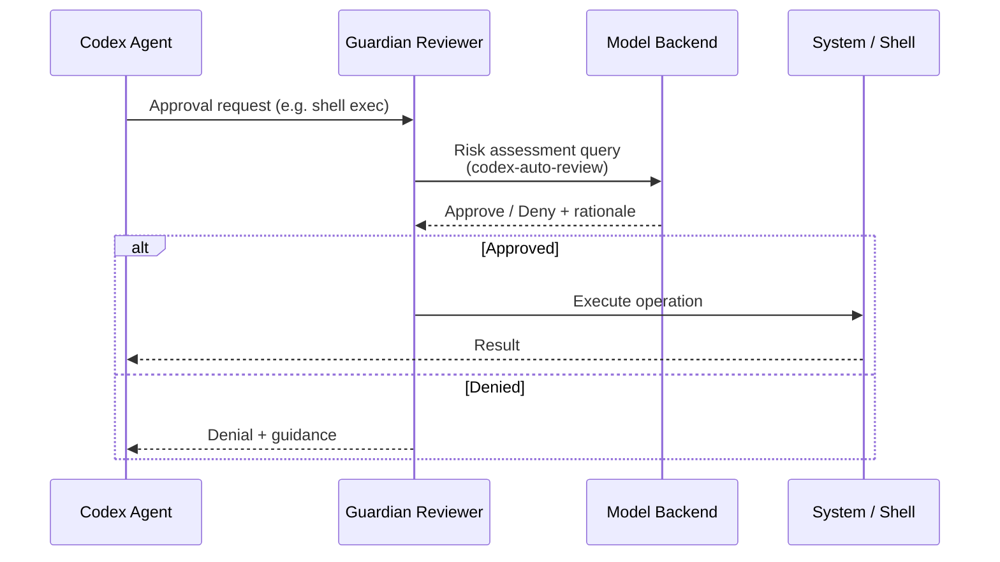
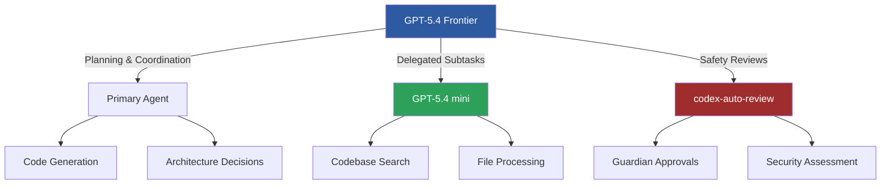

# Purpose-Built Agent Models: What `codex-auto-review` Tells Us About the Future of Specialised AI


---

On 16 April 2026, a single-commit pull request landed in the Codex CLI repository that carries outsized strategic significance. PR #18169 — "Use codex-auto-review for guardian reviews" — replaced the hardcoded `gpt-5.4` model slug in the Guardian reviewer with a new, purpose-built identifier: `codex-auto-review`[^1]. The change itself was minimal — a model slug swap managed through Statsig feature flags — but it crystallises a shift that has been building across the industry throughout 2026: the move from general-purpose frontier models toward purpose-built model variants optimised for specific agentic tasks.

## The Guardian Reviewer: Context and Architecture

To understand why this matters, you need to understand what the Guardian does. Introduced in PR #13860 as "Smart Approvals," the Guardian is a reviewer subagent that sits between the primary Codex agent and sensitive operations — shell execution, file writes, network access, and MCP tool invocations[^2]. When `approvals_reviewer = "guardian_subagent"` is set in configuration, the Guardian intercepts approval requests that would otherwise require human confirmation, gathers relevant context, and applies a risk-based decision framework before approving or denying the operation[^2].



The Guardian operates as a safety layer distinct from existing ARC (Alignment Research Center) mechanisms[^2]. Its lifecycle events — `item/autoApprovalReview/started` and `item/autoApprovalReview/completed` — are deliberately marked `[UNSTABLE]`, signalling that the protocol is still maturing[^2]. Guardian timeouts are handled separately from policy denials, with timeout-specific guidance surfaced in TUI history entries[^3].

## Why a Dedicated Model Slug Matters

Before PR #18169, the Guardian simply called `gpt-5.4` — the same frontier model powering primary agent tasks[^1]. This worked, but it was wasteful. A full frontier model invocation for every approval review is like deploying a Formula 1 car to check parking meters. The economics do not scale.

The `codex-auto-review` slug decouples the Guardian's model selection from the primary agent's. By routing through backend catalogue mappings and Statsig configuration rather than maintaining a hardcoded reference[^1], OpenAI gains several advantages:

**Independent optimisation.** The review model can be fine-tuned, distilled, or swapped without touching the client. A smaller model trained specifically on code review patterns — security vulnerabilities, destructive operations, data exfiltration attempts — can outperform a generalist on this narrow task while running at a fraction of the cost.

**Backend-managed rollout.** Statsig-backed configuration means OpenAI can A/B test different model variants, gradually shift traffic, and roll back instantly if quality regresses[^1]. This is standard practice for model serving but novel in the context of agentic safety reviews.

**Cost segmentation.** Enterprises can reason about review costs separately from generation costs. When your agent runs thousands of operations daily, the cumulative cost of frontier-model Guardian reviews becomes significant.

## The Broader Trend: Model Specialisation in 2026

The `codex-auto-review` move fits a pattern that has accelerated throughout 2026. The industry consensus is shifting from "one model to rule them all" toward a portfolio approach where different models handle different subtasks[^4].

### OpenAI's Own Trajectory

OpenAI's model lineage tells the story. GPT-5.2-Codex (January 2026) was explicitly purpose-built for agentic coding workflows — large refactors, codebase migrations, and multi-file feature implementations[^5]. GPT-5.3-Codex extended this to the full software lifecycle: debugging, deploying, monitoring, writing PRDs, and user research[^6]. Then GPT-5.4 re-unified the architecture, incorporating coding capabilities into the mainline model while simultaneously introducing GPT-5.4 mini for delegated subtasks[^7].

The pattern is not contradiction — it is stratification. The frontier model handles planning, coordination, and final judgement. Smaller, specialised variants handle narrower subtasks in parallel[^7]. `codex-auto-review` is the latest expression of this architecture.



### Evidence from the Wider Ecosystem

This is not an OpenAI-only phenomenon. NVIDIA's research on fine-tuning small language models for code review demonstrated that a fine-tuned Llama 3 8B model with LoRA achieved an 18% improvement in severity rating prediction accuracy over its baseline — and outperformed both Llama 3 70B (8× larger) and Nemotron 4 340B Instruct (40× larger) on the same task[^8]. When GPT-4 evaluated explanation quality, the fine-tuned 8B model consistently matched or outperformed these larger competitors[^8].

The economics are compelling. Serving a 7-billion parameter SLM costs 10–30× less than a 70–175 billion parameter frontier model[^9]. Enterprise SLM deployment runs at \$0.10–\$0.50 per million tokens versus \$2–\$30 for frontier LLMs[^9]. At scale, these differences compound dramatically.

## Enterprise Implications: The Model Selection Matrix

For teams running Codex in production, the `codex-auto-review` precedent suggests a model selection strategy that goes beyond "pick the best model and use it for everything."

### Cost Modelling by Task Type

Consider a typical enterprise agentic workflow:

| Task | Model Tier | Relative Cost | Latency |
|------|-----------|---------------|---------|
| Architecture planning | Frontier (GPT-5.4) | 1.0× | High |
| Code generation | Frontier or coding-specific | 0.8–1.0× | Medium |
| Guardian approval review | Purpose-built (codex-auto-review) | 0.1–0.3× ⚠️ | Low |
| Codebase search | Mini variant (GPT-5.4 mini) | 0.1–0.2× | Low |
| Security scanning | Specialised security model | 0.2–0.5× ⚠️ | Medium |

⚠️ Exact cost ratios for `codex-auto-review` and security-specific models are not publicly documented. Estimates based on SLM cost patterns from industry benchmarks[^9].

### Configuration for Multi-Model Workflows

Codex already supports this stratification through its configuration system. The `approvals_reviewer` setting routes Guardian reviews to the specialised model[^2], while the primary agent model is configured separately. Enterprise admins can constrain model selection through `allowed_approvals_reviewers` policies[^2].

```toml
# codex.toml — multi-model configuration
[agent]
model = "gpt-5.4"                          # Frontier for primary tasks

[approvals]
approval_policy = "on-request"
approvals_reviewer = "guardian_subagent"    # Routes to codex-auto-review
```

The admin policy layer adds governance:

```toml
# codex-enterprise.toml — admin constraints
[admin.approvals]
allowed_approvals_reviewers = ["guardian_subagent"]
sandbox_mode = "workspace-write"
```

## What Comes Next: Predicting the Specialisation Roadmap

If the Guardian reviewer warranted its own model, other agentic subtasks are likely candidates for the same treatment. Based on current Codex architecture and the broader industry trajectory, expect purpose-built variants for:

**Testing and validation.** Test generation requires understanding of assertion patterns, edge cases, and coverage gaps — a focused task that benefits from specialised training data. The LLM-as-a-Judge pattern already demonstrates that fine-tuned 8B models can achieve 99% accuracy relative to frontier models on evaluation tasks at less than 1% of the cost[^10].

**Documentation generation.** Extracting intent from code and producing clear technical prose is a distinct skill from code generation. A documentation-specific model could be trained on high-quality documentation corpora rather than general web text.

**Security analysis.** Codex Security (formerly codenamed Aardvark) already operates as a specialised agent for vulnerability detection[^11]. A dedicated model underlying this agent — analogous to `codex-auto-review` for the Guardian — would be a natural evolution.

**Planning and decomposition.** The orchestration layer that breaks complex tasks into subtasks could benefit from a model trained specifically on task decomposition patterns, dependency graphs, and work estimation.

## Practical Takeaways

1. **Monitor your model invocation costs by task type.** If your Guardian reviews are consuming frontier-model tokens, the `codex-auto-review` slug should reduce this once it propagates through Statsig configuration.

2. **Design agentic architectures with model heterogeneity in mind.** Hard-coding a single model throughout your pipeline is the monolith equivalent of model selection. Use configuration-driven model routing.

3. **Evaluate fine-tuned SLMs for repetitive review tasks.** NVIDIA's results demonstrate that an 8B model can outperform a 340B model on focused code review — the gap between "best model" and "best model for this task" is widening[^8].

4. **Track the `codex-auto-review` slug in release notes.** As this model matures through A/B testing on Statsig, expect OpenAI to document its capabilities and potentially expose it as an API-accessible model for custom review workflows.

The era of "one model for everything" in agentic systems is ending. `codex-auto-review` is a small PR with large implications — it signals that even the company with the most capable frontier model recognises that specialisation, not scale, is the path to production-grade agentic safety.

## Citations

[^1]: Jeff Harris, "Use codex-auto-review for guardian reviews," PR #18169, openai/codex, merged 16 April 2026. [https://github.com/openai/codex/pull/18169](https://github.com/openai/codex/pull/18169)

[^2]: Charley (charley-oai), "Add Smart Approvals guardian review across core, app-server, and TUI," PR #13860, openai/codex. [https://github.com/openai/codex/pull/13860](https://github.com/openai/codex/pull/13860)

[^3]: OpenAI, "Codex CLI Changelog — v0.121.0," 15 April 2026. [https://developers.openai.com/codex/changelog](https://developers.openai.com/codex/changelog)

[^4]: Pluralsight, "The best AI models in 2026: What model to pick for your use case," 2026. [https://www.pluralsight.com/resources/blog/ai-and-data/best-ai-models-2026-list](https://www.pluralsight.com/resources/blog/ai-and-data/best-ai-models-2026-list)

[^5]: Digital Applied, "GPT-5.2 and Codex: Complete OpenAI Model Guide 2026." [https://www.digitalapplied.com/blog/gpt-5-2-codex-openai-model-guide-2026](https://www.digitalapplied.com/blog/gpt-5-2-codex-openai-model-guide-2026)

[^6]: OpenAI, "Introducing GPT-5.3-Codex." [https://openai.com/index/introducing-gpt-5-3-codex/](https://openai.com/index/introducing-gpt-5-3-codex/)

[^7]: OpenAI, "Introducing GPT-5.4." [https://openai.com/index/introducing-gpt-5-4/](https://openai.com/index/introducing-gpt-5-4/)

[^8]: NVIDIA, "Fine-Tuning Small Language Models to Optimize Code Review Accuracy," NVIDIA Technical Blog. [https://developer.nvidia.com/blog/fine-tuning-small-language-models-to-optimize-code-review-accuracy/](https://developer.nvidia.com/blog/fine-tuning-small-language-models-to-optimize-code-review-accuracy/)

[^9]: Iterathon, "Small Language Models 2026: Cut AI Costs 75% with Enterprise SLM Deployment." [https://iterathon.tech/blog/small-language-models-enterprise-2026-cost-efficiency-guide](https://iterathon.tech/blog/small-language-models-enterprise-2026-cost-efficiency-guide)

[^10]: Self-Healing CI article reference — see Elastic production data and LLM-as-a-Judge benchmarks in prior Codex Resources coverage.

[^11]: OpenAI, "Codex Security (Aardvark)," referenced in Codex March 2026 updates. [https://blog.laozhang.ai/en/posts/openai-codex-march-2026](https://blog.laozhang.ai/en/posts/openai-codex-march-2026)
