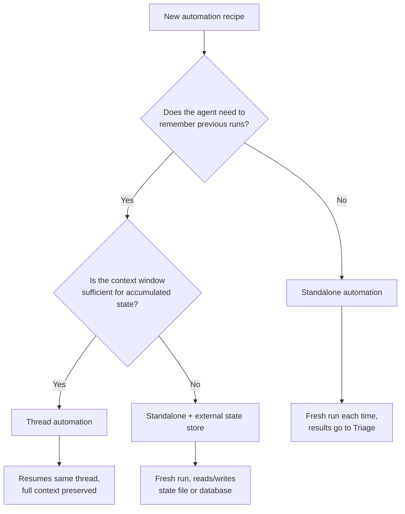

# Thread Automation Recipes: 15 Scheduled Agent Patterns for Daily Development


---

With thread automations landing in Codex 26.415 on 16 April 2026[^1], teams now have a native mechanism for heartbeat-style recurring agent execution that preserves full conversation context across runs[^2]. The official best practices guide frames the relationship neatly: "skills define the method, automations define the schedule"[^3]. But knowing the primitives and having a library of battle-tested patterns are different things entirely.

This article provides 15 concrete automation recipes — each with a scheduling cadence, prompt skeleton, and implementation notes — organised into four categories: daily operations, weekly maintenance, nightly infrastructure, and on-demand monitoring.

## Prerequisites

Every recipe assumes you have:

- Codex CLI ≥ 0.121.0 or Codex app 26.415+[^1]
- A project linked to a Git repository (most recipes use worktree execution)
- API key authentication configured via `CODEX_API_KEY` for unattended runs[^4]

Thread automations can be created conversationally within a Codex thread or via the Automations panel in the app sidebar[^2]. For CLI-driven setups, `codex exec` with external cron provides equivalent functionality[^4].

## Category 1: Daily Operations

### Recipe 1 — Daily Standup Summary

**Schedule:** `0 8 * * 1-5` (08:00 weekdays)
**Type:** Standalone automation

```text
Produce a standup briefing for the last 24 hours.
Group commits by workstream (feature, fix, infra, docs).
For each workstream: list authors, summarise intent, flag any TODO/FIXME added.
Format as Markdown with ## headings per workstream.
If no commits exist, say "quiet day" and stop.
```

**Implementation notes:** Run against your monorepo root. Use a standalone automation rather than a thread automation — each day's summary is independent and context accumulation adds no value[^3]. Post output to Slack via a webhook skill.

### Recipe 2 — CI Failure Triage

**Schedule:** Every 15 minutes during working hours
**Type:** Thread automation

```text
Check the latest CI run on the default branch.
If green: report "CI healthy" and sleep.
If red: identify the failing step, read the log tail, classify the failure
(flaky test / genuine regression / infra issue), and suggest a fix.
If you classified the same failure on your last wake-up, escalate to the
team channel with a @here mention.
```

**Implementation notes:** Thread automation is essential here — the agent needs to remember whether it already reported a specific failure to avoid alert fatigue[^2]. Use `--sandbox workspace-write` so the agent can read CI logs via `gh` but cannot push changes unattended[^5].

### Recipe 3 — Daily Changelog Digest

**Schedule:** `0 18 * * 1-5` (end of day)
**Type:** Standalone automation

```text
Generate a changelog digest covering all merged PRs since yesterday 18:00.
For each PR: title, author, one-line summary, breaking-change flag.
Group by label (feature, bugfix, chore, deps).
Output as Markdown suitable for pasting into release notes.
```

**Implementation notes:** Pair with the `gh pr list --merged` command. The prompt should specify the date range explicitly rather than relying on "today" to avoid timezone ambiguity.

### Recipe 4 — PR Reminder Agent

**Schedule:** `0 10 * * 1-5` (10:00 weekdays)
**Type:** Standalone automation

```text
List all open PRs older than 48 hours without a review.
For each: title, author, age in days, files changed count.
If any PR is older than 5 days, prepend ⚠️ STALE.
Post the list to #code-review.
```

**Implementation notes:** Keep this as a standalone automation — no state needed between runs. Use `gh pr list --json number,title,author,createdAt,reviews` to gather data.

## Category 2: Weekly Maintenance

### Recipe 5 — Dependency Update Sweep

**Schedule:** `0 21 * * 0` (Sunday evening)
**Type:** Standalone automation (worktree execution)


```bash
# GitHub Actions wrapper for CLI-driven dependency updates
- name: Codex dependency sweep
  run: |
    codex exec --full-auto "
      Run npm audit and cargo audit.
      For each vulnerability rated high or critical:
        attempt the recommended fix,
        run the test suite,
        commit if tests pass.
      Open one PR per ecosystem with all passing fixes.
    "
  env:
    CODEX_API_KEY: ${{ secrets.CODEX_API_KEY }}
```


**Implementation notes:** Always execute in a dedicated worktree so failed upgrades do not pollute the working tree[^2]. The `--full-auto` flag permits edits and commits without approval prompts — appropriate here because the test suite gates every change[^5]. For enterprise environments, pair with an `execpolicy` hook to enforce allow-lists on which packages may be auto-upgraded[^6].

### Recipe 6 — Stale Branch Cleaner

**Schedule:** `0 9 * * 1` (Monday morning)
**Type:** Standalone automation

```text
List all remote branches merged into main more than 14 days ago.
Exclude branches matching: release/*, hotfix/*, protect/*.
Delete each qualifying branch.
Report: branches deleted, branches skipped (with reason).
```

**Implementation notes:** Use `--sandbox danger-full-access` only if you trust the prompt constraints. Safer alternative: have the agent produce a deletion script and post it for human approval.

### Recipe 7 — Documentation Freshness Checker

**Schedule:** `0 14 * * 3` (Wednesday afternoon)
**Type:** Standalone automation

```text
For each Markdown file in docs/:
  compare the file's last-modified date against the source code it references.
  If the code changed more recently than the doc, flag it as potentially stale.
Output a table: file | last doc edit | last code edit | staleness (days).
Sort by staleness descending. Flag anything >30 days as ⚠️.
```

### Recipe 8 — Test Coverage Tracker

**Schedule:** `0 6 * * 1` (Monday pre-standup)
**Type:** Thread automation

```text
Run the test suite with coverage enabled.
Compare this week's coverage percentages against last week's (from your memory).
Report: overall delta, top 3 modules with coverage drops, top 3 with gains.
If overall coverage dropped by >2%, flag as ⚠️ REGRESSION.
```

**Implementation notes:** Thread automation is the right choice — the agent compares against its own prior observations, making cross-run context preservation valuable[^2].

## Category 3: Nightly Infrastructure

### Recipe 9 — Nightly Security Scan

**Schedule:** `0 2 * * *` (02:00 daily)
**Type:** Standalone automation (worktree execution)

```text
Run SAST tooling (semgrep, trivy) against the default branch.
Parse findings. Deduplicate against yesterday's known issues list.
For genuinely new findings:
  classify severity (critical/high/medium/low),
  provide a one-paragraph remediation suggestion,
  if critical: open a GitHub issue and label it security/critical.
```

**Implementation notes:** Codex Security already scans repositories commit-by-commit and validates findings in isolated environments before surfacing them[^7]. This recipe layers additional tooling on top. Run in a worktree with `--sandbox workspace-write` to allow issue creation without broader repository write access.

### Recipe 10 — Config Drift Detector

**Schedule:** `0 3 * * *` (03:00 daily)
**Type:** Thread automation

```text
Compare infrastructure config files (terraform/*.tf, k8s/*.yaml, docker-compose*.yml)
against their last-known-good state from your previous run.
Report any unexpected changes: file, diff summary, committer, commit message.
If a change touches security groups, IAM, or secrets references, flag as ⚠️ SECURITY-SENSITIVE.
```

**Implementation notes:** Thread automation preserves the "last-known-good" baseline in conversation context, eliminating the need for an external state store[^2].

### Recipe 11 — Performance Regression Tracker

**Schedule:** `0 4 * * *` (04:00 daily)
**Type:** Thread automation

```text
Run the benchmark suite (cargo bench / npm run bench / pytest --benchmark).
Compare results against baselines from your previous run.
Flag any benchmark that regressed by >10% as ⚠️.
If the same benchmark regressed on two consecutive runs, open a GitHub issue
tagged performance/regression with the before/after numbers.
```

## Category 4: On-Demand Monitoring

### Recipe 12 — API Deprecation Monitor

**Schedule:** `0 10 * * 1,4` (Monday and Thursday)
**Type:** Standalone automation

```text
Check dependency changelogs and release notes for any APIs we consume.
Cross-reference with our codebase's import statements and API calls.
Flag any usage of deprecated endpoints, removed parameters, or sunset timelines.
Output: affected file, line number, deprecation details, migration guidance.
```

### Recipe 13 — Licence Compliance Scanner

**Schedule:** `0 5 * * 1` (Monday early morning)
**Type:** Standalone automation

```text
Enumerate all transitive dependencies and their licences.
Flag any dependency using a licence not in the approved list:
  MIT, Apache-2.0, BSD-2-Clause, BSD-3-Clause, ISC, MPL-2.0.
For flagged dependencies: name, version, licence, which of our packages depends on it.
If a new non-compliant dependency appeared since last week, open an issue.
```

### Recipe 14 — Memory Consolidation Schedule

**Schedule:** `0 22 * * 5` (Friday evening)
**Type:** Thread automation

```text
Review all Codex sessions from this week.
Identify recurring patterns: frequently used commands, repeated context setup,
common friction points, knowledge that was re-discovered multiple times.
Consolidate findings into updated AGENTS.md entries and memory notes.
Suggest prompt improvements for next week.
```

**Implementation notes:** This meta-automation embodies the best practices guidance: "use automations for reflection and maintenance, not just execution"[^3]. The thread context preserves the agent's evolving understanding of your team's workflow patterns.

### Recipe 15 — On-Call Handoff Briefing

**Schedule:** `0 8 * * 1` (Monday, start of on-call rotation)
**Type:** Standalone automation

```text
Produce an on-call handoff briefing covering:
  - All incidents from the past week (source: PagerDuty/Opsgenie API)
  - Open issues labelled bug/critical or bug/high
  - Recent infrastructure changes (from config drift detector findings)
  - Known flaky tests (from CI triage history)
  - Upcoming deployments scheduled this week
Format as a structured briefing with ## sections and severity indicators.
```

## Choosing the Right Automation Type

The decision between thread and standalone automations follows a simple heuristic:



Thread automations shine for comparative analysis (recipes 2, 8, 10, 11, 14) where the agent compares current state against its own prior observations[^2]. Standalone automations suit reporting tasks (recipes 1, 3, 4, 5, 6, 12, 13, 15) where each run is self-contained[^3].

## Prompt Design Principles

The official best practices documentation offers a critical insight for automation prompts[^3]:

1. **Describe what should happen on each wake-up** — not just the overall goal
2. **Define success criteria** — when should the agent report vs stay silent?
3. **Specify stopping conditions** — when should the agent escalate rather than retry?
4. **Stabilise manually first** — "skills define the method, automations define the schedule"[^3]

Avoid automating workflows that still require frequent steering adjustments. The documentation explicitly warns that "automating unstable workflows prematurely wastes resources and produces unreliable results"[^3].

## Security Considerations

Every recipe that writes to the repository or interacts with external services should respect sandbox boundaries[^5]:

- **Read-only** (`--sandbox read-only`): Suitable for monitoring and reporting recipes (1, 3, 4, 7, 8, 12, 13)
- **Workspace-write** (`--sandbox workspace-write`): For recipes that create issues or PRs (2, 5, 9, 11)
- **Full access** (`--sandbox danger-full-access`): Only for recipes like branch cleanup (6) where broader permissions are unavoidable — and even then, prefer generating a script for human approval

Enterprise teams should enforce sandbox restrictions via `execpolicy` hooks to prevent individual automations from escalating their own permissions[^6].

## Citations

[^1]: [Codex Changelog — 26.415 release](https://developers.openai.com/codex/changelog), OpenAI Developers, April 2026.
[^2]: [Automations — Codex app](https://developers.openai.com/codex/app/automations), OpenAI Developers, April 2026.
[^3]: [Best practices — Codex](https://developers.openai.com/codex/learn/best-practices), OpenAI Developers, 2026.
[^4]: [Non-interactive mode — Codex](https://developers.openai.com/codex/noninteractive), OpenAI Developers, 2026.
[^5]: [Codex CLI Automation: 3 Workflow Patterns for GitHub Actions, Cron & CI](https://smartscope.blog/en/generative-ai/chatgpt/codex-cli-automation-workflow-patterns/), SmartScope, April 2026.
[^6]: [Security — Codex](https://developers.openai.com/codex/security), OpenAI Developers, 2026.
[^7]: [Automating Code Quality and Security Fixes with Codex CLI on GitLab](https://developers.openai.com/cookbook/examples/codex/secure_quality_gitlab), OpenAI Cookbook, 2026.
