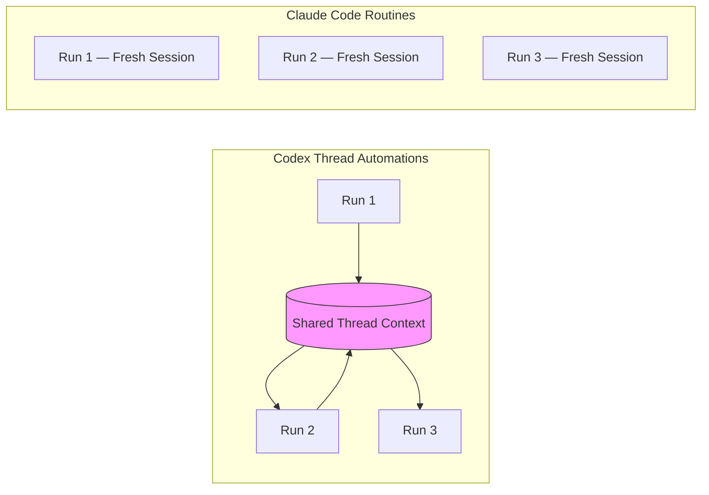
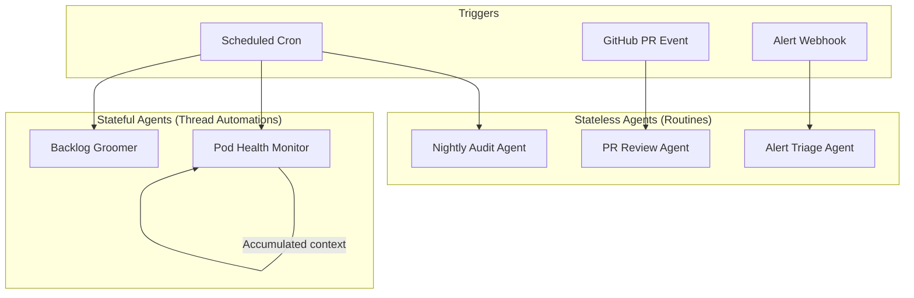

# Thread Automations vs Claude Code Routines: How Scheduled Agent Execution Changes Everything


---

Within 48 hours of each other (14–16 April 2026), both Anthropic and OpenAI shipped scheduled agent execution for their respective coding tools[^1][^2]. Anthropic launched **Claude Code Routines** — cloud-hosted automations with scheduled, API, and GitHub webhook triggers[^3]. OpenAI followed with **thread automations** in the Codex 26.415 platform update — heartbeat-style recurring wake-ups that preserve full conversation context across runs[^2]. This convergence signals that the industry considers unattended, recurring agent execution a table-stakes capability for agentic development platforms.

This article dissects the architectural differences, compares scheduling models, and explores what both approaches mean for teams building agentic pods.

## Architectural Foundations

The two systems start from fundamentally different assumptions about state and infrastructure.

### Codex Thread Automations: Stateful and Local-First

Thread automations are "heartbeat-style recurring wake-up calls attached to the current thread"[^4]. Each wake-up resumes the same conversation, with full access to prior messages, tool outputs, and accumulated context. The agent literally picks up where it left off.

Codex offers three automation tiers[^4]:

| Type | Context | Scope |
|:-----|:--------|:------|
| **Standalone** | Fresh each run | Cross-project; results land in Triage |
| **Project** | Fresh each run | Tied to a Git repo; local or worktree execution |
| **Thread** | Preserved across runs | Attached to current conversation |

Thread automations execute within the Codex desktop app, inheriting the local sandbox and plugin ecosystem. For Git-backed projects, execution can run locally (modifying your working tree directly) or in an isolated worktree[^4].

### Claude Code Routines: Stateless and Cloud-Native

A routine is "a saved Claude Code configuration: a prompt, one or more repositories, and a set of connectors, packaged once and run automatically"[^3]. Each run starts a fresh cloud session — there is no persistent thread. The routine clones repositories from scratch, executes its prompt, and produces a session you can review or continue manually.

Routines run on Anthropic-managed cloud infrastructure, meaning they keep working when your laptop is closed[^3]. This is the key differentiator: routines are infrastructure, not a desktop feature.



## Trigger Models Compared

Both platforms support time-based scheduling, but Claude Code goes further with event-driven triggers.

### Codex Scheduling

Codex thread automations support[^4]:

- **Minute-based intervals** — for active follow-up loops (monitoring a deploy, watching CI)
- **Daily and weekly schedules** — for periodic check-ins
- **Custom cron syntax** — for non-standard cadences

The sub-minute granularity is notable. You can set a thread automation to wake every five minutes and poll an external service, with each wake-up building on the previous context. This makes thread automations well-suited to monitoring workflows where accumulated state matters.

### Claude Code Triggers

Routines support three trigger types that can be combined on a single routine[^3]:

```toml
# Conceptual trigger configuration for a routine
[triggers.schedule]
frequency = "daily"       # hourly | daily | weekdays | weekly
# Custom cron via: /schedule update

[triggers.api]
endpoint = "https://api.anthropic.com/v1/claude_code/routines/{id}/fire"
# Bearer token auth, optional text payload

[triggers.github]
event = "pull_request.opened"
repository = "myorg/myrepo"
filters = { base_branch = "main", is_draft = false }
```

The **API trigger** is particularly interesting for enterprise integration. It exposes a dedicated HTTP endpoint per routine with bearer token authentication[^3]. You can wire it into alerting systems, deploy pipelines, or internal tooling:

```bash
curl -X POST https://api.anthropic.com/v1/claude_code/routines/trig_01ABC/fire \
  -H "Authorization: Bearer sk-ant-oat01-xxxxx" \
  -H "anthropic-beta: experimental-cc-routine-2026-04-01" \
  -H "anthropic-version: 2023-06-01" \
  -H "Content-Type: application/json" \
  -d '{"text": "Sentry alert SEN-4521 fired in prod."}'
```

The **GitHub trigger** supports `pull_request` and `release` events with granular filtering on author, title, labels, branch, draft status, and fork origin[^3]. Each matching event spawns an independent session.

### Trigger Comparison Matrix

| Capability | Codex Thread Automations | Claude Code Routines |
|:-----------|:------------------------|:--------------------|
| Cron/schedule | ✅ Minute-level granularity | ✅ Hourly minimum |
| Custom cron syntax | ✅ | ✅ (via `/schedule update`) |
| API/webhook trigger | ❌ | ✅ Per-routine HTTP endpoint |
| GitHub event trigger | ❌ | ✅ PR and release events |
| Context preservation | ✅ Full thread context | ❌ Fresh session each run |
| Offline execution | ❌ Requires app running | ✅ Cloud infrastructure |
| Sub-hour intervals | ✅ | ❌ One-hour minimum |

## Execution Security Models

Codex automations inherit the sandbox model from the desktop app, with three levels: read-only, workspace-write (network blocked), and full access[^4]. Automations default to `approval_policy = "never"` — no human confirmation prompts during runs — unless organisation policy enforces otherwise[^4].

Claude Code routines run autonomously as full cloud sessions with no permission-mode picker and no approval prompts[^3]. What a routine can reach is constrained by selected repositories, branch-push settings (`claude/`-prefixed branches by default), network access level, environment variables, and included MCP connectors[^3].

Both approaches face the same fundamental tension: unattended agents need enough permissions to be useful, but too much latitude creates risk. Codex addresses this through sandbox tiers; Claude Code addresses it through repository scoping and connector selection.

## Usage Limits and Pricing

Claude Code routines have explicit daily run caps tied to subscription tier[^5]:

| Plan | Daily Routine Runs |
|:-----|:-------------------|
| Pro | 5 |
| Max | 15 |
| Team / Enterprise | 25 |

Organisations with extra usage enabled can exceed these caps on metered billing[^3]. Each routine run counts against standard subscription usage the same way interactive sessions do.

Codex thread automations do not publish explicit run caps, but frequent worktree schedules accumulate background worktrees that require disk management[^4]. Automation usage consumes the same API credits as interactive sessions.

## Implications for Agentic Pods

The convergence on scheduled execution creates new patterns for teams running multi-agent workflows.

### Pod Maintenance on Autopilot

Thread automations excel at **institutional memory** for a pod. A maintenance thread can wake every morning, review overnight CI failures, check dependency updates, and update a status board — all while remembering what it found yesterday. The accumulated context means the agent can spot trends ("this test has been flaky for three days") rather than treating each run as isolated.

### Event-Driven Agent Coordination

Claude Code routines excel at **event-driven orchestration**. A GitHub trigger fires on every new PR, running your team's bespoke review checklist[^3]. An API trigger wired to your monitoring stack spawns a triage agent when error thresholds breach[^3]. The stateless model means each event gets clean, focused attention without context pollution from unrelated runs.

### The Hybrid Pattern

The strongest agentic pod architectures will likely combine both approaches:



Use **stateless routines** for discrete, event-driven tasks where fresh context is an advantage (code review, alert triage, deploy verification). Use **stateful thread automations** for ongoing monitoring where accumulated context adds value (trend detection, backlog grooming, institutional knowledge).

## The Broader Competitive Landscape

The Codex and Claude Code offerings are not the only entrants. Kimi Code CLI from Moonshot AI supports parallel agent instances and headless terminal execution[^6], positioning the terminal as "infrastructure primitive" for long-running agents. Cline CLI 2.0 offers similar multi-agent parallelism[^7]. However, neither currently matches the first-class scheduling and trigger infrastructure that Codex and Claude Code now provide.

The pattern is clear: the agentic coding tool market is moving from "human types prompt, agent responds" to "agent runs autonomously on schedule or event, human reviews results." The tools that win will be the ones whose scheduling, triggering, and context management make unattended execution reliable enough to trust overnight.

## Key Takeaways

1. **Context preservation is the differentiator.** Codex thread automations carry forward conversation state; Claude Code routines start fresh. Choose based on whether your use case benefits from accumulated knowledge or clean isolation.

2. **Cloud-native beats local for reliability.** Routines run regardless of laptop state. Thread automations require the Codex app to be running. For production-grade agentic workflows, cloud execution is the safer bet.

3. **Event-driven triggers unlock new patterns.** Claude Code's API and GitHub triggers enable reactive agent architectures that cron alone cannot. Wiring agents into your existing event infrastructure (alerting, CI/CD, webhooks) creates genuinely autonomous development operations.

4. **Plan for hybrid architectures.** The strongest agentic pods will use both stateful and stateless scheduled agents, selecting the right tool based on whether the task needs memory or isolation.

## Citations

[^1]: [Anthropic's Claude Code gets automated 'routines' and a desktop makeover — SiliconANGLE](https://siliconangle.com/2026/04/14/anthropics-claude-code-gets-automated-routines-desktop-makeover/)
[^2]: [Changelog — Codex — OpenAI Developers](https://developers.openai.com/codex/changelog) — 26.415 release, thread automations feature
[^3]: [Automate work with routines — Claude Code Docs](https://code.claude.com/docs/en/routines)
[^4]: [Automations — Codex app — OpenAI Developers](https://developers.openai.com/codex/app/automations)
[^5]: [Claude Code routines promise mildly clever cron jobs — The Register](https://www.theregister.com/2026/04/14/claude_code_routines/)
[^6]: [Kimi Code K2.6 Preview: What Developers Need to Know (2026)](https://www.buildfastwithai.com/blogs/kimi-code-k26-preview-2026)
[^7]: [Announcing Cline CLI 2.0 with free Kimi K2.5](https://cline.bot/blog/announcing-cline-cli-2-0)
