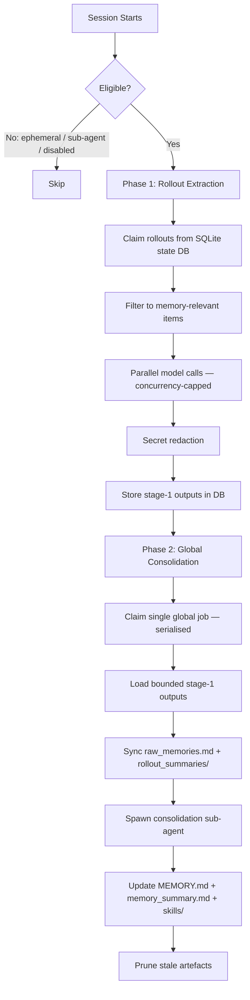
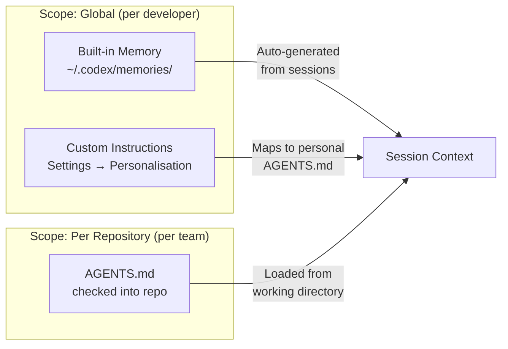

# Codex Built-In Memory Deep Dive: How the Two-Phase Pipeline Turns Sessions into Institutional Knowledge


---

Codex CLI shipped a built-in memory preview on 16 April 2026 as part of the major "Codex for (almost) everything" update[^1]. Unlike project-scoped `AGENTS.md` files or third-party solutions like MemPalace, this is a first-party, local-first memory system baked directly into the Rust core[^2]. It extracts useful context from completed sessions, consolidates it into on-disk artefacts, and injects those memories into future threads — so the agent progressively learns your preferences, conventions, and pitfalls without you repeating yourself.

This article dissects the architecture, configuration surface, privacy model, and practical usage patterns.

## Why Not Just AGENTS.md?

`AGENTS.md` is the right tool for team-level, version-controlled project rules — coding standards, test commands, deployment conventions[^3]. But it has two blind spots:

1. **Personal preferences** — your preferred review style, verbosity, formatting quirks — don't belong in a shared repo file.
2. **Learned corrections** — when you tell Codex "don't use `unwrap()` in production code" mid-session, that correction dies with the thread.

Built-in memory fills both gaps. It operates as a **local recall layer** that sits alongside `AGENTS.md`, not as a replacement[^4]. The official documentation is explicit: "Keep required team guidance in AGENTS.md or checked-in documentation. Treat memories as a helpful local recall layer."[^4]

## Architecture: The Two-Phase Pipeline

The memory system is implemented in the `codex-memory` crate[^2] and runs asynchronously at session startup. It only triggers for non-ephemeral, non-sub-agent sessions with the feature enabled and a state database available[^2].



### Phase 1: Rollout Extraction

Phase 1 processes individual completed sessions ("rollouts") into structured memory records[^2]. Eligible rollouts must be:

- from interactive session sources
- within the configured age window
- idle long enough (to avoid summarising active sessions)
- not already claimed by another worker

Each rollout is sent to a model that produces structured output containing a detailed `raw_memory`, a compact `rollout_summary`, and an optional `rollout_slug`[^2]. Extraction jobs run in parallel with a fixed concurrency cap, and each is lease-claimed in the SQLite state database to prevent duplicate work across concurrent startups[^2].

Failed jobs are marked with retry backoff rather than hot-looping — a resilience pattern that prevents runaway model calls on transient failures[^2].

### Phase 2: Global Consolidation

Phase 2 is serialised — only one consolidation runs at a time[^2]. It:

1. Loads a bounded set of stage-1 outputs, ranked by `usage_count` then by recency
2. Filters out memories whose `last_usage` exceeds the `max_unused_days` window
3. Computes a diff against the previous successful consolidation (`added`, `retained`, `removed`)
4. Syncs filesystem artefacts: `raw_memories.md` and individual files under `rollout_summaries/`
5. Spawns an internal consolidation sub-agent with **no approvals, no network, and local write access only**
6. The sub-agent updates `MEMORY.md`, `memory_summary.md`, and learned `skills/`

The separation into two phases is deliberate: Phase 1 scales horizontally across many rollouts, while Phase 2 serialises the global state update to maintain consistency[^2].

#### The Forgetting Mechanism

Memories aren't permanent. The consolidation diff surfaces `removed` entries — rollouts that were previously selected but have dropped out of the current top-N ranking[^2]. During consolidation, evidence for removed threads is kept temporarily available (the union of current and previous selections) so the sub-agent can make informed forgetting decisions[^2]. This prevents abrupt context loss while still allowing the memory set to evolve.

## On-Disk Layout

All memory artefacts live under `~/.codex/memories/` (or `$CODEX_HOME/memories/`)[^4]:

```
~/.codex/memories/
├── MEMORY.md                          # Consolidated high-level memory
├── memory_summary.md                  # Compact summary for injection
├── raw_memories.md                    # Merged raw extractions (latest first)
├── rollout_summaries/
│   ├── 2026-04-15-refactor-auth.md    # Per-rollout summary
│   └── 2026-04-16-fix-ci-pipeline.md
├── skills/                            # Learned procedural memories
└── memories_extensions/               # Plugin-contributed memories
    └── <extension>/
        ├── instructions.md
        └── resources/
```

The `MEMORY.md` file is the primary injection point — its contents are included in the system prompt of future sessions when `use_memories` is enabled[^4].

## Configuration

Enable the feature and tune its behaviour in `~/.codex/config.toml`:

```toml
[features]
memories = true

[memories]
# Control the two sides independently
generate_memories = true    # Extract memories from new sessions
use_memories = true         # Inject memories into future sessions

# Override models for cost/speed tuning
extract_model = "gpt-5.2-codex"         # Cheaper model for extraction
consolidation_model = "gpt-5.3-codex"   # More capable model for consolidation
```

The model overrides are particularly useful for cost management[^5]. Extraction runs per-rollout (potentially many calls), so a cheaper model makes sense. Consolidation runs once and needs to reason over the full memory set, so a more capable model pays for itself.

### Per-Thread Control

The `/memories` TUI command lets you control memory behaviour within a session[^4]:

- Toggle whether the current thread contributes to future memories
- Review what memories are being injected into the current session
- Force a memory refresh

## Privacy and Security Model

The memory system applies automatic secret redaction to all generated memory fields before storing them in the state database[^2]. However, the official guidance is clear: "Don't store secrets in memories" and "review memory files before sharing directories"[^4].

### Regional Restrictions

Memories are **unavailable** in the European Economic Area (EEA), the United Kingdom, and Switzerland at launch[^4]. This is a regulatory compliance decision — the feature processes session content through models to generate memories, which intersects with GDPR data processing requirements[^6].

For teams with developers across regions, this means memory behaviour will differ by developer location. `AGENTS.md` remains the correct mechanism for anything that must apply universally.

### What Gets Stored Locally

All memory artefacts are local files and SQLite records under `~/.codex/`[^2][^4]. No memory content is uploaded to OpenAI's servers beyond the model calls required for extraction and consolidation. The consolidation sub-agent runs with no network access[^2].

## Memory vs AGENTS.md vs Custom Instructions

Understanding the three persistent context layers prevents duplication and misconfiguration:



| Aspect | Built-in Memory | AGENTS.md | Custom Instructions |
|--------|----------------|-----------|-------------------|
| **Scope** | Per-developer, global | Per-repo, team-shared | Per-developer, global |
| **Source** | Auto-extracted from sessions | Manually authored | Manually authored |
| **Version controlled** | No (local only) | Yes (committed to repo) | No (app settings) |
| **Survives compaction** | Yes (injected at start) | Yes (re-read after compact) | Yes (system prompt) |
| **Cross-tool** | Codex only | AAIF standard — Codex, Claude Code, Cursor[^3] | Codex only |
| **Best for** | Learned preferences, corrections | Team rules, project conventions | Personal defaults |

## Practical Patterns

### Pattern 1: Bootstrap a New Machine

Memory files are portable. Copy `~/.codex/memories/` to a new machine and your preferences, learned conventions, and accumulated corrections transfer immediately — no re-training required.

### Pattern 2: Model Cascade for Cost Control

Use a cheap model for Phase 1 extraction (runs per-rollout) and a capable model for Phase 2 consolidation (runs once):

```toml
[memories]
extract_model = "o4-mini"
consolidation_model = "gpt-5.3-codex"
```

This can reduce memory pipeline costs by 60–80% compared to using the default model for both phases. ⚠️ *Exact savings depend on rollout volume and model pricing at time of use.*

### Pattern 3: Memory Hygiene Automation

Periodically review `~/.codex/memories/MEMORY.md` for:

- Stale preferences you've changed your mind about
- Incorrectly generalised patterns from one-off sessions
- Any residual secrets that escaped redaction

```bash
# Quick audit — what does Codex remember about you?
cat ~/.codex/memories/MEMORY.md

# Nuclear option — reset all memories
rm -rf ~/.codex/memories/
```

### Pattern 4: Separate Work and Personal Contexts

Use `CODEX_HOME` to maintain separate memory stores:

```bash
# Work context
CODEX_HOME=~/.codex-work codex

# Personal projects
CODEX_HOME=~/.codex-personal codex
```

Each home directory maintains its own memory pipeline, state database, and consolidated artefacts.

### Pattern 5: Memory-Aware AGENTS.md

Reference the memory system in your `AGENTS.md` to prevent conflicts:

```markdown
## Context Layers
- Team rules: this file (AGENTS.md)
- Personal preferences: developer's built-in memory (do not duplicate here)
- If memory contradicts this file, this file wins
```

## Limitations and Caveats

- **Not available in EEA/UK/Switzerland** — regulatory restriction at launch[^4]
- **No cross-tool portability** — memories are Codex-only; for cross-tool memory, see MemPalace[^7] or similar MCP-based solutions
- **No manual memory injection** — you cannot directly write to the memory pipeline; it only learns from sessions
- **Ephemeral and sub-agent sessions are excluded** — `codex exec --ephemeral` calls do not contribute memories[^2]
- **Background processing** — memories update asynchronously, not immediately after a session ends[^4]
- **Secret redaction is best-effort** — review files before sharing `~/.codex/` directories[^4]

## What This Means for Enterprise Teams

For enterprise deployments, the memory system creates a tension: individual developer memories improve productivity, but they're invisible to the team and ungoverned. The practical approach:

1. **Enforce team rules in `AGENTS.md`** — these are version-controlled and auditable
2. **Use memories for personal acceleration** — review style, verbosity, preferred patterns
3. **Set `generate_memories = false` in governed profiles** if compliance requires it
4. **Audit periodically** — `~/.codex/memories/` is plain Markdown, trivially reviewable

The permission profiles system[^8] can enforce memory settings per repository through governed repo mode, ensuring sensitive codebases don't accumulate developer-specific memory artefacts.

## Citations

[^1]: OpenAI, "Codex for (almost) everything", 17 April 2026 — [https://openai.com/index/codex-for-almost-everything/](https://openai.com/index/codex-for-almost-everything/)
[^2]: OpenAI, `codex-rs/core/src/memories/README.md` (main branch) — [https://github.com/openai/codex/blob/main/codex-rs/core/src/memories/README.md](https://github.com/openai/codex/blob/main/codex-rs/core/src/memories/README.md)
[^3]: AAIF, "AGENTS.md Specification", donated to Linux Foundation December 2025 — [https://developers.openai.com/codex/guides/agents-md](https://developers.openai.com/codex/guides/agents-md)
[^4]: OpenAI, "Memories — Codex | OpenAI Developers" — [https://developers.openai.com/codex/memories](https://developers.openai.com/codex/memories)
[^5]: OpenAI, "Configuration Reference — Codex | OpenAI Developers" — [https://developers.openai.com/codex/config-reference](https://developers.openai.com/codex/config-reference)
[^6]: gHacks, "OpenAI Updates Codex With Computer Use, In-App Browser, Memory, and 90-Plus New Plugins", 17 April 2026 — [https://www.ghacks.net/2026/04/17/openai-updates-codex-with-computer-use-in-app-browser-memory-and-90-plus-new-plugins/](https://www.ghacks.net/2026/04/17/openai-updates-codex-with-computer-use-in-app-browser-memory-and-90-plus-new-plugins/)
[^7]: MemPalace Cloud Plugin — [https://mempalace.cloud](https://mempalace.cloud)
[^8]: OpenAI, Codex permission profiles PRs #18285–#18288 — [https://github.com/openai/codex/releases](https://github.com/openai/codex/releases)
