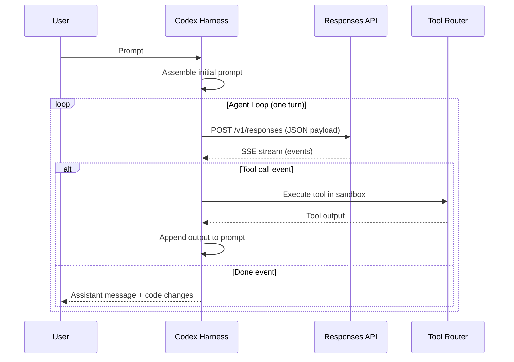
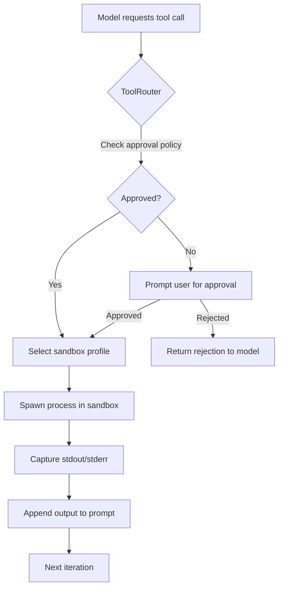
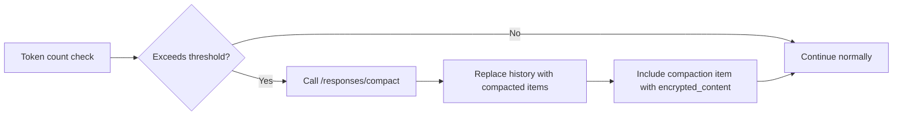

# The Codex CLI Agent Loop Explained: What Happens When You Hit Enter

Every time you type a prompt into Codex CLI and press Enter, an orchestration engine kicks into gear — assembling context, querying a model, executing tools, and looping until the task is done. OpenAI calls this the **agent loop**, and understanding it is the difference between treating Codex as a black box and being able to debug, optimise, and extend it effectively.

This article dissects that loop from the inside out, drawing on OpenAI's own engineering deep-dive[^1] and the open-source Rust implementation[^2].

## The Big Picture

A single interaction with Codex CLI — from prompt to final response — is called a **turn**. A turn may contain dozens of internal **iterations**, each involving a model inference call and zero or more tool executions. The turn ends only when the model emits a `done` event containing an assistant message such as "I've updated the tests for you."[^1]

The harness — Codex's core runtime — is the glue between you, the model, and the tools the model invokes[^3]. In the Rust rewrite (codex-rs), this lives in the `codex-exec` crate, but the logical flow is the same regardless of implementation language[^4].

## Phase 1: Prompt Assembly

Before any model call, Codex constructs a structured JSON payload for the Responses API. The payload follows a strict hierarchy with role-based priority weighting[^1]:

1. **System message** — server-controlled instructions defining the agent's core behaviour
2. **Tool definitions** — all available tools including built-in shell/file tools, API-registered tools, and MCP servers
3. **Instructions** — client-provided guidance assembled from multiple cascading sources
4. **Input sequence** — user messages, prior assistant responses, and tool call results

### Instruction Cascading

The instructions component deserves special attention. Codex merges guidance from several sources in priority order[^1][^5]:

1. `~/.codex/config.toml` — global user preferences
2. `AGENTS.override.md` — project-level overrides (typically git-ignored)
3. `AGENTS.md` files — traversed from the project root to the current working directory
4. Configured skill instructions

Each source is subject to a 32 KiB limit[^1]. This cascading design means a team can set project-wide conventions in a root `AGENTS.md` while individual developers add personal preferences in `config.toml` or `AGENTS.override.md`.

## Phase 2: Model Inference via the Responses API

With the prompt assembled, Codex sends an HTTP POST to the Responses API. The exact endpoint varies by authentication method[^1]:

| Auth Method | Endpoint |
|---|---|
| ChatGPT login | `chatgpt.com/backend-api/codex/responses` |
| API key | `api.openai.com/v1/responses` |
| Local model | `localhost:11434/v1/responses` |

The default model is `o4-mini`, though this is configurable via `--model` or `config.toml`[^2]. For Codex Cloud, the dedicated `codex-1` model — a fine-tuned variant of o3 optimised for software engineering — is used instead[^6].

### Streaming with Server-Sent Events

The API responds via Server-Sent Events (SSE), with each event containing a JSON payload prefixed by type[^1]. Key event types include:

- **`response.output_text.delta`** — incremental text for real-time UI streaming
- **`response.output_item.added`** — new items (tool calls, reasoning steps) that must be appended to subsequent requests
- **`response.output_item.done`** — completion markers for individual items
- **`response.done`** — the turn-ending signal

A single response can contain multiple `done` events — for example, a reasoning item followed by a function call — and each must be captured and included in the next iteration's input[^1].

## Phase 3: Tool Execution

When the model requests a tool call, the harness routes it through the **ToolRouter**, which enforces the configured approval policy before spawning the process[^7].

### Approval Policies

Codex's current approval modes (post-Rust rewrite) are[^7][^8]:

| Mode | Behaviour |
|---|---|
| **Auto** (default) | Reads, edits, and commands within the working directory proceed automatically; external access requires approval |
| **Read-only** | Agent can browse files but cannot execute commands or write |
| **Full Access** | Unrestricted machine and network access |

### Sandbox Enforcement

Every tool call executes within a sandbox whose profile applies to the **entire process tree**, not just the direct child process[^7]. This prevents a tool call from spawning background workers that escape the policy boundary. The sandbox implementation is platform-native:

- **macOS** — App Sandbox / `sandbox-exec`
- **Linux** — Landlock + seccomp
- **Windows** — Win32 job objects and restricted tokens

The tool output — stdout, stderr, exit codes — is appended to the conversation history and fed back to the model for the next iteration of the loop[^1].

## Phase 4: Context Window Management

As the loop iterates, the conversation payload grows. Every iteration resends the full history because Codex deliberately maintains **stateless requests** — it never uses the `previous_response_id` parameter[^1]. This design choice enables Zero Data Retention (ZDR) compliance, critical for enterprise customers who cannot have conversation data persisted on OpenAI's servers[^1].

The trade-off is that naive looping would be **quadratic** in cost — each iteration processes all previous tokens plus new ones. Two mechanisms keep this manageable.

### Prompt Caching

Exact-prefix prompt caching converts quadratic inference cost to approximately **linear** on cache hits[^1]. The key insight is that the static portion of the prompt (system instructions, tool definitions, early conversation items) remains identical across iterations, so only new tokens at the tail require fresh computation.

This is why certain configuration changes mid-conversation are expensive — they invalidate the cached prefix[^1]:

- Changing the tool list or MCP server configuration
- Switching models
- Modifying sandbox or approval settings
- Changing the working directory

Codex mitigates this by appending new content rather than modifying earlier items wherever possible[^1].

### Context Compaction

When token count exceeds the `auto_compact_limit` threshold, Codex invokes a dedicated `/responses/compact` endpoint[^9]. This triggers a two-path process:

1. **Remote path** (OpenAI models) — server-side compaction via the API
2. **Local path** (any provider) — client-side LLM summarisation

The compaction generates a replacement conversation that includes a special `type=compaction` item with opaque `encrypted_content`[^9]. This preserves the model's latent understanding of the original conversation while dramatically reducing token count.

The summarisation prompt requests four specific sections[^10]:

1. Current progress and key decisions
2. Important constraints and user preferences
3. Remaining TODOs
4. Critical data needed to continue work

⚠️ It is worth noting that compaction **permanently deletes** original tool outputs and model responses — unlike Claude Code's layered approach, Codex commits to irreversible compression[^10].

You can configure compaction behaviour in `config.toml` or via the API's `context_management` parameter with a `compact_threshold` value[^9].

## Putting It All Together: A Complete Turn

Here is what happens when you type `fix the failing test in auth_test.go` and press Enter:

1. **Prompt assembly** — Codex collects your system instructions from `config.toml` and `AGENTS.md`, enumerates available tools, and packages everything with your message into JSON.

2. **First inference** — the model receives the payload via the Responses API. It reasons about the task (producing reasoning events) and decides it needs to read the test file. It emits a `function_call` event for `shell` with `cat auth_test.go`.

3. **Tool execution** — the ToolRouter checks the approval policy (Auto mode allows reads), spawns the command in the sandbox, and captures the output. The file contents are appended to the conversation.

4. **Second inference** — the model now sees the test code. It identifies the bug and emits another `function_call` to write the fix via a file edit tool.

5. **Tool execution** — the edit is applied to the local file system within the sandbox.

6. **Third inference** — the model decides to run the test suite to verify. Another `function_call` for `go test ./...`.

7. **Tool execution** — tests run in the sandbox; output is captured and appended.

8. **Fourth inference** — tests pass. The model emits a `done` event with the message: "Fixed the nil pointer check in `TestAuthToken` — all tests pass now."

9. **Turn complete** — Codex displays the message, and the full transcript is available for review or rollback via git.

## Debugging the Loop

When things go wrong, understanding the loop helps you diagnose issues:

- **Stuck in a tool-call cycle** — the model keeps calling tools without converging. Check whether your `AGENTS.md` instructions are contradictory or whether the task is genuinely ambiguous. Consider adding clearer constraints.

- **Compaction loop** — a known issue where the agent repeatedly triggers compaction without making progress[^11]. This typically indicates the task requires more context than can survive compaction. Break the task into smaller pieces.

- **Cache misses causing slow responses** — if you notice degraded performance mid-session, you may have triggered a prefix invalidation. Avoid changing tools, models, or directories mid-turn when possible.

- **Unexpected approval prompts** — review your sandbox mode and ensure your `config.toml` matches your workflow. The `auto` mode handles most development scenarios without interruption.

## Key Takeaways

The Codex CLI agent loop is a well-engineered cycle of prompt assembly, model inference, tool execution, and context management. The critical design decisions — stateless requests for ZDR compliance, prompt caching for linear scaling, and compaction for long-running sessions — reflect the practical realities of building a production coding agent.

Understanding these internals lets you write better `AGENTS.md` instructions (keep them stable to preserve cache hits), structure tasks for efficient iteration (smaller, focused prompts converge faster), and debug when the agent behaves unexpectedly.

The loop is deliberately simple in concept — query, act, repeat — but the engineering that makes it fast, safe, and reliable at scale is anything but.

## Citations

[^1]: OpenAI, "Unrolling the Codex agent loop," [https://openai.com/index/unrolling-the-codex-agent-loop/](https://openai.com/index/unrolling-the-codex-agent-loop/)

[^2]: OpenAI, "Codex CLI — GitHub repository," [https://github.com/openai/codex](https://github.com/openai/codex)

[^3]: OpenAI, "Unlocking the Codex harness: how we built the App Server," [https://openai.com/index/unlocking-the-codex-harness/](https://openai.com/index/unlocking-the-codex-harness/)

[^4]: Daniel Vaughan, "The codex-rs Architecture: How OpenAI Rewrote Codex CLI in Rust," [https://codex.danielvaughan.com/2026/03/28/codex-rs-rust-rewrite-architecture/](https://codex.danielvaughan.com/2026/03/28/codex-rs-rust-rewrite-architecture/)

[^5]: OpenAI, "Custom instructions with AGENTS.md – Codex CLI," [https://developers.openai.com/codex/guides/agents-md](https://developers.openai.com/codex/guides/agents-md)

[^6]: OpenAI, "Introducing Codex," [https://openai.com/index/introducing-codex/](https://openai.com/index/introducing-codex/)

[^7]: OpenAI, "Agent approvals & security – Codex CLI," [https://developers.openai.com/codex/agent-approvals-security](https://developers.openai.com/codex/agent-approvals-security)

[^8]: OpenAI, "Features – Codex CLI," [https://developers.openai.com/codex/cli/features](https://developers.openai.com/codex/cli/features)

[^9]: OpenAI, "Compaction – OpenAI API," [https://developers.openai.com/api/docs/guides/compaction](https://developers.openai.com/api/docs/guides/compaction)

[^10]: Justin3go, "Context Compaction in Codex, Claude Code, and OpenCode," [https://justin3go.com/en/posts/2026/04/09-context-compaction-in-codex-claude-code-and-opencode](https://justin3go.com/en/posts/2026/04/09-context-compaction-in-codex-claude-code-and-opencode)

[^11]: GitHub Issue #8481, "Codex agent is stuck in compaction loop," [https://github.com/openai/codex/issues/8481](https://github.com/openai/codex/issues/8481)
