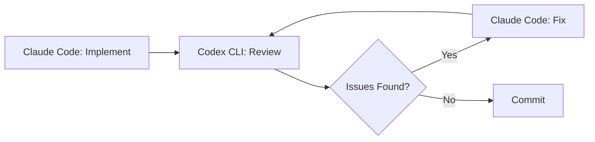
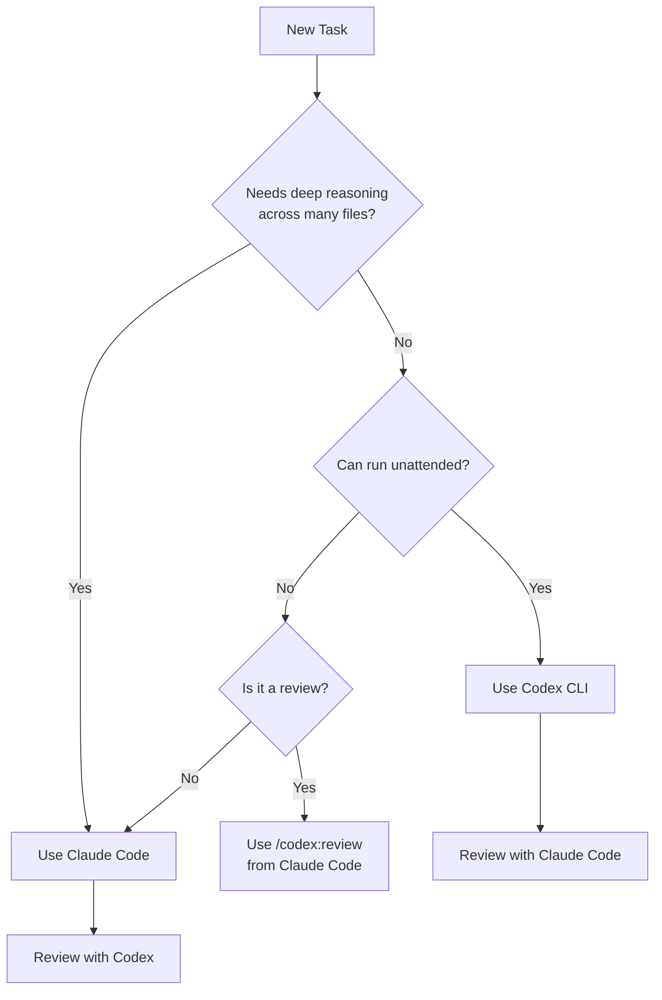

# How to Make Codex CLI and Claude Code Work Together


---

The most productive AI-assisted developers in 2026 are not picking sides between Codex CLI and Claude Code — they are running both. Claude Code excels at deep reasoning across large codebases and architecture decisions; Codex CLI dominates autonomous execution, background tasks, and code review[^1]. The question is not *which* tool to use, but *how* to make them collaborate effectively.

This article covers three practical integration approaches — from a zero-config official plugin to full MCP bridging — and the workflow patterns that emerge from each.

---

## Why Both Tools?

Each tool has a distinct personality shaped by its underlying model and execution model:

| Dimension | Claude Code | Codex CLI |
|-----------|------------|-----------|
| **Context window** | ~1M tokens[^2] | ~192K tokens[^3] |
| **Execution style** | Collaborative, step-by-step | Autonomous, fire-and-forget |
| **Sweet spot** | Architecture, debugging, frontend | Background tasks, reviews, CI/CD |
| **Token efficiency** | Higher consumption | ~4× fewer tokens per task[^1] |
| **SWE-bench** | 80.9% (Agent Teams)[^2] | 69.1% (standalone)[^4] |

Running both at a combined \$40/month entry tier gives you complementary coverage: Claude Code for tasks that need deep reasoning and high first-pass accuracy, Codex CLI for volume and autonomy[^1].

---

## Approach 1: The Official Plugin (codex-plugin-cc)

OpenAI released `codex-plugin-cc` — an official Claude Code plugin that wraps the Codex CLI app server and exposes it as a set of slash commands inside Claude Code sessions[^5].

### Installation

```bash
# Prerequisites: Node.js 18.18+, Codex CLI installed globally
npm install -g @openai/codex

# Install the plugin into Claude Code
claude plugin add openai/codex-plugin-cc
```

Run `/codex:setup` inside a Claude Code session to verify that Codex is reachable. If Codex is not installed, the setup command can install it for you automatically[^5].

### Authentication

You need either a ChatGPT subscription (Free tier or above) or an OpenAI API key. If you have not authenticated Codex before:

```bash
codex login
```

This stores credentials in `~/.codex/config.toml`[^6].

### Available Commands

The plugin exposes four primary commands[^5]:

**`/codex:review`** — Standard code review. Runs Codex against your current working tree and returns findings.

```
/codex:review --base main
```

Supports `--background` to run asynchronously and `--wait` to block until complete.

**`/codex:adversarial-review`** — Pressure-tests implementation decisions around authentication, data loss, and race conditions. Read-only — it flags issues but does not modify code[^5].

```
/codex:adversarial-review
```

**`/codex:rescue`** — Hands a task to Codex entirely, spawning it as a subagent. Useful when Claude Code is stuck or you want a second opinion from a different model[^5].

```
/codex:rescue "investigate why the auth middleware is rejecting valid JWTs"
```

Supports `--resume` to continue the latest rescue thread and `--fresh` to start a new one.

**`/codex:status`** and **`/codex:result`** — Check on background jobs and retrieve their output.

### Configuration

To override the default model or reasoning effort, add settings to your Codex `config.toml`[^6]:

```toml
# ~/.codex/config.toml
model = "o3"
model_reasoning_effort = "high"
```

Project-level overrides go in `.codex/config.toml` within the repository root[^7].

---

## Approach 2: MCP Server Bridge

For deeper integration — where Claude Code can invoke Codex programmatically as a tool rather than via slash commands — you can run Codex as an MCP server. Several implementations exist; the two most mature are `codex-as-mcp` and `tuannvm/codex-mcp-server`[^8][^9].

### codex-as-mcp (Lightweight)

This exposes Codex as a pair of MCP tools that Claude Code can call autonomously during its reasoning loop[^8].

```json
{
  "mcpServers": {
    "codex-subagent": {
      "type": "stdio",
      "command": "uvx",
      "args": ["codex-as-mcp@latest"],
      "env": {
        "OPENAI_API_KEY": "sk-..."
      }
    }
  }
}
```

Add this to your Claude Code MCP configuration (typically `~/.claude/mcp.json` or project-level `.mcp.json`).

⚠️ **Security note:** `codex-as-mcp` runs with `--dangerously-bypass-approvals-and-sandbox` by default. Only use this in repositories you trust[^8].

### codex-mcp-server (Session-Aware)

The `tuannvm/codex-mcp-server` adds session management with 24-hour TTL and up to 100 concurrent sessions, making it suitable for multi-turn workflows[^9]:

```json
{
  "mcpServers": {
    "codex": {
      "type": "stdio",
      "command": "npx",
      "args": ["-y", "codex-mcp-server@latest"],
      "env": {
        "OPENAI_API_KEY": "sk-..."
      }
    }
  }
}
```

If you encounter timeouts on longer tasks, increase the tool timeout in your Codex config[^8]:

```toml
# ~/.codex/config.toml
tool_timeout_sec = 300
```

### The conversationId Gotcha

When Codex runs as an MCP server, it exposes `codex()` to start a conversation and `codex-reply()` to continue one. Historically, `codex()` did not return the `conversationId` needed by `codex-reply()`, breaking multi-turn flows[^10]. The `codex-mcp-server` works around this with its own session management layer. If you use the raw `codex mcp-server` command, check the latest release notes — this bug has been partially addressed but may still surface in edge cases.

---

## Approach 3: Manual Orchestration Patterns

Even without plugins or MCP bridges, you can orchestrate both tools effectively using terminal multiplexing and shared file conventions.

### Side-by-Side with tmux

```bash
# Left pane: Claude Code for architecture and implementation
claude

# Right pane: Codex CLI for review and background tasks
codex
```

The key workflow: implement in Claude Code, then switch to the Codex pane for review:

```bash
# In Codex pane — review what Claude Code just wrote
codex "review the changes in the last commit for security issues, \
focusing on auth and data validation"
```

### Shared AGENTS.md

Both tools read `AGENTS.md` files for project conventions[^11]. A single `AGENTS.md` ensures consistent behaviour regardless of which tool you are using:

```markdown
# AGENTS.md

## Code Style
- Use TypeScript strict mode
- All public functions require JSDoc comments
- Error handling: use Result types, never throw

## Testing
- Unit tests alongside source files (*.test.ts)
- Integration tests in __tests__/integration/
- Minimum 80% coverage for new code

## Review Checklist
- No secrets in code
- SQL queries use parameterised statements
- All user input validated at API boundary
```

### The Implement-Review-Fix Loop

The most effective cross-tool pattern follows a simple cycle:



1. **Implement** in Claude Code — leverage its large context window for multi-file changes
2. **Review** with Codex CLI — either via the plugin (`/codex:review`) or in a separate terminal
3. **Fix** flagged issues back in Claude Code
4. **Commit** when the review passes

This cross-provider review catches errors that a single model would miss, because Claude and GPT-series models have different blind spots[^5].

---

## Decision Framework: Which Tool for Which Task?



**Claude Code first** for: architecture decisions, complex debugging, large refactors, frontend components, anything requiring >192K tokens of context[^1].

**Codex CLI first** for: test generation, documentation, dependency updates, CI pipeline tasks, infrastructure scripts, background batch processing[^1].

**Cross-review always** for: security-sensitive code, production deployments, any change touching authentication or payment flows.

---

## Cost Management

Running both tools requires some cost awareness:

| Scenario | Estimated Monthly Cost |
|----------|----------------------|
| Light use (either tool) | \$20 (single subscription)[^1] |
| Combined daily use | \$40 (both subscriptions)[^1] |
| Heavy API use (MCP bridge) | Variable — monitor via `codex usage` |

To keep MCP bridge costs down, set a lower default reasoning effort for routine tasks and reserve `high` or `xhigh` for complex reviews[^7]:

```toml
# ~/.codex/config.toml — project-level override for routine work
model_reasoning_effort = "low"

# Override per-task when needed
# codex -c model_reasoning_effort="high" "review auth module"
```

---

## Practical Tips

1. **Start with the plugin.** If you already use Claude Code, `codex-plugin-cc` is the lowest-friction path. Install it, run `/codex:setup`, and start with `/codex:review` on your next PR.

2. **Graduate to MCP when you need autonomy.** The plugin requires you to invoke commands manually. MCP bridges let Claude Code decide *when* to call Codex based on the task — useful for automated pipelines.

3. **Keep `AGENTS.md` as the single source of truth.** Both tools respect it, so your conventions stay consistent regardless of which agent is executing.

4. **Use adversarial review for security-critical code.** The `/codex:adversarial-review` command specifically targets auth, data loss, and race conditions — run it before any security-sensitive merge[^5].

5. **Watch for context window limits.** If Claude Code is working with a large codebase (>192K tokens), do not delegate the same task to Codex via MCP — it will not have the same context and may produce incomplete results[^3].

6. **Check the `conversationId` fix status.** If you rely on multi-turn MCP sessions, verify that your Codex version has the conversation tracking fix before depending on `codex-reply()`[^10].

---

## Citations

[^1]: [Claude Code vs Codex CLI: Which AI Coding Agent Should You Use in 2026?](https://supalaunch.com/blog/claude-code-vs-codex-cli-comparison-best-ai-coding-agent-2026) — SupaLaunch, 2026.
[^2]: [Claude Code vs Codex CLI vs Gemini CLI (2026 Comparison)](https://www.deployhq.com/blog/comparing-claude-code-openai-codex-and-google-gemini-cli-which-ai-coding-assistant-is-right-for-your-deployment-workflow) — DeployHQ, 2026.
[^3]: [Codex CLI vs Claude Code in 2026: Architecture Deep Dive](https://blakecrosley.com/blog/codex-vs-claude-code-2026) — Blake Crosley, 2026.
[^4]: [Codex CLI SWE-Bench Scores Explained](https://github.com/openai/codex) — OpenAI GitHub, 2026.
[^5]: [Introducing Codex Plugin for Claude Code](https://community.openai.com/t/introducing-codex-plugin-for-claude-code/1378186) — OpenAI Developer Community, 2026.
[^6]: [Config basics – Codex](https://developers.openai.com/codex/config-basic) — OpenAI Developers, 2026.
[^7]: [Configuration Reference – Codex](https://developers.openai.com/codex/config-reference) — OpenAI Developers, 2026.
[^8]: [codex-as-mcp: Convert Codex CLI to an MCP server](https://github.com/kky42/codex-as-mcp) — GitHub, 2026.
[^9]: [codex-mcp-server: MCP server wrapper for OpenAI Codex CLI](https://github.com/tuannvm/codex-mcp-server) — GitHub, 2026.
[^10]: [Claude Code ↔ Codex CLI in Practice: Session Handoffs, Community Bridges and Known Gotchas](../articles/2026-03-27-claude-code-codex-mcp-in-practice.md) — Codex Resources, 2026.
[^11]: [Codex Plugin for Claude Code README](https://github.com/openai/codex-plugin-cc/blob/main/README.md) — OpenAI GitHub, 2026.
