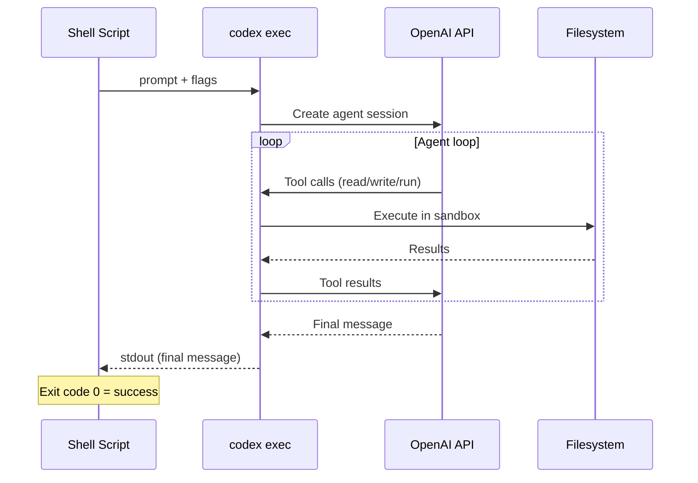
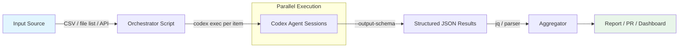

# Codex CLI Headless and Batch Mode: Non-Interactive Automation Guide


---

Codex CLI's `codex exec` subcommand strips away the interactive TUI and runs the agent as a headless process — prompt in, result out, exit[^1]. That makes it the foundation for every automation pattern: shell scripts, cron jobs, Git hooks, and batch pipelines that process dozens of files without human intervention.

This article goes beyond basic CI/CD integration (covered in the [CI/CD pipeline article](2026-03-26-codex-cli-cicd-non-interactive.md)) and focuses on **batch processing patterns, parallel orchestration, structured output, and performance tuning** for non-interactive workloads.

---

## How Headless Execution Works

When you invoke `codex exec`, Codex starts a single agent session, executes the task to completion, streams progress to `stderr`, writes the final agent message to `stdout`, and exits[^1]. There is no approval prompt — the agent runs autonomously under whatever sandbox policy you configure.



By default, the agent runs in a **read-only sandbox** — it can read files but cannot write or execute commands with network access[^2]. Escalate permissions only as far as the task demands:

```bash
# Read-only analysis (default)
codex exec "list all TODO comments in src/"

# Workspace writes (edits files, no network)
codex exec --full-auto "add type annotations to all Python files in src/"

# Full access (only in isolated runners)
codex exec --sandbox danger-full-access "run the test suite and fix failures"
```

---

## Essential Flags for Automation

The flags below form the automation toolkit. Combine them to build pipelines that are stateless, parseable, and safe[^2][^3].

| Flag | Effect | When to use |
|------|--------|-------------|
| `--full-auto` | Enables `workspace-write` sandbox + `on-request` approvals | File-editing batch tasks |
| `--ephemeral` | Skips persisting session rollout files | Stateless runners, parallel jobs |
| `--json` | Emits JSON Lines event stream to `stdout` | Machine-parseable pipelines |
| `-o <path>` | Writes final message to a file | Capturing results for downstream steps |
| `--output-schema <file>` | Validates final response against a JSON Schema | Structured data extraction |
| `--skip-git-repo-check` | Allows execution outside a Git repository | Ad-hoc scripting, temp directories |
| `-C <path>` | Sets the workspace root | Processing multiple repos |
| `-m <model>` | Overrides the configured model | Cost control per task tier |
| `--yolo` | Bypasses all approvals and sandboxing | Fully isolated containers only |

### Input Modes

Codex exec accepts prompts as positional arguments, from `stdin`, or as attached images[^1]:

```bash
# Inline prompt
codex exec "explain the authentication flow"

# Pipe context + prompt
git diff HEAD~1 | codex exec "review this diff for security issues"

# Stdin as prompt
cat prompt.txt | codex exec -

# Attach a screenshot
codex exec -i error-screenshot.png "diagnose this error"
```

---

## Batch Processing Patterns

The real power of headless mode emerges when you loop `codex exec` over multiple inputs. The key constraint: each `codex exec` invocation is a **separate agent session** with its own context window[^1].

### Pattern 1: Shell Loop Over Files

Process every file matching a pattern:

```bash
#!/usr/bin/env bash
set -euo pipefail

for file in src/**/*.py; do
  echo "Processing: $file" >&2
  codex exec --full-auto --ephemeral \
    "Add comprehensive docstrings to all public functions in $file. \
     Follow Google-style docstring conventions."
done
```

### Pattern 2: Parallel Batch with GNU Parallel

For CPU-bound or I/O-bound batches, run multiple `codex exec` instances concurrently. Use `--ephemeral` to avoid session file conflicts between parallel instances[^4]:

```bash
#!/usr/bin/env bash
find src/ -name "*.ts" -print0 | \
  parallel -0 -j4 --bar \
    codex exec --full-auto --ephemeral \
      "Add JSDoc comments to all exported functions in {}"
```

> **Caveat:** Parallel instances share the same API rate limits. With the default `gpt-5.4` model, four concurrent sessions is a reasonable starting point — monitor for 429 errors and adjust[^5].

### Pattern 3: CSV-Driven Batch

Codex CLI supports a built-in CSV batch capability that fans out work from a structured input with progress tracking[^6]:

```bash
# Process a CSV of issues
codex exec --full-auto \
  "Read issues.csv. For each row, create a fix branch, \
   apply the described change, and commit. \
   Report progress after each row."
```

For more control, drive the CSV from a shell script:

```bash
#!/usr/bin/env bash
tail -n +2 tasks.csv | while IFS=',' read -r file action description; do
  echo "Task: $action on $file" >&2
  codex exec --full-auto --ephemeral -C "$(pwd)" \
    "$description — apply to file $file"
done
```

---

## Structured Output with `--output-schema`

When downstream tools need predictable JSON, the `--output-schema` flag constrains the agent's final response to match a JSON Schema[^7]. This is essential for pipelines that parse Codex output programmatically.

Define a schema file:

```json
{
  "$schema": "https://json-schema.org/draft/2020-12/schema",
  "type": "object",
  "properties": {
    "summary": { "type": "string" },
    "risk_level": { "enum": ["low", "medium", "high", "critical"] },
    "issues": {
      "type": "array",
      "items": {
        "type": "object",
        "properties": {
          "file": { "type": "string" },
          "line": { "type": "integer" },
          "description": { "type": "string" }
        },
        "required": ["file", "description"]
      }
    }
  },
  "required": ["summary", "risk_level", "issues"]
}
```

Then use it in a pipeline:

```bash
codex exec --full-auto \
  --output-schema review-schema.json \
  -o review-result.json \
  "Review src/ for security vulnerabilities"

# Parse the structured output
jq '.issues[] | select(.risk_level == "critical")' review-result.json
```

> **Note:** `--output-schema` currently requires a model from the `gpt-5` family[^8]. It cannot be combined with `codex exec resume`[^9].

---

## JSON Lines Event Streaming

The `--json` flag transforms `stdout` into a JSON Lines stream of every event the agent emits — messages, tool calls, file changes, and reasoning traces[^2]:

```bash
codex exec --json "refactor the logging module" | \
  jq -c 'select(.type == "item.completed") | .item'
```

Event types include:

| Event type | Contains |
|-----------|----------|
| `thread.started` | Session ID, thread metadata |
| `item.completed` | Agent messages, tool call results |
| `turn.completed` | End-of-turn summaries |

This is invaluable for building dashboards, audit logs, or custom progress reporters around batch jobs.

---

## Session Resume for Long-Running Work

Batch jobs sometimes fail partway through. Rather than restarting from scratch, resume the session[^1]:

```bash
# Resume the most recent session in this directory
codex exec resume --last "continue from where you left off"

# Resume a specific session by ID
codex exec resume 7f9f9a2e-1b3c-4c7a-... "fix the remaining test failures"
```

Resume preserves the full conversation transcript, plan history, and prior approvals. Combine with `--all` to search sessions from any directory.

---

## Performance and Cost Tuning

### Model Selection Per Task Tier

Not every batch task needs the flagship model. Use `-m` to route tasks to the appropriate cost tier[^5]:

```bash
# Lightweight tasks: use gpt-5.4-mini (30% of gpt-5.4 quota)
codex exec -m gpt-5.4-mini --full-auto --ephemeral \
  "add missing __init__.py files to all packages"

# Complex refactoring: use gpt-5.4 (default)
codex exec --full-auto \
  "refactor the payment module to use the strategy pattern"

# Deep analysis: use gpt-5.3-codex for stronger coding focus
codex exec -m gpt-5.3-codex --full-auto \
  "identify and fix all race conditions in the async handlers"
```

### Tips for Batch Efficiency

1. **Use `--ephemeral`** for stateless batch jobs — avoids disk I/O for session persistence and prevents conflicts between parallel runs[^2].

2. **Scope prompts tightly.** A prompt targeting a single file completes faster and uses fewer tokens than one scanning an entire repository.

3. **Pipe context rather than letting the agent discover it.** Feeding `git diff` or file contents via `stdin` reduces tool-call round trips:

    ```bash
    cat src/auth.py | codex exec "review this code for OWASP top 10 issues"
    ```

4. **Set concurrency limits.** When running parallel instances, cap concurrency to avoid API rate limiting. Four to six parallel sessions is a reasonable default for most API tiers[^4].

5. **Use profiles** for repeatable configurations. Define automation profiles in `~/.config/codex/config.toml`[^3]:

    ```toml
    [profile.batch]
    model = "gpt-5.4-mini"
    approval_mode = "full-auto"

    [profile.batch-heavy]
    model = "gpt-5.4"
    approval_mode = "full-auto"
    ```

    Then invoke with: `codex exec -p batch --ephemeral "your task"`

---

## Architecture: Putting It Together

A typical batch automation pipeline combines these patterns into a multi-stage workflow:



### Example: Batch Security Audit

```bash
#!/usr/bin/env bash
set -euo pipefail

SCHEMA="audit-schema.json"
RESULTS_DIR="audit-results"
mkdir -p "$RESULTS_DIR"

# Find all service directories
services=$(find services/ -maxdepth 1 -mindepth 1 -type d)

# Audit each service in parallel (max 4 concurrent)
echo "$services" | \
  parallel -j4 --bar \
    codex exec --full-auto --ephemeral \
      --output-schema "$SCHEMA" \
      -o "$RESULTS_DIR/{/}.json" \
      "Audit {/} for security vulnerabilities, dependency issues, \
       and configuration problems. Focus on OWASP top 10."

# Aggregate results
echo "=== Audit Summary ==="
for result in "$RESULTS_DIR"/*.json; do
  service=$(basename "$result" .json)
  risk=$(jq -r '.risk_level' "$result")
  count=$(jq '.issues | length' "$result")
  echo "$service: $risk ($count issues)"
done
```

---

## Limitations and Gotchas

- **Git requirement:** `codex exec` expects to run inside a Git repository by default. Use `--skip-git-repo-check` to override, but the agent loses Git-aware context[^2].
- **No interactive approval:** There is no way to approve individual actions mid-session. Choose your sandbox policy upfront[^1].
- **MCP server failures:** If a required MCP server fails to initialise, `codex exec` exits immediately rather than continuing without it[^2].
- **Session conflicts:** Parallel instances without `--ephemeral` can interfere via shared session restore files[^4]. Always use `--ephemeral` for parallel batch work.
- **`--output-schema` model restriction:** Structured output validation requires a `gpt-5` family model — it will not work with local models via `--oss`[^8].

---

## Citations

[^1]: [Non-interactive mode — Codex CLI | OpenAI Developers](https://developers.openai.com/codex/noninteractive)
[^2]: [Command line options — Codex CLI | OpenAI Developers](https://developers.openai.com/codex/cli/reference)
[^3]: [Features — Codex CLI | OpenAI Developers](https://developers.openai.com/codex/cli/features)
[^4]: [Multiple parallel codex exec instances interfere via shared session restore — Issue #11435 — openai/codex](https://github.com/openai/codex/issues/11435)
[^5]: [Models — Codex | OpenAI Developers](https://developers.openai.com/codex/models)
[^6]: [Codex CLI Multi-Agent: Agent Roles, CSV Batch & Config Guide | Morph](https://www.morphllm.com/codex-multi-agent)
[^7]: [Build Code Review with the Codex SDK | OpenAI Cookbook](https://cookbook.openai.com/examples/codex/build_code_review_with_codex_sdk)
[^8]: [BUG: --output-schema limited to "gpt-5" as guard is too narrow on model_family — Issue #4181 — openai/codex](https://github.com/openai/codex/issues/4181)
[^9]: [Add --output-schema support to codex exec resume — Issue #14343 — openai/codex](https://github.com/openai/codex/issues/14343)
