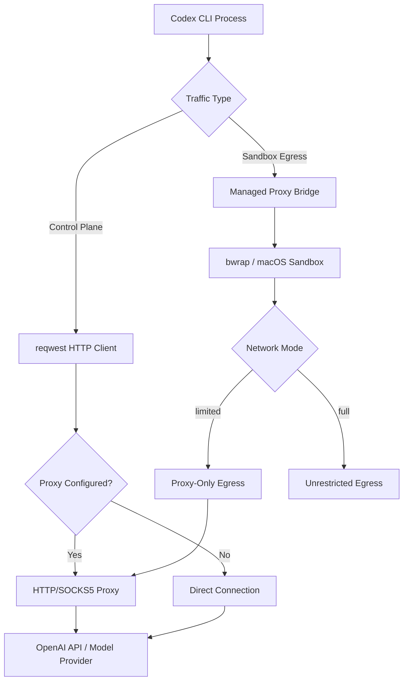
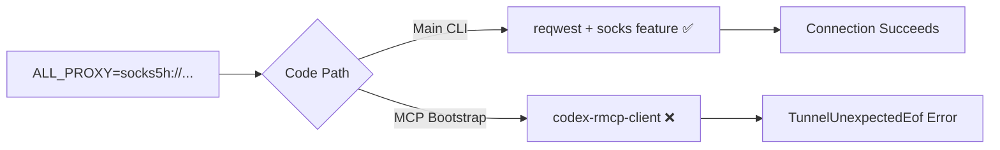

# Codex CLI Proxy Configuration: SOCKS, HTTP, and Corporate Networks


---

Running Codex CLI behind a corporate proxy is one of the most common friction points in enterprise adoption. Between TLS-intercepting proxies, SOCKS tunnels, firewall allow-lists, and the CLI's own managed network proxy, there are several layers to configure correctly. This guide covers every proxy scenario you are likely to encounter, from straightforward HTTP proxies to complex SOCKS-only corporate networks with custom certificate authorities.

## How Codex CLI Handles Network Traffic

Codex CLI has two distinct networking paths that both need proxy configuration:

1. **Control-plane traffic** — API calls to OpenAI (or your custom model provider), OAuth login flows, and telemetry. These use `reqwest` HTTP clients internally[^1].
2. **Sandbox egress traffic** — commands executed inside the sandboxed agent environment. On Linux, this uses `bwrap` (bubblewrap) with a managed proxy bridge; on macOS, the sandbox enforces network policy at the OS level[^2].



Understanding this split is critical: configuring environment variables alone handles control-plane traffic, but sandbox egress requires `config.toml` settings as well.

## Environment Variables: The Quick Path

Codex CLI honours the standard proxy environment variables for its `reqwest`-based HTTP clients[^3]. Set these before launching the CLI:

```bash
export HTTPS_PROXY="http://proxy.corp.example.com:8080"
export HTTP_PROXY="http://proxy.corp.example.com:8080"
export ALL_PROXY="http://proxy.corp.example.com:8080"
export NO_PROXY="localhost,127.0.0.1,.corp.example.com"
```

For WebSocket connections (used by `codex --remote`), set the corresponding variables:

```bash
export WS_PROXY="http://proxy.corp.example.com:8080"
export WSS_PROXY="http://proxy.corp.example.com:8080"
```

⚠️ As of v0.121.0, not all internal HTTP clients consistently read these variables. Some code paths — notably the OAuth login flow and Ollama integration — have historically required individual patches[^4]. If you hit connectivity issues on a specific flow, check the open issues on GitHub.

### Priority Order

When multiple variables are set, Codex follows the standard `reqwest` resolution order:

1. `HTTPS_PROXY` / `HTTP_PROXY` (protocol-specific)
2. `ALL_PROXY` (catch-all fallback)
3. `NO_PROXY` exclusions applied last

Lowercase variants (`https_proxy`, `http_proxy`) are also respected, with uppercase taking precedence[^3].

## config.toml: The Managed Network Proxy

For sandbox egress and fine-grained control, configure the managed network proxy in `~/.codex/config.toml` (user-level) or `.codex/config.toml` (project-level)[^5].

### HTTP Proxy Configuration

```toml
[permissions.default.network]
mode = "limited"                # "limited" routes through proxy; "full" is unrestricted
proxy_url = "http://proxy.corp.example.com:8080"
allow_upstream_proxy = true     # chain to corporate proxy from managed proxy
```

The `allow_upstream_proxy` setting is essential in corporate environments. When `true`, the managed proxy respects `HTTP_PROXY` / `HTTPS_PROXY` / `ALL_PROXY` for upstream requests, including CONNECT tunnels[^5]. Without it, the managed proxy attempts direct connections that your firewall will block.

### SOCKS5 Proxy Configuration

```toml
[permissions.default.network]
mode = "limited"
enable_socks5 = true
socks_url = "socks5h://proxy.corp.example.com:1080"
enable_socks5_udp = false       # enable only if your proxy supports UDP relay
```

The `socks5h` scheme delegates DNS resolution to the proxy server — use this in corporate networks where internal DNS is not available on the developer's machine. Use `socks5` if you want local DNS resolution[^6].

### Full Network Configuration Reference

```toml
[permissions.default.network]
mode = "limited"                              # "limited" | "full"
proxy_url = "http://proxy.corp.example.com:8080"
socks_url = "socks5h://proxy.corp.example.com:1080"
enable_socks5 = true
enable_socks5_udp = false
allow_upstream_proxy = true
allow_local_binding = false                   # permit local bind/listen ops
dangerously_allow_non_loopback_proxy = false  # bind on non-loopback addresses
```

## Corporate TLS Proxies and Custom Certificates

Most corporate networks run TLS-intercepting proxies (Zscaler, Bluecoat, Forcepoint) that re-sign HTTPS traffic with an internal root CA. Codex CLI will reject these connections unless you provide the CA bundle[^7].

### Setting the CA Bundle

```bash
export CODEX_CA_CERTIFICATE="/etc/pki/tls/certs/corporate-ca-bundle.pem"
```

The fallback chain is[^7]:

1. `CODEX_CA_CERTIFICATE` — Codex-specific, takes highest precedence
2. `SSL_CERT_FILE` — standard OpenSSL variable
3. System root certificate store

The PEM file can contain multiple certificates, and Codex tolerates OpenSSL `TRUSTED CERTIFICATE` labels and ignores well-formed X509 CRL sections in the same bundle[^7].

### Verifying Your CA Setup

```bash
# Test that Codex can reach the API through your proxy
CODEX_CA_CERTIFICATE=/path/to/bundle.pem codex e ping

# If login fails separately, the OAuth flow may need the same CA
CODEX_CA_CERTIFICATE=/path/to/bundle.pem codex auth login
```

⚠️ OAuth login behind corporate TLS proxies has been a known pain point. If `codex auth login` fails with certificate errors even after setting `CODEX_CA_CERTIFICATE`, check GitHub issue #6849 for the latest workarounds[^8].

## Routing Through an API Gateway

For organisations that mandate all LLM traffic flows through a central gateway (for logging, rate-limiting, or cost allocation), configure a custom model provider rather than a network proxy:

```toml
model_provider = "gateway"

[model_providers.gateway]
name = "OpenAI via corporate gateway"
base_url = "https://llm-gateway.corp.example.com/openai"
env_key = "OPENAI_API_KEY"
wire_api = "responses"
```

This approach is cleaner than proxy chaining when your gateway speaks the OpenAI API protocol. Kong AI Gateway[^9], LiteLLM, and custom reverse proxies all work with this pattern. You can also inject custom headers for internal authentication:

```toml
[model_providers.gateway]
name = "OpenAI via gateway with auth"
base_url = "https://llm-gateway.corp.example.com/openai"
env_key = "OPENAI_API_KEY"
wire_api = "responses"

[model_providers.gateway.http_headers]
X-Team-Id = "platform-engineering"

[model_providers.gateway.env_http_headers]
X-Gateway-Token = "GATEWAY_AUTH_TOKEN"
```

## The SOCKS-Only Pitfall

A significant limitation exists when running Codex CLI with SOCKS proxy only (no HTTP proxy available). The main Codex execution flow works — `codex e ping` succeeds — but the MCP bootstrap for `codex_apps` fails because the `codex-rmcp-client` dependency does not enable the `socks` feature flag in its `reqwest` build[^10].



### Workaround

Run a local HTTP-to-SOCKS proxy bridge and set both variable families:

```bash
# Start a local HTTP proxy that forwards to your SOCKS proxy
# (using gost, privoxy, or similar)
gost -L http://:8118 -F socks5://proxy.corp.example.com:1080

# Set both HTTP and SOCKS proxy variables
export HTTPS_PROXY="http://127.0.0.1:8118"
export HTTP_PROXY="http://127.0.0.1:8118"
export ALL_PROXY="socks5h://proxy.corp.example.com:1080"
```

This issue is tracked in GitHub issue #16360 and has cross-references to related fixes in #16550 and #17529[^10].

## Data Residency Configuration

For organisations subject to data residency requirements (EU, UK, or other regional mandates), redirect API traffic to the appropriate regional endpoint:

```toml
[model_providers.openaidr]
name = "OpenAI (US data residency)"
base_url = "https://us.api.openai.com/v1"
env_key = "OPENAI_API_KEY"
wire_api = "responses"
```

This can be combined with proxy configuration — set the model provider for data residency and environment variables for network routing[^11].

## Firewall Allow-List

If your network security team requires explicit allow-listing, Codex CLI needs outbound access to these endpoints:

| Endpoint | Port | Purpose |
|----------|------|---------|
| `api.openai.com` | 443 | API requests |
| `auth.openai.com` | 443 | OAuth login |
| `chatgpt.com` | 443 | MCP apps bootstrap |
| `cdn.openai.com` | 443 | Model/config downloads |
| Your model provider URL | 443 | Custom provider traffic |

⚠️ The `chatgpt.com` endpoint is easy to miss — it is used by the optional `codex_apps` MCP integration and will cause bootstrap failures if blocked[^10].

## Debugging Proxy Issues

When proxy configuration is not working, use these diagnostic steps:

```bash
# 1. Verify environment variables are set
env | grep -i proxy

# 2. Test basic connectivity
CODEX_LOG=debug codex e ping 2>&1 | grep -i proxy

# 3. Test with curl through the same proxy (baseline)
curl -x "$HTTPS_PROXY" https://api.openai.com/v1/models \
  -H "Authorization: Bearer $OPENAI_API_KEY"

# 4. Check if the managed proxy is starting
CODEX_LOG=trace codex e ping 2>&1 | grep -i "proxy\|socks\|bwrap"
```

Set `CODEX_LOG=debug` or `CODEX_LOG=trace` to see detailed proxy negotiation output. On Linux, check that `bwrap` is available and that your user has the necessary namespace permissions for the managed proxy bridge[^2].

## Putting It All Together: Corporate Network Recipe

Here is a complete configuration for a typical corporate environment with a TLS-intercepting HTTP proxy, internal DNS, and data residency requirements:

```bash
# Shell profile (~/.bashrc or ~/.zshrc)
export HTTPS_PROXY="http://proxy.corp.example.com:8080"
export HTTP_PROXY="http://proxy.corp.example.com:8080"
export NO_PROXY="localhost,127.0.0.1,.corp.example.com"
export CODEX_CA_CERTIFICATE="/etc/pki/tls/certs/corp-ca-bundle.pem"
```

```toml
# ~/.codex/config.toml

[permissions.default.network]
mode = "limited"
proxy_url = "http://proxy.corp.example.com:8080"
allow_upstream_proxy = true

[sandbox_workspace_write]
network_access = true
```

This configuration ensures both control-plane and sandbox traffic route through the corporate proxy, with the custom CA bundle handling TLS interception transparently.

## Citations

[^1]: [Use proxy environment variables across Codex HTTP clients · Issue #4242](https://github.com/openai/codex/issues/4242) — Documents that Codex uses `reqwest` for HTTP clients and the current state of proxy variable support.

[^2]: [Agent approvals & security – Codex | OpenAI Developers](https://developers.openai.com/codex/agent-approvals-security) — Describes the bwrap-based managed proxy and sandbox networking architecture.

[^3]: [Support configuring outbound HTTP proxy via http_proxy in config.toml · Issue #6060](https://github.com/openai/codex/issues/6060) — Community discussion on proxy environment variable support and workarounds.

[^4]: [Use proxy environment variables across Codex HTTP clients · Issue #4242](https://github.com/openai/codex/issues/4242) — Details inconsistent proxy handling across individual call sites.

[^5]: [Configuration Reference – Codex | OpenAI Developers](https://developers.openai.com/codex/config-reference) — Official reference for all `config.toml` network and proxy settings.

[^6]: [Advanced Configuration – Codex | OpenAI Developers](https://developers.openai.com/codex/config-advanced) — Advanced proxy, model provider, and authentication configuration.

[^7]: [Configuration – codex/docs/config.md](https://github.com/openai/codex/blob/main/docs/config.md) — Documents CODEX_CA_CERTIFICATE, SSL_CERT_FILE fallback chain, and PEM format requirements.

[^8]: [OAuth Login Fails Behind Corporate Proxy with Custom CA Certificates · Issue #6849](https://github.com/openai/codex/issues/6849) — Tracks OAuth login failures behind TLS-intercepting proxies.

[^9]: [How to: Route OpenAI Codex CLI traffic through AI Gateway | Kong Docs](https://developer.konghq.com/how-to/use-codex-with-ai-gateway/) — Step-by-step guide for routing Codex traffic through Kong AI Gateway.

[^10]: [codex_apps MCP bootstrap fails on SOCKS-only ALL_PROXY · Issue #16360](https://github.com/openai/codex/issues/16360) — Documents the SOCKS-only limitation in codex-rmcp-client and workarounds.

[^11]: [Advanced Configuration – Codex | OpenAI Developers](https://developers.openai.com/codex/config-advanced) — Data residency endpoint configuration for regional compliance.
