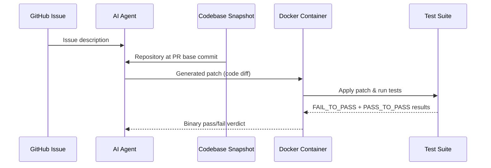
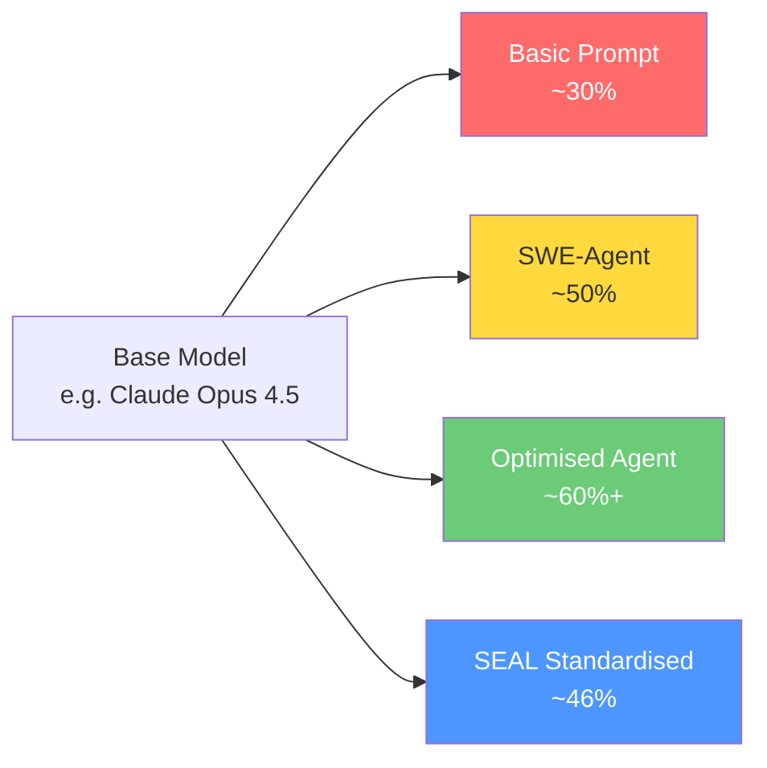

# Codex CLI SWE-Bench Scores and Benchmark Results Explained


---

OpenAI's Codex models consistently top the SWE-Bench leaderboards, but what do those numbers actually mean? This article breaks down the benchmark variants, explains how Codex CLI scores are produced, contextualises the results against competing agents, and examines the limitations you should consider before treating any single number as ground truth.

## What Is SWE-Bench?

SWE-Bench is a benchmark created by Princeton researchers in October 2023 that tests whether language models can resolve real-world GitHub issues[^1]. The original dataset contains 2,294 task instances drawn from 12 popular open-source Python repositories — Django, Flask, scikit-learn, matplotlib, sympy, and others[^2]. Each task pairs an issue description with a codebase snapshot, and the model must produce a patch that makes failing tests pass without breaking existing ones.

The evaluation runs inside isolated Docker containers with no network access and no visibility into future git history[^3]. Success is binary: either all fail-to-pass and pass-to-pass tests succeed, or the attempt is scored as a failure.



## The Four SWE-Bench Variants

Not all SWE-Bench scores are comparable. The benchmark now exists in four distinct variants, each with different scope and reliability characteristics.

### SWE-Bench Full (Original)

The original 2,294-task Python-only dataset[^1]. Useful for historical comparison but increasingly considered unreliable as a standalone metric due to data contamination concerns.

### SWE-Bench Lite

A 300-task subset designed for faster iteration during agent development[^4]. Python-only and subject to the same contamination issues as the full dataset. Primarily used by researchers iterating on agent scaffolding rather than for headline comparisons.

### SWE-Bench Verified

A curated 500-task subset created in collaboration with OpenAI, where human software engineers validated that each issue has unambiguous descriptions and reliable tests[^5]. This became the de facto standard for model announcements through 2025. However, OpenAI themselves confirmed data contamination across all frontier models — models can reproduce verbatim patches from training data rather than genuinely solving problems[^6].

**Current top scores (April 2026):**

| Model | Score |
|-------|-------|
| Claude Mythos Preview | 93.9% |
| GPT-5.3 Codex | 85.0% |
| Claude Opus 4.5 | 80.9% |
| Claude Opus 4.6 | 80.8% |
| Gemini 3.1 Pro | 80.6% |
| GPT-5.2 | 80.0% |

### SWE-Bench Pro

The most rigorous variant, launched to address contamination concerns[^7]. SWE-Bench Pro contains 1,865 tasks across five languages — Python, JavaScript, TypeScript, Java, and Go — drawn from 41 repositories[^4]. Each task averages 107 lines changed across 4.1 files, making it substantially harder than Verified[^4].

The dataset is split into three partitions: public (731 tasks), commercial (276 tasks), and held-out (858 tasks)[^4]. The held-out partition is never published, making memorisation far less viable as a strategy.

**Current top scores on SWE-Bench Pro (April 2026):**

| System | Score | Notes |
|--------|-------|-------|
| GPT-5.3-Codex | 56.8% | Custom agent scaffolding |
| GPT-5.2-Codex | 56.4% | Custom agent scaffolding |
| Claude Code | 55.4% | Custom agent scaffolding |
| GPT-5.2 | 55.6% | Custom agent scaffolding |
| Claude Opus 4.5 (SEAL) | 45.9% | Standardised scaffolding |
| Claude Sonnet 4.5 (SEAL) | 43.6% | Standardised scaffolding |

Note the gap between custom and standardised scaffolding results — the same Claude Opus 4.5 scores 45.9% with SEAL's standardised harness but substantially higher with optimised agent frameworks[^4]. This is the single most important insight for interpreting benchmark tables.

## Terminal-Bench 2.0: The CLI-Specific Benchmark

SWE-Bench focuses on repository bug-fixing, but Codex CLI operates across a broader range of terminal workflows. Terminal-Bench 2.0, developed by the Laude Institute, fills this gap with 89 tasks that require models to inspect environments, read and edit files, run commands, and recover from errors across multi-step terminal sessions[^8][^9].

Where SWE-Bench tests "can you fix this bug?", Terminal-Bench tests "can you actually operate as a competent developer in a terminal?" — including state management, error recovery, and tool-use discipline[^9].

**Terminal-Bench 2.0 top scores (April 2026):**

| Model | Score |
|-------|-------|
| Claude Mythos Preview | 82.0% |
| GPT-5.3 Codex | 77.3% |
| GPT-5.4 | 75.1% |

GPT-5.3-Codex's 77.3% Terminal-Bench score is arguably more representative of what Codex CLI actually does in daily use than its SWE-Bench numbers[^10].

## Why Scaffolding Matters More Than Model Choice

The same underlying model can produce wildly different benchmark scores depending on the agent framework wrapping it. Research consistently shows scaffolding accounts for a 10–20 percentage point swing[^4][^6]:



Codex CLI's benchmark submissions use OpenAI's custom agent scaffolding — not the standardised SEAL harness used for apples-to-apples model comparisons[^4]. This is not unusual (Claude Code and other agent systems do the same), but it means you cannot directly compare Codex CLI's 56.8% SWE-Bench Pro score against a raw model score on the same benchmark.

When evaluating benchmark results, always check:

1. **Which variant?** — Verified, Pro, Full, or Lite scores are not interchangeable
2. **Which scaffolding?** — Custom agent vs standardised harness
3. **Provider-reported or independent?** — Self-reported scores lack third-party verification
4. **Date of evaluation** — Models and benchmarks both evolve rapidly

## How Codex CLI Uses These Models

Understanding that GPT-5.3-Codex leads SWE-Bench Pro is useful, but how does this translate to your daily Codex CLI usage?

Codex CLI's architecture pairs the underlying model with several layers that directly impact real-world performance:

- **Kernel-level sandboxing** — every command runs in an isolated environment, similar to the Docker containers used in SWE-Bench evaluation[^10]
- **Subagent orchestration** — complex tasks are decomposed across multiple specialised agents[^11]
- **MCP tool integration** — external tools extend the agent's capabilities beyond raw code generation[^10]
- **Rust-based runtime** — the rewrite from TypeScript to Rust prioritises startup speed and token processing throughput[^10]

The benchmark scores reflect the model's ceiling capability. Your actual results depend on prompt quality, `AGENTS.md` configuration, repository complexity, and the specific task type.

## Running Your Own Evaluations

If headline benchmarks are insufficient for your use case, you can evaluate Codex CLI against SWE-Bench tasks directly.

### Using sb-cli

```bash
pip install sb-cli
sb login
```

Submit predictions for evaluation:

```bash
sb submit --predictions path/to/predictions.jsonl
```

### Using SWE-agent with Codex models

```bash
sweagent run-batch \
  --config config/default.yaml \
  --agent.model.name gpt-5.3-codex \
  --agent.model.per_instance_cost_limit 2.00 \
  --instances.type swe_bench \
  --instances.subset verified \
  --instances.split dev \
  --instances.slice :10
```

This runs the first 10 instances from the dev split with a \$2.00 per-instance cost cap[^3]. Scale up the slice as needed, but expect meaningful costs — a full Verified run with a frontier model can exceed \$500.

### Using kbench for agent harness comparison

The open-source kbench tool provides standardised benchmarking specifically for agent harnesses[^12]:

```bash
git clone https://github.com/shareAI-lab/kbench.git
cd kbench
# Follow setup instructions for your agent
```

## Limitations Worth Remembering

Before optimising your workflow around benchmark scores, consider these structural limitations:

- **Data contamination** — all frontier models show evidence of memorisation on SWE-Bench Verified[^6]. SWE-Bench Pro mitigates this but cannot fully eliminate it.
- **Binary evaluation** — benchmarks test whether tests pass, not whether the code is readable, maintainable, or well-architected[^4].
- **Isolated tasks** — SWE-Bench tests single-issue bug fixes. It does not evaluate multi-file refactoring, architectural decisions, or cross-repository changes[^4].
- **Benchmark saturation** — HumanEval went from 13% to 99% in five years[^4]. SWE-Bench Verified may already be approaching saturation at 93.9%.
- **⚠️ Real-world gap** — no peer-reviewed study has established a reliable correlation between SWE-Bench scores and developer productivity gains in production environments.

## Practical Takeaways

1. **Use SWE-Bench Pro scores for model comparisons** — Verified is compromised by contamination
2. **Compare like with like** — custom scaffolding scores vs custom scaffolding, standardised vs standardised
3. **Terminal-Bench 2.0 is more relevant for CLI workflows** than SWE-Bench
4. **Scaffolding accounts for 10–20 points** — your `AGENTS.md`, prompt engineering, and MCP configuration matter as much as model choice
5. **GPT-5.3-Codex currently leads on Pro** at 56.8%, with Claude Code close behind at 55.4%[^4]

---

## Citations

[^1]: C. Jimenez et al., "SWE-bench: Can Language Models Resolve Real-World GitHub Issues?", arXiv:2310.06770, October 2023. [https://arxiv.org/abs/2310.06770](https://arxiv.org/abs/2310.06770)

[^2]: SWE-bench Official Website — Overview. [https://www.swebench.com/SWE-bench/](https://www.swebench.com/SWE-bench/)

[^3]: SWE-bench Evaluation Guide. [https://www.swebench.com/SWE-bench/guides/evaluation/](https://www.swebench.com/SWE-bench/guides/evaluation/)

[^4]: "SWE-Bench Explained: Benchmarks, Verified, Pro, and the 2026 Leaderboard", MorphLLM, 2026. [https://www.morphllm.com/swe-benchmark](https://www.morphllm.com/swe-benchmark)

[^5]: "Introducing SWE-bench Verified", OpenAI, 2024. [https://openai.com/index/introducing-swe-bench-verified/](https://openai.com/index/introducing-swe-bench-verified/)

[^6]: "SWE-bench Scores and Leaderboard Explained (2026)", DEV Community. [https://dev.to/rahulxsingh/swe-bench-scores-and-leaderboard-explained-2026-54of](https://dev.to/rahulxsingh/swe-bench-scores-and-leaderboard-explained-2026-54of)

[^7]: "SWE-Bench Pro Leaderboard", Scale AI. [https://labs.scale.com/leaderboard/swe_bench_pro_public](https://labs.scale.com/leaderboard/swe_bench_pro_public)

[^8]: "Terminal-Bench: Benchmarking Agents on Hard, Realistic Tasks in Command Line Interfaces", arXiv:2601.11868, January 2026. [https://arxiv.org/abs/2601.11868](https://arxiv.org/abs/2601.11868)

[^9]: "Terminal-Bench 2.0 Explained: How We Measure Agentic Coding", BenchLM.ai. [https://benchlm.ai/blog/posts/terminal-bench-2-agentic-benchmark](https://benchlm.ai/blog/posts/terminal-bench-2-agentic-benchmark)

[^10]: "Introducing GPT-5.3-Codex", OpenAI. [https://openai.com/index/introducing-gpt-5-3-codex/](https://openai.com/index/introducing-gpt-5-3-codex/)

[^11]: Codex CLI Subagents Documentation, OpenAI Developers. [https://developers.openai.com/codex/subagents](https://developers.openai.com/codex/subagents)

[^12]: kbench — Benchmark Tools for Agent Harnesses, GitHub. [https://github.com/shareAI-lab/kbench](https://github.com/shareAI-lab/kbench)
