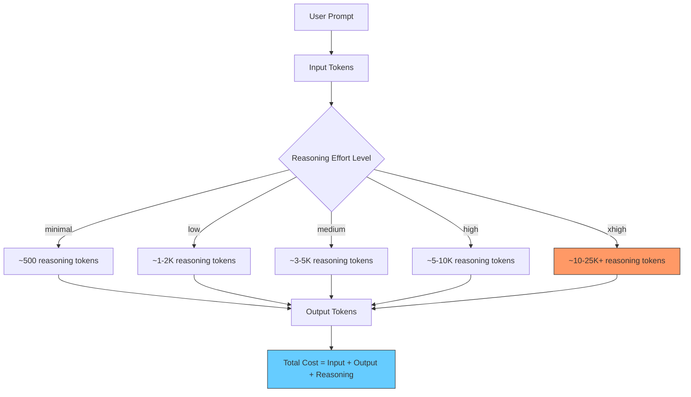
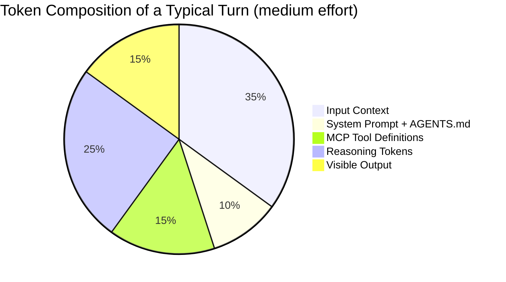
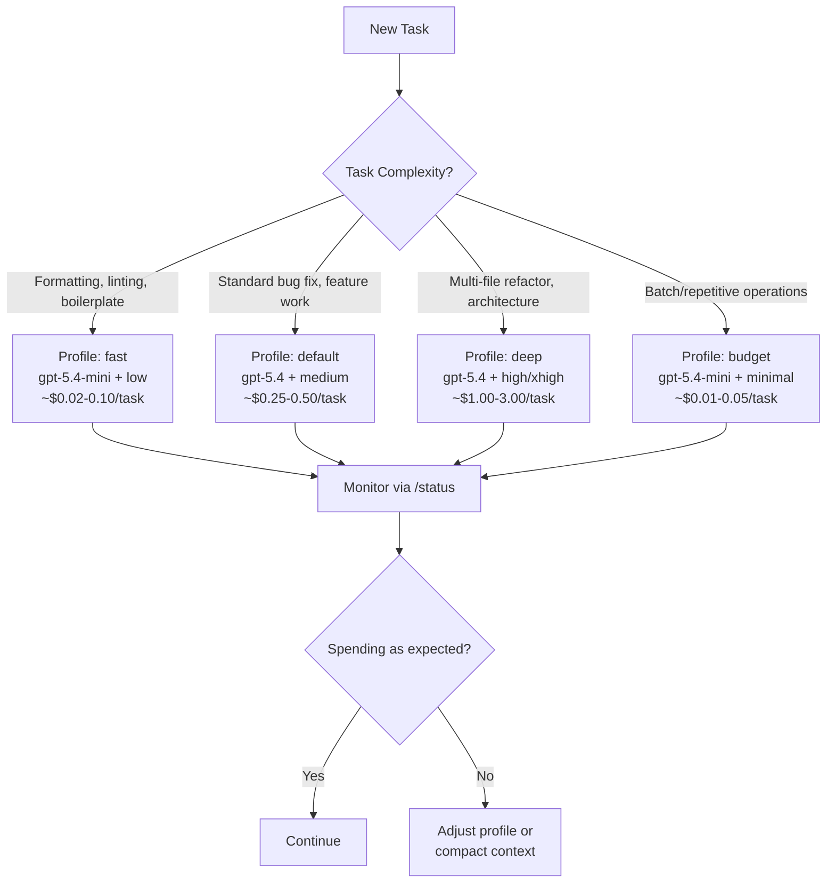

# Codex CLI Token Usage and Cost by Reasoning Effort Level


---

Every API call to a reasoning model generates two categories of tokens you pay for: the visible output and the hidden reasoning chain the model works through before responding. In Codex CLI, the `model_reasoning_effort` setting directly controls how long that reasoning chain runs — and therefore how much each turn costs. Getting this setting right is the difference between a productive $5 day and a bewildering $50 one.

This article breaks down how reasoning effort levels affect token consumption, how to configure them in Codex CLI, and how to build profiles that match effort to task complexity.

## How Reasoning Tokens Work

OpenAI's o-series and GPT-5.x models use chain-of-thought reasoning: they generate internal "thinking" tokens before producing the visible response[^1]. These reasoning tokens occupy space in the context window and are billed as output tokens[^2] — which, at current pricing, are significantly more expensive than input tokens.

A short response might use 2,000 visible output tokens but 10,000 reasoning tokens behind the scenes[^3]. The `reasoning.effort` parameter (exposed in Codex CLI as `model_reasoning_effort`) controls how many of these thinking tokens the model generates before committing to an answer.



The key insight: reasoning tokens are billed at the output token rate. On GPT-5.4, that is 375 credits per million tokens — six times the input rate of 62.50 credits per million[^4]. On the API tier, output tokens for GPT-5.3-Codex cost $14.00 per million versus $1.75 per million for input[^5]. Every additional reasoning token hits at the expensive rate.

## The Six Effort Levels

Codex CLI supports six reasoning effort values via the Responses API[^6]:

| Level | Typical Reasoning Tokens | Best For | Relative Cost |
|-------|--------------------------|----------|---------------|
| `none` | 0 | Extraction, routing, simple transforms | 1× (baseline) |
| `minimal` | ~200–500 | Trivial lookups, formatting (GPT-5 family only) | ~1.1× |
| `low` | ~1–2K | Standard code generation, boilerplate | ~1.5× |
| `medium` | ~3–5K | Most development work (default) | ~2–3× |
| `high` | ~5–10K | Complex bugs, multi-file architecture | ~4–6× |
| `xhigh` | ~10–25K+ | Security audits, large refactors, migrations | ~8–15× |

⚠️ These token ranges are approximate and vary significantly by prompt complexity. OpenAI has noted that "a query that uses 500 reasoning tokens on one request might use 5,000 on a slightly different phrasing"[^3]. The cost multipliers above reflect typical patterns rather than guaranteed ratios.

The critical benchmark: **xhigh reasoning can use 3–5× more tokens than medium for the same prompt**[^7]. On a complex task that already generates substantial reasoning at medium effort, switching to xhigh can push a $0.50 turn past $2.00.

## Configuring Reasoning Effort

### In config.toml

Set a global default in `~/.codex/config.toml`:

```toml
model = "gpt-5.4"
model_reasoning_effort = "medium"
```

### Via Command Line Override

Override per-invocation without touching your config:

```bash
codex -c model_reasoning_effort="high" "explain this race condition"
```

### During an Interactive Session

Use the `/reasoning` slash command to switch effort levels mid-session without restarting[^8]:

```
/reasoning high
```

You can also switch models with `/model` — combining a model change with a reasoning level change is the fastest way to shift cost profiles on the fly.

### Plan Mode Override

Codex CLI supports a separate reasoning effort for plan mode, letting you think deeply during planning but execute cheaply:

```toml
model_reasoning_effort = "low"
plan_mode_reasoning_effort = "high"
```

This is particularly effective: you get thorough analysis during the planning phase where reasoning quality matters most, then drop to cheaper execution for the actual code generation[^6].

## Building Cost-Optimised Profiles

The most effective cost strategy is named profiles that pair the right model with the right reasoning effort for each class of task.

```toml
# ~/.codex/config.toml

# Default: balanced for everyday work
model = "gpt-5.4"
model_reasoning_effort = "medium"

[profiles.fast]
# Quick tasks: boilerplate, formatting, simple fixes
model = "gpt-5.4-mini"
model_reasoning_effort = "low"
model_reasoning_summary = "none"

[profiles.deep]
# Hard problems: security review, architecture, complex debugging
model = "gpt-5.4"
model_reasoning_effort = "xhigh"
model_reasoning_summary = "detailed"

[profiles.budget]
# Cost-conscious batch work
model = "gpt-5.4-mini"
model_reasoning_effort = "minimal"
model_reasoning_summary = "none"
```

Invoke with the `-p` flag:

```bash
# Quick formatting fix — cheap and fast
codex -p fast "fix the linting errors in src/utils.ts"

# Deep security review — expensive but thorough
codex -p deep "audit this authentication module for vulnerabilities"

# Batch processing on a budget
codex -p budget "add JSDoc comments to all exported functions"
```

Switching from GPT-5.4 to GPT-5.4-mini alone achieves approximately a 2.5–3.3× cost reduction[^4]. Combining that with a drop from `medium` to `low` reasoning effort compounds the savings — users report 40–60% cost reductions for routine tasks using this approach[^7].

## Monitoring Token Spend

Codex CLI emits `token_count` events that report cumulative totals per session. The CLI subtracts previous totals to recover per-turn breakdowns across five categories: input, cached input, output, reasoning, and total[^9].

### In-Session Monitoring

Use the `/status` command in the TUI to see current session token consumption. This shows a running total that updates after each turn.

### External Tooling

For systematic tracking, tools like [ccusage](https://ccusage.com/guide/codex/) parse Codex CLI session logs and provide per-model breakdowns with pricing calculations[^10]. For team-scale visibility, the community-built [tokscale](https://github.com/junhoyeo/tokscale) offers leaderboards and contribution graphs across multiple AI coding tools[^11].

### Setting Safety Limits

Cap worst-case costs with token limits in your config:

```toml
# Trigger automatic history compaction before context explodes
model_auto_compact_token_limit = 80000

# Limit individual tool output stored in conversation
tool_output_token_limit = 20000

# Cap session transcript size (bytes)
[history]
max_bytes = 5000000
```

The `model_auto_compact_token_limit` is particularly important. Without it, long sessions accumulate context that inflates every subsequent turn's input token count. One analysis found sessions reaching a median of 96K tokens per turn with p95 at 200K tokens[^12] — at GPT-5.4 input rates, that is 6–12.5 credits per turn just for context before any reasoning begins.

## The Hidden Cost Multipliers

Beyond reasoning effort, several factors silently inflate token consumption:

### System Prompt and AGENTS.md Overhead

Every turn includes the system prompt and your `AGENTS.md` file. This adds approximately 2–5K tokens per turn[^7]. A verbose AGENTS.md in a large monorepo can push this higher. Keep project instructions concise and use `.codex/config.toml` overrides rather than prose where possible.

### MCP Server Tool Definitions

Each connected MCP server registers its tool definitions in every API call. Each tool adds roughly 200–500 tokens of schema overhead[^7]. If you have five MCP servers with ten tools each, that is 10–25K tokens of overhead per turn — before you have even asked a question.



### Shell Output Bloat

One study found that shell command output accounted for 90.3% of all tool-output characters in typical sessions[^12]. A single `ls -la` on a large directory or a verbose test runner can inject thousands of tokens into your context. Use targeted commands and consider piping through `head` or `grep` in your prompts.

## A Decision Framework



The general rule: **start at the lowest effort level you think might work, then escalate only if the output quality is insufficient**. The cost difference between `low` and `xhigh` can be an order of magnitude, and for the majority of daily coding tasks, `medium` or even `low` produces perfectly adequate results.

## Practical Recommendations

1. **Set `medium` as your global default.** It handles most development work well and avoids the cost surprises of higher settings.

2. **Create at least two profiles** — a `fast` profile with a mini model and low effort for routine work, and a `deep` profile for genuinely hard problems.

3. **Use `plan_mode_reasoning_effort`** to separate thinking from doing. High reasoning during planning, low during execution.

4. **Monitor with `/status` regularly.** If a session's token count is climbing faster than expected, compact the history or switch profiles.

5. **Trim your MCP servers.** Only connect the servers you actively need. Each idle server still adds tool definition overhead to every turn.

6. **Set `model_auto_compact_token_limit`.** This single setting prevents the runaway context accumulation that causes the worst cost spikes.

7. **Reserve `xhigh` for tasks where you have tested** and confirmed it produces meaningfully better results than `high`. The OpenAI documentation explicitly advises using it "only when testing demonstrates clear benefit that justifies the extra latency and cost"[^2].

## Citations

[^1]: [Reasoning models guide — OpenAI API Documentation](https://developers.openai.com/api/docs/guides/reasoning)
[^2]: [Reasoning models — reasoning effort parameter — OpenAI Developers](https://developers.openai.com/api/docs/guides/reasoning)
[^3]: [OpenAI o4-mini and o3-pro reasoning model guide — TokenMix](https://tokenmix.ai/blog/openai-o4-mini-o3-pro)
[^4]: [Pricing — Codex — OpenAI Developers](https://developers.openai.com/codex/pricing)
[^5]: [GPT-5.2-Codex Complete Guide: xHigh Reasoning — NxCode](https://www.nxcode.io/resources/news/gpt-5-2-codex-complete-guide-xhigh-reasoning-2026)
[^6]: [Configuration Reference — Codex — OpenAI Developers](https://developers.openai.com/codex/config-reference)
[^7]: [Codex CLI: The Definitive Technical Reference — Blake Crosley](https://blakecrosley.com/guides/codex)
[^8]: [Szymon Rączka on X — reasoning effort CLI configuration](https://x.com/screenfluent/status/1954881189451345949)
[^9]: [Display cumulative token usage — GitHub Issue #1047](https://github.com/openai/codex/issues/1047)
[^10]: [Codex CLI Overview — ccusage](https://ccusage.com/guide/codex/)
[^11]: [tokscale — CLI token usage tracker — GitHub](https://github.com/junhoyeo/tokscale)
[^12]: [Why Is My Codex CLI Token Usage Suddenly So High? — BSWEN](https://docs.bswen.com/blog/2026-03-02-codex-cli-token-usage-spike/)
